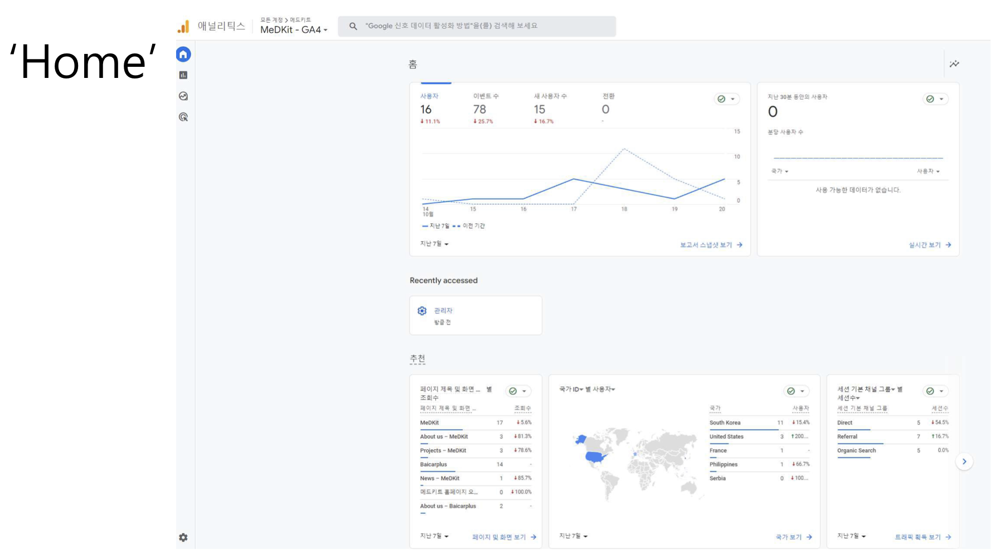
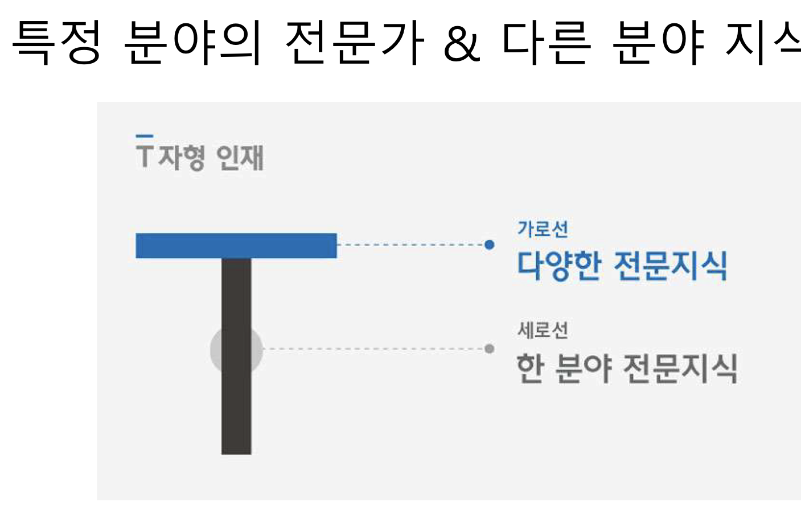

# UX_Design 10강 Data Driven UX - Introduction

## 내용
1. `개요`
2. `배경`
3. `데이터 기반 UX 디자인의 장점`
4. 데이터 분석의 마음가짐
5. 오해

## 1. 개요
- UX는 어렵고, 뜬구름 잡는 느낌
    - `사용자의 개성 - 모호함과 주관성` 때문
- 빅데이터 기법을 접목하여, `구체적이고 정량적인 접근` 가능
- `최적의 UX 실현 및 제공` 가능성 제고 -> 라이프싸이클 동안 관리
- `데이터 분석`은 아직 생소하고 어려운 분야
- 좋은 분석 도구가 필요 (프로젝트 참여자 및 이해 관계자)

## 2. 배경
- 웹 페이지나 모바일 앱의 경우, `발전 및 변화 속도`가 엄청나게 빨라짐
- UX설계에서 핵심인 `사용자들의 만족도는 구매 혹은 매출`로 이어짐
- 사용성의 `상향 평준화`로 새로운 가치 창출이 절실
- 사용자들의 `사소한 행동까지도 추적하고 분석하여 사용성 개선`에 활용
- 스마트폰, 태블릿, 웨어러블, 사물인터넷의 등장으로 `상호작용 방식 혁신`
- 24시간 365일 사용자와 함께 하는 방식으로 발전

### 데이터 기반 UX
- 전통적인 방식 사용하여, `UX에 대한 새로운 요구`를 충족하기 어려움
- Persona, Scenario, Usability Test, Focus Group Interview, 등의 방식으로는
`사용자 니즈를 파악하여 제품 기획`을 잘 할 수 있으나, `사용자와 시스템 사이에 발생하는 (온라인/실시간) 상호작용을 면밀하게 장기적으로 추적하고 분석`
하기에는 부족 -> `라이프 사이클` 동안 `지속적이고 체계적 관리` 필요
- `사용자가 다양`해지고 `각각의 개성`을 살리기 위한 새로운 요구에 부응

### Google Analytics
- 구글에서 제공하는 무료 `웹 페이지 분석` 도구
    - 페이지 방문자 숫자, 방문자의 항해 방식, 각 페이지에서 소비한 시간, 방문자들의 사용 채널, 등의 `사용자 방문 패턴`과
    `사용자 행위` 관련 데이터 제공
    - 해당 사이트의 효과성 및 효율성 점검 - `데이터 기반 분석`
- [`Google Analytics - Beginner's Guide`](https://marketingplatform.google.com/about/analytics/) 

### 데이터 기반 UX의 용도 (1)
- 디자이너, 개발자 및 데이터과학자들의 `협업을 통한 데이터 분석`
- 방대한  `상호작용 데이터`에 대한 체계적 데이터 분석을 통하여, `디자인 근거 자료 및 의사 결정의 근거 확보`
- `시간과 비용` 최소화, `최적의 UI/UX 설계` 도출, 웹 사이트 운영 과정에서 발생하는 `위험 요소에 대한 대비 및 예측`

### 데이터 기반 UX의 용도 (2)
- 웹사이트 분석 도구를 사용하여 최적의 사이트를 목표로 `지속적인 개선`
- `불완전한 디자인`일지라도, 일단 출시하여 `경쟁에서 우위 확보`
- `시장의 요구에 신속하게 대응`하며, `사용자의 반응`을 살펴서, `정확한 방향성 파악 및 사용자의 행동을 이끌어내는 디자인을 개발`
- 시장의 `수요`와 사용자의 `요구`에 대하여, `적절한 대응`을 하면서, `최적화된 사이트로 발전`시키는 전략

### 특정 분야의 전문가 & 다른 분야 지식

### 데이터 시대에 필요한 역량
- `비즈니스` 관점에서 사고하는 역량
    - 해당 산업에 대한 이해 - (예) 식품 산업, 전자상거래 산업, 등
    - 영업 마케팅, 조직, 매출 등 사업 전략을 설계하고, 문서화 및 발표를 통한 설득 능력
- `데이터 분석과 관리` 역량
    - 데이터 분석 기법과 수학적 사고 -> 데이터 분석 도구 사용에 유리
- 문제 파악 및 해결하는 `디자인 역량`
    - 사용자 니즈 달성을 가로막는 문제점 파악
    - 문제 해결 방법을 찾아서 주변 동료들과 협업하여 해결하는 능력

### 비즈니스 역량
- `매출 증대` 및 `이익 창출`이 목표
- 목표 달성을 위한 `전략 수립 역량` 확보
- 예) 
    - 타겟 시장은 ? 
    - 누구를 대상으로 무엇을 어떤 방식으로 소통할 것인가? 
    - 고객이 원하는 것을 제공하는 방법은? 
    - 우리회사의 방향성은 ?
    - 전략은 ?
- `고객 데이터 체계적 관리 & 인공지능을 활용한 업무 자동화` 도입

### 데이터 분석 및 관리 역량
- 데이터 시대의 공통언어 - `수학`
    - 확률, 통계, 행렬, 등 수학 지식을 바탕으로 데이터 분석 도구 활용
- `통계 패키지` (예, IBM SPSS) & `오픈소스` (예, R, Python, 등)
- `데이터 수집, 측정 및 분석`을 지원하는 `소프트웨어 도구`
    - 구글 어낼리틱스, 아도비 어낼리틱스, [뷰저블](https://www.beusable.net/ko/about), 등
- `수학적 사고`, `비판적 사고` 및 `분석적 사고` 역량을 확보