# UX_Design 10강 Data Driven UX - Introduction - 기초지식

## 내용 Part 1
1. `개요`
2. `배경`
3. `데이터 기반 UX 디자인의 장점`
4. 데이터 분석의 마음가짐
5. 오해

## 1. 개요
- UX는 어렵고, 뜬구름 잡는 느낌
    - `사용자의 개성 - 모호함과 주관성` 때문
- 빅데이터 기법을 접목하여, `구체적이고 정량적인 접근` 가능
- `최적의 UX 실현 및 제공` 가능성 제고 -> 라이프싸이클 동안 관리
- `데이터 분석`은 아직 생소하고 어려운 분야
- 좋은 분석 도구가 필요 (프로젝트 참여자 및 이해 관계자)

## 2. 배경
- 웹 페이지나 모바일 앱의 경우, `발전 및 변화 속도`가 엄청나게 빨라짐
- UX설계에서 핵심인 `사용자들의 만족도는 구매 혹은 매출`로 이어짐
- 사용성의 `상향 평준화`로 새로운 가치 창출이 절실
- 사용자들의 `사소한 행동까지도 추적하고 분석하여 사용성 개선`에 활용
- 스마트폰, 태블릿, 웨어러블, 사물인터넷의 등장으로 `상호작용 방식 혁신`
- 24시간 365일 사용자와 함께 하는 방식으로 발전

### 데이터 기반 UX
- 전통적인 방식 사용하여, `UX에 대한 새로운 요구`를 충족하기 어려움
- Persona, Scenario, Usability Test, Focus Group Interview, 등의 방식으로는
`사용자 니즈를 파악하여 제품 기획`을 잘 할 수 있으나, `사용자와 시스템 사이에 발생하는 (온라인/실시간) 상호작용을 면밀하게 장기적으로 추적하고 분석`
하기에는 부족 -> `라이프 사이클` 동안 `지속적이고 체계적 관리` 필요
- `사용자가 다양`해지고 `각각의 개성`을 살리기 위한 새로운 요구에 부응

### Google Analytics
- 구글에서 제공하는 무료 `웹 페이지 분석` 도구
    - 페이지 방문자 숫자, 방문자의 항해 방식, 각 페이지에서 소비한 시간, 방문자들의 사용 채널, 등의 `사용자 방문 패턴`과
    `사용자 행위` 관련 데이터 제공
    - 해당 사이트의 효과성 및 효율성 점검 - `데이터 기반 분석`
- [`Google Analytics - Beginner's Guide`](https://marketingplatform.google.com/about/analytics/) 
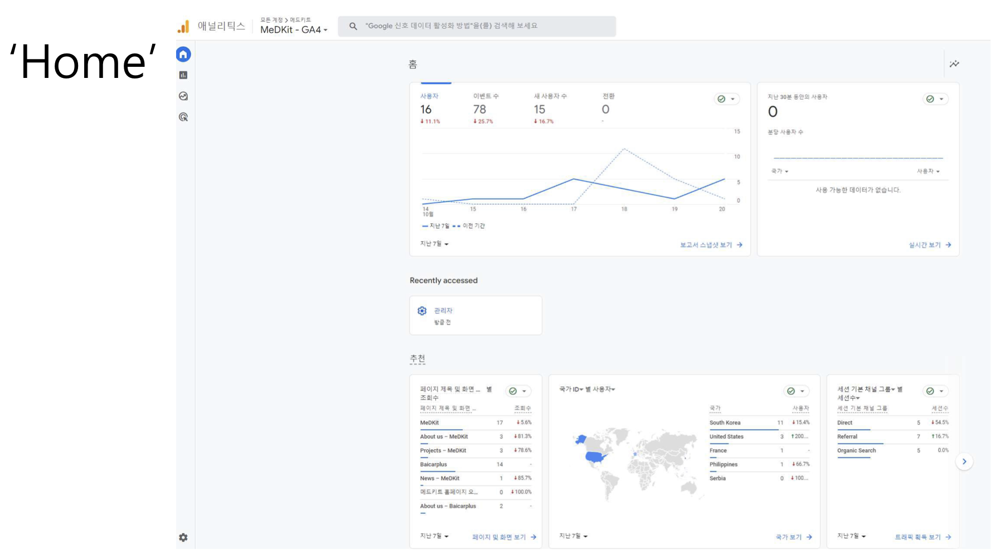

### 데이터 기반 UX의 용도 (1)
- 디자이너, 개발자 및 데이터과학자들의 `협업을 통한 데이터 분석`
- 방대한  `상호작용 데이터`에 대한 체계적 데이터 분석을 통하여, `디자인 근거 자료 및 의사 결정의 근거 확보`
- `시간과 비용` 최소화, `최적의 UI/UX 설계` 도출, 웹 사이트 운영 과정에서 발생하는 `위험 요소에 대한 대비 및 예측`

### 데이터 기반 UX의 용도 (2)
- 웹사이트 분석 도구를 사용하여 최적의 사이트를 목표로 `지속적인 개선`
- `불완전한 디자인`일지라도, 일단 출시하여 `경쟁에서 우위 확보`
- `시장의 요구에 신속하게 대응`하며, `사용자의 반응`을 살펴서, `정확한 방향성 파악 및 사용자의 행동을 이끌어내는 디자인을 개발`
- 시장의 `수요`와 사용자의 `요구`에 대하여, `적절한 대응`을 하면서, `최적화된 사이트로 발전`시키는 전략

### 특정 분야의 전문가 & 다른 분야 지식
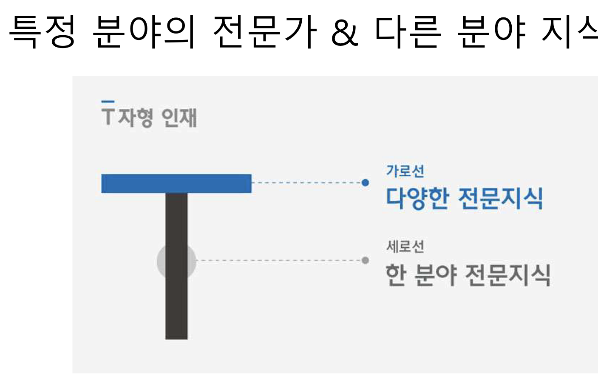

### 데이터 시대에 필요한 역량
- `비즈니스` 관점에서 사고하는 역량
    - 해당 산업에 대한 이해 - (예) 식품 산업, 전자상거래 산업, 등
    - 영업 마케팅, 조직, 매출 등 사업 전략을 설계하고, 문서화 및 발표를 통한 설득 능력
- `데이터 분석과 관리` 역량
    - 데이터 분석 기법과 수학적 사고 -> 데이터 분석 도구 사용에 유리
- 문제 파악 및 해결하는 `디자인 역량`
    - 사용자 니즈 달성을 가로막는 문제점 파악
    - 문제 해결 방법을 찾아서 주변 동료들과 협업하여 해결하는 능력

### 비즈니스 역량
- `매출 증대` 및 `이익 창출`이 목표
- 목표 달성을 위한 `전략 수립 역량` 확보
- 예) 
    - 타겟 시장은 ? 
    - 누구를 대상으로 무엇을 어떤 방식으로 소통할 것인가? 
    - 고객이 원하는 것을 제공하는 방법은? 
    - 우리회사의 방향성은 ?
    - 전략은 ?
- `고객 데이터 체계적 관리 & 인공지능을 활용한 업무 자동화` 도입

### 데이터 분석 및 관리 역량
- 데이터 시대의 공통언어 - `수학`
    - 확률, 통계, 행렬, 등 수학 지식을 바탕으로 데이터 분석 도구 활용
- `통계 패키지` (예, IBM SPSS) & `오픈소스` (예, R, Python, 등)
- `데이터 수집, 측정 및 분석`을 지원하는 `소프트웨어 도구`
    - 구글 어낼리틱스, 아도비 어낼리틱스, [뷰저블](https://www.beusable.net/ko/about), 등
- `수학적 사고`, `비판적 사고` 및 `분석적 사고` 역량을 확보

## 3. 데이터 기반 UX 디자인의 장점
- `데이터를 기반으로 UX 상황 판단`하여 `지속적으로 개선`하는 프레임워크
1. 서비스 `성장 주기별로 디자인 방향성과 목표`를 되짚어 정리 -> `라이프사이클 동안의 지속적이고 체계적 관리` 가능
2. `디자인 산출물의 근거`가 되며 `업무 진행 공통의 언어`로 데이터 사용
3. 반복적으로 수행되는 `디자인 검증을 손쉽게 수행`하도록 지원
4. UX epdlxj `분석의 체계화 및 자동화 기능성`

### 데이터 분석 프레임워크
- `AARRR` (`Acquisition`(획득), `Activation`(활성화), `Retention`(유지/재방문), `Referral` (추천), `Revenue`(매출)) 미국의 데이브 맥클루어 (Dave McClure)가 개발한 기업/서비스 데이터 분석 프레임우커ㅡ
- AARRR은 `시장 진입 단계에 맞는 특정 지표`를 기준으로 `우리 서비스의 상태를 가늠`할 수 있는 효율적인 기준
- 수많은 데이터 중 현 시점에서 `가장 핵심적인 지표에 집중`할 수 있게 함으로써, `분석할 리소스 (인력이나 시간)가 충분하지 않은 스타트업에게 매력적`인 프레임워크

### 단계 별 핵심 지표
1. `Acquisition(획득)` : 사용자가 어떤 경로로 우리 서비스 / 사이트에 들어 오는가? 일간 개별 사용자, 월간 개별 사용자, 신규 사용자, 등의 숫자 증가에 집중. `검색엔진에 최적화된 마케팅 활동` 필요. (SEO, Search Engine Optimizaion). 일정 숫자의 사용자 확보하면 다음 단계로.
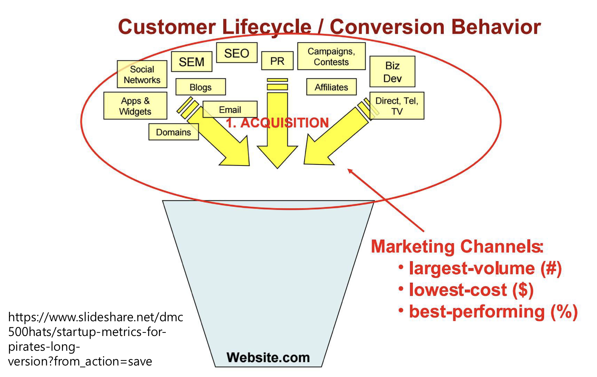
2. `Activation(활성화)` : 사용자가 첯음 서비스 / 사이트를 이용할 떄 긍정적인 경험을 제공하는가 ? 사이트에 머무르는 시간 증가 & 서비스를 이용하기 전에 떠나는 `사용자 이탈률` (= 반송률, Bouncing Rate) 낮추기.
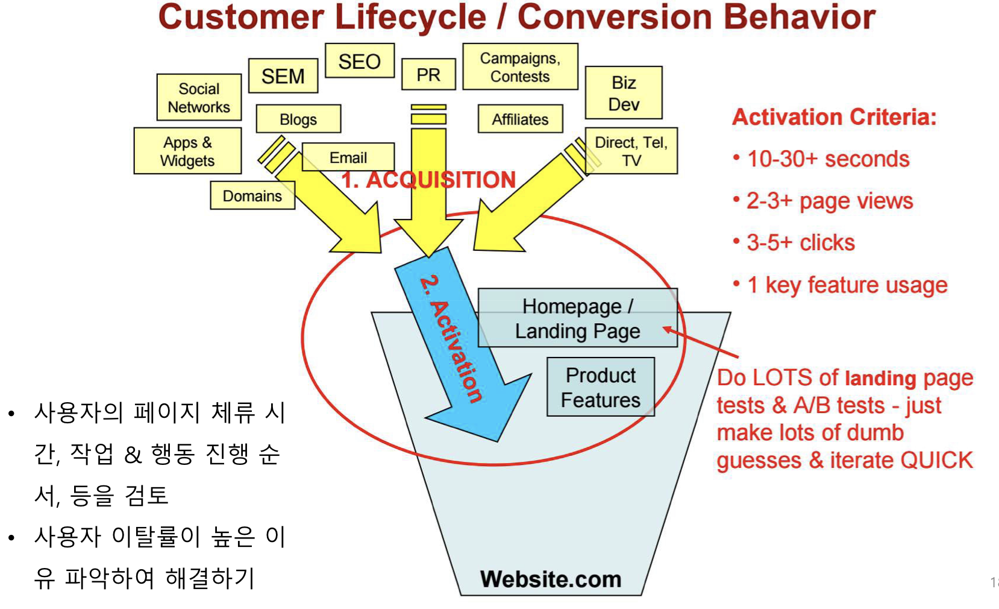
3. `Retention(유지)` : 이후의 서비스/사이트 재사용률(재방문)은 어떻게 되는가? `전환율`(CVR, Conversion Rate: 페이지 방문자들 중에서 `소정의 유도된 행위를 수행`한 비율. 즉, 회원가입, 상품 구매, 다운로드, 등의 행위 수행한 방문자들의 비율) 파악.
- `서비스 만족도를 대변`하는 기준. "유지" 비율이 낮으면 "매출"이 발생 실적이 낮아지므로, `서비스의 성공과 직결`되는 부분.
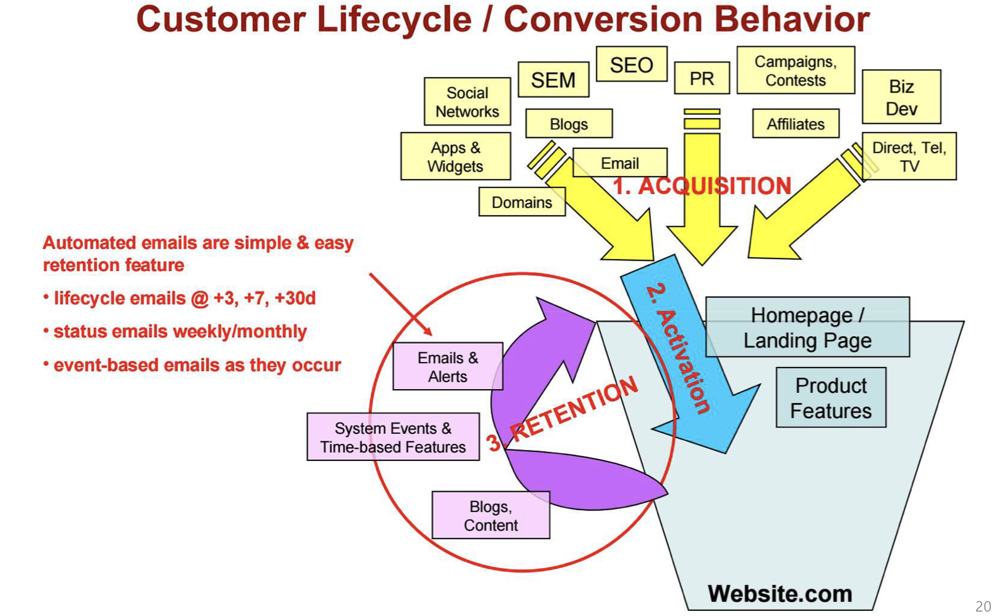
4. `Referral(추천)` : 사용자가 `자발적 공유 혹은 구독 신청` 작업을 일으키고 있는가? 긍정적인 평가 의견이 전파되는가 ? "공유하기", "구독하기", 등의 단추 클릭 수 조사하여 증가시키는 노력.
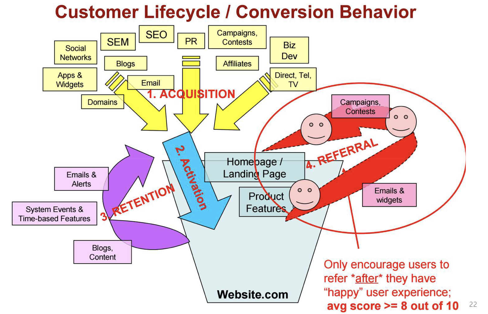
5. `Revenue(매출)` : `최종 목적(매출)`으로 연결되고 있는가? 회원 가입, 구매하기, 다운로드, 등의 `UI요소를 개선`하여 매출 증가 유도 노력
    - 사용자가 서비스/사이트를 접하고 우리가 원하는 `매출을 일으키기까지의 전체적인 과정`을 `성장주기별로 5단계로 데이터 기반으로 분석하고 관리`
    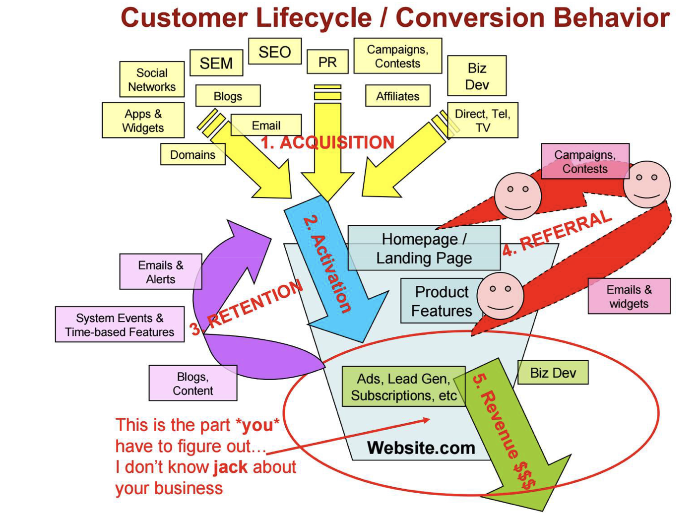

### Types of Metrics & Measurement
- `Qualitative` : Usability Testing / Session Monitoring
    - Watch what users do, figure out problems & solutions from small # of users
- `Quantitative` : Traffic Analysis / User Engagement
    - Compare what users do in one scenario vs another, see which copy/graphics/UI are most effective
- `Competitive` : Monitoring & Tracking Competitors
    - Track competitor activity & compare against yours; if possible compare channels, keyword traffic, demographic targeting, user satisfaction, etc.
(see slide notes for links to tools & vendors)

### 데이터 - 디자인의 근거 & 공통 언어
- `UX 디자인` 결과물은 프로젝트 `구성원들 전체가 공유하고 책임`을 느끼는 것이여야 하므로, `의견과 행동이 일치되도록 공감대 형성`이 필수
- UX 디자인은 단순 심미적 가치를 넘어 `고객의 니즈를 정확하게 파악하여 해결`하고, `그들을 위한 서비스와 제품을 제공`하는 작업
- 배경이 `다양한 구성원들이 소통하고 공감`하기 위하여, `데이터`와 같은 `객관적이고 합리적인 공용의 언어`가 필요

### 데이터 - 공통의 언어
- UX팀이 주축이 되어 `데이터 기반 의사 결정 문화를 내재화` -> 조직 내부의 `협엽 분위기` 상승 & 조직 `전체의 만족도` 상승
- `가설 & 결과`를 함께 보여줌 -> "회원 가입 버튼을 14일간 무료라는 레이블로 나타내면, 신교 회원 가입자수가 증가할 것이다" -> 결과를 보여주는 데이터
- `검증`을 위하여 A/B Testing 등의 비교 평가 실험을 실시하여 개선 여부 확인

### 디자인 검증 - 반복적 개선
- "시장에서의 `핵심 가치를 빨리 정의`한 뒤, `가설을 수립하고 검증 & 개선을 반복`하라" - 에릭 리스(Eric Ries, 미국의 기업가)
- 시장을 선점하고, 고객의 행동 데이터 및 피드백 분석을 통해 개선
- `데이터는 모호한 사용자 형태를 정량화하여 빠른 가설 검증` -> 다음 단계 진입 여부 결정을 지원
- `가설, 검증 & 개선 사이클`을 자주 사용하여 실패 확률을 감소

### 전문 인력 부족 및 자원 부족 상황 극복
- 국내 대다수의 기업은 `UX 데이터 전문가 및 조직이 부족하거나 부재`
- `마케팅 부서나 데이터과학자가 대신`하는 경우도 많음
- 마케팅의 경우, `퍼널(Funnel)` `현상 기반 광고 효과 측정`이 대부분
- `UX 디자이너 혹은 개발자`가 데이터를 직접 분석하여 개선한다면, 다양한 방식으로 `UX 상황을 분석`하고, `UX 성과 개선`으로 바로 반영 가능

### 퍼널 분석 (Funnel Analysis)
- `광고 효과 측정`과 같이, 최초에 온라인 광고에 흥미를 보인 고객이 최종 구매 결정까지 이르는 과정을 `단계 별로 관찰하고 분석`하는 기법
- 처음에는 많은 고객의 참여로 시작하여 최종 구매 결정까지 이르는 고객의 숫자는 점점 줄어들게 됨
- 고객들의 특정 행위들에 대한 `전환율 파악`
- `언제, 어디서, 어떻게, 누가 이탈 여부 파악` -> 이탈 원인 개선이 목표
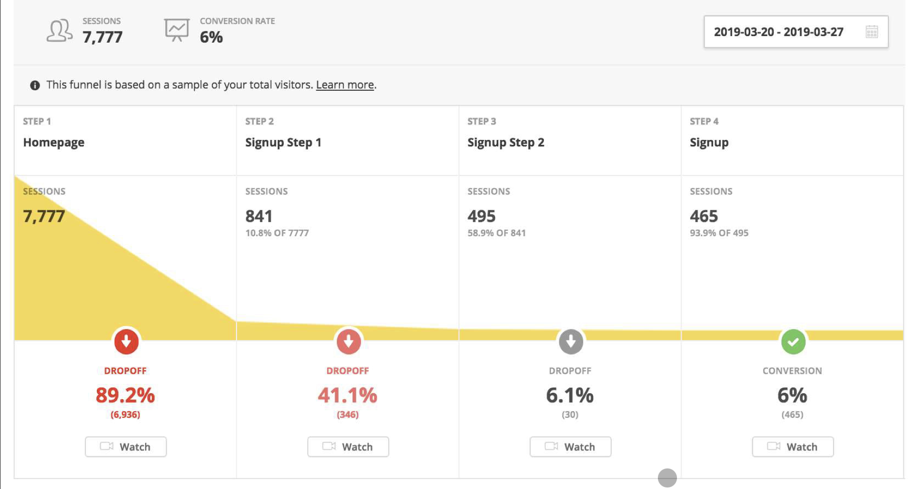

---
---
---

## 내용 Part 2
1. 개요
2. 배경
3. 데이터 기반 UX 디자인의 장점
4. `데이터 분석의 마음가짐`
5. `오해`

## 4. 데이터 분석의 마음가짐
- `비즈니스 기여와 성과 창출` 목적
    - 데이터 분석 및 UX 개선의 궁극적인 목표를 염두에 두어야 함
- `조직의 이슈`를 기반으로 사고하기
    - "조직의 물음"에 대한 "UX 개발자의 답변"이 필요
- `자사의 데이터로 직접 분석`하기
    - 접근이 용이하고, 분석 및 개선 효과가 빠르고 직접적으로 나타남

### 비즈니스 기여 & 성과 창출
- 데이터를 분석하여 UX 개선하는 목적은 ? `비즈니스 기여` & `성과 창출`
- `데이터 분석 및 UX 개선 결과`만을 `단순 보고`보다는, 결과를 기반으로 `기업이나 조직의 비즈니스 성과를 창출하는 방안 제시`가 필수
- 데이터 분석 자체가 목적이 아니라, `비즈니스 성과를 내기 위한 수단`
- `UX 디자인 결과물`이 `비즈니스에 얼마나 기여하고 있는지를 파악`하는 것이 데이터 분석의 진정한 목적

### 조직의 이슈를 기반으로 사고 (1)
- `"조직의 물음"`(이슈)에 대하여 고민하여 "`UX 측면에서 답변`" 제시할 것
- `"무엇"`을 위해서, "`어떻게`" 해야 하나? -> 데이터 분석을 기반으로 답변
- "우리 쇼핑몰의 신규 가입자 숫자를 증가시키려면?", "이탈율을 낮추려면 ?", "전환율을 높이려면?", "매출을 증대하려면?", 등의 이슈
- 신규 사용자, 일간 개별 사용자 & 월간 개별 사용자 데이터, 각 마케팅 채널 별로 사용자 유입 데이터, 페이지 별로 사용자 체류 시간, 행동 패턴 데이터, 등을 분석하여 적절한 답변 제시 필수
    - ["`Beusable`" 사례](https://www.beusable.net/ko/feature-uxheatmap)
    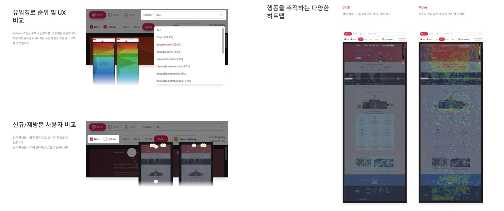
    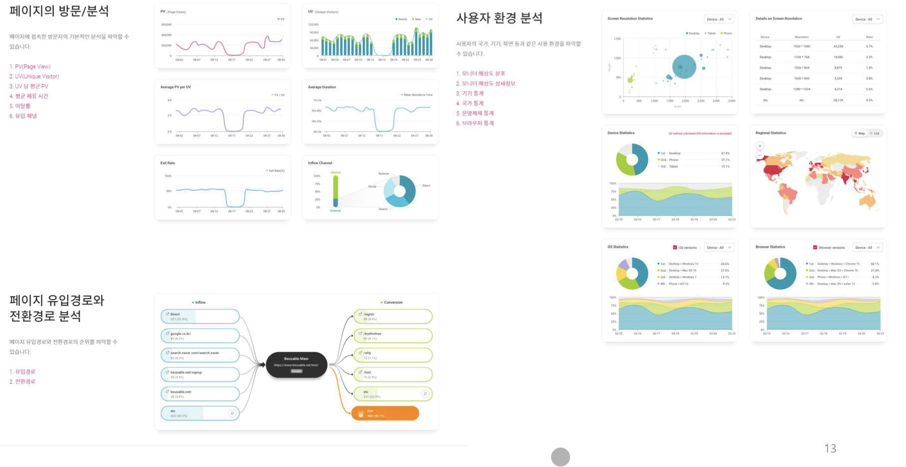

### 조직의 이슈를 기반으로 사고 (2)
- `조직의 이슈` : 데이터 분석의 목적과 분석 기준을 정하는 근거
- 데이터 분석과 결과 도출은 UX 개발자의 몫이지만, `분석 기준은 조직의 이슈를 바탕으로 결정`되어야 함
- `조직의 현재 상황 및 제품/서비스의 발전 단계`(예, AARRR 프레임워크)에 따라 적절한 분석과 처방 및 개선 작업 수행

### 데이터는 어디에?
- 다양한 데이터 분석 기법과 도구가 존재하는데, 막상 실무에 적용하려면?
- 데이터 형태나 종류, 분석 환경, 실행자, 등 많은 부분에서 `강의나 세미나 내용과 실제 업무 환경과의 차이`가 발생
- 우리 조직의 데이터를 활용하여 작은 것부터 실행
- 경험 축적에 따라 성과가 자연스럽게 나타날 것

## 5. 데이터에 관한 오해
- 오해 1 : 데이터는 숫자와 수치를 의미한다. (`데이터의 의미`)
    - 사전적 의미 : 어떠한 `이론을 세우는데 기초가 되는 사실이나 자료`
    - `특성`이나 `정보`를 나타내며, 주로 `숫자, 관찰`을 통하여 `수집`
    - `다양한 형태의 데이터`가 존재 : 사용자의 의견, 사용자의 행동, 등
    - 숫자는 분석을 위하여 `다양한 형식의 데이터를 정량화`
    - `"데이터의 신뢰성"`을 확보하기 위하여, 다양한 관점에서 다양한 형태의 데이터를 수집하고 분석하여야 함 (`정량` & `정상`)
    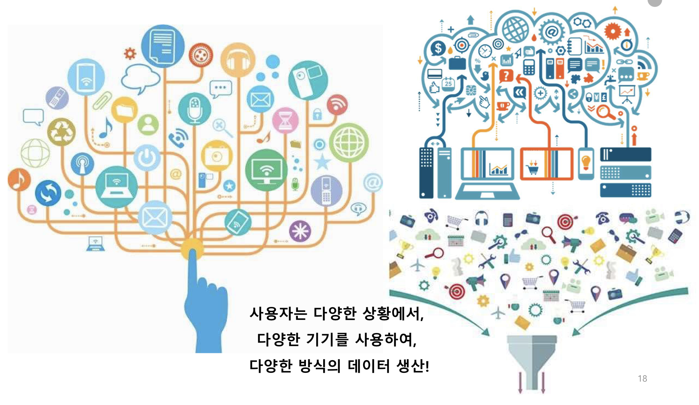
    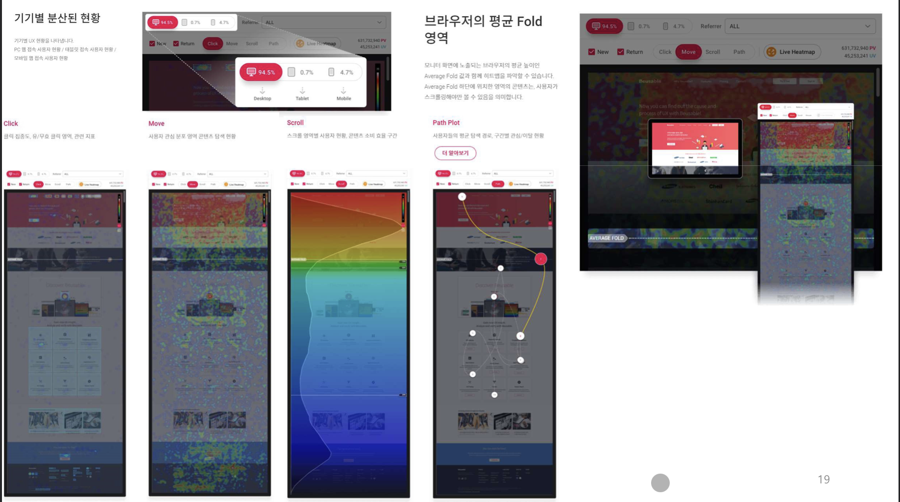
- 오해 2 : UX 개발자의 역할은 데이터 측정 및 결과를 공유하는 일이다. (`UX 개발자의 역할`)
    - UX 데이터 측정 및 분석 결과의 `전달자 & 보고자`
    - UX 데이터 분석을 통하여 영감을 얻어서, `사이트 개선 작업을 실행하는 수행자`
    - `데이터 수집과 분석의 목표`를 먼저 정확하게 이해하고 수행
    - 목표 설정 및 이해를 기반으로 개선 작업 수행하는 실행자
    - `비즈니스에 기여`하고 `성과 창출` 목표를 달성하는 역할
    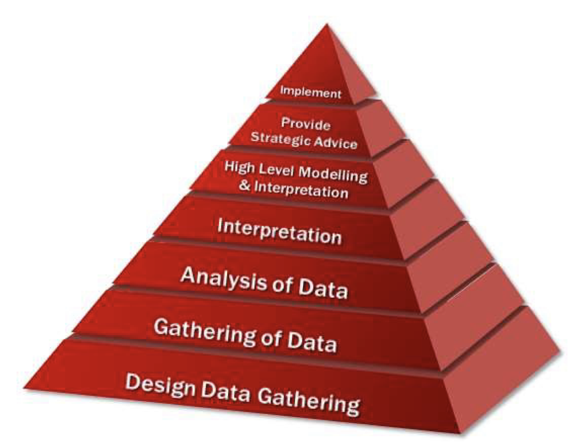
- 오해 3 : 데이터는 숫자가 가장 중요하다. (`데이터는 숫자가 가장 중요`)
    - 숫자 자체보다 더 중요한 것은 데이터 추세 (Trend) 파악
    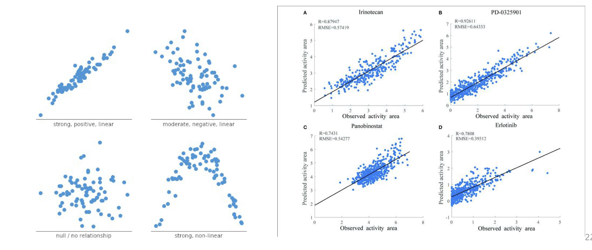
    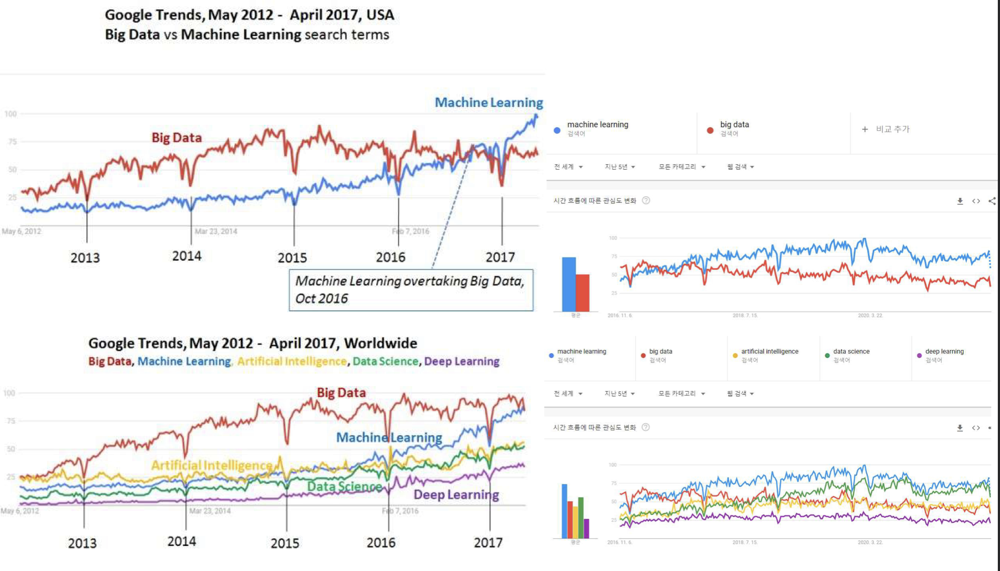
    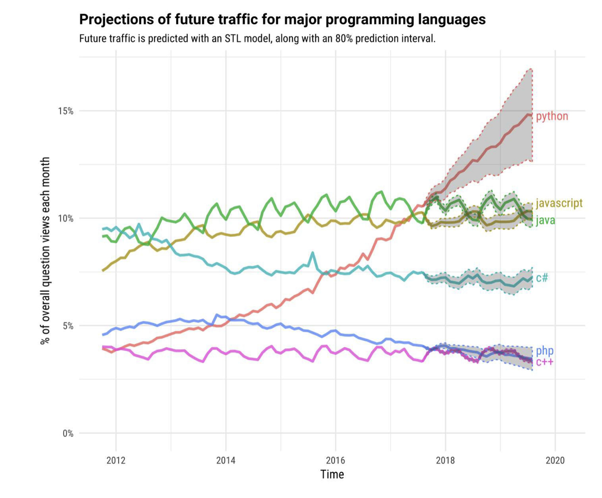
- 오해 4 : UX 디자인과 관련된 의사 결정은 모두 데이터를 바탕으로 실행해야 한다. (`의사결정은 모두 데이터 기반`)
    - 데이터에 `영향을 주는 요소는 다양`함
        - 객관적이고 합리적인 측정과 분석이 가능하고, 필요함
        - 시장 환경, 경쟁자, 조직의 내부 동향, 등 다양한 요소에 의하여 데이터는 영향을 받을 수 있음
        - 데이터 측정 및 분석 환경에 의한 영향도 무시할 수 없음
    - `다양한 요소를 데이터와 함께 검토하고 분석`하여야 좋은 결과 도출
        - 조직의 환경, 국내외 상황, 조직의 목표, 시장 동향 변화, 등을 고려하여야 함
    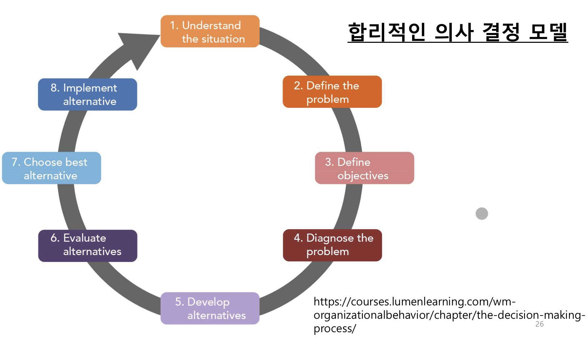
    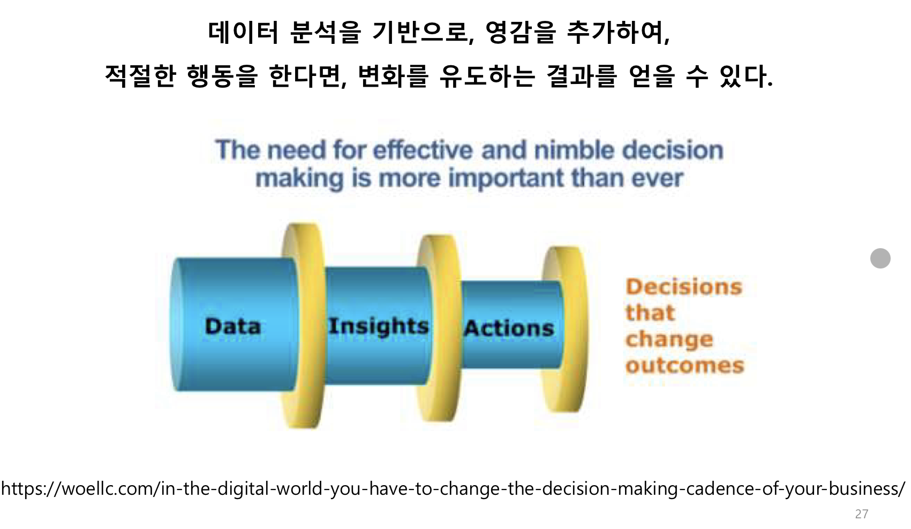

