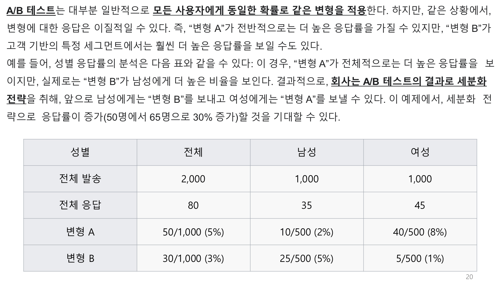
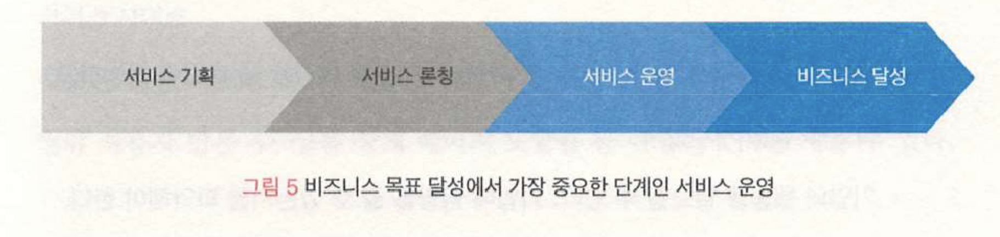
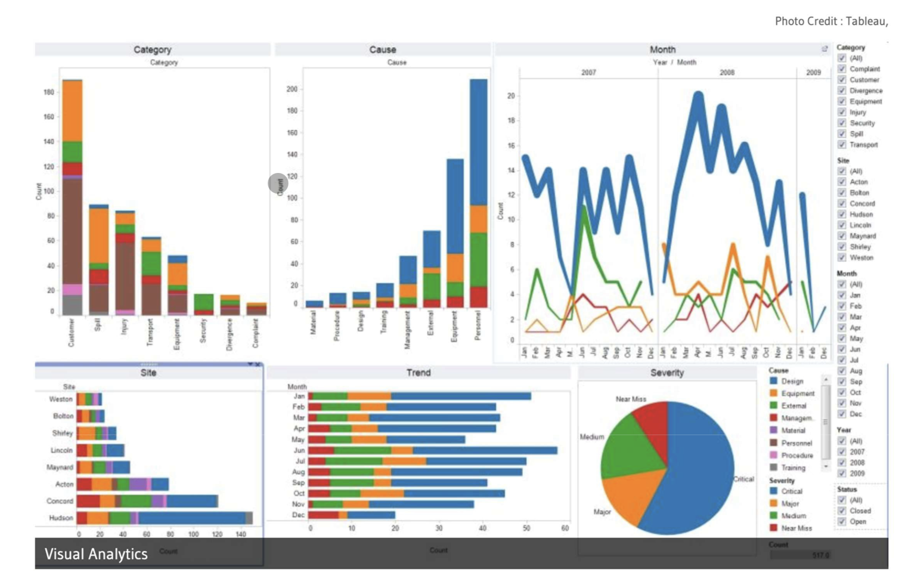
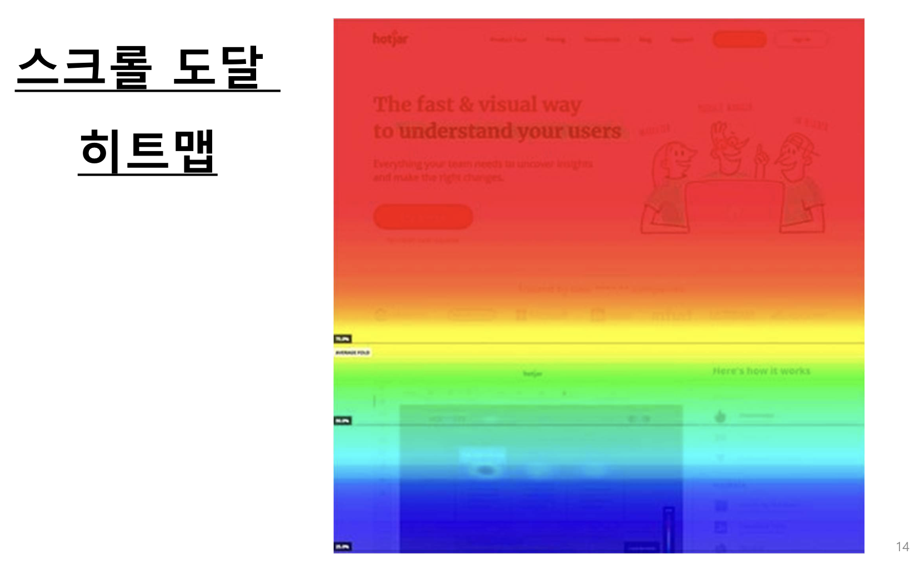
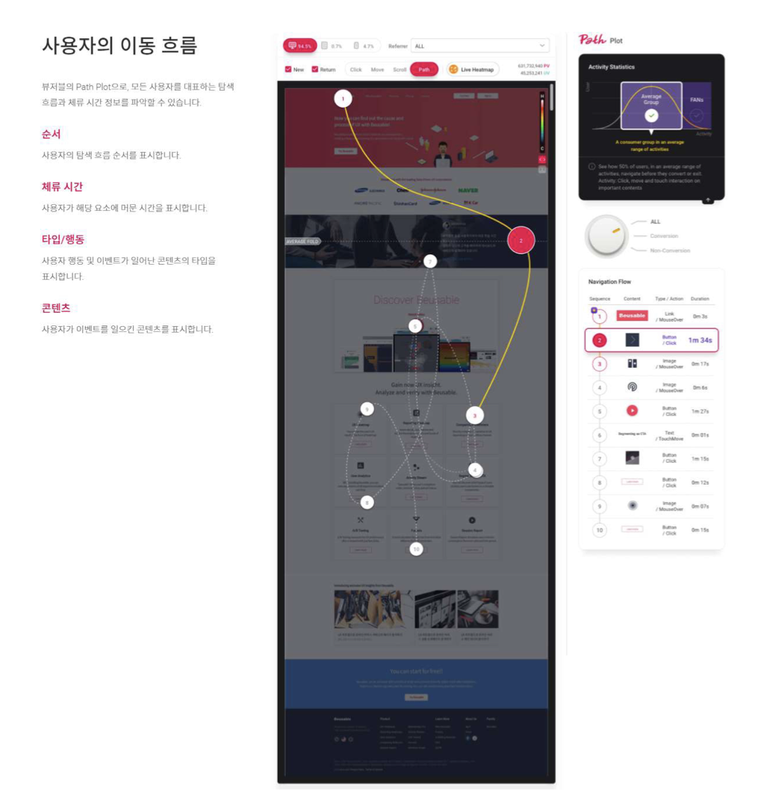
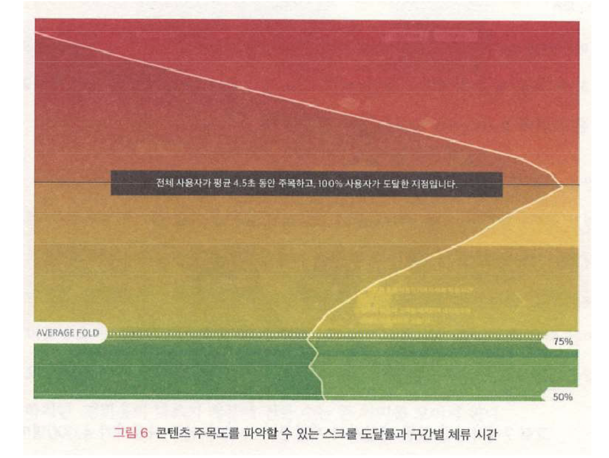
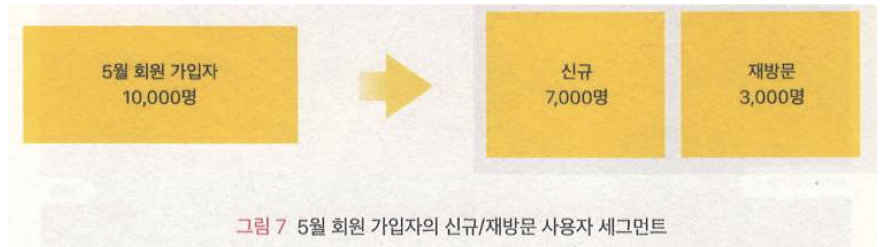
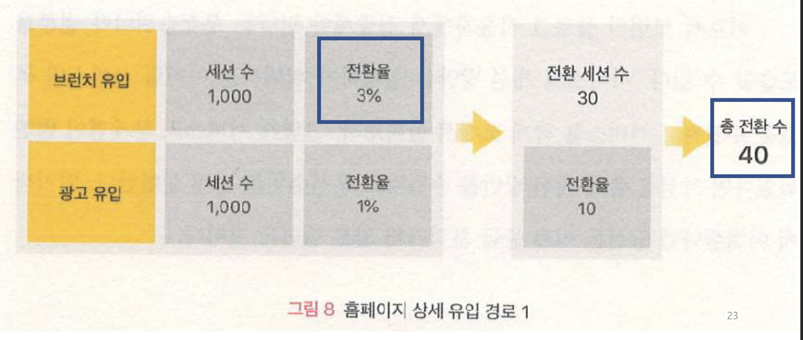
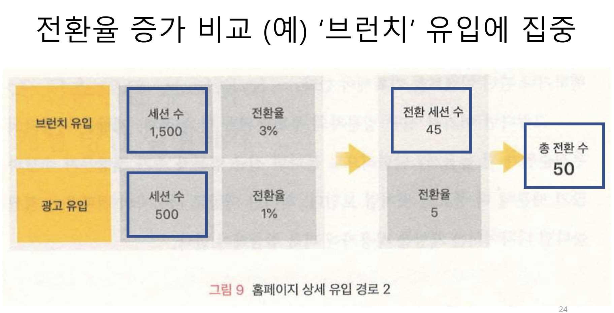

# UX디자인 Data Driven UX - Process

## 내용 Part 1
1. `데이터 기반 UX 디자인 프로세스`
2. `데이터 분석 프로세스`
3. `데이터 분석 목표 설정`
4. 목표 정량 수치, KPI
5. 우선 순위 & 개선 방안 실행

## 1. 데이터 기반 UX 디자인 프로세스

### 분석 과정 & 운영 과정에 활용

> 시점으로는 개발 전 개발 후로 나눠서 데이터 분석을 한다.

## 2. 데이터 분석 프로세스
1. 서비스 `목표 설정`하기
    - `서비스 목표를 거시적 관점에서 파악`하여, 분석의 방향 설정
    - 목표에 따라 `분석 대상 사용자의 특성`이 결정됨
    - `분석의 방향성` 결정 & `사용자의 방문 목적` 파악 <- 서비스 목표
    - `기업이나 서비스의 발전 단계`에 따라, 서비스 개선에서 집중하여야 할 부분과 개선 활동의 목표는 달라질 수 있음
    
2. 목적 달성에 `방해되는 문제 페이지` 찾기
    - 서비스 전체에서 작은 영역(페이지)에 집중하여 관찰하여 검토
    - 목적 달성을 위하여 `방문하는 경로`를 따라 `방해하는 페이지` 찾기
    - `페이지 뷰`의 규모가 큰 페이지는 중요하므로, `해당 페이지에서의 이탈률`에 집중하여, 관찰 및 검토하고 분석
    - 사용자가 가장 많이 `이탈하는 위치(페이지) 파악`
    #### 용어 해설
    - `페이지 뷰 (Page View : PV)는 `인터넷 웹사이트의 특정 페이지가 사용자의 요청에 따라 표시되는 것 혹은 이러한 요청 받는 횟수를 세는 `단위(PV)`
    - 페이지 뷰는 한 사이트의 `사용자 행태를 분석`하고 `광고 등의 수익을 배분하기 위한 중요한 측정 요소`
    - 수많은 웹 사용자들의 방문을 받는다면 이를 기반으로 `광고의 효과를 측정` 할 수 있으며 이러한 `측정이 객관적이고 믿을 만하다면` 광고주로부터 `요금을 부과하는 기준` (위키피디아)
    #### 방문 경로 사례
    - `전자상거래:` 메인 > 제품 상세 페이지 > 장바구니 > 결제 > 결제완료
    - `웹 서비스:` 체험판 등록 > 실행 > 유료 버전 업그레이드
    - `콘텐츠 서비스:` 메인 > 상세 콘텐츠 보기 > 정기 구독
    - `B2B (Businesss to Business):` 기업 메인 혹은 상품 페이지 > 문의하기 > 문의 완료
3. `기능과 레이아웃` 검증 및 최적화
    - `페이지 내부 영역`까지 관찰하여 검토 및 분석
    - (예) 화장품 전자상거래 사이트
        - "상세 화장품 정보" 보다는 "사용자 리뷰"를 확인하여 구매 결정 사실 파악
        - "리뷰" 부분을 강조하고, 페이지 내에서의 위치 조정
    - (예) 육아 정보 사이트
        - "육아 정보"보다는 "중고 장터" 메뉴를 더 많이 이용한다는 사실 파악
        - 메인 페이지에 "중고 장터" 메뉴 노출하여 재배치
4. `콘텐츠와 세부 UI` 검증 및 최적화
    - 기능 단위에서 더 세부적으로 들어가서, `기능 속의 UI요소 (단추, 메뉴, 등)`들이 가지는 `작업 달성도`를 관찰, 검토 및 분석
    
    
    - `사용자의 행동과 심리를 파악`하여 콘텐츠 최적화
    - `히트맵(Heatmap)` 사용하여 신규 방문 및 재방문자의 행동 비교
    
    
    
    > 히트맵을 분석해, 사람들을 유혹하는 유인책을 제시 하는 것도 중요하다.
    - `유입 경로`에 따라 달라지는 사용자의 콘텐츠 소비 현황 파악
    #### 사례
    - 클라우드 서비스 판매 회사 (가)는, 상단에 쉽게 노출되지만 `관심도가 적은 영역`에 "애니메이션"을 삽입하고, `기존 콘텐츠의 문구를 변경`하여 `사용자의 주목도` 상승
    - 언론사 (나)는 사용자들이 기존 `광고 배너를 제대로 확인하지 않는다`는 사실 확인 후, `배너 위치를 사용자 주목도가 높은 위치로 이동`하여 `레이아웃 개선하여 주목도` 상승
5. `지속적으로 개선하고 효과 추적`하기
    - 검토 및 분석 결과를 가지고 `개선 작업` 수행한 다음, `결과에 대한 검증` 수행 - `비교 실험`
    - (예) `A/B Testing` : "버킷 테스트" 또한 "분할-실행 테스트"라고 하며, 두개의 변형 A와 B를 사용하는 ("개선 이전" 대비 "개선 이후") 종합 대조 실험 (위키피디아)
    
    > A안 B안이 있을때 비교하여 어떤 것이 좋은지 테스트 하는 것
    - (예) `Heatmap 분석`으로 효과 확인

## 데이터 분석 목표 설정
- `"목표"`란 무엇인가 ?
- "어떤` 목적을` 이루려고 `지향하는 실제적 대상`"으로 `서비스가 나아갈 구체적 모습`
- 모든 서비스와 웹 사이트는 목표를 반드시 설정하여야 함
- 명확한 목표를 알아야, 데이터 분석 과정에서 달성 정도를 파악, 이를 근거로 `조직의 구성원들이 방향성을 가지고` 개발 & 운영 작업을 수행

### UX `데이터 분석 목표의 세가지 요소`
- `달성기간`
- `정량적 수치`
- `행동 지표`
> 모 대기업에서 위생상태 (손톱)으로 목표를 세운 사례를 들었음.

### 목표 요소 설정 과정
1. `행동 지표`: 목표 달성을 위하여, `사용자가 서비스 혹은 웹 사이트에서 행동`하여야 할 매우 구체적인 내용을 `지표`로 설정
    - 서비스 목표가 달성되기 위하여 `사용자가 반드시 하여야 하는 행동에 대하여 고민하는 과정`에서 도출 가능
    - 예) 인터넷 쇼핑몰에서는 사용자가 상품을 열람한 이후에, 장바구니에 상품을 담아야 매출 발생
    - `B2C 거래`(Business to Consumer) : 상품 열람, 장바구니 상품 담기 & 결제 -> `매출 증가`
    - `B2B 거래`(Business to Business) : 상품 확인 & 문의하기 -> `서비스 계약 & 매출 증가`
    > 
2. `정량적 수치` : 행동 지표를 `수치로 표현`하여야, `목표 달성 정도`를 파악하는 것이 가능
    #### 정량적 수치 (1)
    - `행동 지표`를 `정량적`으로 나타낸 `수치`가 필요
    - 현재 서비스의 목표 대비 어디까지 왔으며, 얼마나 더 나아가야 하는지를 나타내는 거리 -> 과거 실적 혹은 업계 벤치마킹으로 `목표 수치` 결정
    - `(예)` B2B 영업용 사이트
        - `사용자 입장` : 상품 페이지 & 문의하기 페이지에 대한 PV (Page View), UV (Unique Visitor), 문의하기 CTA (Call to Action) 버튼 클릭 수, 등
        - `비즈니스 관점` : 문의 수, 서비스 계약 건수, 매출액, 등
    #### 정량적 수치 (2)
    - `PV (Page View)` : 특정 페이지가 `사용자의 요청`에 의하여 보여지는 횟수 혹은 요청 횟수를 세는 단위. 사용자의 `행위를 파악하고 분석`, 광고와 같은 `수익을 분배하는데 근거`로 사용. 가짜 사용자 혹은 `부정적인 노출 방법 문제 해결` 필요
    - `히트 (Hit)` : 특정 파일이 서버로부터 요청을 받는 것. 따라서 하나의 페이지 뷰에는 복수의 `히트` 발생 가능. 
        - 예) 2개의 그림 파일을 가진 페이지라면 한 번의 방문으로 3번의 히트를 기록 가능.
    - `방문 (Visit)`: 사용자 혹은 자동 프로그램이 `웹사이트 접속하면 발생`. 한번의 방문으로 여러 개의 PV 및 히트 발생 가능. 방문자 혼자 여러 방문 수 기록 가능.
    #### 정량적 수치 (3)
    - `UV (Unique Visitor):` 한 명의 방문자가 여러 번의 방문 기록을 남길 수 있으므로, 서로 다른 방문자의 숫자를 세기 위한 개념
        - 방문자는 특정 웹사이트에 방문할 때 자신의 컴퓨터에 기록되는 `쿠키`남기는 것에 동의함으로써, 방문한 기록 및 `접속 IP를 확인`하여 `순수 방문자`의 방문 수를 추적하고 기록 가능 - 방문자 장치 인식 & 접속 기록
        - 보통은 24시간 안에 일어난 여러 번의 방문은 하나로 처리하거나 특정 시간 간격, 예를 들어 10분 안에 여러 번의 방문하는 경우, 한번의 방문으로 처리하는 방법을 채택하여 재방문 여부를 결정.
    #### 정량적 수치 (4)
    - `CTA (Call to Action) : ` 웹 사이트 방문자들이, `조직이나 기업이 원하는 행위를 수행`하도록 초대, 요청, 설득 및 유도하는 행위
        - 웹 사이트 운영하는 조직이나 기업의 목적에 따라, CTA 방식이 결정됨
        - (예) 회원 가입, 상품 구매, 잡지 구독, 매출액 증가, 등 목표에 따른 CTA 방식
        - 홍보 전략의 하나로서, 가격 할인, 사은품 증정, 등의 혜택을 주어서 사용자들이 `(조직이나 기업이) 원하는 행동을 핟록 유도`
3. `달성 기간` : `작업 일정에 대한 목표 설정`이 있어야 속도 조절 가능
    - 목표 달성에 `필요한 기간` -> 목표 달성을 위한 `작업의 수행 속도`
    - `목표 달성도 평가 기간의 단위` : 년, 분기, 월, 주간 단위 사용하며 최근 일간 단위 사용 추세
    - 서비스 `제공, 개선 및 업데이트`와 같은 `중요 일정에 맞추는` 것이 일반적
    - (예) 매주 수요일에 기업 블로그 작성하여 발표한다면, 수요일 혹은 목요일에 방문자 숫자를 파악하고 분석

### 데이터 분석 기준 & 목표 설정 방법
- `달성기간` : 목표 달성을 위하여 작업을 수행하는 속도를 어느 정도로 하여야 하는가?
- `정량적 수치` : 서비스 목표 달성하기 까지 현재 얼마나 왔고, 앞으로 얼마나 더 가야 하는가?
- `행동 지표` : 사용자들이 어떤 행동을 해야 목표가 달성되었다고 판단할 수 있는가?

## 내용 Part 2
1. 데이터 기반 UX 디자인 프로세스
2. 데이터 분석 프로세스
3. 데이터 분석 목표 설정
4. `목표 정량 수치, KPI`
5. `우선 순위 & 개선 방안 실행`

## 4. 목표 정량 수치, KPI

- "서비스 론칭"(= 시작)보다 더 중요한 것이 "서비스 운영"
- `핵심 성과 지표 (KPI, Key Performance Index)` : 비즈니스 성과 달성을 위한 "활동 기준"이자 "분석 목표" -> UX 목표 정량화 "서비스 운영" 개선 -> "비즈니스 달성"

### KPI ?
- 무엇을, 언제까지, 달성할 것인가? -> 달성 기준 & 수치
- 갖추어야 할 특징
    1. `측정 및 비교 가능` - 웹 페이지에서의 사용자 체류 시간, 작업 완성률, 등을 측정 가능하고 비교 가능해야 함
    2. `기업의 행동 유발` 가능 - 서비스 제공 기업에 영향을 주어 행동 유발하여야 함
    3. `이해 가능` - 구성원 누구나 이해 가능하도록 쉽고, 명료하여야 함
- 세가지 요소를 다 갖춘 `제대로 된 KPI수립이 핵심` 

### 업종 별 대표적 KPI
- `B2B 사이트` : 매출 보다는 `근본적 목적 달성 여부`를 파악할 것
    - 전자 상거래 사이트로 이동하는 배너 또는 링크의 클릭 수
    - 기업 주력 홍보 콘텐츠 페이지 뷰 - 신상품 & 신규 경영진 소개 등
    - 자료 청구 페이지 체류 시간
    - 평가판 서비스 다운로드 숫자
    - 단기적인 매출 증대보다는, `장기적인 협력 관계가 더욱 중요`
- `미디어 사이트` : 페이지 뷰가 제일 강조됨
    - 페이지 뷰, 회원 가입률, 등이 목표
    - 마케팅 측면에서는 페이지 뷰가 주 수익원
- `커머스 사이트` : B2C 상거래
    - 매출이 최종 목표
    - 매출 달성을 위한 회원 가입자 수, 1일, 1주, 1월 기간 사용자 방문 수
    - 상품 상세 페이지 도달 비율
- `소셜 네트워크` : 사용자 관여도가 제일 강조됨
    - 사용자들이 얼마나 적극적으로 참여하는지가 제일 중요
    - "좋아요" 클릭 수, "댓글", "공유", "추천", 등의 숫자
- 우리 조직이 가지고 있는 KPI ? 재검토하고 개선의 여지가 없는지 살펴볼 것

### KPI 수립
- 서비스 기획 이전에, 페르소나 설정 단계에서 함께 수립하는 것이 바람직
- 서비스 디자인하면서 KPI를 염두에 두고 디자인 가능
1. 누가 어떤 문제를 어떤 서비스로 해결하고 싶은지를 정의
    - ["뷰저블"](https://www.beusable.net/ko/) 홈페이지의 경우, "UX 디자인 분석"에 관심이 있는 사용자에게 "뷰저블"의 다양한 기능과 가치를 소개하는 것이 목표
2. 서비스가 사용자에게 어떤 `경험을 제공`하는지 `구체적인 가치를 정의`
    - "사용자에게 제공하고 싶은 경험이 무엇인가?" 라는 질문에 대한 답변
    - 뷰저블 웹사이트의 경우, "사용자 데이터 분석을 위한 `솔루션 정보 제공`" & "솔루션 `가입 및 이용`" -> 해당 서비스의 `인지도 상승` 및 `사용자 활성화`가 목표인 단계
3. KPI 수립
    - `서비스의 핵심 가치에 집중`하여 KPI 수립
    - 뷰저블 사이트의 경우, "회원 가입자 수", "뷰저블 상요하기 버튼 클릭 수", 등
4. KPI `측정 기간 설정`
    - 일, 주, 월간 혹은 분기 주기로 측정
    - 뷰저블 웹사이트의 경우, 주 단위 및 월 단위로 측정하며, 사용자를 구체적으로 정의하여 정확한 통계 수집 노력 (예) 특정 사용자의 행위가 지나치는 경우 배제
5. 수립한 KPI 사용하여 `서비스를 분석하고 개선`
    - KPI 달성 여부를 확인하여 지속적인 개선 노력
    - 서비스의 성장은 "론칭"이 아니라 "운영"에서 판가름
    

### 시각화된 분석 페이지를 위한 KPI
1. `페이지 탐색` - 특정 페이지 내부에서 사용자의 탐색 행위
    - 기준 : 페이지
    - 의미 : 방문자는 페이지 내에 제공된 `모든 콘텐츠를 모두 탐색했는지 검토`하여 탐색 성과 측정
    - 측정 방안 : 페이지 구간 별 `스크롤 도달률` 혹은 `스크롤 도달 높이` (혹은 깊이)의 평균을 살펴봄
    
    > 페이지에서 사용자가 어디까지 봤는지
2. `콘텐츠의 탐색 수치` - 페이지 내부에서 콘텐츠 별 탐색 행위
    - 기준 : 페이지
    - 의미 : 페이지 내에서 `작업 수행 횟수,` 움직임 별 `체류 시간`, 등을 측정하여, `작업 수행 흐름이 원활한지 여부` 및 `장애물 존재 여부` 파악
    - 측정 방안 : 사용자의 콘텐츠 탐색 순차와 탐색 위치 별 체류 시간을 살펴봄
    
3. `콘텐츠 주목` - 사용자의 시선 추적 및 주목 성과
    - 기준 : 콘텐츠
    - 의미 : 방문자의 `콘텐츠 별 체류 시간`과 `탐색 밀집도를 파악`하여 `콘텐츠의 주목 성과` 비교
    - 측정 방안 : 구간 별 체류 시간, 마우스로 탐색한 규모 (도달한 페이지 뷰 대비 마우스가 올라간 페이지 뷰), 스트림의 밀집도 및 체류 시간을 살펴 봄
    
4. `콘텐츠 인지` - 특정 콘텐츠 별 탐색과 인지 행위
    - 기준 : 콘텐츠 (클릭 가능한 요소)
    - 의미 : 방문자는 `특정 콘텐츠에 도달하여 얼마나 인지하고 탐색`했는지 검토하여 콘텐츠 탐색 성과 측정
    - 측정 방안 : `전체 페이지 뷰` 대비 `콘텐츠 별 마우스 올린 횟수` 값을 계산하여 살펴봄

## 5. `우선 순위 부여 & 개선 방안 실행`
- `선택과 집중 (우선 순위 부여)`
- 데이터 분석 결과 도출한 개선 방안은 곧바로 실행에 옮기기보다, `조직의 정책, 서비스 단계, 노력, 시간, 비용, 자원, 등 여러 요소를 고려`하여 우선 순위를 부여할 것
- `개선 방안의 영향력을 고려`하여 우선 순위 부여

### 예제: 신규 가입자 대비 재방문자
- 5월 가입자 10,000명 중, 신규 7,000명 & 재방문 3,000명일 경우 대응 방식은 ? 
    - `신규에 집중할 것인가 재방문에 집중할 것인가`

1. `재방문자 수 증가`에 집중하기 위하여, "출석 체크"와 같은 기능을 추가하거나 마케팅 부서와 협의하여 재방문자를 위한 이벤트 수립 가능
2. `신규 방문자 증가`를 위하여, 마케팅에서 광고 예산 추가 집행 가능
    - 숫자가 많은 신규 방문자에 집중할 수도 있지만, 재방문자의 전환율이 훨씬 높으면`(재방문자의 구입율이 높으면)`, 재방문자 숫자 증가에 집중

### 예제 : 유입 경로 비교

> 전환율을 봤을때 브런치 유입에 많은 투자를 하기로 결정

## 요약
- 데이터 분석은 절차에 따라 (`Data-Driven UX 디자인 프로세스` 기반)
- 분석 목표를 올바르게, 제대로 수립하고 (`행동 지표, 정량적 수치, 달성 기간`)
- 핵심 목표를 정량적 수치로 설정하여 (`KPI`)
- 개선 방안은 `우선 순위에 따라 체계적으로` 실행
