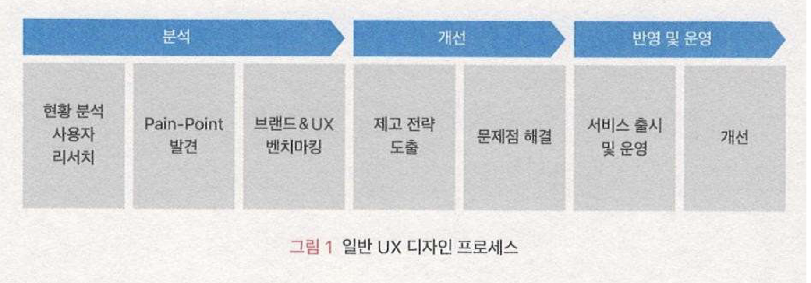
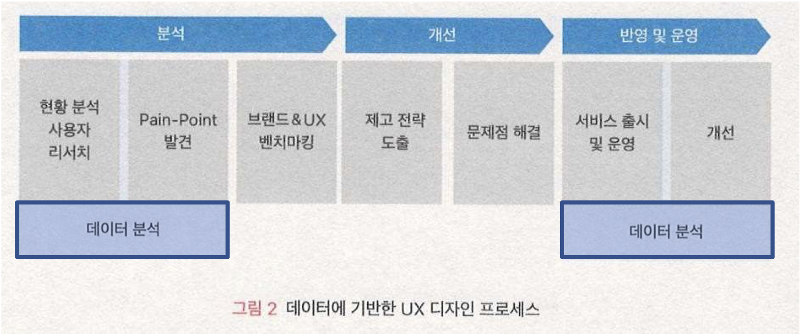
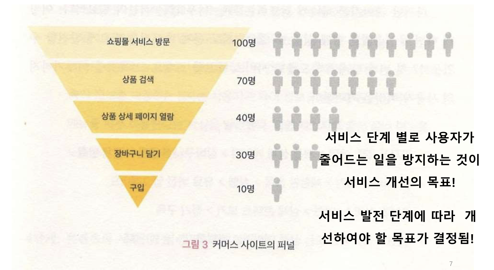
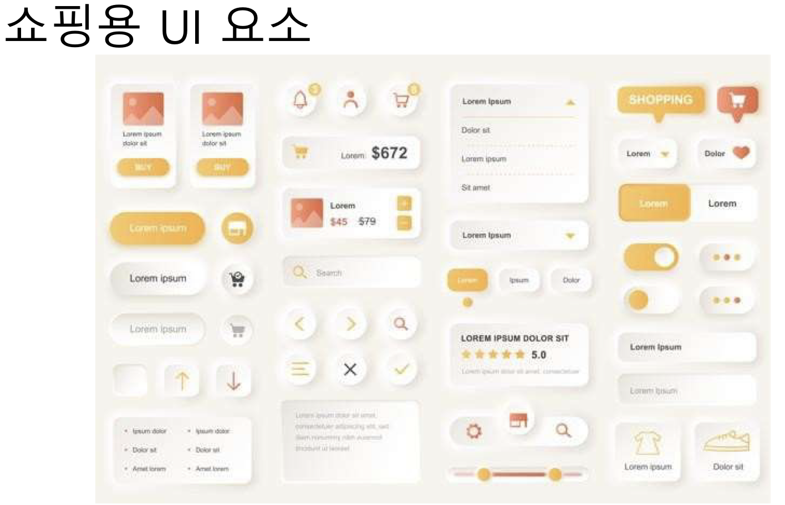
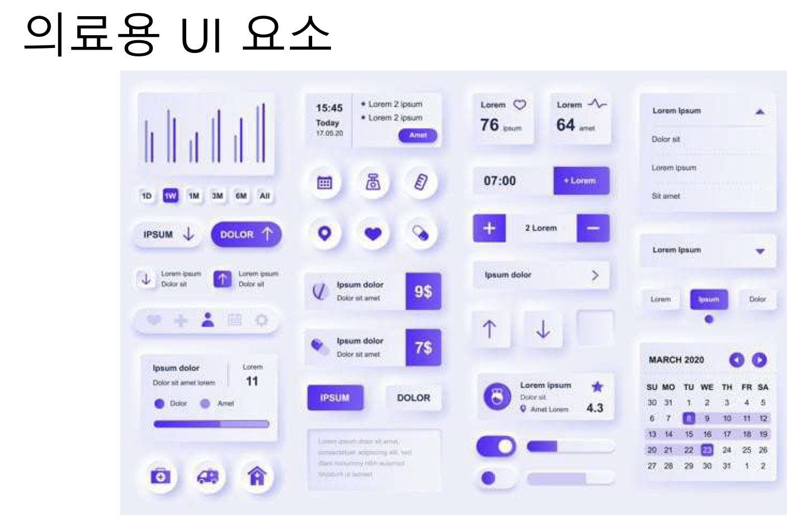
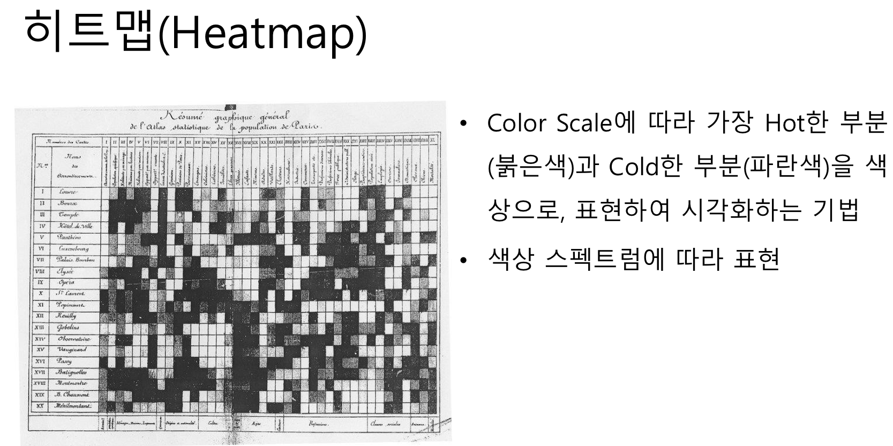
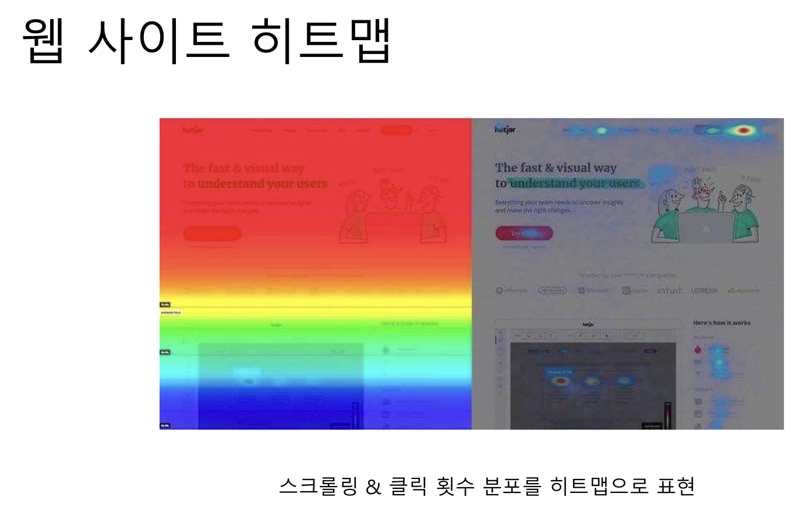
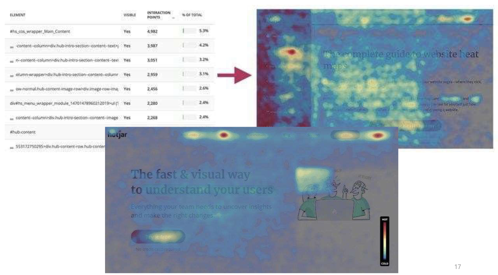

# UX디자인 Data Driven UX - Process

## 내용
1. `데이터 기반 UX 디자인 프로세스`
2. `데이터 분석 프로세스`
3. `데이터 분석 목표 설정`
4. 목표 정량 수치, KPI
5. 우선 순위 & 개선 방안 실행

## 1. 데이터 기반 UX 디자인 프로세스

### 분석 과정 & 운영 과정에 활용

> 시점으로는 개발 전 개발 후로 나눠서 데이터 분석을 한다.

## 2. 데이터 분석 프로세스
1. 서비스 `목표 설정`하기
    - `서비스 목표를 거시적 관점에서 파악`하여, 분석의 방향 설정
    - 목표에 따라 `분석 대상 사용자의 특성`이 결정됨
    - `분석의 방향성` 결정 & `사용자의 방문 목적` 파악 <- 서비스 목표
    - `기업이나 서비스의 발전 단계`에 따라, 서비스 개선에서 집중하여야 할 부분과 개선 활동의 목표는 달라질 수 있음
    
2. 목적 달성에 `방해되는 문제 페이지` 찾기
    - 서비스 전체에서 작은 영역(페이지)에 집중하여 관찰하여 검토
    - 목적 달성을 위하여 `방문하는 경로`를 따라 `방해하는 페이지` 찾기
    - `페이지 뷰`의 규모가 큰 페이지는 중요하므로, `해당 페이지에서의 이탈률`에 집중하여, 관찰 및 검토하고 분석
    - 사용자가 가장 많이 `이탈하는 위치(페이지) 파악`
    #### 용어 해설
    - `페이지 뷰 (Page View : PV)는 `인터넷 웹사이트의 특정 페이지가 사용자의 요청에 따라 표시되는 것 혹은 이러한 요청 받는 횟수를 세는 `단위(PV)`
    - 페이지 뷰는 한 사이트의 `사용자 행태를 분석`하고 `광고 등의 수익을 배분하기 위한 중요한 측정 요소`
    - 수많은 웹 사용자들의 방문을 받는다면 이를 기반으로 `광고의 효과를 측정` 할 수 있으며 이러한 `측정이 객관적이고 믿을 만하다면` 광고주로부터 `요금을 부과하는 기준` (위키피디아)
    #### 방문 경로 사례
    - `전자상거래:` 메인 > 제품 상세 페이지 > 장바구니 > 결제 > 결제완료
    - `웹 서비스:` 체험판 등록 > 실행 > 유료 버전 업그레이드
    - `콘텐츠 서비스:` 메인 > 상세 콘텐츠 보기 > 정기 구독
    - `B2B (Businesss to Business):` 기업 메인 혹은 상품 페이지 > 문의하기 > 문의 완료
3. `기능과 레이아웃` 검증 및 최적화
    - `페이지 내부 영역`까지 관찰하여 검토 및 분석
    - (예) 화장품 전자상거래 사이트
        - "상세 화장품 정보" 보다는 "사용자 리뷰"를 확인하여 구매 결정 사실 파악
        - "리뷰" 부분을 강조하고, 페이지 내에서의 위치 조정
    - (예) 육아 정보 사이트
        - "육아 정보"보다는 "중고 장터" 메뉴를 더 많이 이용한다는 사실 파악
        - 메인 페이지에 "중고 장터" 메뉴 노출하여 재배치
4. `콘텐츠와 세부 UI` 검증 및 최적화
    - 기능 단위에서 더 세부적으로 들어가서, `기능 속의 UI요소 (단추, 메뉴, 등)`들이 가지는 `작업 달성도`를 관찰, 검토 및 분석
    
    
    - `사용자의 행동과 심리를 파악`하여 콘텐츠 최적화
    - `히트맵(Heatmap)` 사용하여 신규 방문 및 재방문자의 행동 비교
    
    
    
    - `유입 경로`에 따라 달라지는 사용자의 콘텐츠 소비 현황 파악
    #### 사례
    - 클라우드 서비스 판매 회사 (가)는, 상단에 쉽게 노출되지만 `관심도가 적은 영역`에 "애니메이션"을 삽입하고, `기존 콘텐츠의 문구를 변경`하여 `사용자의 주목도` 상승
    - 언론사 (나)는 사용자들이 기존 `광고 배너를 제대로 확인하지 않는다`는 사실 확인 후, `배너 위치를 사용자 주목도가 높은 위치로 이동`하여 `레이아웃 개선하여 주목도` 상승
5. `지속적으로 개선하고 효과 추적`하기

