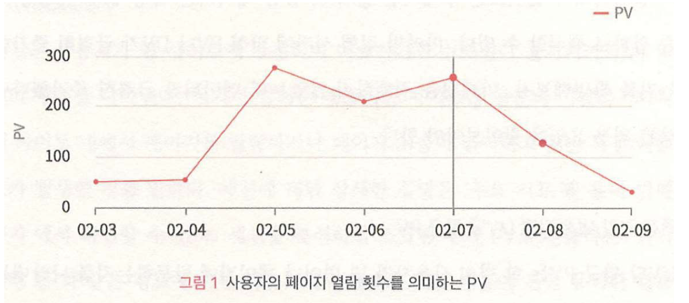
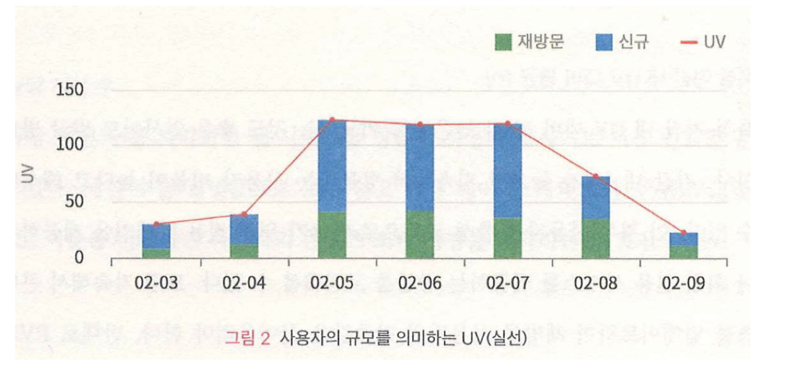

# Data Driven UX - TERMS (용어 이해하기)

## 내용
1. `데이터를 통해 알 수 있는 UX정보`
2. `지표 분석에서 고려할 사항`
3. UX 디자인을 위한 데이터 분석 도구
4. 주요 지표 및 용어 이해하기

## `1. 데이터를 통해 알 수 있는 UX 정보`
### 1-1. 웹 사이트 사용자의 `방문 규모` 현황
- (1)
    - `페이지 뷰 (PV, Page View):` 특정 페이지가 사용자에게 노출된 횟수. 일반적으로 분석도구들은 웹 크롤러에 노출되는 횟수가 페이지 뷰로 잡히지 않도록 대응.
    
- (2)
    - `순 방문자 (UV, Unique Visitors):` 중복된 페이지 뷰를 제거하여 실제로 해당 페이지를 방문한 순수한 방문자들의 페이지 요청 숫자를 파악
    
- (3)
    - `PV와 UV 증감 및 추세 확인:` 특정 기간 동안 해당 지표 값들이 크게 늘어나거나 줄어드는 현상 및 변화하는 추세 파악이 중요
    - 해당 지표 값들의 증감은 `마케팅 행사`와 같은 특정 요인에 영향을 받을 수 있으며, 다른 요인도 영향을 줄 수 있으므로 세심한 조사 필요
    - `특정 기간 동안 일자 별로 UV 당 평균 PV 값 분석:` 보통 한 사용자가 여러 번 방문하므로, PV 값이 큰데, 그 비율이 높은 이유를 일자 별로 분석하여 원인 파악 (`재방문 사유 파악`) -> 긍정적 혹은 부정적 원인(?)
- (4)
    - `특정 기간 내 UV 대비 평균 PV:` UV 대비 PV 평균 값이 지속적으로 높으면, 재방문하는 사용자의 비율이 높다는 의미이므로, 충성 고객으로 만들기 위한 전용 캠페인이나 서비스를 제공하는 방안을 고민할 수 있음
    - 재방문 사용자의 만족도 향상을 위하여 콘텐츠 지속적 업데이트 필요
    - UV 대비 PV 값이 평균보다 낮으면, 신규 방문자가 많다는 해석이 가능하므로, 로그인이나 회원 가입하는 기능을 줄이고, 비회원을 위한 서비스 창출 및 콘텐츠 다양화 시도할 필요
- (5)
    - `세션(Session):` 웹 사이트를 방문하여 이탈하기까지 (세션이 끊기기까지) 발생한 일련의 행동 - 웹 페이지 이동, 클릭, 마우스 이동, 스크롤, 등 특정한 상호작용 이벤트들의 집합
    - 세션을 분석하면, 사용자의 실질적인 행동에 대한 여러 가지 유용한 UX정보를 얻을 수 있음
- (6)
    - `세션 당 Page 수 평균값:` 사용자가 한 번 사이트 방문하여 `페이지 이동하는 횟수 평균값`을 파악 가능 `->` 세션 당 방문 Page 숫자가 많아지면, 사용자의 참여도가 증가 `->` 일반적으로, 사용자들은 특정 사이트 1회 방문에서 평균 1.8에서 4.4정도 숫자의 페이지를 방문
    - `UV당 세션 분석:` `순 사용자`가 사이트에 와서 방문하는 페이지 별, 카테고리 별, 콘텐츠 별로 파악하여 방문 비율 분석 가능 `->` `사용자의 콘텐츠 소비 경향 파악`

### 1-2. 웹 사이트 사용자의 `환경적 특성`
- (1)
    - `사용자의 국가, 디바이스, 운영체제 및 브라우저 특성 파악`
    - 사용자 특성을 파악하는 첫걸음 /Rightarrow 언어, 문화, 정서, 등 특성 파악

### 1-3. 웹 사이트 사용자의 `전환율, 이탈률 및 종료율`
### 1-4. 웹 사이트 사용자의 `유입 경로`
### 1-5. 웹 사이트 사용자의 `전환 경로`
### 1-6. 웹 사이트 사용자의 `내부 활동 정보` 