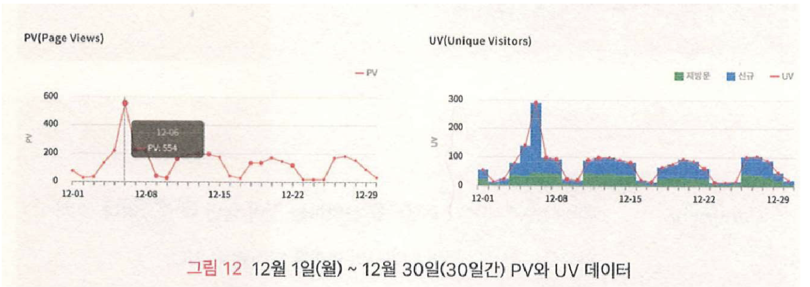

# Data Driven UX - TERMS (용어 이해하기)

## 내용 Part01
1. `데이터를 통해 알 수 있는 UX정보`
2. `지표 분석에서 고려할 사항`
3. UX 디자인을 위한 데이터 분석 도구
4. 주요 지표 및 용어 이해하기

## `1. 데이터를 통해 알 수 있는 UX 정보`
### 1-1. 웹 사이트 사용자의 `방문 규모` 현황
- (1)
    - `페이지 뷰 (PV, Page View):` 특정 페이지가 사용자에게 노출된 횟수. 일반적으로 분석도구들은 웹 크롤러에 노출되는 횟수가 페이지 뷰로 잡히지 않도록 대응.
    
- (2)
    - `순 방문자 (UV, Unique Visitors):` 중복된 페이지 뷰를 제거하여 실제로 해당 페이지를 방문한 순수한 방문자들의 페이지 요청 숫자를 파악
    
- (3)
    - `PV와 UV 증감 및 추세 확인:` 특정 기간 동안 해당 지표 값들이 크게 늘어나거나 줄어드는 현상 및 변화하는 추세 파악이 중요
    - 해당 지표 값들의 증감은 `마케팅 행사`와 같은 특정 요인에 영향을 받을 수 있으며, 다른 요인도 영향을 줄 수 있으므로 세심한 조사 필요
    - `특정 기간 동안 일자 별로 UV 당 평균 PV 값 분석:` 보통 한 사용자가 여러 번 방문하므로, PV 값이 큰데, 그 비율이 높은 이유를 일자 별로 분석하여 원인 파악 (`재방문 사유 파악`) &rarr; 긍정적 혹은 부정적 원인(?)
- (4)
    - `특정 기간 내 UV 대비 평균 PV:` UV 대비 PV 평균 값이 지속적으로 높으면, 재방문하는 사용자의 비율이 높다는 의미이므로, 충성 고객으로 만들기 위한 전용 캠페인이나 서비스를 제공하는 방안을 고민할 수 있음
    - 재방문 사용자의 만족도 향상을 위하여 콘텐츠 지속적 업데이트 필요
    - UV 대비 PV 값이 평균보다 낮으면, 신규 방문자가 많다는 해석이 가능하므로, 로그인이나 회원 가입하는 기능을 줄이고, 비회원을 위한 서비스 창출 및 콘텐츠 다양화 시도할 필요
- (5)
    - `세션(Session):` 웹 사이트를 방문하여 이탈하기까지 (세션이 끊기기까지) 발생한 일련의 행동 - 웹 페이지 이동, 클릭, 마우스 이동, 스크롤, 등 특정한 상호작용 이벤트들의 집합
    - 세션을 분석하면, 사용자의 실질적인 행동에 대한 여러 가지 유용한 UX정보를 얻을 수 있음
- (6)
    - `세션 당 Page 수 평균값:` 사용자가 한 번 사이트 방문하여 `페이지 이동하는 횟수 평균값`을 파악 가능 &rarr; 세션 당 방문 Page 숫자가 많아지면, 사용자의 참여도가 증가 &rarr; 일반적으로, 사용자들은 특정 사이트 1회 방문에서 평균 1.8에서 4.4정도 숫자의 페이지를 방문
    - `UV당 세션 분석:` `순 사용자`가 사이트에 와서 방문하는 페이지 별, 카테고리 별, 콘텐츠 별로 파악하여 방문 비율 분석 가능 &rarr; `사용자의 콘텐츠 소비 경향 파악`

### 1-2. 웹 사이트 사용자의 `환경적 특성`
- (1)
    - `사용자의 국가, 디바이스, 운영체제 및 브라우저 특성 파악`
    - 사용자 특성을 파악하는 첫걸음 &rarr; 언어, 문화, 정서, 등 특성 파악
    - 디바이스 등의 환경을 파악하여 `웹 사이트 기능 최적화` 작업 추진
    - PV, UV, 등의 지표 값 변화에 영향을 주는 요인 파악에 도움
- (2)
    - `사용자의 국가 특성 파악`
    - 사용 언어, 문화, 관습 등 특성
    - 국가 별로 번역 및 지역화 작업 수행
    - 기본 국가 및 언어 설정
    - (예) 국가 선택 및 언어 선택 메뉴
    - (예) 가로/세로 쓰기, 한/영 변환, 등
    
    - `카토그램(cartogram)`
    
- (3)
    - `사용자의 디바이스 특성 파악`
    - 데스크탑, 태블렛, 휴대폰, 등
    - 모바일 (태블렛 & 휴대폰)
    - 상호작용 및 표현 방식 차이
    - 대응 방안 수립 필요
    
- (4)
    - `사용자의 운영체제 및 브라우저 특성 파악`
    
- (5)
    - 사용자 환경 특성 (5)
    

 
### 1-3. 웹 사이트 사용자의 `전환율, 이탈률 및 종료율`
- (1) `사용자 전환율 (Conversion Rate)`
    - 웹 사이트 방문자들 중에서 소정의 행위를 수행한 방문자 비율
    - 해당 비율이 높을 수록 웹 사이트 운영자에게 유리
    - (예) 특정 UI 요소 클릭, 페이지 이동, 회원 가입, 상품 구매, 상세 정보 열람, 파일 다운로드, 동영상 재생, 등의 행위 &rarr; 웹 사이트 운영자가 원하는 (긍정적인 바람직한) 행위
- (2) `사용자 이탈률 (Bounce Rate) 또는 반송률`
    - 사이트 방문자들 중에서 오직 해당되는 페이지 하나만을 보고 이탈하는 방문자 비율
    - 해당 비율이 낮을수록 웹 사이트 운영자에게 유리
    - 해당 페이지에서 시작하는 세션들 중에서, 해당 페이지 하나만 방문 후 종료한 세션 비율 &rarr; 웹 사이트 운영자가 원치 않는 (부정적인) 행위
- (3) 사이트에 페이지가 A~C가 있고 하루에 한 세션만 존재하며 페이지 방문 순서는 다음과 같다면
    - `월요일` : 페이지 A > 페이지 B > 페이지 C
    - `화요일` : 페이지 B > 페이지 A > 페이지 C
    - `수요일` : 페이지 A > 종료
    - 페이지 A : 페이지뷰 3건과 50% 이탈률. &rarr;  페이지 A에서 화요일에 발생한 페이지뷰는 이탈률 계산 시 고려되지 않음. 이탈은 사용자의 방문이 한 페이지 밖에 없는 세션이며, 이탈률은 해당 페이지가 세션을 시작하는 세션 수를 분모로 계산.
- (4) `사용자 종료율 (Exit Rate)`
    - 웹 사이트 방문자들이 방문한 모든 페이지를 대상으로 하여 계산
    - 해당 페이지를 방문하여 그 페이지에서, 세션을 종료한 방문 행위 비율
    - 특정 페이지 방문이 포함된 10 세션들 중에서, 해당 페이지 2 세션이 종료되고, 나머지 세션에서는 다른 페이지로 이동을 했다고 하면 해당 페이지 종료율은 20%
- (5) 
    
- (6)
    - `전환한 사용자`
    - 페이지의 특성에 따라, 전환율이 크게 문제가 되지 않을 수 있음
    - `최종 페이지`(사전 서비스의 단어 검색 결과, 뉴스 기사 페이지, 게시판 상세 보기, 등)는 예외이며, 사용자의 활동이 요구되는 경우에 전환율 유용
    - 마우스 이동, 클릭, 스크롤 등 `사용자 행위 분석` &rarr; 사용자 특징 & 요구사항 &rarr; 사용자 니즈 및 관심 콘텐츠 파악 가능
- (7) `이탈한 사용자`
    - 이탈한 이유? 콘텐츠 품질이 낮거나, 사용자의 목적과 다르거나, 네트워크 속도 등 기술적 지원 부족이 이유일 수도 있음
    - 전환율, 체류 시간, 등을 고려하여 개선 여부 및 수준 결정
        - 이탈하지 않은 사용자들의 전환율이 높다면, 해당 페이지 이탈률 개선이 시급
        - 평균 체류 시간이 웹 사이트 평균 체류 시간보다 낮은 경우도 개선이 시급
    - 다른 페이지에서의 사용자 행위도 감안하여 이탈률 높은 페이지 개선에 반영
- (8) `종료한 사용자`
    - 사용자가 마지막으로 확인한 콘텐츠의 종류에 따라 원인 파악 가능
    - 이벤트 페이지라면 사용자가 충분히 정보를 획득하여 자연스러우 종료
    - 탐색을 진행하여야하는 페이지임에도 종료한다면, 마지막 콘텐츠가 사용자를 실망시켰는지 여부를 확인하여야 함 &rarr; 해당 콘텐츠가 종료의 원인이라면 개선 방안 강구 필요

### 1-4. 웹 사이트 사용자의 `유입 경로`
- (1)
    - 사용자가 해당 페이지에 방문하기 직전의 경로 &rarr; 마케팅 효과 분석
    - 도메인을 기준으로 내부 유입(동일 도메인)과 외부 유입으로 구분
    - 외부 유입
        - 직접 유입(Direct)
        - 추천 유입(Referral)
        - 검색 유입(Search)
        - 소셜 유입(Social)
- (2)
    
- (3) `직접 유입 (Direct)`
    - 사용자가 직접 URL 입력하여 방문 혹은 "즐겨찾기" 같은 링크 통해 방문
    - 자사 운영 앱을 통하거나 문자 메세지를 통하거나, QR 코드 스캔을 통하여 방문하는 경우 포함
    - 유입 경로를 세부 분류한 통계 분석이 필요
- (4) `추천 유입 (Referral)`
    - 다른 사이트나 특정 링크를 타고 유입
    - 추천 유입 비율을 분석하면 홍보 효과 역추적 가능
    - (예) 쇼핑을 위한 가격 비교 & 추천 사이트 : "다나와" & "에누리"
- (5) `검색 유입 (Search)`
    - Google, Naver 등 검색엔진을 통하여 유입 &rarr; 숫자 증가를 위하여 검색엔진에 맞추어 최적화 작업 필요 &rarr; 검색엔진 특성에 맞추어 검색 결과 최상위에 위치할 수 있도록 하는 작업 &rarr; 각 검색엔진에서 제공하는 최적화 가이드라인에 따라 웹 사이트 구성
    - 광고 집행 여부에 따라 "무료" & "유료" 검색 유입으로 구별
- (6) `소셜 유입 (Social)`
    - SNS를 타고 유입 - Facebook, Instagram, etc.
    - 자사 제품 및 서비스 홍보를 위한 SNS 개설 및 운영
    - 고객의 니즈에 맞는 콘텐츠 지속적 개발 및 운영이 핵심

### 1-5. 웹 사이트 사용자의 `전환 경로`
- `기획자의 의도`에 맞게 사용자들이 행동하고 `전환`하는지 여부 파악
- 페이지 이동 및 전환 흐름이 원활하고 자연스럽게 이어지는 분석
- 전자상거래의 경우, 바람직한 방향은 "제품 상세 정보" 페이지로 이동
- 실제로는 "고객센터"로의 이동 비율이 높음
- 기획자의 의도대로 움직여 주지 않으면, `해당 페이지의 정보 구조 및 UI흐름 검토 및 개선` 필요

### 1-6. 웹 사이트 사용자의 `내부 활동 정보` 
- 사용성 테스트 : 사용자의 작업 수행 과정의 행위 관찰 및 분석
- 히트 맵 분석
- 마우스 이동 &rarr; 사용자 관심 파악
- 스크롤 &rarr; 콘텐츠 노출 빈도 

## `2. 지표 분석에서 고려할 사항`
1. 사용자 행동의 정도와 양상
    - 행동의 종류는 물론
    - 정도와 양상을 함께 분석
    - 페이지 & 콘텐츠 체류 시간
    - 마우스 이동 횟수
    - 탐색 순서
    
2. 상세 행동에 따른 해석
    - 사용자 행동의 과정까지 상세 분석하면 해석이 달리질 수 있음
    - (예) 많은 사용자가 페이지 하단까지 스크롤 이동했다
        - 해석1 : 사용자가 적극적으로 콘텐츠를 탐색하고 모든 콘텐츠가 사용자에게 노출됨
        - 해석2 : (상세 분석 통한) 중간 콘텐츠를 건너뛰고 하단 콘텐츠 확인, 하단 콘텐츠 체류는 하지 않고, 다시 상단으로 역스크롤, 상단 콘텐츠에 불만을 가지고 (낮은 탐색과 전환율) 사용자가 추가 탐색
3. 통계와 평균 계산 작업
    - 평균 값의 함정 - 일부 극단적인 수치에 영향을 받을 수 있음
    - 체류 시간의 경우, 산술 평균값, 마우스 이동, 스크롤, 등 다른 정보와 함께 확인하여 의미 없는 데이터 정제 혹은 데이터 분포 확인 필요
    - 어느 사이트 메인 페이지 산술 평균 체류 시간이 약 3분 정도로 계산된다고 하자 &rarr; 데이터 분포를 보니, 1~2초에서 1분 18초가 50% &rarr; 너무 길거나 짧은 방문자 상하위 50% 제외 &rarr; 나머지 50%의 중간값인 14초를 대표값으로 선정

    ### 체류 시간 평균값의 오류 원인 사례
    - 메인 페이지에 극단적으로 길게 체류 - 1시간 이상
    - 페이지에 잠시 방문하고는, 이동하지 않은 채 자리를 비움
    - 극단적으로 짧아서 실제 사용자의 활동이 어려운 0 ~ 1초 체류
    - 페이지 접속 직후, 의도와 상관없이 접속 종료
    - 원치 않은 페이지란 것을 바로 깨닫고 종료 

4. 시간의 흐름에 따른 데이터 분석
    
    
    - 1개월 치 데이터를 일 단위로 표기하면, 일정 주기로 그래프의 낮은 값이 보임
    - 해당 사이트가 B2B 사이트이므로 주말에는 사이트 방문 수치가 하락
    - 이같은 패턴은 공휴일과 연말연시, 설날, 추석 등의 연휴 기간에도 발생
    - 데이터 변화 추세 및 정기적인 반복 패턴 찾아내는 것이 핵심
    
    - 12월 데이터를 분석하면, 6일 PV값과 UV값의 비정상적인 증가 확인
    - 해당 일자에 SNS활용한 마케팅 프로모션 실시되었음
    - 마케팅 프로모션 효과 확인 가능

    ### 데이터 트렌드 파악 사례
    
    - 4월부터 전반적으로 데이터 감소 추세
    - 특히 7월에서 8월로 넘어가는 시기에 거의 2배 감소
    - 휴가철 영향인지 검토 필요
    - 다른 원인도 철저 분석 필요
    - 데이터 분석의 핵심은 트렌드, 패턴 및 특이 사항 파악
    

5. 데이터 해석의 세분화
    - 세그멘트화 (Segmentation) : 데이터를 부분적으로 나누어 해석
    - 일반적인 데이터 분석의 한계 극복 &rarr; 예를 들어 가입자 수 개선 필요 &rarr; 전반적인 상황만을 가지고 개선 포인트 찾기가 어려움
    - 개선 포인트 파악을 위하여 세분화한 다음 상세한 분석 필요
    - KPI &rarr; (예) 회원 증가 &rarr; 개선 포인트 및 전략 수립의 기본
    
    - 세그먼트화화여 세분화
    - 세그먼트 별 "전환율" 계산
    - 4개의 유입 경로 중 "전환율"이 가장 높은 경로 확인하여 개선 방안 강구
    - 신규 대비 재방문 사용자 유입 방안 강구
    
    - PV 규모 분석 - 4월부터 점점 PV 감소 추세
    - 소셜의 경우, 3개월 간 급속도로 증가 추세
    - 세그먼트 예시
        - 데스크탑과 모바일 사용자 숫자 비교
        - 신규 방문자 대비 재방문자 숫자 비교 - 행동 성향을 분석하여 각기 다른 사용자 행동을 분석하여 전환 목표를 다르게 설정
        - 유입 경로 별 사용자 숫자 파악 - 경로 별로 사용자 유입 개선 방안 강구

## 내용 Part02
1. 데이터를 통해 알 수 있는 UX정보
2. 지표 분석에서 고려할 사항
3. `UX 디자인을 위한 데이터 분석 도구`
4. `주요 지표 및 용어 이해하기`