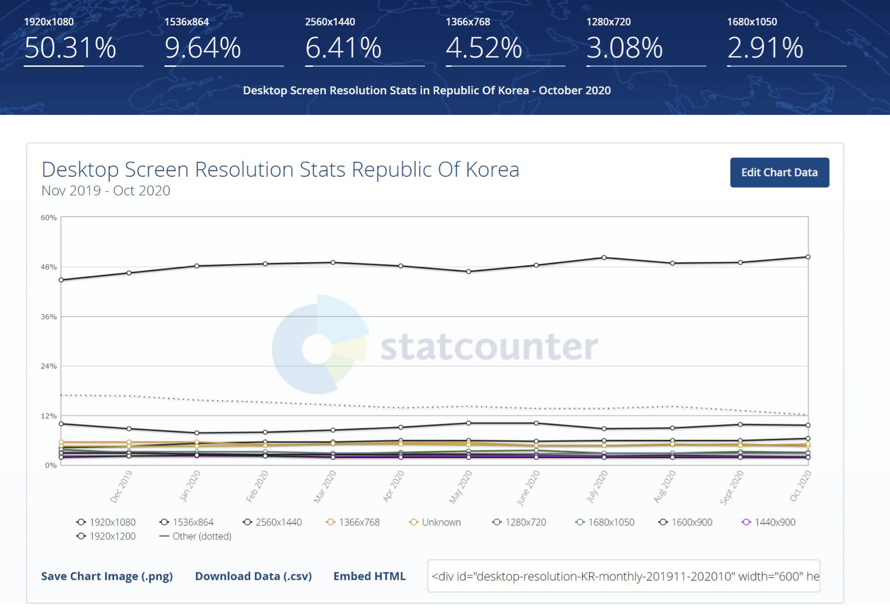
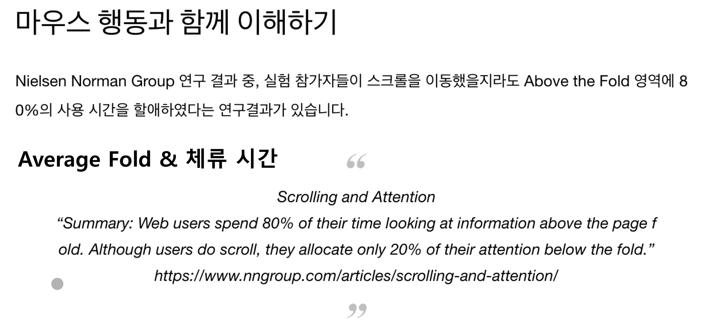

# 데이터 기반 UX 히트맵

## 내용 Part01
1. `히트맵 이해`
2. `마우스 클릭 분석`
3. `마우스 스크롤 분석`
4. Average Fold 분석
5. UX 디자인 개선
6. 사용자 탐색 분석

## `1. 히트맵 이해`
- `Heatmap` = 열 (Heat) + 지도 (Map)
- 특정 정보를 이미지 위에 `열 분포 형태의 그래픽으로 표현`
- 웹 사이트 분석에서는 `사용자의 마우스 움직임을 열 분포도로 변환`해 웹 사이트 위에 겹쳐 표현
- `시각화된 화면을 통하여 웹 사이트와 중첩`해서 보여주므로, 사용자의 입장에서 생각하고 그 활동을 분석할 수 있도록 지원

### 아이트래킹 - 히트맵으로 표현
- `아이트래킹 (Eye-Tracking):` 사용자의 행태와 의도 파악을 위하여 장비를 이용하여 사용자의 시선을 추적하는 기법
- 고가의 장비와 참여할 사용자 모집과 활용이 필요하므로, `한정된 숫자의 데이터만 수집` 가능
- 마우스 움직임을 사용하여 사용자가 `응시한 콘텐츠`와 `방문 순서,` `체류 시간`, 그리고 `시선 궤적의 거리`와 같은 정보를 수집 가능 (연구에 따르면 아이트래킹과 시선의 일치도는 약 84%)

## `2. 마우스 클릭 분석`

- Fold : 웹 사이트에서 작은 화면 보기에서 잘리지 않는 부분
- Average Fold : 통계적으로 봤을 때 평균적으로 잘리는 부분
- 접힌 부분에 드러나는 부분이 중요하다.

### 클릭 분석 (1)
- `무효 클릭` : 클릭 또는 이벤트 대상이 아닌 UI 요소 혹은 영역이므로 `기능적으로 의미가 없는 부분을 클릭`하는 경우
- 사용자가 `무의식적으로 빈 곳을 클릭`하는 무효 클릭은 분석에서 제외
- 사용자가 `클릭 가능하다고 오해한 경우`는 분석 대상
    - (예) 페이지 내에 고객사 로고들을 표현한 경우, 사용자들은 해당 로고를 클릭하면 그 회사 혹은 관련 상세 정보 사이트로 이동하는 것인 줄로 오해하고 클릭하여 `무효 클릭` 발생

### 클릭 분석 (2)
- 무효 클릭이 발생하면, 사용자의 `행동 흐름이 중단`될 가능성이 있고, 그 결과 `사용자가 실패감을 느낄 수 있음` &rarr; UX 디자인 개선을 통하여 사용자들이 클릭 가능하다고 믿는 요소들에서 "무효 클릭" 발생 방지 노력
- (주의) `무효 클릭`에 대한 다른 의미 존재 - 유명 포털 사이트에서 사용
    - 사용자가 의도하지 않은 클릭이나 악성 소프트웨어로부터 발생한 클릭 등, 불법으로 간주하는 광고 클릭 - 구글
    - 검색광고 본래의 취지에 맞지 않은 무의미한 클릭 - 네이버
    - 유저의 검색패턴에서 벗어난 클릭 - 무효클릭으로 판단되는 클릭은 과금되지 않음 - 카카오
    - 광고비 및 광고 호스팅 웹사이트 소유자의 이익을 늘리기 위한 인위적 클릭
    - 자동화된 클릭 도구, 로봇 또는 기타 사기성 소프트웨어를 이용한 클릭
    - 더블클릭의 두 번째 클릭처럼 광고주에게 무의미한 클릭

### 클릭 분석 (3)
- `유효 클릭` 클릭 가능한 유의미한 요소를 클릭 (예) 페이지 이동
- 이동 클릭 & 비이동 클릭 - 페이지 이동 여부에 따라 판단
- `유효 클릭 비율` = 100 * (유효 클릭을 수행한 사용자 수)/(해당 위치에 마우스를 이동한 사용자 수)
- 각 UI 요소를 분석하여 클릭 수, 클릭 비율, PV 당 클릭 수 정보, 등이 제공되고 유효 클릭 수 및 시간 등을 파악 가능

### 클릭 분석 (4)
- `유효 클릭 비율` &rarr; `사용자 목적` & `마우스 이동` &rarr; `콘텐츠 접근성 및 주목도`
1. 유효 클릭 비율 높고, 마우스 이동 높으면 &rarr; 기획 의도 성공적 달성
2. 유효 클릭 비율 낮고, 마우스 이동 높으면 &rarr; 접근성 높고 주목은 많이 받으나, 사용자 목적에 부합 못하므로, 사용자 니즈에 대한 추가 연구 필요
3. 유효 클릭 비율 높고, 마우스 이동 낮으면 &rarr; 주목도 개선 위해 디자인 개선 필요
4. 유효 클릭 비율 낮고, 마우스 이동 낮으면 &rarr; 사용자들로부터 외면 받는 콘텐츠이므로 유지 여부에 대하여 고민하고, 사용자 목적에 맞는다면 개선 방안 수립 필요

### 클릭 분석 (5)
- `이동 클릭` 클릭 가능한 요소를 클릭하여, 다른 페이지 혹은 탭으로 이동 혹은 새 창이 열리는 등 링크 클릭으로 유의미한 이동 기능을 수행
- 해당 페이지에서 사용자가 `가장 마지막으로 체류한 위치이자 마지막으로 소비한 콘텐츠`에서 발생한 클릭
- `이동 클릭`은 `마우스 스크롤` 및 `전환율`과 함께 분석
    - 스크롤 중단 이유가 "마음에 드는 콘텐츠로 전환하기 위하여"일 수도
    - 전환율 데이터와 비교하면 어느 콘텐츠에서 전환이 가장 많은지 측정

### 클릭 분석 (6)
- `비이동 클릭` 클릭 가능한 요소를 클릭하여, 동일 페이지 내부로 유의미한 이동 기능을 수행 (디자이너가 의도한 상호작용 수행)
- 화면 레이어가 펼쳐 지거나, 다른 이미지 표현, 텍스트 출력, 등
- 사용자가 해당 페이지에서 수행한 행위 판단 &rarr; 사용자의 최종 목적 및 관심사 추측 가능
- 페이지 내부의 `요소별 클릭 수`와 `전환율 수치` 파악이 중요

- above Fold : average Fold 위에 있는 fold (광고비가 below Fold보다 비싸다.)
- below Fold : average Fold 아래에 있는 fold

### 클릭 분석 (7)
- `사용자의 관심도` - 콘텐츠 클릭 수로 확인
- 이동 `페이지 PV에 기여한` 정도 = 해당 페이지 링크 연결 수
- 해당 `콘텐츠의 중요도` = (관련 요소 클릭 수) / (전체 클릭 수)
    - 해당 페이지 내의 중요도 & 전체 사이트 내부에서의 중요도 계산 기능
- 전체 `PV 대비 콘텐츠의 영향력` = (관련 요소 클릭 수) / (전체 사이트 PV)

### 클릭 분석 (8)
- UI 요소의 위치, 크기, 강렬한 정도, 등 &rarr; 접근성과 주목도에 영향을 줌
- `위치` : 첫 페이지 상단이 매우 중요한 위치 (접근성 & 주목도)
- `면적` : 크기에 비례하여 클릭 수 증가 &rarr; 크기 정보를 배제하기 위하여 면적 당 클릭 수로 비교 &rarr; "면적이나 위치에 무관하게 사용자가 선택한 요소들의 순위" &rarr; 절대 클릭 수보다 면적 당 클릭 수로 판단
- `강렬도` : 색상, 이미지 내용, 텍스트 내용, 등에 따라 접근성 및 주목도가 영향을 받음

### 클릭 분석 (9)
- 웹 페이지의 길이가 길어서 해당 `콘텐츠를 한 화면에 담기 어려울 때`
- 각 콘텐츠의 위치에 따라 콘텐츠에 도달한 사용자들의 숫자가 상이
- `콘텐츠가 노출된 (해당 위치에 도달한) 사용자 규모`
- 도달 사용자 규모 대비 클릭 수를 가지고 콘텐츠 도달 대비 전환 혹은 이동 성과를 파악

## 3. 마우스 스크롤 분석
1. 마우스 스크롤 이동 분석
    - 웹 페이지 레이아웃을 다라 스크롤 하면서 사용자의 관심이 이동하는 상황 파악
        - PV 100% 도달한 경우 - HOT (빨간색)
        - PV 0% 도달한 경우 - COLD (파란색)
    - `Average Fold`영향을 받음 - 신문 접은 모습 (@가판대)
        - "Above the Fold" : 신문 1면에 위치하여 노출 빈도 높음
        - "Below the Fold" : 접혀진 부분이라 상대적으로 노출 어려움
        - 웹의 경우, 사용자 기본 화면 깊이 (혹은 높이) 기준
        
        
    - 기본 화면 깊이 (혹은 높이)안에 들어오지 않는 콘텐츠의 경우, 사용자 스크롤이 해당 콘텐츠에 도달할 수 있도록 유도하는 방안 강구 필요
    - `Average Fold기준으로 세밀한 분석` 필요
        - Average Fold 영역에 히트맵 흔적이 없다면 사용자들은 추가되는 영역의 존재를 모를 수 있으므로 개선 방안 고민 필요
        -   Average Fold 영역 상단에 사용자들의 니즈를 만족시키는 콘텐츠가 다 존재하면, 사용자들은 해당 영역을 벗어날 필요성을 느끼지 못할 수도 있으므로, 추가 분석 필요
    - 관련 `데이터 교차 분석` 필요
    
2. 마우스 스크롤 데이터 교차 분석
    ### (1)
    - 서로 `다른 히트맵을 교차 분석하여 종합적 분석` &rarr; 깊이 있는 사용자 행동 및 현황 파악 가능
    - 스크롤 히트맵, 마우스 이동 히트맵, 클릭 히트맵, 체류 시간 등을 교차 분석
    - (예) 스크롤 중단 이유, 특정 영역 도달 혹은 미도달 이유, 등 종합적 분석에 의한 판단 가능
    ### (2)
    - `어텐션 그래프` (Attention Graph) = 스크롤 히트맵 + 체류 시간
    - `사용자의 주목도 의미`
    - 주목도가 가장 높은 영역
    - 주목도가 가장 낮은 영역
    
    ### (3)
    
    
    

## 내용 Part02
1. 히트맵 이해
2. 마우스 클릭 분석
3. 마우스 스크롤 분석
4. `Average Fold 분석`
5. `UX 디자인 개선`
6. `사용자 탐색 분석`

## `4. Average Fold 분석`
- `Above the Fold` 영역은 해당 페이지 방문 사용자에게 100% 노출되는데, `Below the Fold` 영역의 경우는 들어가는 의사 결정이 필요
- `3초 법칙` : 웹 사이트 방문자가 페이지에서 어떠한 정보를 찾거나 행동을 위한 의사 결정을 하는데 일반적으로 3~5초를 소비하므로, 3초이내에 사용자들이 웹 페이지를 보고 `Below the Fold`영역으로 넘어갈 수 있도록 유도하여야 함

### Abodve the Fold 역할
- 항상 사용자에게 노출되는 부분이므로 `사용자의 추가 탐색` (즉, 해당 페이지의 하단 부분으로 스크롤 내리기와 같은 적극적인 탐색)을 유도
- 해당 부분의 콘텐츠가 `사용자의 기대에 부응하는 정도`에 따라 추가 탐색 실행 여부가 좌우됨
- 사용자의 `목표를 달성시키는 과정에서 가장 중요한 영역`이자, `페이지 추가 탐색을 유도`하는 첫 관문

### 시사점
- 사용자들의 `디스플레이 해상도 분포`를 고려하여 "Average Fold" 조정함으로써, 대상 사용자 범위 결정 &larr; `Above the Fold 영역`을 대부분의 사용자들이 주목함
- `글로벌 사용자와 국내 사용자의 디스플레이 해상도 분포`가 다르므로, 각각의 경우에 따라 웹 페이지의 "Average Fold"조정

## `5. UX 디자인 개선`
- 마우스 `스크롤 히트맵과 Average Fold`함께 분석
- 사용자 `체류 시간과 Average Fold`함께 분석
- `Average Fold`를 UX 디자인 개선에 활용

### Average Fold & 스크롤 히트맵

1. above the fold &rarr; 눈길체류
2. Average Fold &rarr; Below the fold 유도
3. Below the Fold &rarr; 오래 머무르도록 유도
---

> Average Fold에서 애매하게 끊어 스크롤을 내리도록 유도한다.

## `6. 사용자 탐색 분석`
- `스트림 (Stream) `해석 방법 - `사용자 탐색 순차` 파악
- 사용자의 `응시 지점과 지점 별 체류 시간` 산출
- `플롯 (Plot)그래프로` 표현 - 개별 사용자의 흐름 파악
- 스트림은 전체 사용자는 물론 세그먼트 별로 세분화된 각 그루 별 `사용자의 평균 행동 흐름` 파악

### 스트림 (Stream)
- 사용자의 `평균적인 콘텐츠 소비 흐름`
- 마우스 `포인터 이동 흐름의 순차` : 원을 연결하는 선과 원 안의 `숫자`
- 마우스 포인터 `체류가 가장 집중된 콘텐츠의 위치` : 원의 `위치`
- `체류 시간` : 원의 `크기`
- 전환 혹은 이탈하지 않고 `순차를 이어간 페이지 뷰의 비율:` 원의 `투명도` - 투명할 수록 전환하거나 이탈한 사용자가 많은 콘텐츠

> 사람 마다 눈이나 마우스의 움직임 패턴이 다르다.

> 평균을 냄

### 최종 목적지 비교 분석

- Referrer마다 `Click Heatmap을 비교`하여, `사용자의 관심 및 최종 목적지를 비교/분석`할 수 있습니다.
- 네이버를 통해 들어온 사람들은 검색으로 들어왔기 때문에 다른거 쳐다보지도 않고 목적지로 바로 가서 구매한다.

- Referrer마다 `Movement Heatmap을 비교`하여, `사용자의 관심과 행동의 전반적인 분포를 비교/분석`할 수 있습니다.

- Referrer마다 `Activity Stream을 비교`하여, `콘텐츠의 탐색 흐름과 체류 시간 정보를 비교/분석`할 수 있습니다.