# 데이터 기반 UX 심화 분석

## 내용 part01
1. `유입경로 이해하기`
2. `CTA (Call to Action) 분석`
3. `효과적인 CTA Design`
4. 퍼널 (Funnel) 분석
5. 개별 사용자 행동 분석

## `1. 유입경로 이해하기`
- `유입 채널` : 직접, 추천, 검색과 SNS 유입
- 방문자들이 이용한 다양한 채널 분석
- `Organic Search` (무료) 대 `Paid Search` (유로)
    - 웹 사이트 운영자가 지불하는 비용의 유무
    
    
    

### "직접 유입"의 다양한 사례
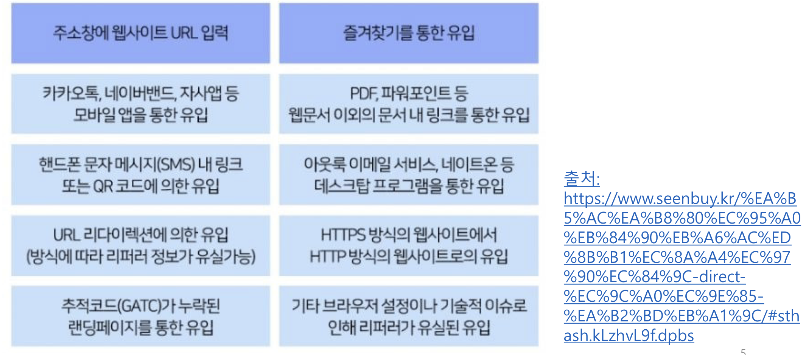

### 경로 파악 방법

- Google Analytics에서 `유입경로 자세히 보기 필터`를 사용하면 검색하는 사람이 `어떤 기기`(PC, 모바일(태블릿, 스마트폰) 등)에서 `어떤 검색어`로 검색했는지 알 수 있음
- 검색자의 `검색 결과 페이지를` 그대로 볼 수 있어서 자신의 사이트가 검색엔진에서 어떻게 보여지는지 정확히 볼 수 있음
- 또한 해당 링크를 클릭하여 특정 검색어로 검색 시 `자사/자신의 사이트/페이지의 순위는 물론 경쟁사의 순위는 몇 등인지를 확인할` 수 있음.

### 유입 경로에 따른 사용자 특성
- `검색을 통한 유입 (Search):` 네이버나 구글 같은 검색 엔진을 통해 유입된 경우, 해당 웹 서비스와 연관된 키워드 혹은 서비스 명을 인지 가능성
- `서비스 명으로 검색`한 사용자는 재방문 가능성이 높으며, 특정 목적을 명확하게 인지하고 유입된 방문자일 가능성
- `다른 키워드 사용한 검색`의 경우, 해당 키워드가 사용자의 니즈와 연관될 가능성 - [`구글 서치 콘솔`](https://search.google.com/search-console/about)사용하면, `사용자의 검색어 파악 가능`
- `SNS 유입 (Social):` 광고나 홍보 채널을 통해 유입되므로 웹 서비스에 대한 사전 정보가 상대적으로 부족한 경우가 많음
- 대부분 콘텐츠에 흥미를 느끼고 유입되며, 구체적인 니즈는 저조
- 각 SNS 별로 유입된 `사용자들의 행동 패턴을 분석`하면 마케팅 활동 관련하여 유용한 정보가 될 수 있음 (예, 전환률)

### 유입 경로 별 사용자 행동 분석
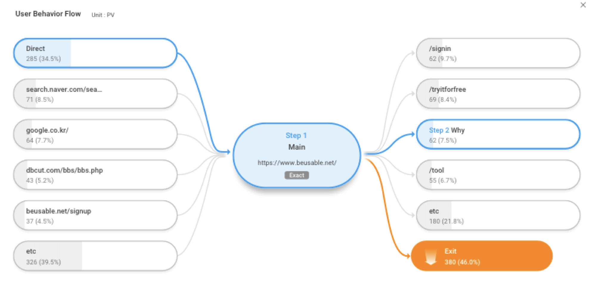
- `직접 유입 "Above the Fold"` 영역을 주로 탐색
- 직접 유입 방문자들의 콘텐츠 탐색 의지가 상대적으로 부족함
- `구글 & 네이버 유입`은 `"Average Fold"` 지나 `동영상 영역`에도 체류
- 구글 사용자들은 동영상에 제일 오래 체류
- 네이버 유입자들의 콘텐츠 소비율이 제일 높음
- 각 유입 경로 별로 사용자의 `전환률 분석` 필요
- 홍보 비용 투입 우선 순위? &rarr; 네이버 > 구글 > 직접 유입

## `2. CTA (Call to Action) 분석`
- `CTA 버튼` = `행동 유도 버튼` 혹은 `목표 달성 버튼`
- 회원 가입, 구매, 다운로드, 문의, 상세정보, 등 다양한 기능의 버튼 존재
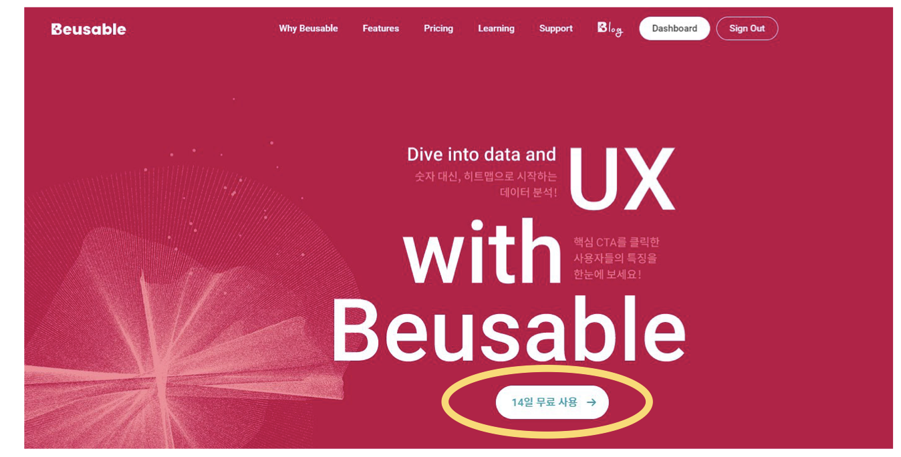

### `세분화된 CTA 분석`

- 사용자 유입 경로
- PV & UV
- 신규 방문/재방문 비율
- 펭균 체류시간
- 사용 디바이스 정보
- &rarr;
- 정보들을 분석하여 전환률 개선에 활용

- `직접 유입`이 가장 많음
- 네이버와 구글을 통한 유입이 각각 2위 & 3위 &rarr; 홍보 & 마케팅 효과가 좋음
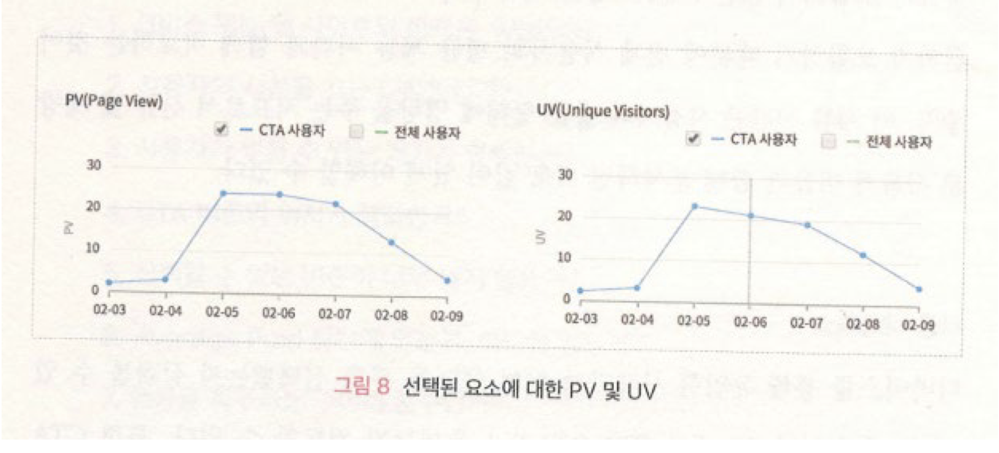
- `전체 사용자 대비 CTA 사용자의 PV & UV 비율 게산` &rarr; 해당 CTA 중요도 측정 가능
- 해당 `페이지의 PV / UV` &rarr; 한 명의 사용자가 해당 페이지에 속한 CTA 기능 수행을 위하여 몇 번이나 그 페이지를 방문했는지 표현
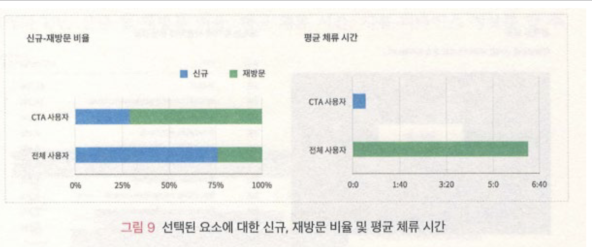
- `신규 - 재방문 비율:` CTA 기능 선택한 사용자는 어떤 사용자인가? 마케팅 효과 측정 가능.
- `평균 체류 시간:` CTA 사용자가 해당 기능이 있는 페이지에 체류한 평균 시간으로, CTA 기능의 종류에 따라 (1) 이동 링크 포함이면, "CTA 도달하기 까지의 평균 체류 시간"으로 해석 (2) 페이지 내부에 머무르는 경우, "CTA 도달 및 선택 이후의 체류 시간" 의미

- `사용 기기의 종류 별 분석:` 각 기기별로 사용자는 어떤 CTA기능을 선택했는지 분석
- 해당 기기에서는 `CTA가 노출`되었는지 여부 확인 - Average Fold 위치 확인 필요
- `Above 혹은 Below the Fold 영역`에 위치 &rarr; 해당 버튼 위치에 따라 CTA 노출 여부 결정되어 전환률에 큰 영향을 끼침

## `3. 효과적인 CTA Design`
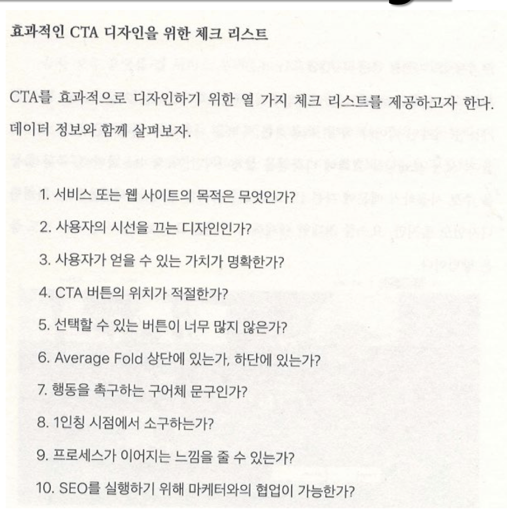
1. 서비스 혹은 웹 사이트의 목적
    - 서비스 혹은 사이트 `운영 목적이 분명하게 설정`되어야 함
    - 상품 매출? 고객 발굴? 브랜딩을 통한 광고 매출?
    - 목적에 따라 문구나 그래픽 요소들의 색상과 톤이 결정됨
    - 어떤 목적을 가지고 있던지, 중요한 `공통의 세부 목표는 사용자의 행동을 촉구하고 유도`하는 것 &rarr; 단순 감상이나 정보 제공용은 아님
2. 시선 유도하는 디자인
    - `클릭이 가능한 디자인`으로 `사용자의 주목`을 받고 `행동 유도`
    - 일반적으로 화려하고 강렬한 디자인으로 관심 유도
    - 깔끔하고 단순하며 여백을 살린 효율적 디자인도 유용함
    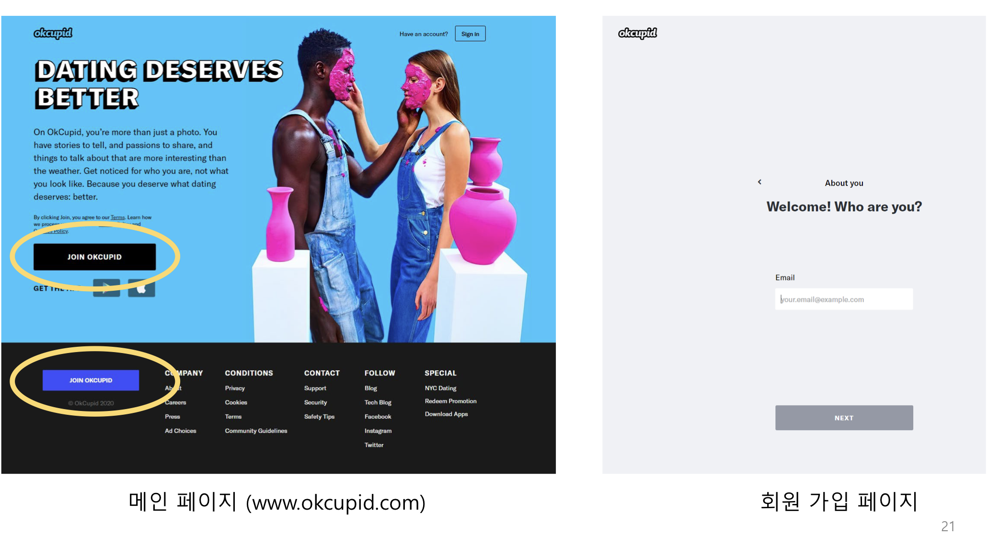
    > 이 사이트는 회원 수를 늘리는 것이 목표여서 저러한 시선을 유도했다. 
3. 사용자가 얻는 가치를 명시
    
    - 사용자의 이익 명시
    - 이익 실현을 위한 CTA 버튼의 주목도 제고
    - 이익에 대한 기대 심리 표현
    - www.uber.com
    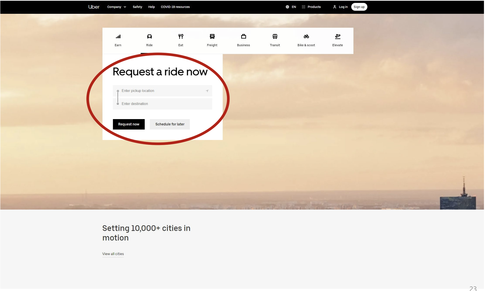
4. CTA 버튼 위치의 적절성
    - `"구매 흐름"`에 자연스럽게 어울리는 버튼 디자인 및 배치 필요
    - 주목도, 크기, 위치, 등
    - 구매 흐름에 따른 마우스 이동 경로와의 거리를 최소화
    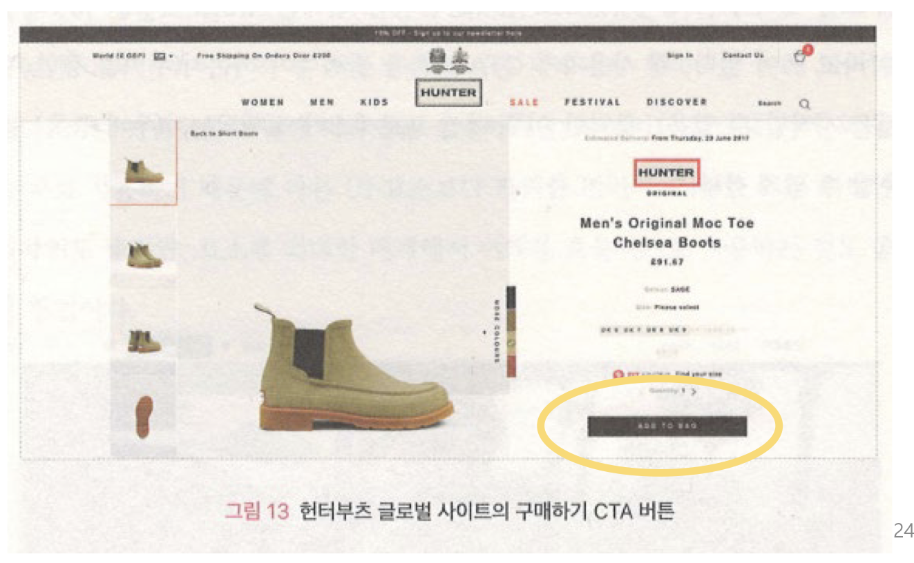
5. 적절한 숫자의 선택 버튼
    - `너무 많은 옵션 중에서 선택`하려면, `사용자가 부담`을 가짐
    - 4개 이하의 선택 버튼을 제공해야 `사용자들이 편안하게 선택` 가능
    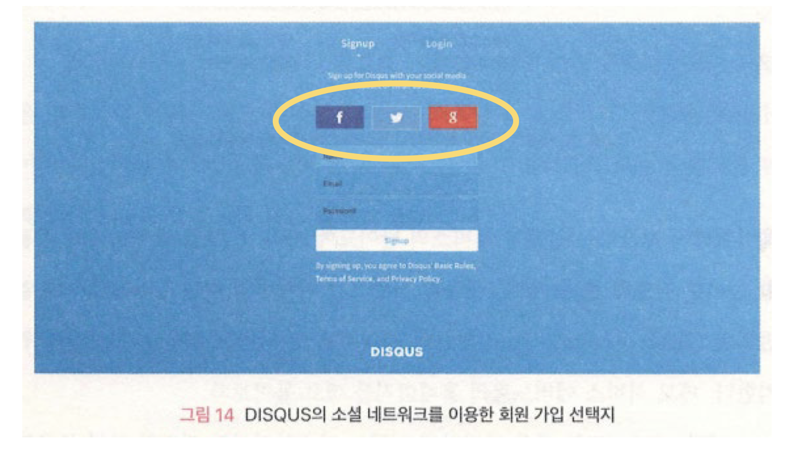
6. CTA 버튼의 위치
    
    - "`Above` or `Below the Fold`???"
    - `복잡하고 어려운 서비스`를 이해하는 과정에서, 설명을 위해 페이지 스크롤이 하단까지 가는 경우가 다반사
    - `쉽고 단순한 서비스`의 경우 CTA 버튼은 상단에 위치
    

    ### AIDA 법칙 
    - 방문자가 CTA 행동을 일으키기 까지의 과정 정의
    - `A`ttention (주의) : 고객의 관심을 끄는 카피 문구나 이미지 사용
    - `I`nterest (흥미) : 고객의 관심이 이어질 수 있는 콘텐츠 배치
    - `D`esire (욕구) : 서비스의 강점과 특징을 어필하여 사용자의 욕구 자극
    - `A`ction (행동) : 사용자가 CTA 행동을 하도록 유도

7. 행동을 촉구하는 구어체 문구 사용
    - "가입하기" &rarr; `"30일 무료 체험 하세요"`
    - "등록하기" &rarr; `"지금 3천원에 다운로드하세요"`
    - `자극적이고 강렬한 자극과 설득`
    - 희소성 &rarr; 긴장감과 시급성 유도 (예, 기간 한정 세일, 매진 임박, 등의 문구로 자극하고 CTA 행동 유도)
    
8. 1인칭 시점
    - 사용자에게 `공감`을 불러 일으킴
    - "당신의 아이템을 드립니다." &rarr; 사용자를 꼭 집어서 지칭
    - 나에게 `맞춤형 정보 제공` 및 `기능 제공`
    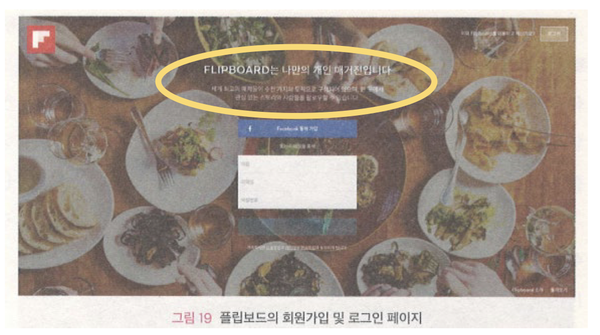
9. 프로세스가 이어지는 느낌
    
    - CTA 버튼이 세션 종료를 의미하는 것은 아니므로, `연속적으로 이어지는 절차 및 정보 제공을 지원`하는 작업 필요
    - (예) 화살표 혹은 다운로드 버튼 모양의 아이콘 사용
10. SEO 실행 위해 마케터와 협업
    - 사용자 유입이 있어야 CTA 버튼 누르는 행동 발생
    - `사용자 불러 모으기와 붙잡아 두기 전략` 필요
    - `다양한 검색엔진 최적화(SEO, Search Engine Optimization)`되어 사용자들을 불러 모으는 웹 사이트가 되도록 `마케팅 및 홍보 전략 수립과 추진` 필요

## 내용 part02
1. 유입경로 이해하기
2. CTA (Call to Action) 분석
3. 효과적인 CTA Design
4. `퍼널 (Funnel) 분석`
5. `개별 사용자 행동 분석`

## 4. 퍼널 분석
- `"퍼널 (Funnel)"`: 웹 사이트 방문자가 전환(상품구매, 문의 완료, 회원 가입, 등)에 이르기까지 단계 별로 페이지 시각화 & 분석, 어떤 단계에서 얼마나 이탈하는지를 파악하여 UX디자인 개선에 활용하는 분석 기법
- 해당 웹 사이트의 `취약한 페이지와 성과를 달성하는 페이지` 파악
- `세션`을 기준으로 사용자 유입수, 이탈률, 전환율, 잔존율 계산
- `"잔존율:"` 전환 경로의 각 단계에서 이탈하지 않고 다음 단계로 넘어간 사용자의 비율

### 단계별 잔존 및 이탈 현황
단계별 잔존 및 이탈 정도를 한눈에 파악할 수 있습니다. 기울기의 폭이 클수록 해당 페이지의 이탈률이 높다는 의미이며, 이탈률이 높은 단계의 페이지를 개선하면 잔존율을 높일 수 있습니다.

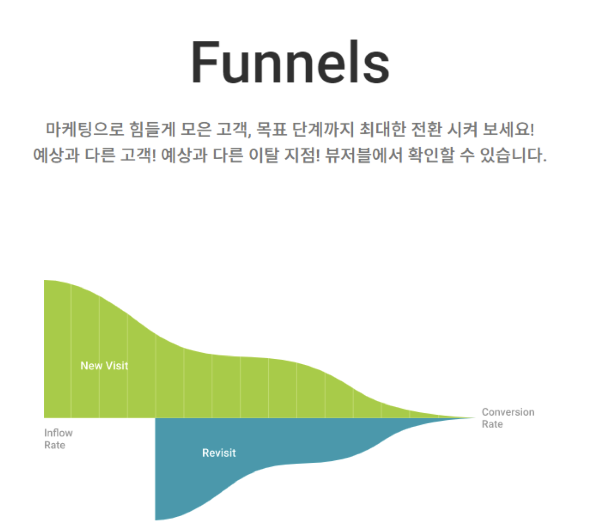

### 퍼널 설계 방법 (1)
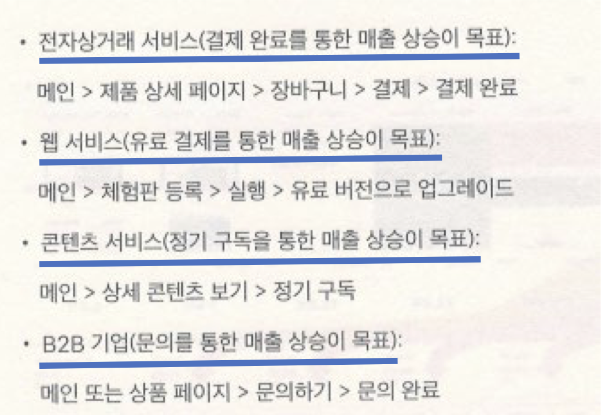
- 분석할 퍼널을 사용자의 경로를 사용하여 구성
- 최종 페이지부터 시작 페이지까지 역순으로 생각
- 서비서의 가장 큰 목표는 ?
- 일반적인 퍼널 경로를 생각하여 시각화 &rarr;

### 퍼널 설계 방법 (2)
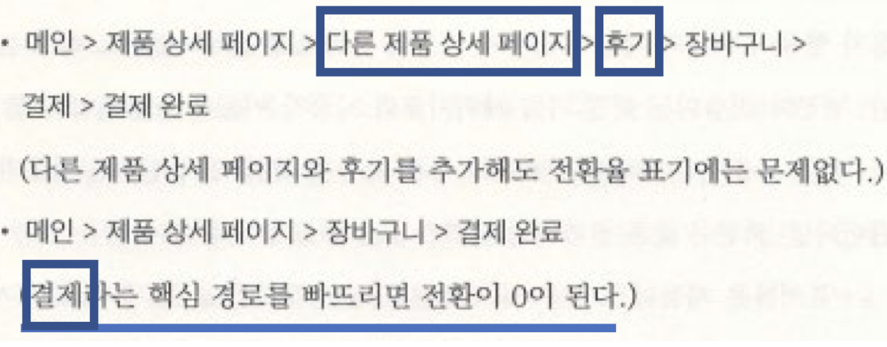
- 퍼널 작성 과정에서 `핵심 경로` 사이에 다른 `페이지 추가는 가능`
- `핵심 페이지`가 빠지고 `경로를 건너 뛰는 경우,` 최종 전환이 "0"이 될 수 있음

### 퍼널 설계 방법 (3)
- 메인 페이지에 들어온 방문자들이 "Why"페이지로 많이 가기를 원하는데 (`퍼널의 설계`에 반영됨) 다른 페이지로 더 많이 가는 상황이 발생하므로 개선이 필요 &rarr; (예) "메인" 페이지 개선 방안 찾기
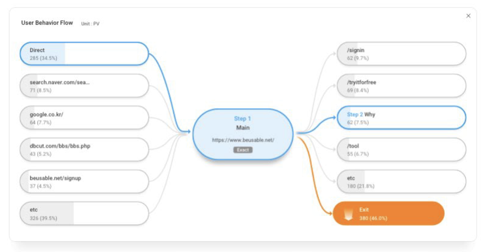
- 단계별 사용자 행동흐름 분석 &rarr; 랜딩 페이지 방문 전후의 페이지 정보로 사용자 행동 흐름을 분석할 수 있으며, 퍼널 단계를 수정함으로써 `최적화된 사용자의 행동 흐름`을 찾을 수 있습니다.

### 퍼널 설계 방법 (4)
- `세션 리포트` 검토하여 개선 방안 찾기
    - 마우스 오버(= Hover), 클릭, 스크롤, 체류 시간, 등의 사용자 행동 정보 분석
    - 페이지 이동 흐름 파악 (사용자 행동)
- 서비스 상의 `전환율 최적화` 방안 강구
    1. `이탈률 개선` - 취약 페이지의 UX 개선을 통하여 전체 이탈률 낮추기
    2. `사용자 유입수 늘리기` - 캠페인 등 적극적 마케팅 활동 수행
        - 다양한 방안을 수립하고, 비교 검토하여 의사 결정

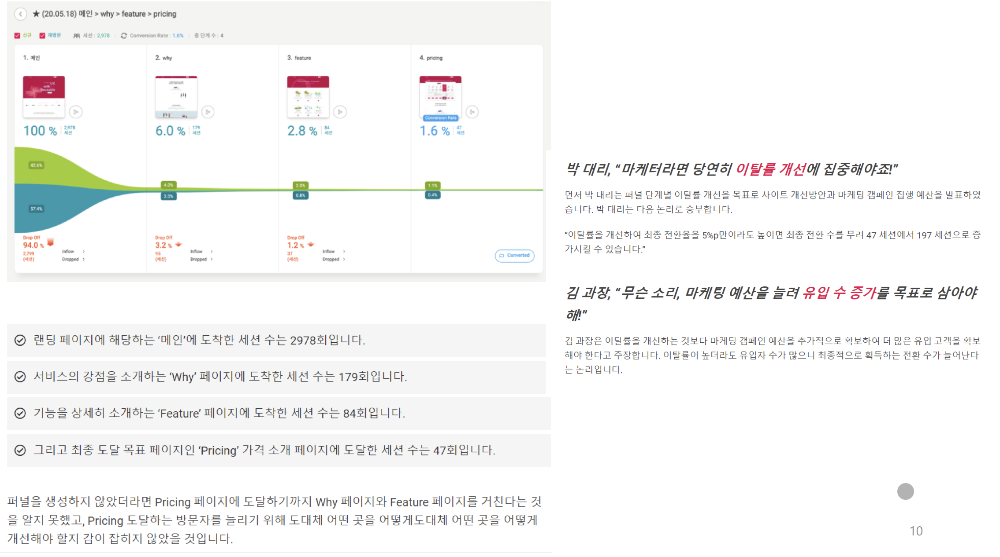
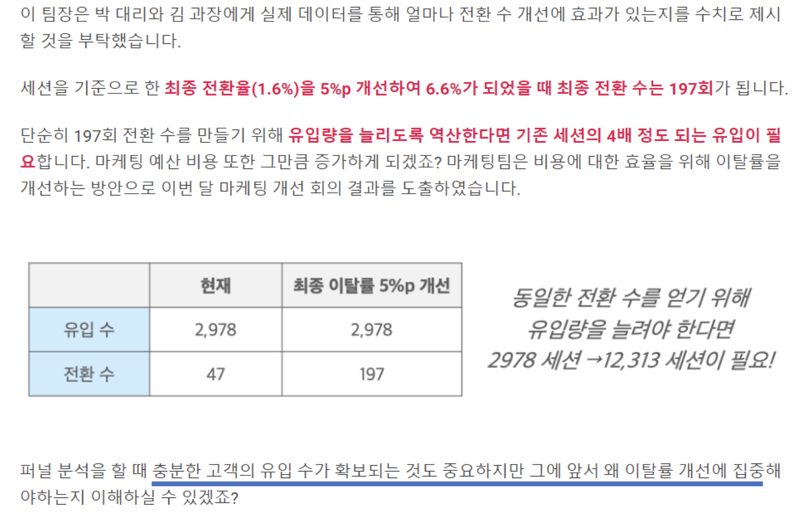
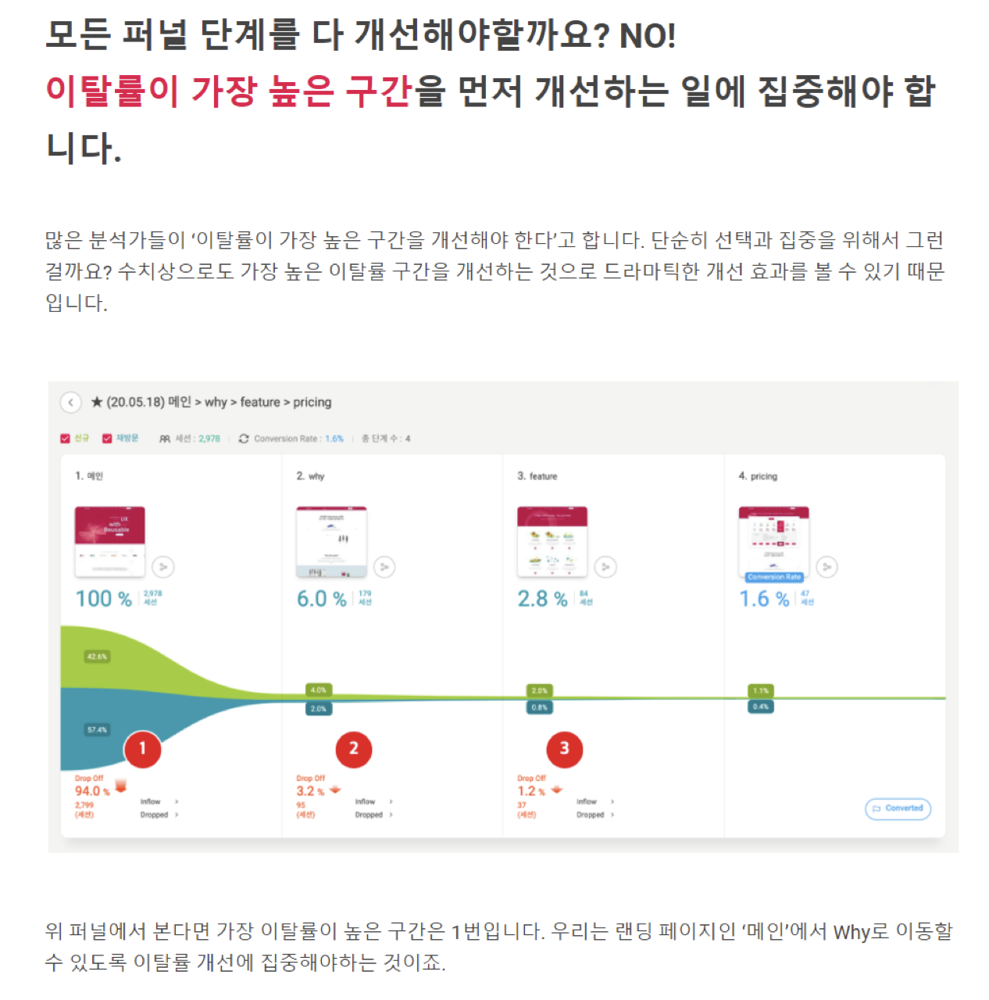
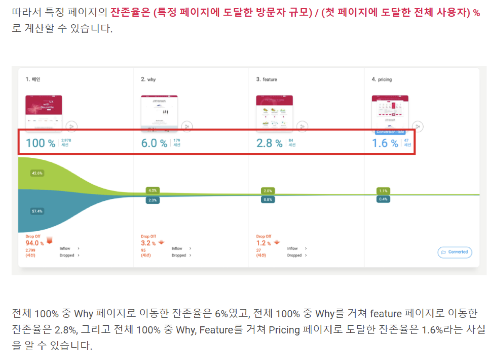
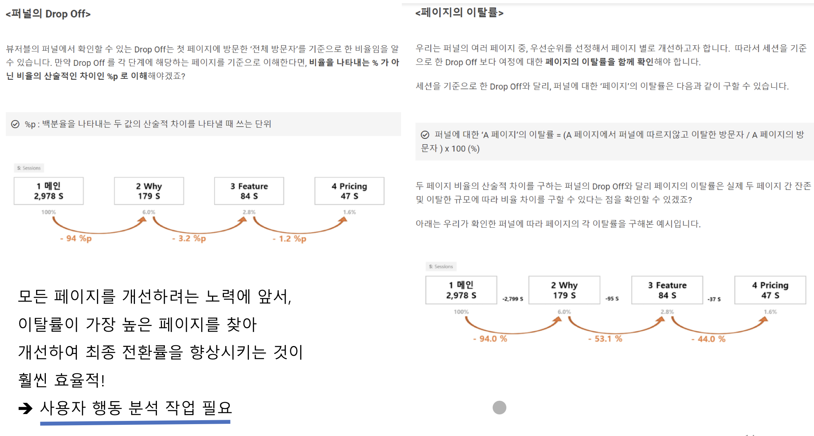
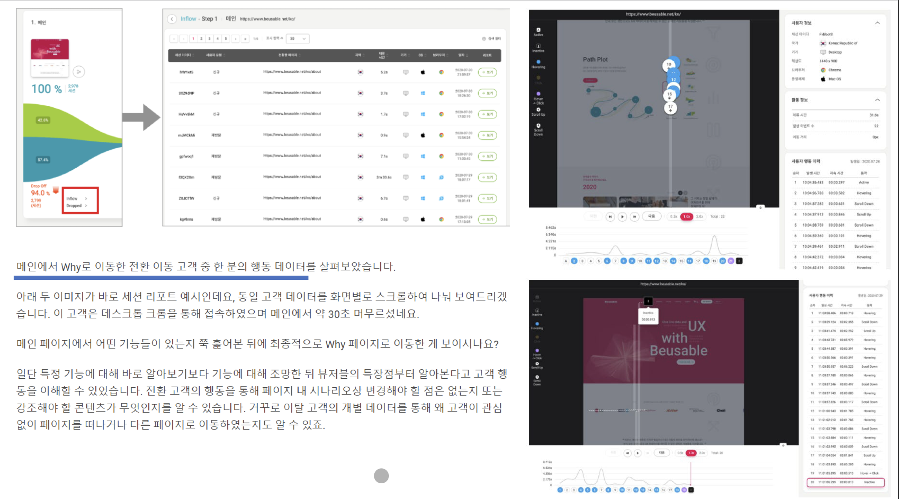

## 5. `개별 사용자 행동 분석`
- `세션 리포트(Session Report):` 개별 사용자의 웹 페이지 활동을 파악
> 사용자 행동을 녹화하였다가 동영상으로 보여주는 방법 혹은 사용자 행동의 요약된 정보를 시각화하여 제공하는 방법
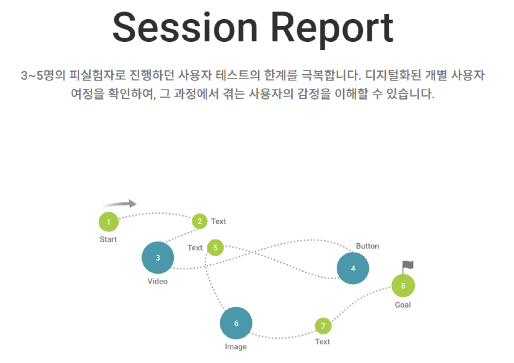
> 개별 사용자의 이동 흐름과 행동 &rarr; 사용자 검색 순서와 체류 시간, 행동 정보를 확인할 수 있습니다. Hover to Click, Hover, Click, Scroll 정보를 알기 쉽게 제공하고 있습니다.
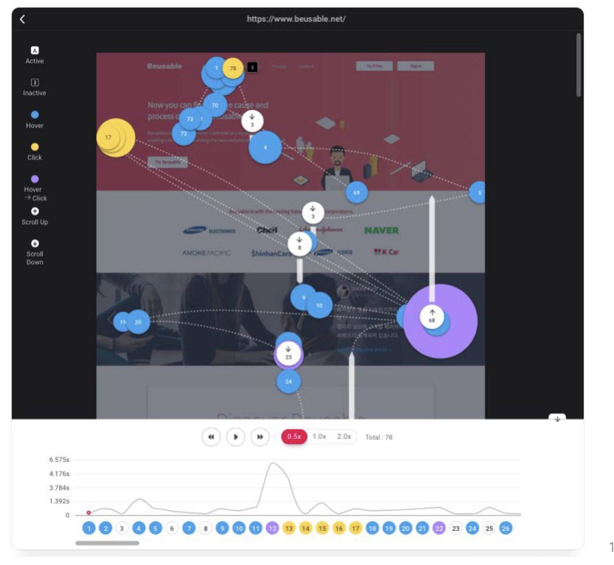
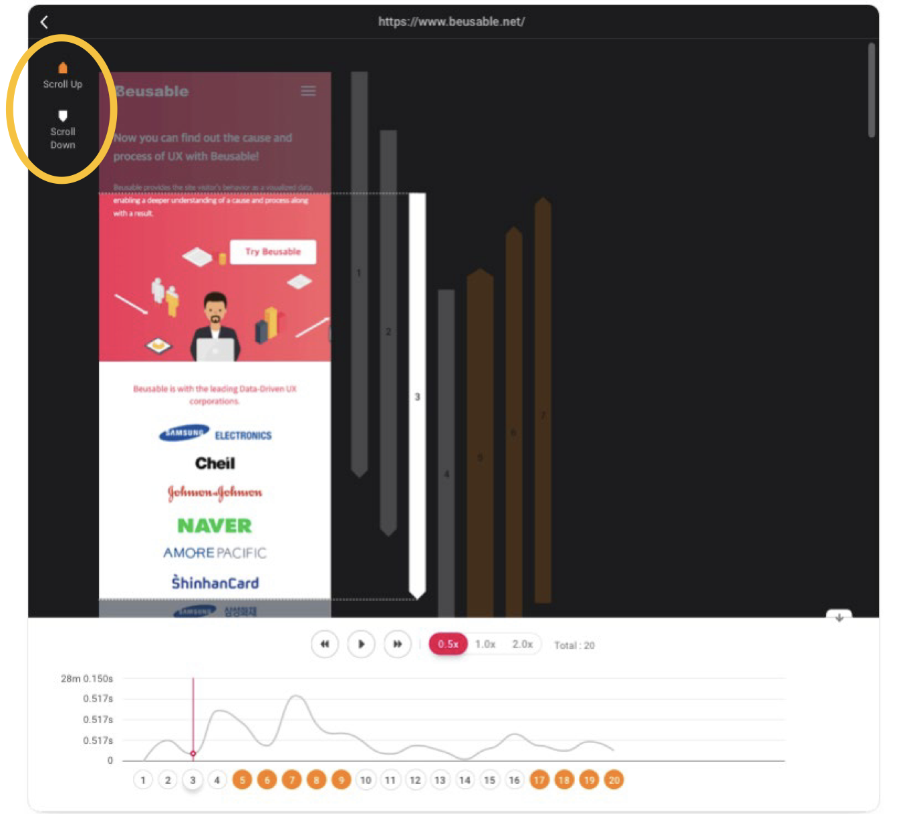
> 사용자 정보
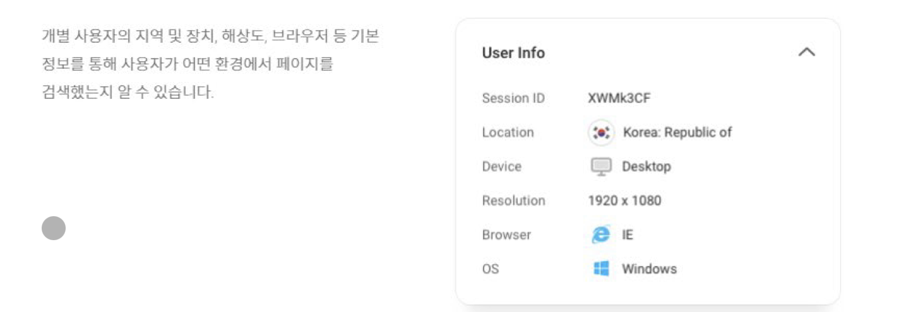
> 활동 정보의 비교 분석
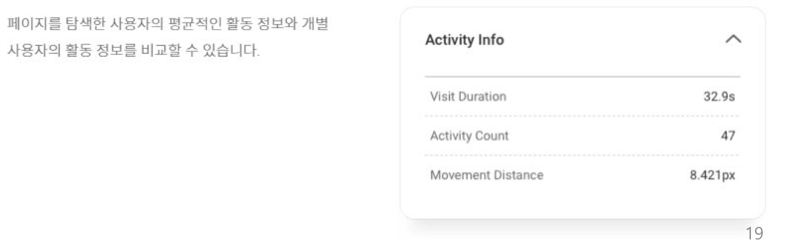
> 행동 순서별 내역 &rarr; 사용자의 행동 시점과 행동 정보를 제공함으로써, 상세한 사용자 활동을 확인 할 수 있습니다.

### 세션 리포트 활용
- 개발자 - 디버깅
    #### 개발자를 위한 세션 리포트 : 버그를 신속하게 재현하고 해결하도록 지원합니다.
        사용자의 디바이스, 브라우저, 화면 해상도, OS는 모두 다릅니다. QA를 하더라도 잡아낼 수 없는 에러가 있을 수 있습니다. 
        이를 버그로 보고하더라도 버그 리포트만으로는 개발팀에서 무수한 경우의 수를 고려하며 문제 상황을 재현하기 어렵습니다.
        사용자에게 어떤 일이 일어났는지, 누가 정확히 어떤 영향을 받고 있는지 추측하기에 충분한 정보가 제공되지 않는 경우가 대다수입니다.

        또한 텍스트와 일련의 스크린숏 정도로만 제공되는 리포트는 버그의 영향도를 책정하기 어렵고 그렇기 때문에 우선순위를 결정하는 것도
        어렵습니다. 세션 리포트라면 이 문제를 간단히 해결해줍니다. 소프트웨어상의 문제점, 코딩 상의 에러, 버그들을 신속하게 이해하고 문제 재현과
        해결에 걸리는 시간을 극적으로 단축시켜 줍니다.
- 마케터 - 전환률 최적화
    #### 마케터를 위한 세션 리포트 : 전환율 최적화를 위한 실마리를 제공합니다.
    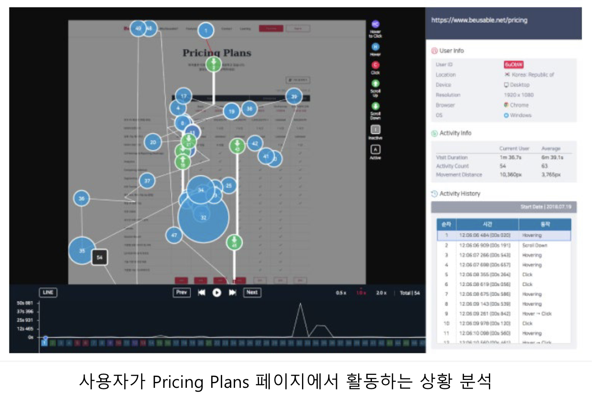
        웹 사이트 전환율을 최적화하기 위해 마케터는 항상 머리를 맞대고 고민합니다. 하지만 마케터가 사용하는
        기존 웹로그 분석 툴이나 일련의 KPI들만 보아선 왜 사용자가 CTA를 클릭하지 않는지, 어느 지점에서 흥미
        를 잃었는지, 어떤 콘텐츠가 사용자에게 인기 있고 그렇지 않은지를 발견하기 어렵습니다. 세션 리포트는 특
        정 웹 페이지에서 사용자에게 어떤 일이 일어나는지를 정확히 제시함으로써 전환율 최적화를 지원합니다.
        왜 사용자가 전환하는지, 그렇지 않은지, 전환율 이끄는 트리거가 무엇인지를 발견할 수 있습니다.

            - 사용자가 혹시 UI를 혼동하지는 않나요 ?
            - 사용자의 화면에 CTA가 가려져 있지는 않나요 ?
            - 부족한 정보를 더 찾고 있지는 않나요 ?
            - 왜 도중에 양식 입력을 포기하였나요 ?

        세션 리포트는 마케터가 설정한 퍼널을, 더욱 상세히 이해하게 하고 실제 집행한 광고 효과를 분석하는 강력한 역할을 합니다.
- 고객센터 - 고객의 문제 이해
    #### CS 담당자를 위한 세션 리포트 : 고객이 직면한 문제를 직관적으로 이해할 수 있게 합니다.
    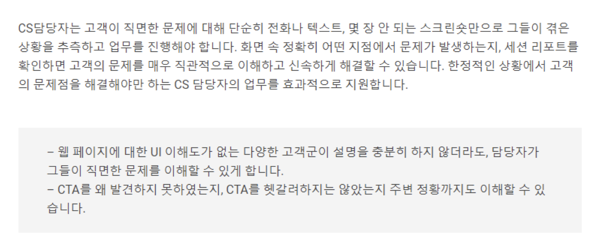
- UX 디자이너 - 사용자 니즈 & Pain Point 발견
    #### UX 디자이너를 위한 세션 리포트 : 사용자의 Needs와 Pain-Point를 발견하게 합니다.
    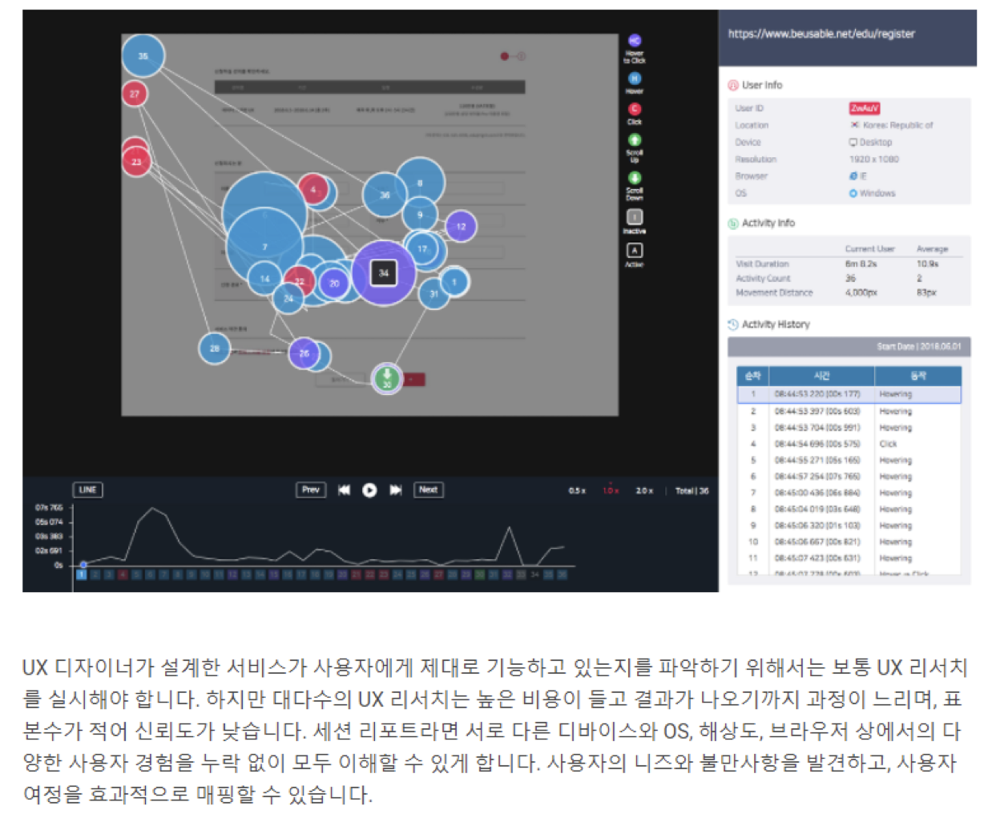

### 목표 달성 페이지 분석 사례
- 회원 가입 페이지 `UX 디자인 문제점 분석` 사례
    - 회원 가입 페이지에 `"회사명 입력"` 양식에서 마우스 움직이며 회원 가입 진행을 지체하는 양상을 보이는 사용자의 숫자가 많이 확인된다면 &rarr; (해결 제안 1) 사용자를 `"기업사용자"`와 `"개인사용자"`로 분리
- 고객센터에서 `고객의 서비스 이용 상의 문제점 파악` 사례
    - 고객들의 문의, 상담, 건의, 제안, 항의, 등 메시지가 다양한 형식으로 전달됨
    - 이메일, 게시판, 전화, 등 소통 수단을 통하여 전달되지 못하는 상황이나 문제점을 `세션 리포트 분석을 통하여 파악`

## 생각해 볼 점
- 퍼널 생성의 중요성
- 개별 사용자 행동 분석의 중요성
