# UX디자인 Data Driven UX - A/B Testing

## 내용 - "뷰저블" 사이트 블로그 중심
1. A/B Testing 이란 ?
2. A/B Testing 필요성과 사례
3. A/B Testing 진행하기
4. A/B Testing 진행 시에 주의 사항
5. A/B Testing 에 대한 오해

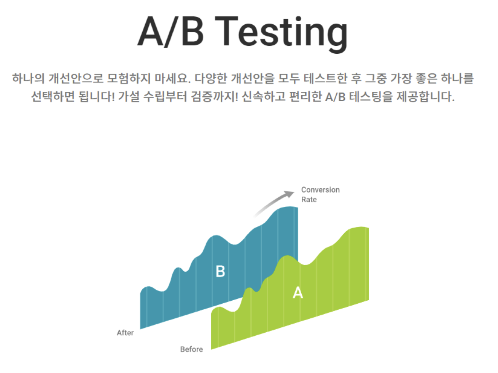

## `1. A/B Testing 이란 ?`

### A/B Testing 결과 요약
> A/B 테스트 결과를 전환률, 이탈률, 평균 체류 시간 등 주요 지표를 기준으로 비교할 수 있습니다.
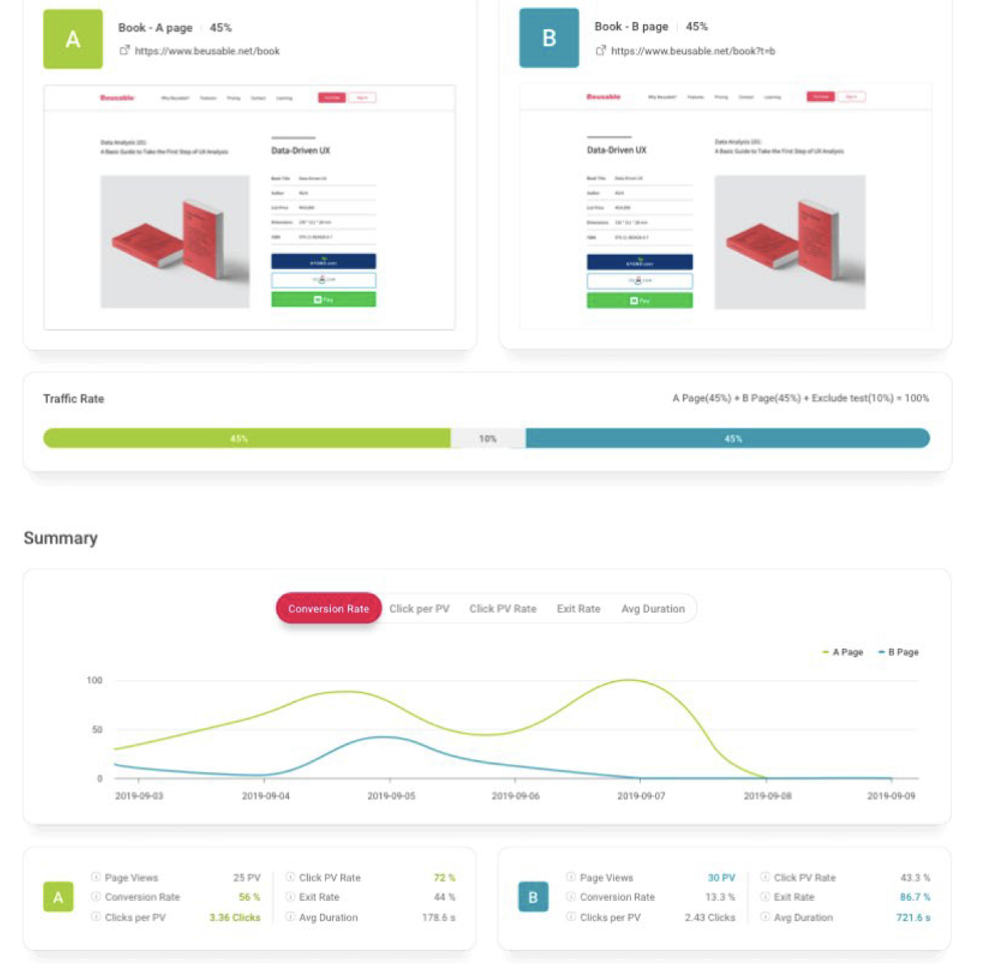

### UX 개선 전후 링크별 
> UX 개선 전후의 링크별 전환율을 비교하여 그 개선 효과를 한눈에 파악할 수 있습니다.
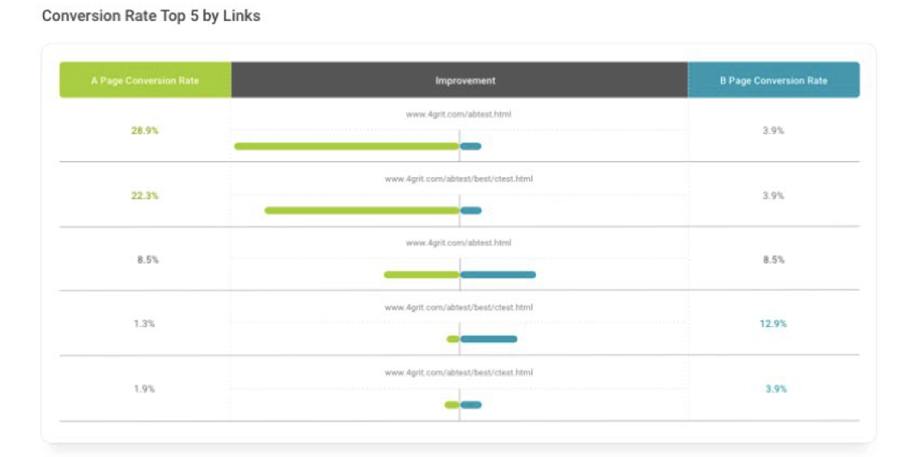

### UX 개선 전후 요소별 클릭 비교
> UX 개선 전후의 요소별 클릭률을 비교하여, 클릭을 유도하기 위한 콘텐츠의 추가 및 수정 여부를 결정할 수 있습니다.
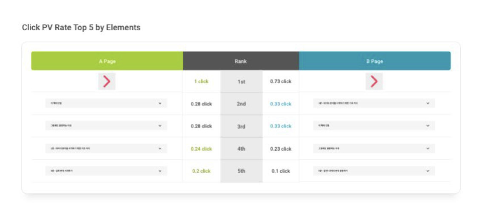

### 히트맵을 통한 A/B Testing 결과 비교 분석
> 히트맵으로 결과를 비교 및 분석하면, 지표로는 쉽게 알 수 없는 정량적인 사용자 행동 변화를 파악할 수 있습니다.
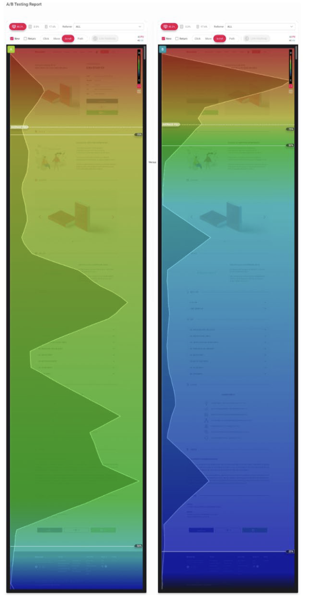

## `2. A/B Testing 필요성과 사례`
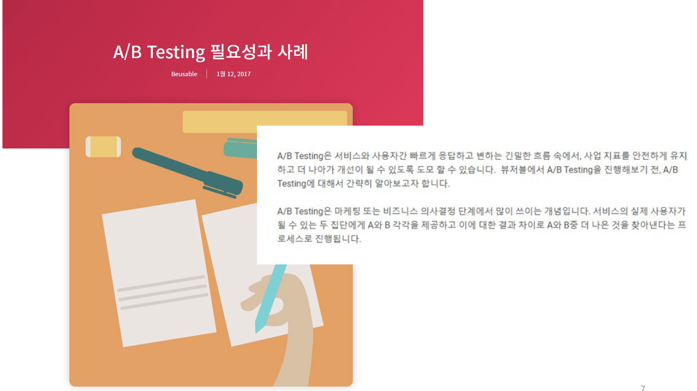

### A/B Testing이 왜 필요할까 ?
- 검증
    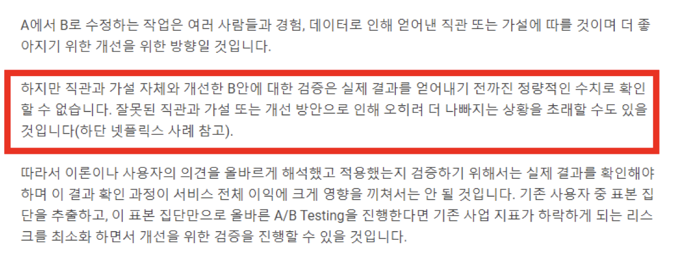
- 비교의 동시성
    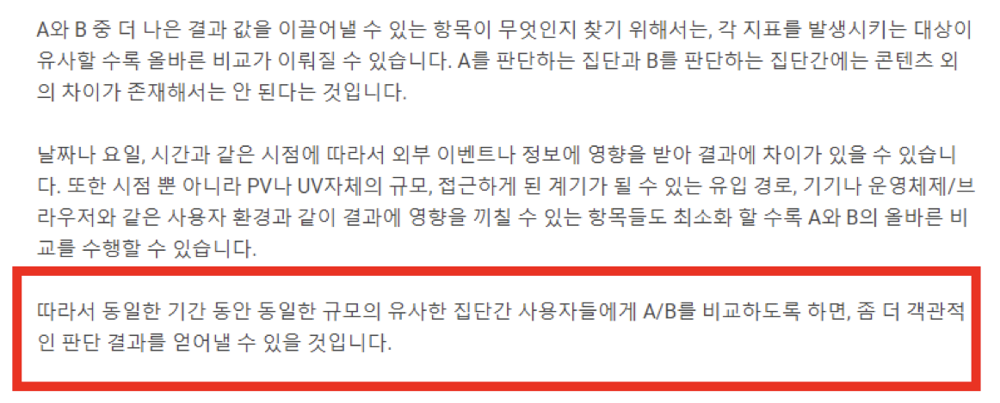

### A/B Testing이 적용된 실제 사례
- 오바마 선거 A/B Testing 사례
    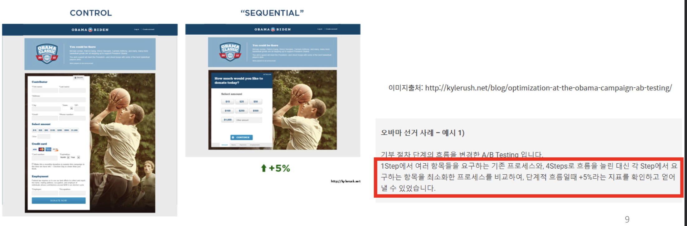
    - 오바마의 대선 홍보 활동은 데이터를 기반으로 효율적인 결과를 이끌어낸 사례로 유명합니다. 다양한 데이터 활용 중, 기부 버튼에 적절한 색상, 텍스트를 찾고 기부 절차 단계의 흐름을 어떻게 할 지 등에 A/B 테스트를 적용하였습니다. A/B 테스트 결과로 가장 나은 기부금을 이끌어낼 수 있는 방안을 정량적인 수치로 확인할 수 있었고, 이는 실제 기부금 모집의 증가와 더 나아가 선거활동의 성공으로 이끌 수 있었습니다.
    > 사진의 차이
    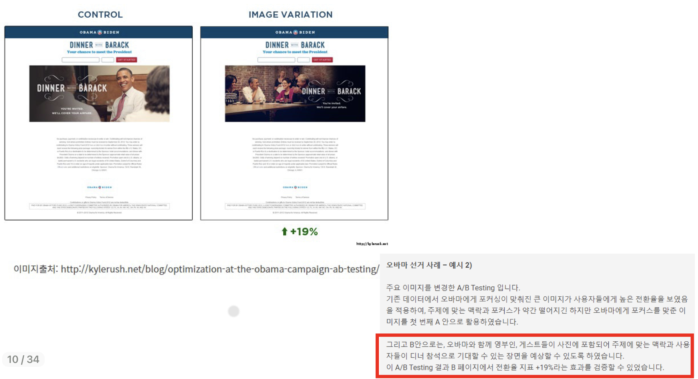
- 넷플릭스 사례
    > 넷플릭스에서는 회원 가입 전, 메인 화면을 개선하는 작업을 진행했습니다.
    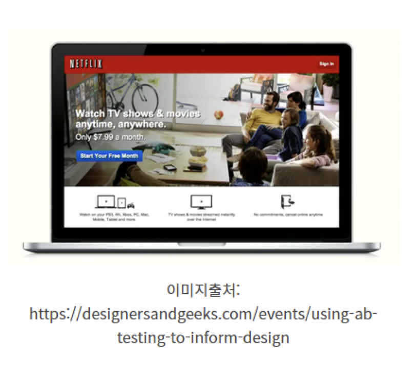
    - B를 만들기 이전에, 사용자들에게 회원 가입을 하기 전 어떤 화면을 원하는지 조사하였고, 조사 결과 약 46% '사용자들에게 시청할 수 있는 영화와 TV쇼 목록'이라는 답변을 받았습니다. 그리고 이 설문조사를 반영하여 이러한 목록 콘텐츠를 제공한다면 가입률을 개선할 수 있을 것이라는 가설을 세웠고 다양한 콘텐츠 목록이 제공되는 B안을 새롭게 만들었습니다.
    > 하지만 기존 A안과 설문조사를 반영하여 개선한 B안으로 A/B Testing 결과, A에 비해 가입 전환률이 낮아진 결과를 확인할 수 있었습니다. 원인은 시청 목록 화면에서 가입페이지로 바로 전환되는 것이 아니라 오히려 탐색으로 인해 가입 전환 콘텐츠 영역에서 벗어나게 되고, 또한 원하는 콘텐츠가 없을 시 좌절감을 느껴 이탈하게 되는 경우가 발생하였기 때문입니다.
    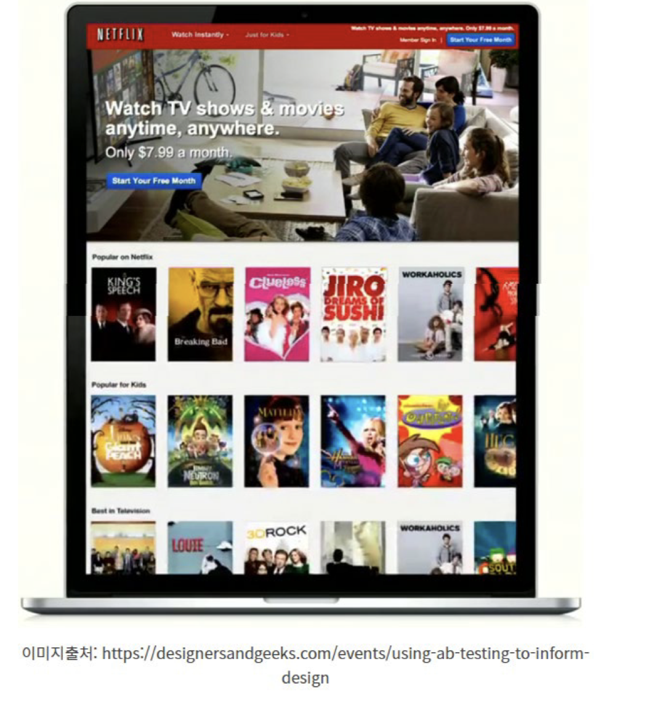
    > 따라서 넷플릭스는 사용자들이 가입 전 시청 가능 목록을 확인하되 목록 위주로 탐색하는 행위로 빠지지 않고 실제 가입으로 전환될 수 있도록 다음 이미지와 같은 디자인을 개선할 수 있었습니다.
    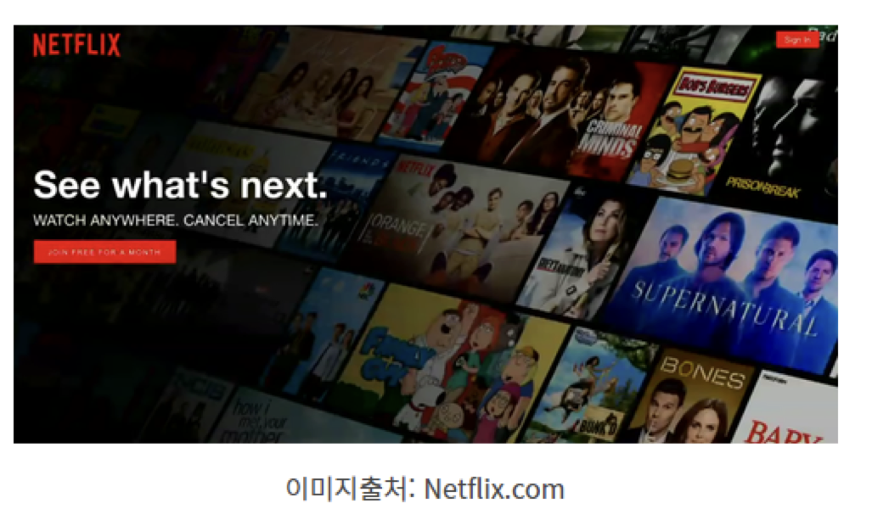
    > 결론은 A/B Testing은 좋다.
    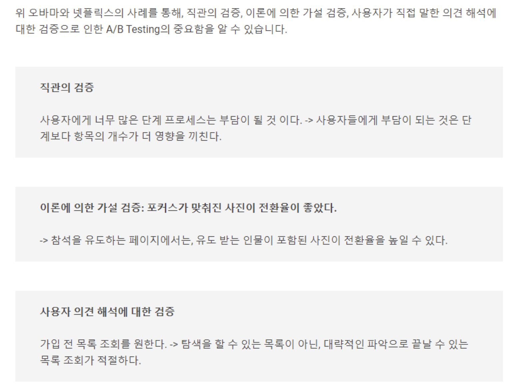

## 3.