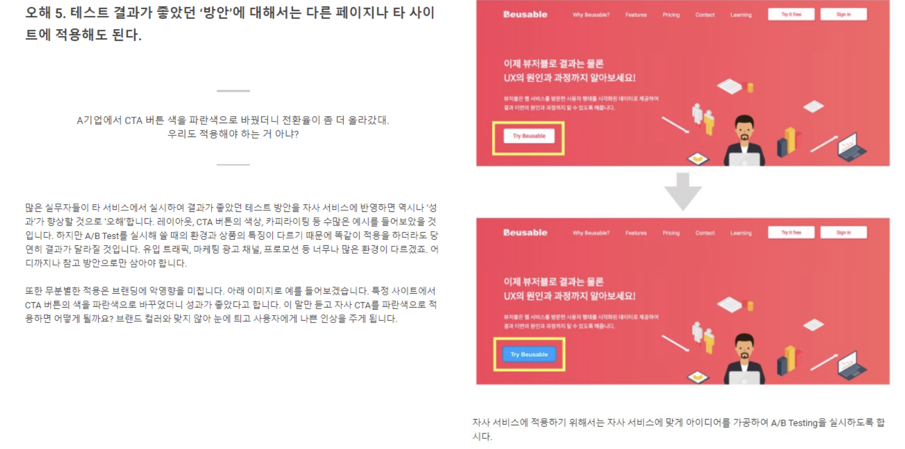

# UX디자인 Data Driven UX - A/B Testing

## 내용 - "뷰저블" 사이트 블로그 중심
1. A/B Testing 이란 ?
2. A/B Testing 필요성과 사례
3. A/B Testing 진행하기
4. A/B Testing 진행 시에 주의 사항 7가지
5. A/B Testing 에 대한 5가지 오해


## `1. A/B Testing 이란 ?`

### A/B Testing 결과 요약
> A/B 테스트 결과를 전환률, 이탈률, 평균 체류 시간 등 주요 지표를 기준으로 비교할 수 있습니다.


### UX 개선 전후 링크별 
> UX 개선 전후의 링크별 전환율을 비교하여 그 개선 효과를 한눈에 파악할 수 있습니다.


### UX 개선 전후 요소별 클릭 비교
> UX 개선 전후의 요소별 클릭률을 비교하여, 클릭을 유도하기 위한 콘텐츠의 추가 및 수정 여부를 결정할 수 있습니다.


### 히트맵을 통한 A/B Testing 결과 비교 분석
> 히트맵으로 결과를 비교 및 분석하면, 지표로는 쉽게 알 수 없는 정량적인 사용자 행동 변화를 파악할 수 있습니다.


## `2. A/B Testing 필요성과 사례`


### A/B Testing이 왜 필요할까 ?
- 검증
    
- 비교의 동시성
    

### A/B Testing이 적용된 실제 사례
- 오바마 선거 A/B Testing 사례
    
    - 오바마의 대선 홍보 활동은 데이터를 기반으로 효율적인 결과를 이끌어낸 사례로 유명합니다. 다양한 데이터 활용 중, 기부 버튼에 적절한 색상, 텍스트를 찾고 기부 절차 단계의 흐름을 어떻게 할 지 등에 A/B 테스트를 적용하였습니다. A/B 테스트 결과로 가장 나은 기부금을 이끌어낼 수 있는 방안을 정량적인 수치로 확인할 수 있었고, 이는 실제 기부금 모집의 증가와 더 나아가 선거활동의 성공으로 이끌 수 있었습니다.
    > 사진의 차이
    
- 넷플릭스 사례
    > 넷플릭스에서는 회원 가입 전, 메인 화면을 개선하는 작업을 진행했습니다.
    
    - B를 만들기 이전에, 사용자들에게 회원 가입을 하기 전 어떤 화면을 원하는지 조사하였고, 조사 결과 약 46% '사용자들에게 시청할 수 있는 영화와 TV쇼 목록'이라는 답변을 받았습니다. 그리고 이 설문조사를 반영하여 이러한 목록 콘텐츠를 제공한다면 가입률을 개선할 수 있을 것이라는 가설을 세웠고 다양한 콘텐츠 목록이 제공되는 B안을 새롭게 만들었습니다.
    > 하지만 기존 A안과 설문조사를 반영하여 개선한 B안으로 A/B Testing 결과, A에 비해 가입 전환률이 낮아진 결과를 확인할 수 있었습니다. 원인은 시청 목록 화면에서 가입페이지로 바로 전환되는 것이 아니라 오히려 탐색으로 인해 가입 전환 콘텐츠 영역에서 벗어나게 되고, 또한 원하는 콘텐츠가 없을 시 좌절감을 느껴 이탈하게 되는 경우가 발생하였기 때문입니다.
    
    > 따라서 넷플릭스는 사용자들이 가입 전 시청 가능 목록을 확인하되 목록 위주로 탐색하는 행위로 빠지지 않고 실제 가입으로 전환될 수 있도록 다음 이미지와 같은 디자인을 개선할 수 있었습니다.
    
    > 결론은 A/B Testing은 좋다.
    

## `3. A/B Testing 진행하기`
1. 목표 설정
    
    - 뷰저블을 통해 페이지에서 사용자 행동 정보와 방문 현황을 히트맵이나 Analytics로 파악할 수 있습니다. 또는 각 서비스의 고유 관리 기능을 통해 회원가입이나 구매건수 지표를 별도로 파악할 수 있습니다.
    - A/B Testing을 진행하기 전, B안이 준비되지 않은 서비스 관리자는 개선하고자 하는 목표를 정량적으로 설정함으로써 B안을 준비하고 A/B Testing을 위한 준비를 시작할 수 있습니다. 목표가 정량적이지 않을 경우, `개선을 위해 A의 어떤 부분을 어떻게 고쳐서 B안을 만들어야 할 지 모호할 수 있습니다. 회원가입 링크나 구매버튼과 같이 특정 콘텐츠 링크로 전환되는 클릭의 증가나, 지정한 위치까지의 스크롤 도달률 증가를 통해 노출 증가와 같이 정량적으로 측정 가능한 목표를 구체적으로 설정할 수 있습니다.`
    - `이 때, 설정하는 목표는 콘텐츠에 기인한 결과가 될 수 있어야 합니다. 예를 들어, PV와 같은 항목은 페이지 내부 콘텐츠에 기인한 결과가 될 수 있어야합니다. 예를 들어, PV와 같은 항목은 페이지 내부 콘텐츠에 영향을 받기보다는 외부 마케팅 홍보 활동이나 시간 등과 같이 외부적 항목들에 많은 영향을 받을 수 있습니다. 따라서 제작자의 내부 콘텐츠 개선 작업으로 비교적 적은 기간, 적은 표본 대상의 A/B Testing 진행한 것만으로는 개선에 대한 효과를 얻거나 파악하기 어령루 수 있습니다.`
2. 현황 및 문제 원인 파악
    
    - 앞서 목표를 설정하였다면, 해당 목표와 관련이 있는 지표 항목들의 현황을 파악해야 합니다. 이는 현황을 통해 목표 달성에 영향을 끼쳤을, 또는 끼쳤을 것이라고 예쌍 되는 항목들을 이해하기 위함 입니다.
    - `만약 상품안내 페이지에서 실제 구매 링크로 전환되는 클릭의 증가가 목표일 경우에는, 다음 현황들을 파악할 수 있습니다.`
    #### 2.1 다른 링크로 전환 된 경우 확인하기 (다른 목적 이해하기)
    - `구매 링크 이외 다른 링크들의 클릭 현황을 확인할 수 있습니다. 구매 링크보다 클릭 순위가 높은 링크를 확인하면 사용자들이 해당 페이지에서 구매 이외 어떤 행동을 더 원했는지 이해할 수 있습니다.`
    > 뷰저블에서 다른 링크로 전환 된 경우를 확인하고 싶으면, Reporting Heatmaps의 히트맵 정보에서 클릭 순위 정보를 확인할 수 있습니다.
    #### 2.2 유입 경로 별 현황 확인하기 `(시너지를 줄 수 있는 콘텐츠 이해하기)`
    - 만약 구매 링크 비율이 유난히 높은 유입경로가 있다면, 해당 유입경로 페이지는 구매로 전환하기에 긍정적인 시너지 효과를 주는 콘텐츠를 갖고 있다고 이해할 수 있습니다. 따라서 해당 유입경로 페이지에 구매링크 페이지로 전환되는 링크를 더 강조하여 전환율을 더 높여볼 수 있습니다.
    - 또한 만약 구매 링크 비율이 높았던 유입 경로가, 앞서 확인한 [다른 링크로 전환 된 경우]에 해당되는지 검토할 수 있습니다. 만약 다른 페이지로 전환되었던 사용자들이 다시 되돌아와서 구매 링크로 전환되었다면, 해당 페이지에서 구매 링크로 전환되기까지 부족한 정보에 대한 문제점을 전환/유입경로에 해당하는 페이지 콘텐츠 정보로 파악할 수 있습니다.
    > 뷰저블의 Comparing Referrers 메뉴를 이용하면, 유입 경로 별 다양한 히트맵(클릭, 이동, 스크롤, Stream)을 쉽게 확인하고 비교할 수 있습니다.
    
    #### 2.3 UT / 설문조사 / 인터뷰 진행하기
    - `만약 히트맵이나 분석 데이터를 통해 현황을 파악하기 어렵다면, 사용자들에게 직접 Usability Test나 설문조사를 진행하여 사이트의 현황과 문제에 대한 의견을 직접 수집하는 방안도 존재합니다. 다만 이 방법에는, 사용자들이 정말 자신이 이해하고 겪은 것들을 100% 솔직하고 정확하게, 그리고 근본적인 원인을 제대로 표현할 수 있는가에 대한논란이 존재합니다. 이전 아티클의 넷플릭스 사례를 보면 ,` A/B Testing 1차 Testing에서 설문조사로 얻은 내용을 단순히 반영했을 때 오히려 지표가 낮아져서 더 면밀히 살펴본 결과 더 근본적인 요구사항이 숨어있는 경우가 존재하였던 것을 발견한 사례를 볼 수 있었습니다. 따라서 Usability Test나 설문조사와 같은 방법에는 좀 더 심도 있는 인터뷰가 함꼐하여 이러한 위험을 방지해야합니다.
3. 가설 설정 및 B제작
    
4. A/B Testing 진행
    > 뷰저블에서 A/B Testing 진행을 위한 트래픽 분산을 직접 설정할 수 있습니다.
    
    #### 4.1 Split Rate 설정하기
    
    #### 4.2 기간 설정
    
    #### 4.3 With A/A Testing
    - `A/A Testing은 동일한 A를 Split 하여 두 개로 분산하고, 각 집단의 값을 비교하여 그 차이가 어느정도 되는지 확인하는 테스트 기법입니다.`
    - A/A Testing은 A/B Testing에서 필수적인 사항은 아닙니다. 하지만 A/B Testing 결과에서 Split으로 발생하여 감안해야 하는 오차 범위를 구해 신뢰도를 알아보고자 할 때, 객관적인 근거 자료로 활용할 수 있습니다.
5. 결과 비교
    - 다음은 뷰저블의 실제 A/B Testing 결과페이지에서 볼 수 있는 [리포트 비교] 콘텐츠와 [히트맵 비교] 콘텐츠입니다.
    
    #### 5.1 리포트 비교
    - [리포트 비교] 콘텐츠에서는, A/B Testing에 설정한 값을 확인하고, 정량적인 지표 결과를 비교해볼 수 있습니다.
    ```
    트래픽 비율 

    각 A/B 페이지의 화면과 분산된 트래픽 비율을 확인할 수 있습니다.
    ```
    ```
    지표 결과 비교

    Conversion Rate(페이지 전환율, 페이지 내 콘텐츠를 소비한 사용자의 비율,) Click per PV(전체 Clicks / 전체 PV), Click PV Rate(클릭을 발생시킨 PV / 전체 PV), Exit Rate (이탈률, 전환하지 않은 사용자의 비율), Avg Duration(평균 체류시간) 정보에 대한 정보를 A와 B 각각 라인 차트나 표로 확인할 수 있습니다.
    ```
    ```
    Rank 지표 결과 비교

    그리고 각 A/B 페이지에서 전환이 많이 발생한 콘텐츠 순위 [링크별 Conversion Rate Top 5]와 PV당 클릭 카운트가 많이 발생한 순위 [요소별 Clicks per PV Top 5]를 확인할 수 있습니다.
    ```
    #### 5.2 히트맵 비교
    - [히트맵 비교] 콘텐츠에서는 뷰저블의 다른 메뉴에서 볼 수 있었던 히트맵 도구를 A와 B 각각에서 확인할 수 있습니다.
    - 다른 메뉴에서와 마찬가지로, 각 기기에 따라 Referrer(유입 경로)별이나 전환 또는 이탈 별로 사용자의 행동을 분류해서 다양한 히트맵(클릭, 움직임, 스크롤, Stream)을 좌/우 화면으로 직접 편리하게 비교할 수 있습니다.

## `4. A/B Testing 진행 시에 주의 사항 7가지`
1. 테스트 시작 전 분석 대상 페이지에 방문자가 충분히 유입되는지 검토하세요.


2. 웹 페이지의 개선 사항을 발견한 후 우선순위를 결정합니다.

3. 외부 요인에 좌우되지 않도록 테스트를 설계하고 실시해야 합니다.

4. 어떤 페이지를 실시해야 할지 모르겠다면 랜딩 페이지를 먼저 진행해봅시다.

5. 결과가 나쁘다고 해서 테스트를 중단해서는 안됩니다. 교훈을 얻어 다음 테스트를 준비하세요.

6. A/B 테스트가 브랜드 가치를 훼손해서는 안됩니다.

7. A/B 테스트는 수단이지 목적이 되어버려서는 안됩니다.


## `5. A/B Testing 에 대한 5가지 오해`
1. 오해 1 : A/B Testing보다 오랜 경험을 쌓은 실무자의 감이 더 정확하다.

2. 오해 2 : A/B Testing은 테스트를 수행할 전문가와 기술력, 예산, 개발 공수가 반드시 필요하다.

3. 오해 3 : A/B 테스트는 100만 이상의 대규모 PV 트래픽을 보유한 사이트에서만 실시할 수 있다.

4. 오해 4 : 테스트 결과를 판단할 때는 특정 한 가지 지표만 살펴보면 충분하다.

5. 오해 5 : 테스트 결과가 좋았던 '방안'에 대해서는 다른 페이지나 타 사이트에 적용해도 된다.



