# 데이터 기반 UX 심화 분석

## 내용 part01
1. `유입경로 이해하기`
2. `CTA (Call to Action) 분석`
3. `효과적인 CTA Design`
4. 퍼널 (Funnel) 분석
5. 개별 사용자 행동 분석

## `1. 유입경로 이해하기`
- `유입 채널` : 직접, 추천, 검색과 SNS 유입
- 방문자들이 이용한 다양한 채널 분석
- `Organic Search` (무료) 대 `Paid Search` (유로)
    - 웹 사이트 운영자가 지불하는 비용의 유무
    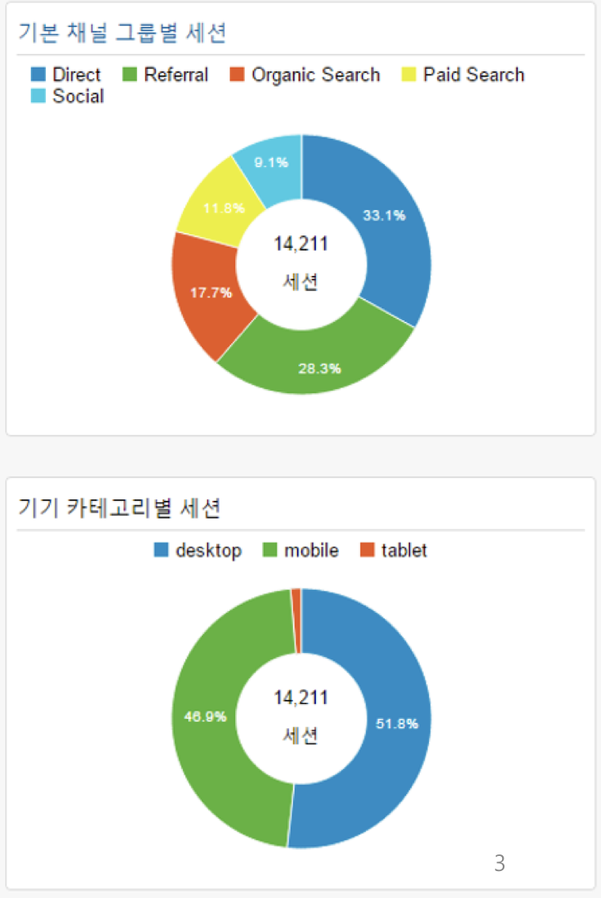
    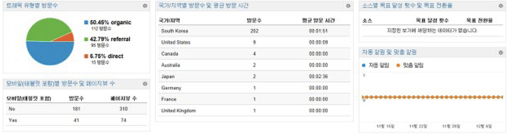
    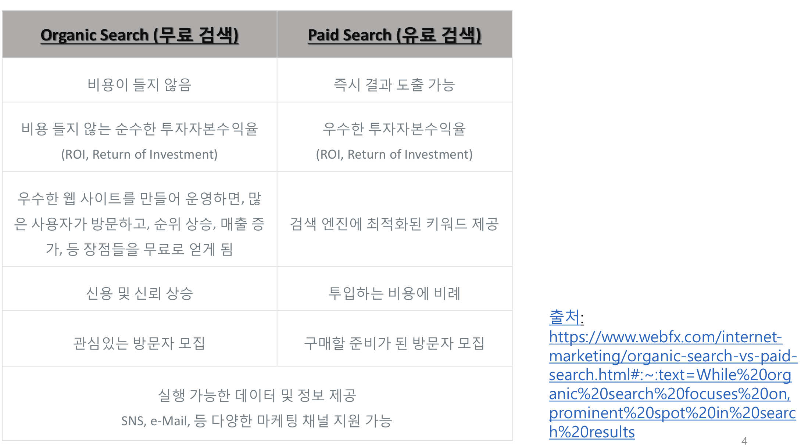

### "직접 유입"의 다양한 사례
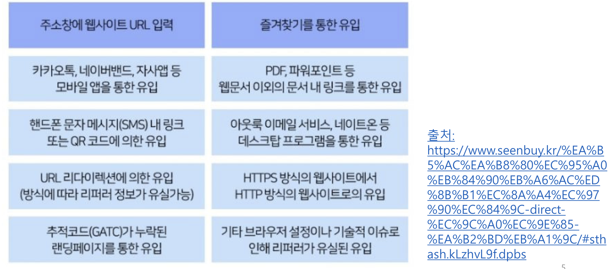

### 경로 파악 방법
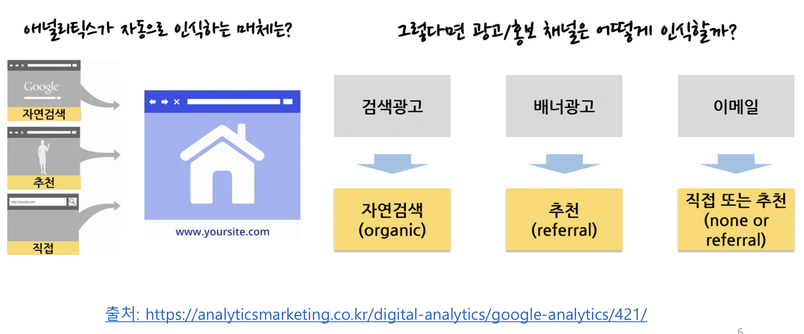
- Google Analytics에서 `유입경로 자세히 보기 필터`를 사용하면 검색하는 사람이 `어떤 기기`(PC, 모바일(태블릿, 스마트폰) 등)에서 `어떤 검색어`로 검색했는지 알 수 있음
- 검색자의 `검색 결과 페이지를` 그대로 볼 수 있어서 자신의 사이트가 검색엔진에서 어떻게 보여지는지 정확히 볼 수 있음
- 또한 해당 링크를 클릭하여 특정 검색어로 검색 시 `자사/자신의 사이트/페이지의 순위는 물론 경쟁사의 순위는 몇 등인지를 확인할` 수 있음.

### 유입 경로에 따른 사용자 특성
- `검색을 통한 유입 (Search):` 네이버나 구글 같은 검색 엔진을 통해 유입된 경우, 해당 웹 서비스와 연관된 키워드 혹은 서비스 명을 인지 가능성
- `서비스 명으로 검색`한 사용자는 재방문 가능성이 높으며, 특정 목적을 명확하게 인지하고 유입된 방문자일 가능성
- `다른 키워드 사용한 검색`의 경우, 해당 키워드가 사용자의 니즈와 연관될 가능성 - [`구글 서치 콘솔`](https://search.google.com/search-console/about)사용하면, `사용자의 검색어 파악 가능`
- `SNS 유입 (Social):` 광고나 홍보 채널을 통해 유입되므로 웹 서비스에 대한 사전 정보가 상대적으로 부족한 경우가 많음
- 대부분 콘텐츠에 흥미를 느끼고 유입되며, 구체적인 니즈는 저조
- 각 SNS 별로 유입된 `사용자들의 행동 패턴을 분석`하면 마케팅 활동 관련하여 유용한 정보가 될 수 있음 (예, 전환률)

### 유입 경로 별 사용자 행동 분석

- `직접 유입 "Above the Fold"` 영역을 주로 탐색
- 직접 유입 방문자들의 콘텐츠 탐색 의지가 상대적으로 부족함
- `구글 & 네이버 유입`은 `"Average Fold"` 지나 `동영상 영역`에도 체류
- 구글 사용자들은 동영상에 제일 오래 체류
- 네이버 유입자들의 콘텐츠 소비율이 제일 높음
- 각 유입 경로 별로 사용자의 `전환률 분석` 필요
- 홍보 비용 투입 우선 순위? &rarr; 네이버 > 구글 > 직접 유입

## `2. CTA (Call to Action) 분석`
- `CTA 버튼` = `행동 유도 버튼` 혹은 `목표 달성 버튼`
- 회원 가입, 구매, 다운로드, 문의, 상세정보, 등 다양한 기능의 버튼 존재
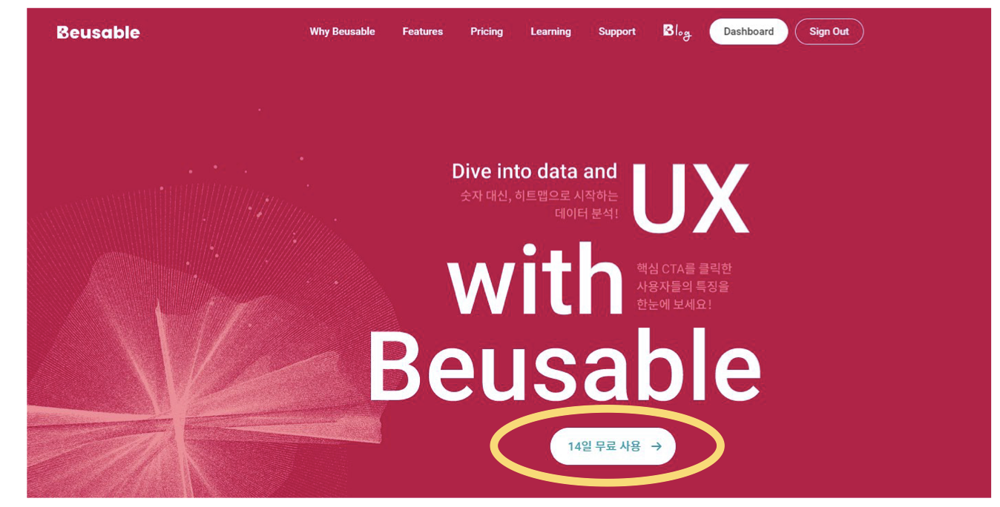

### `세분화된 CTA 분석`
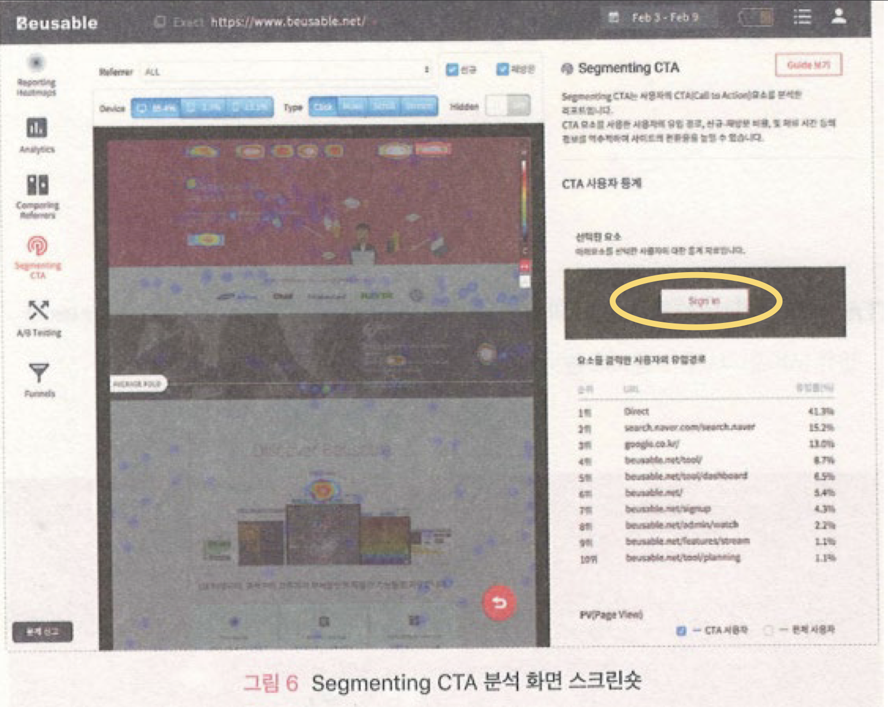
- 사용자 유입 경로
- PV & UV
- 신규 방문/재방문 비율
- 펭균 체류시간
- 사용 디바이스 정보
- &rarr;
- 정보들을 분석하여 전환률 개선에 활용
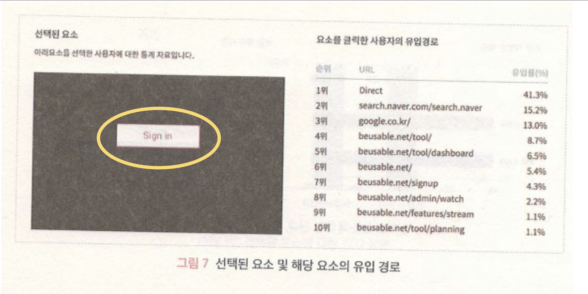
- `직접 유입`이 가장 많음
- 네이버와 구글을 통한 유입이 각각 2위 & 3위 &rarr; 홍보 & 마케팅 효과가 좋음
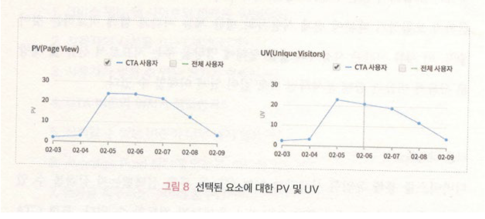
- `전체 사용자 대비 CTA 사용자의 PV & UV 비율 게산` &rarr; 해당 CTA 중요도 측정 가능
- 해당 `페이지의 PV / UV` &rarr; 한 명의 사용자가 해당 페이지에 속한 CTA 기능 수행을 위하여 몇 번이나 그 페이지를 방문했는지 표현
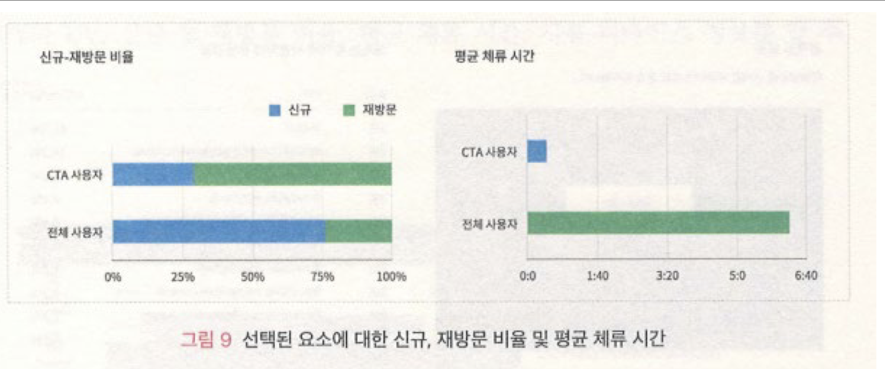
- `신규 - 재방문 비율:` CTA 기능 선택한 사용자는 어떤 사용자인가? 마케팅 효과 측정 가능.
- `평균 체류 시간:` CTA 사용자가 해당 기능이 있는 페이지에 체류한 평균 시간으로, CTA 기능의 종류에 따라 (1) 이동 링크 포함이면, "CTA 도달하기 까지의 평균 체류 시간"으로 해석 (2) 페이지 내부에 머무르는 경우, "CTA 도달 및 선택 이후의 체류 시간" 의미
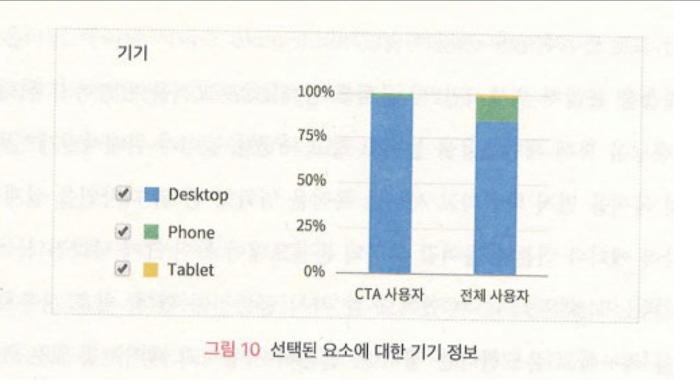
- `사용 기기의 종류 별 분석:` 각 기기별로 사용자는 어떤 CTA기능을 선택했는지 분석
- 해당 기기에서는 `CTA가 노출`되었는지 여부 확인 - Average Fold 위치 확인 필요
- `Above 혹은 Below the Fold 영역`에 위치 &rarr; 해당 버튼 위치에 따라 CTA 노출 여부 결정되어 전환률에 큰 영향을 끼침

## `3. 효과적인 CTA Design`
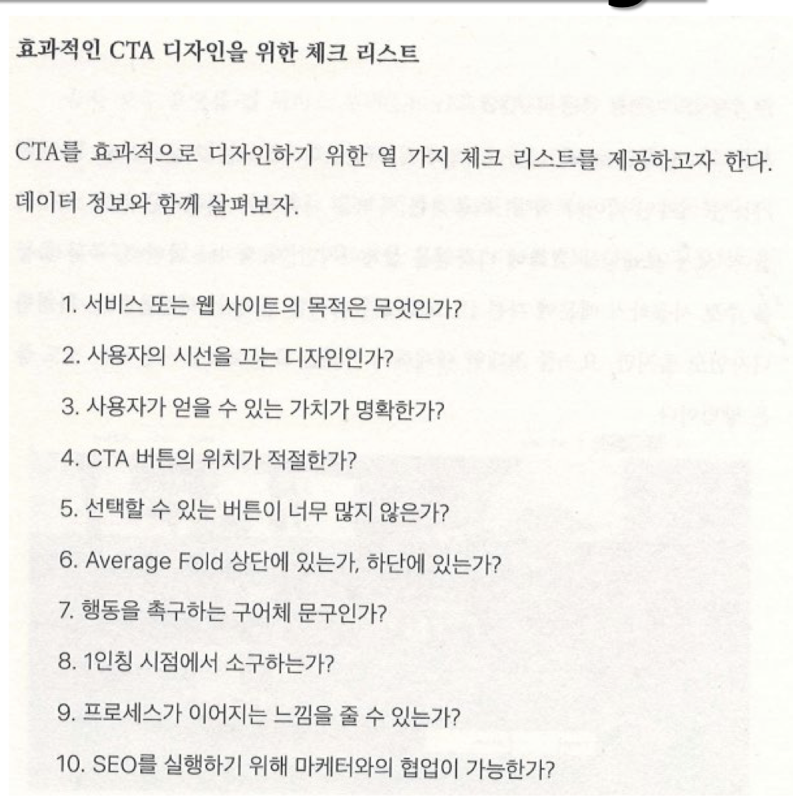
1. 서비스 혹은 웹 사이트의 목적
    - 서비스 혹은 사이트 `운영 목적이 분명하게 설정`되어야 함
    - 상품 매출? 고객 발굴? 브랜딩을 통한 광고 매출?
    - 목적에 따라 문구나 그래픽 요소들의 색상과 톤이 결정됨
    - 어떤 목적을 가지고 있던지, 중요한 `공통의 세부 목표는 사용자의 행동을 촉구하고 유도`하는 것 &rarr; 단순 감상이나 정보 제공용은 아님
2. 시선 유도하는 디자인
    - `클릭이 가능한 디자인`으로 `사용자의 주목`을 받고 `행동 유도`
    - 일반적으로 화려하고 강렬한 디자인으로 관심 유도
    - 깔끔하고 단순하며 여백을 살린 효율적 디자인도 유용함
    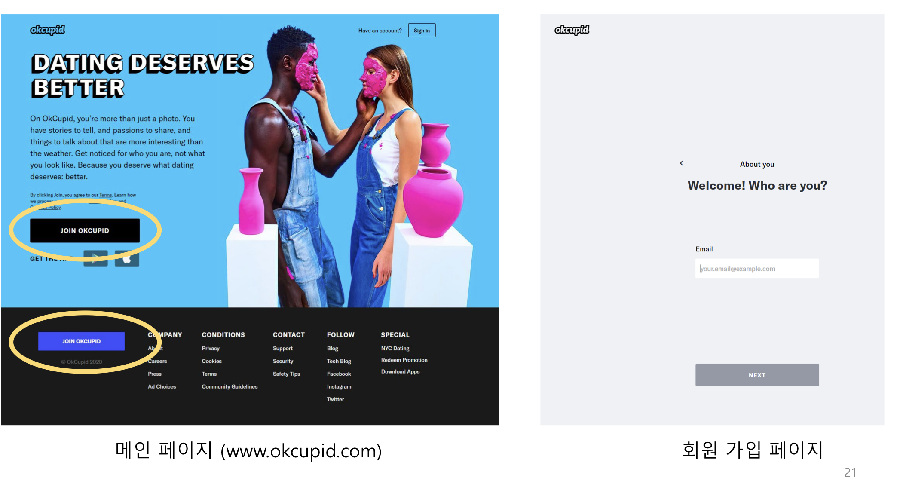
    > 이 사이트는 회원 수를 늘리는 것이 목표여서 저러한 시선을 유도했다. 
3. 사용자가 얻는 가치를 명시
    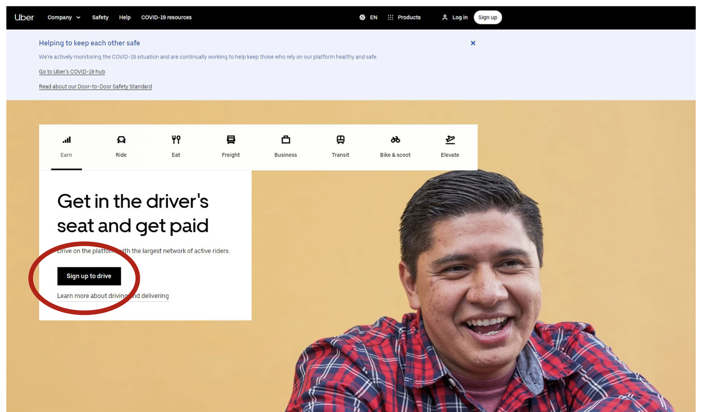
    - 사용자의 이익 명시
    - 이익 실현을 위한 CTA 버튼의 주목도 제고
    - 이익에 대한 기대 심리 표현
    - www.uber.com
    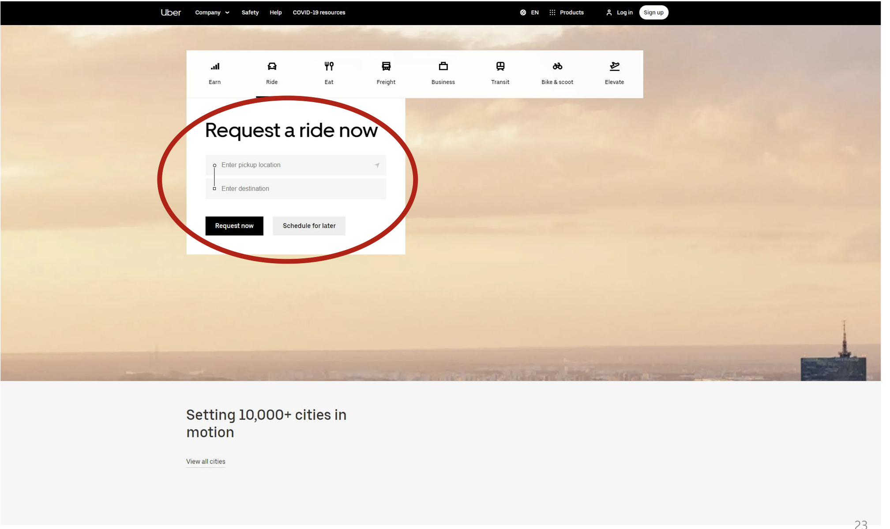
4. CTA 버튼 위치의 적절성
    - `"구매 흐름"`에 자연스럽게 어울리는 버튼 디자인 및 배치 필요
    - 주목도, 크기, 위치, 등
    - 구매 흐름에 따른 마우스 이동 경로와의 거리를 최소화
    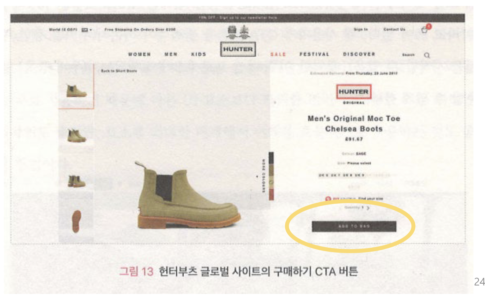
5. 적절한 숫자의 선택 버튼
    - `너무 많은 옵션 중에서 선택`하려면, `사용자가 부담`을 가짐
    - 4개 이하의 선택 버튼을 제공해야 `사용자들이 편안하게 선택` 가능
    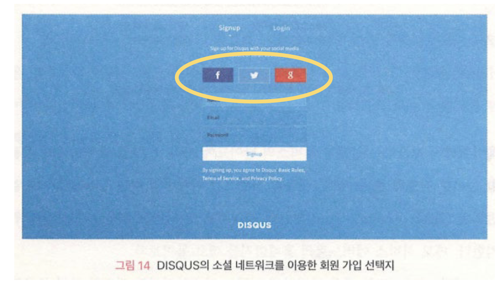
6. CTA 버튼의 위치
    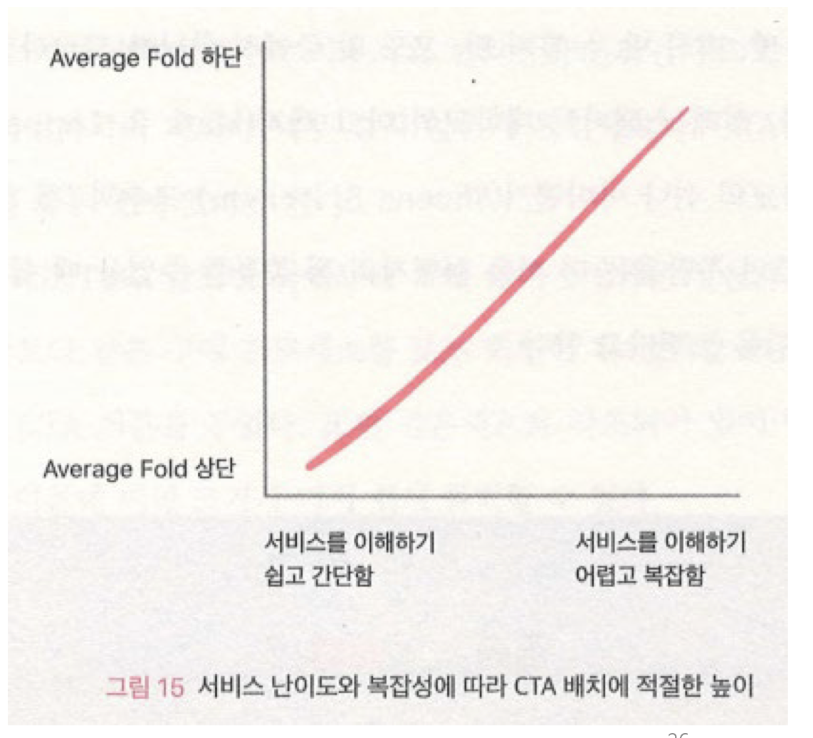
    - "`Above` or `Below the Fold`???"
    - `복잡하고 어려운 서비스`를 이해하는 과정에서, 설명을 위해 페이지 스크롤이 하단까지 가는 경우가 다반사
    - `쉽고 단순한 서비스`의 경우 CTA 버튼은 상단에 위치
    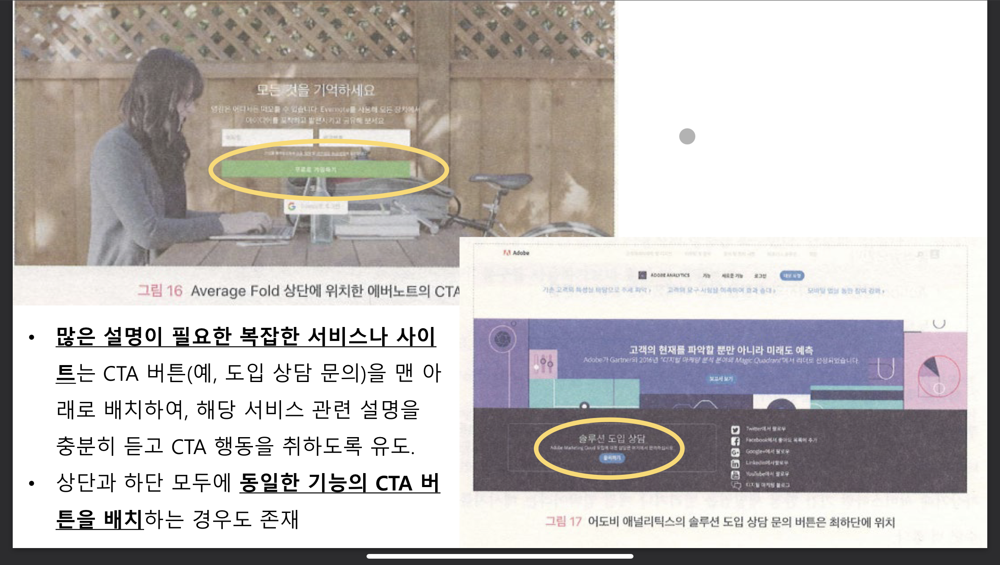

    ### AIDA 법칙 
    - 방문자가 CTA 행동을 일으키기 까지의 과정 정의
    - `A`ttention (주의) : 고객의 관심을 끄는 카피 문구나 이미지 사용
    - `I`nterest (흥미) : 고객의 관심이 이어질 수 있는 콘텐츠 배치
    - `D`esire (욕구) : 서비스의 강점과 특징을 어필하여 사용자의 욕구 자극
    - `A`ction (행동) : 사용자가 CTA 행동을 하도록 유도

7. 행동을 촉구하는 구어체 문구 사용
    - "가입하기" &rarr; `"30일 무료 체험 하세요"`
    - "등록하기" &rarr; `"지금 3천원에 다운로드하세요"`
    - `자극적이고 강렬한 자극과 설득`
    - 희소성 &rarr; 긴장감과 시급성 유도 (예, 기간 한정 세일, 매진 임박, 등의 문구로 자극하고 CTA 행동 유도)
    
8. 1인칭 시점
    - 사용자에게 `공감`을 불러 일으킴
    - "당신의 아이템을 드립니다." &rarr; 사용자를 꼭 집어서 지칭
    - 나에게 `맞춤형 정보 제공` 및 `기능 제공`
    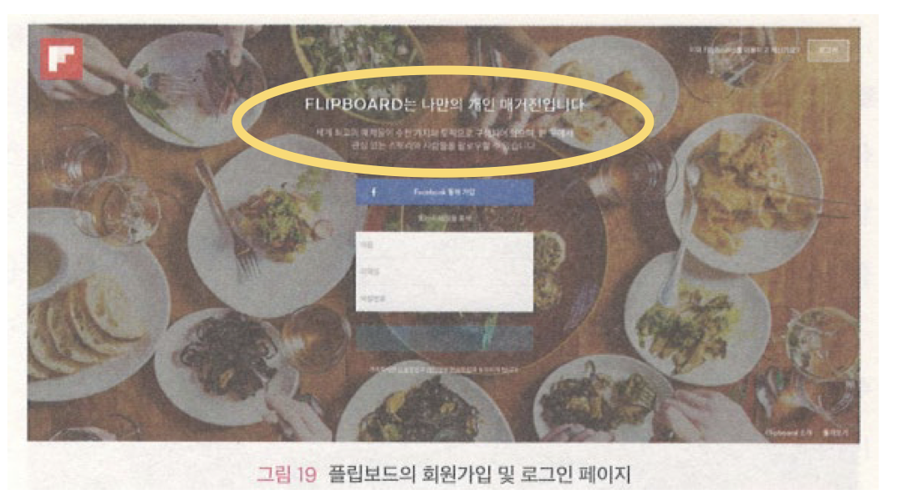
9. 프로세스가 이어지는 느낌
    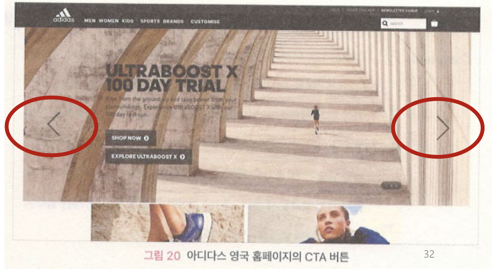
    - CTA 버튼이 세션 종료를 의미하는 것은 아니므로, `연속적으로 이어지는 절차 및 정보 제공을 지원`하는 작업 필요
    - (예) 화살표 혹은 다운로드 버튼 모양의 아이콘 사용
10. SEO 실행 위해 마케터와 협업
    - 사용자 유입이 있어야 CTA 버튼 누르는 행동 발생
    - `사용자 불러 모으기와 붙잡아 두기 전략` 필요
    - `다양한 검색엔진 최적화(SEO, Search Engine Optimization)`되어 사용자들을 불러 모으는 웹 사이트가 되도록 `마케팅 및 홍보 전략 수립과 추진` 필요