# UX_Desing Lecture 15-2 - Data Driven UX - 실전 데이터 분석 사례

## 내용 - "뷰저블" 사이트 블로그 중심 - part 01
1. `세그멘테이션을 사용한 사용자 분석`
2. `“클릭” 행위 분석하여 사용자 의사 결정 촉구`
3. `“내부 검색 데이터” 분석 – 고객의 방문 목적 파악`
4. `콘텐츠형 서비스 분석`
5. 맞춤형 상품(콘텐츠) 추천 방식 구현 – 필요한 데이터 종류
6. 맞춤형 상품(콘텐츠) 추천 방식 구현 – 데이터 기반 추천
7. 맞춤형 상품(콘텐츠) 추천 방식 구현 – 고객 취향

##  `1. 세그멘테이션을 사용한 사용자 분석` (Divide & Conquer 전략)
- `고객을 특성별로 분류하는 세그멘테이션 (Segmentation)`

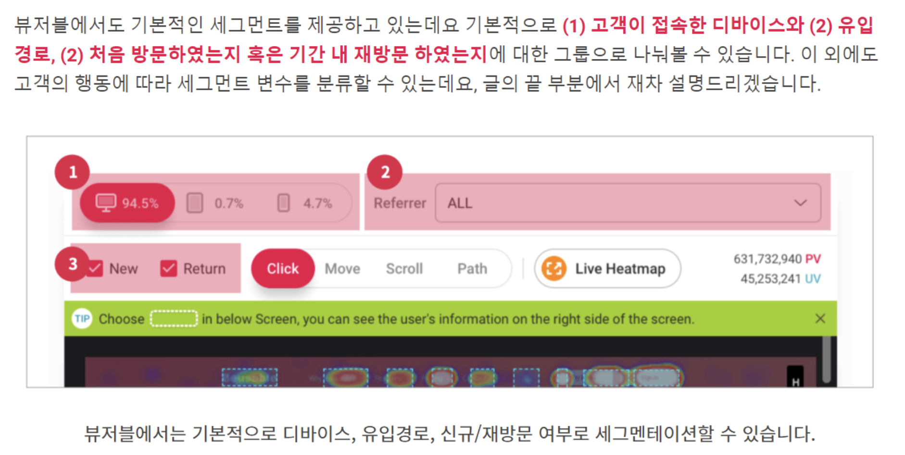
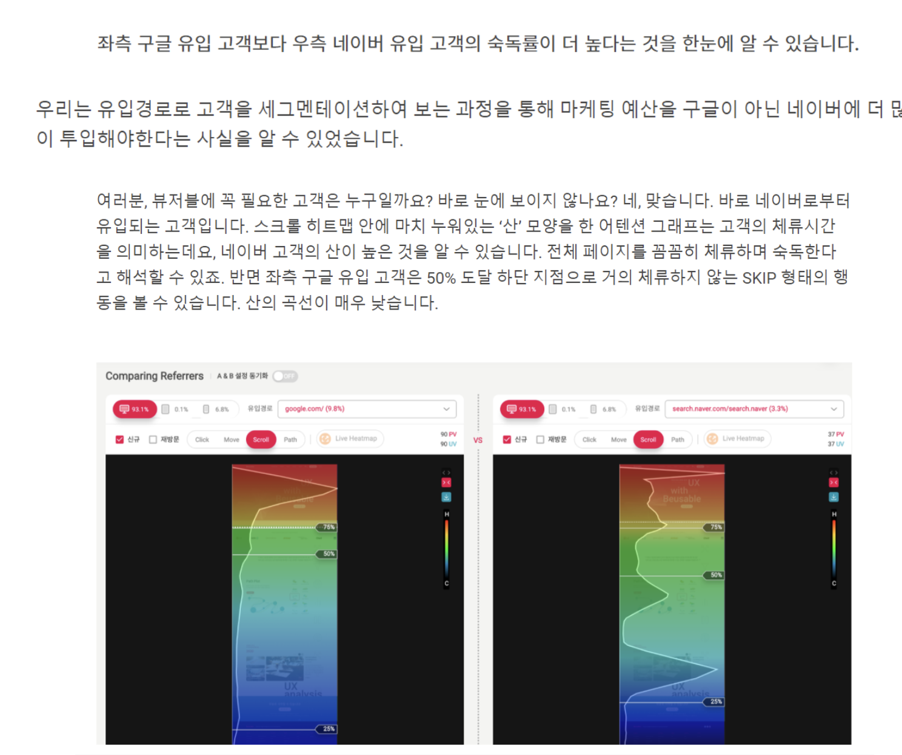
### 효과적인 세그멘테이션을 위한 3가지 점검 기준
- 모든 고객 그룹을 세그멘테이션할 수 있는 것은 아닙니다. 효과적인 세그멘테이션을 위해서는 서비스/상품 또는 마케팅 전략 관점에서 기준을 두고 수립되어야 하는데요, 뷰저블은 아래 3가지를 점검 기준으로써 제안합니다.
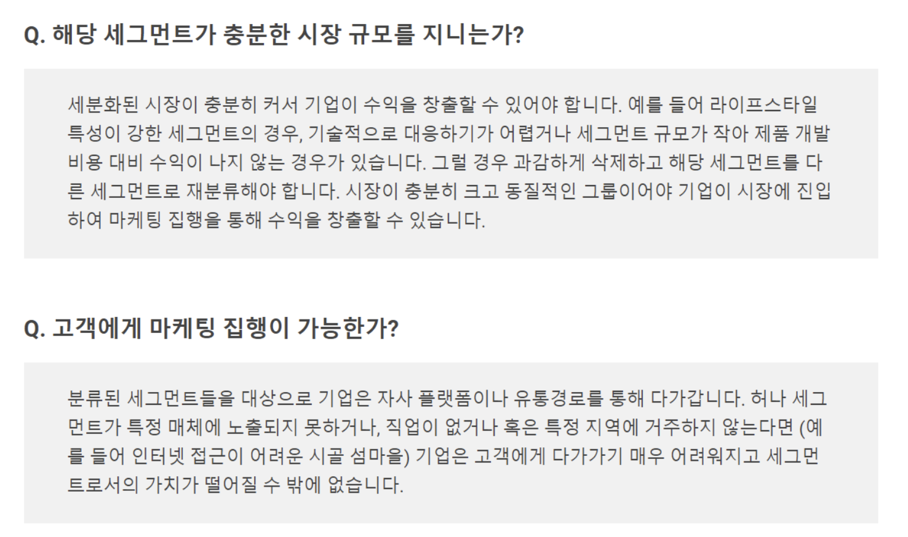

### 기본적인 4가지 세그멘테이션 방식

### 페이지 내 여정에 따라 고객을 세분화할 수 있습니다.
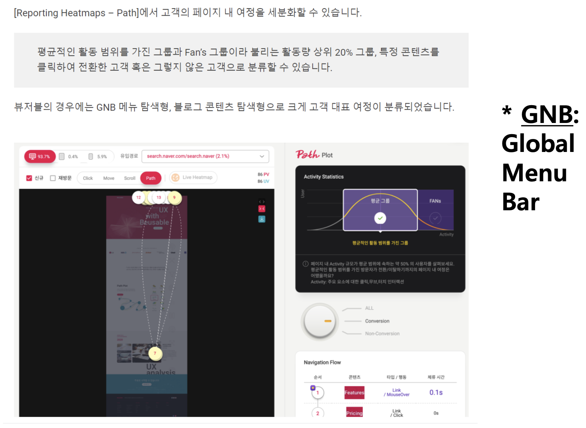

- Path를 살펴보겠습니다. 위 그래프롤 보면 뷰저블을 이용하는 고객 중 `대다수가 GNB 영역을 탐색`합니다. 그러나 활동량이 많은 `FAN's 그룹은 하단 블로그 콘텐츠를 주로 탐색하죠.`

### 특정 CTA를 클릭하여 전환한 고객과 그렇지 않은 고객을 세분화할 수 있습니다.
- `CTA 분석 및 효과적인 디자인` &rarr; 체크리스트 &rarr; 14강 제 1부 참조

## `2. “클릭” 행위 분석하여 사용자 의사 결정 촉구`

### 고객의 흥미와 관심을 의미하는 중요한 행동 데이터, '클릭(Click)'
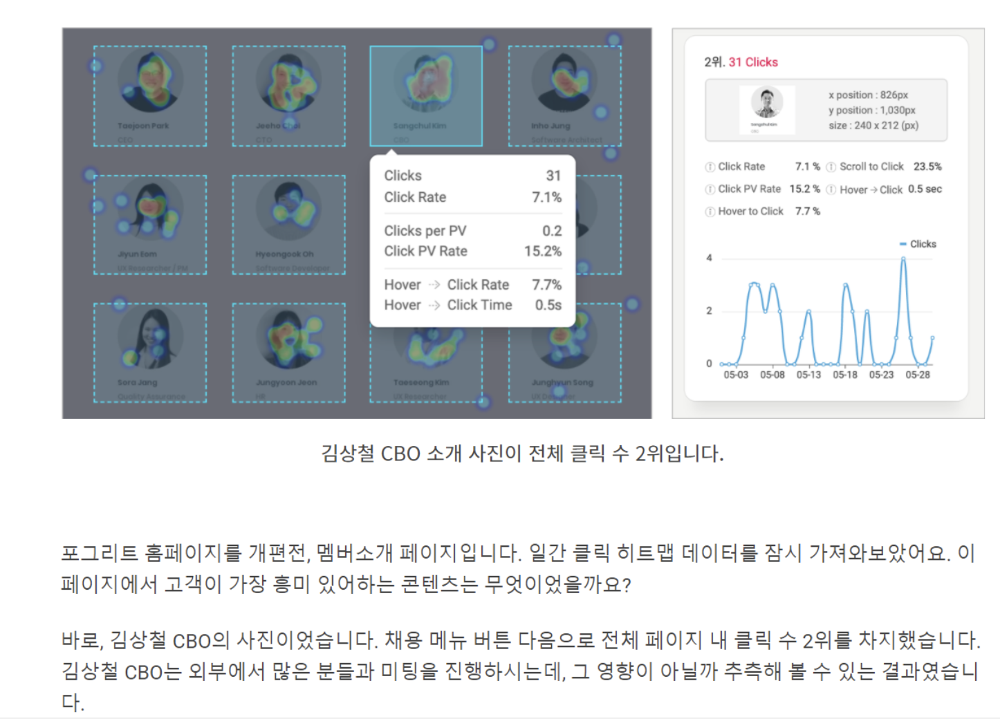

### 클릭 데이터를 활용하여 고객의 의사결정 시간을 단축하기

### 방대한 양의 콘텐츠 중 우선 순위로 활용할 수 있는 클릭 수 데이터

### 비슷한 상품들 중 구매를 유도할 수 있는 클릭 수 데이터

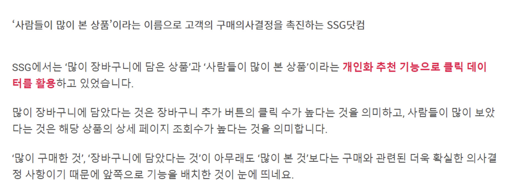

### '스크롤이 도달한 PV 대비 클릭 수' 데이터로 살펴보기

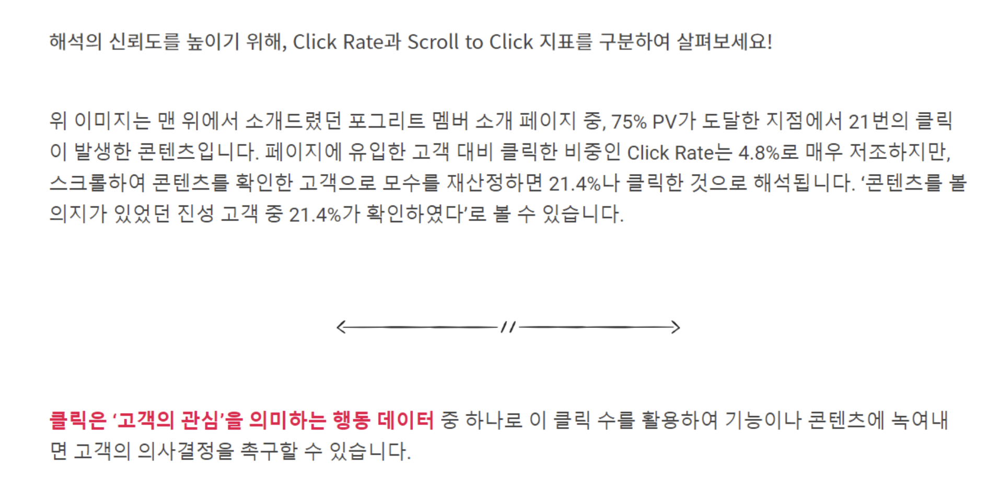

## `3. “내부 검색 데이터” 분석 – 고객의 방문 목적 파악`
### 검색은 고객의 방문목적을 의미하는 가장 좋은 데이터입니다.

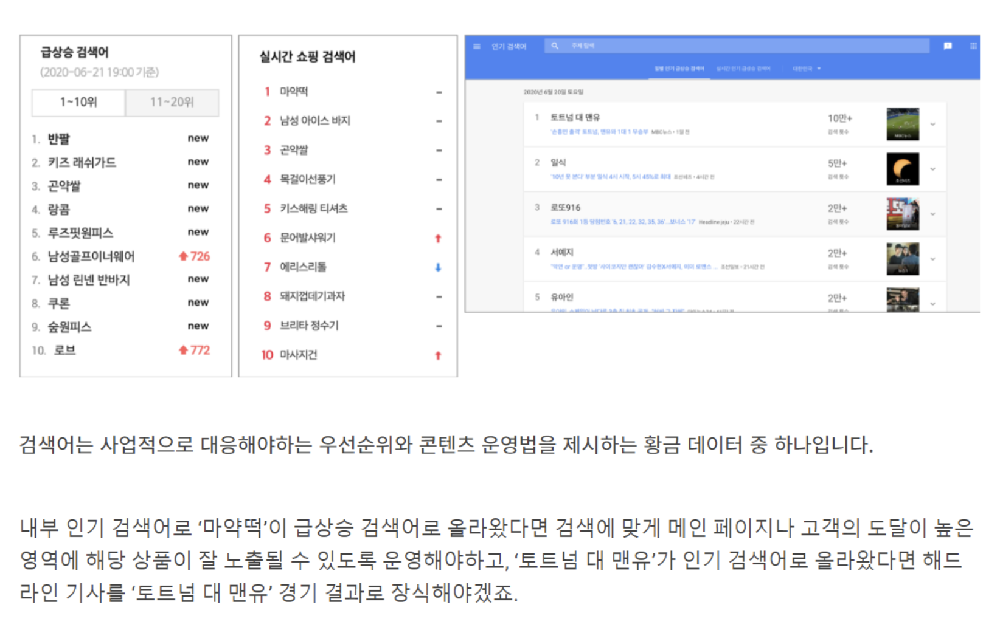
### 검색엔진의 정확도를 높이고 기능을 지속적으로 고도화해나가야 합니다.

### 1. 검색어의 정확성을 높일 수 있도록 '동의어 사전' 관리하기

### 2. 검색어를 검색엔진이 이해할 수 있도록 '형태소 분리사전' 관리하기

### 3. 검색어 가중치 조정을 통해 고객 화면단의 검색결과 정렬 순서 조정하기

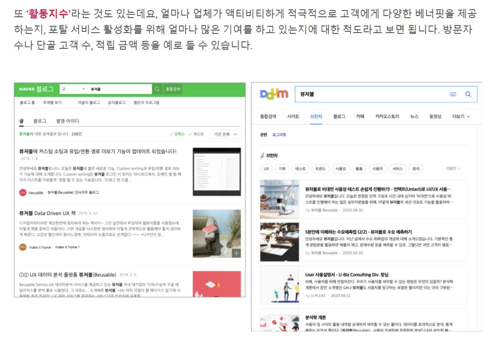
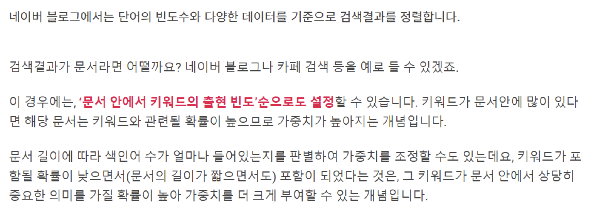
### 검색어 데이터 분석을 통해 사업적 역량 강화하기
>검색결과가 0인 비율 분석하기
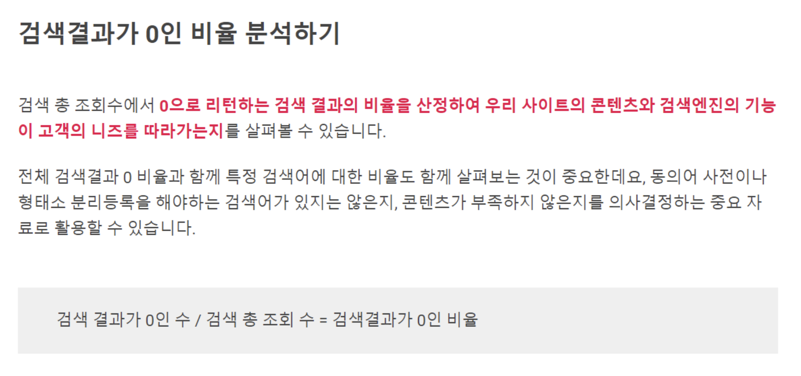
>재검색 비율과 검색어 분석하기

>검색 이탈비율과 검색어 분석하기

## `4. 콘텐츠형 서비스 분석` - 블로그, 카페, 나무위키 등 콘텐츠형 서비스 분석하기
- `콘텐츠형 서비스`로는 먼저 기업이 자체 생산하는 경우를 예로 들 수 있는데요, 지금 여러분들이 읽고 있는 뷰저블 블로그처럼 기업 블로그나 뉴스, 방송국 등의 미디어 사이트를 꼽을 수 있습니다.
- 다음으로는 고객이 직접 참여하여 동영상이나 기사 등의 형태로 산출물을 만들어내는 `사용자 제작 콘텐츠 (User Generated Content, UGC)`서비스가 있습니다. 페이스북, 블로그. 트위터, 카페 등이 예가 될 수 있으며 나무위키나 위키피디아도 언급할 수 있습니다.
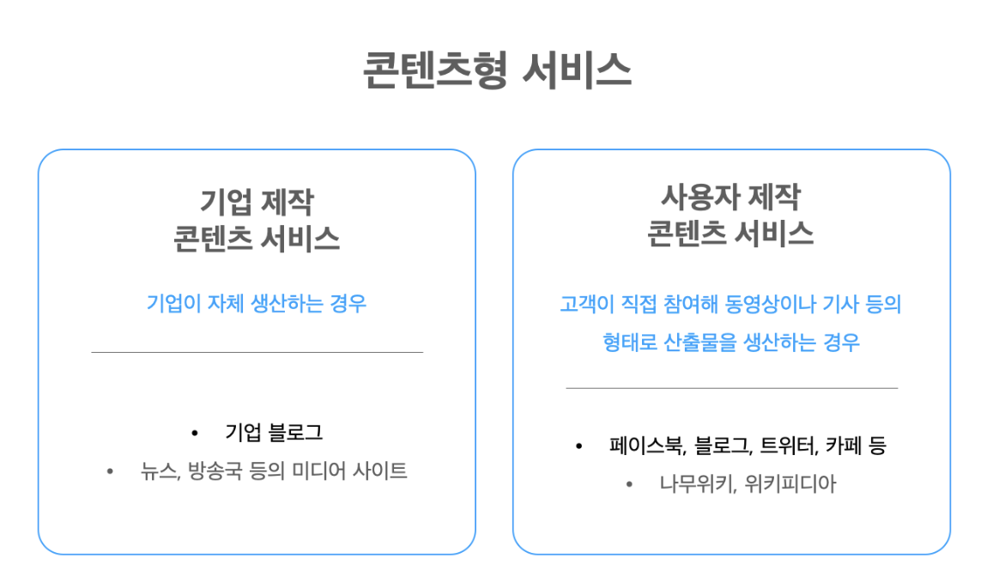
- 이러한 사이트들은 `'좋은 콘텐츠'가 지속해서 생성되고 좋아요나 댓글 같은 고객의 참여도가 높아져서, '선순환 구조'를 이뤄나가는 것을` 목표로 삼습니다. 단순히 콘텐츠를 읽거나 보는 것을 넘어 직접 댓글을 달거나 수준 높은 콘텐츠를 만들어내고, 그 콘텐츠가 매우 좋아서 친구에게 또는 가족에게 추천하여 다시 사이트 내부로 참여시키는 것이 중요하겠죠 ?

### `콘텐츠 서비스 분석용 핵심 지표`
1. UV & PV – 최대한 많은 방문자 확보
    - 순 방문자 수 (UV)와 페이지 뷰 수(PV)
2. 평균 체류 시간 – 콘텐츠 소비 시간과 비례
3. 유입 경로와 공유 수 – 해당 서비스 성장의 실마리
4. 알림 기능 동의자 수 혹은 클릭 수 – 고객의 지속적 방문
5. 퍼널 기법으로 월 단위 분석– 단계 별 성과 분석