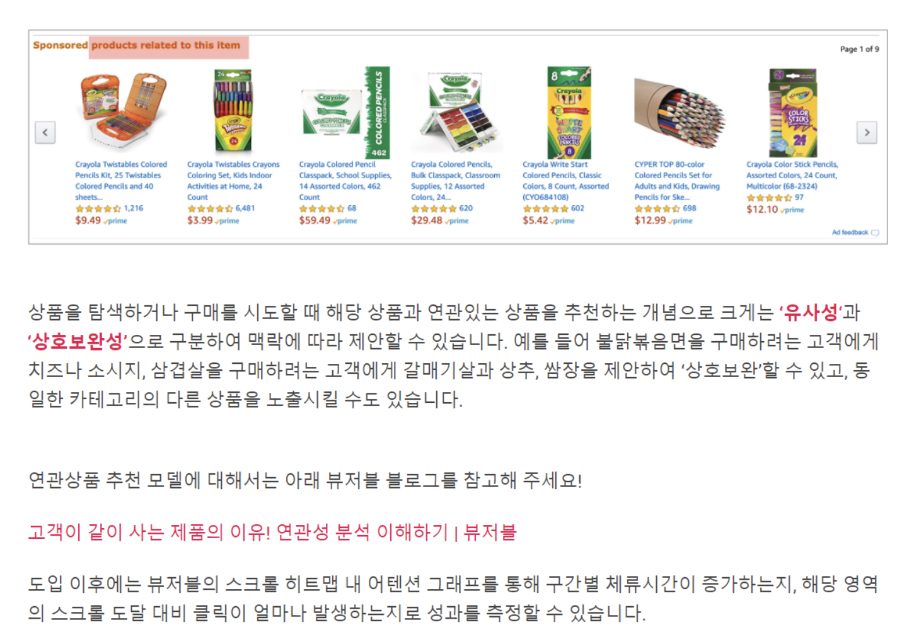
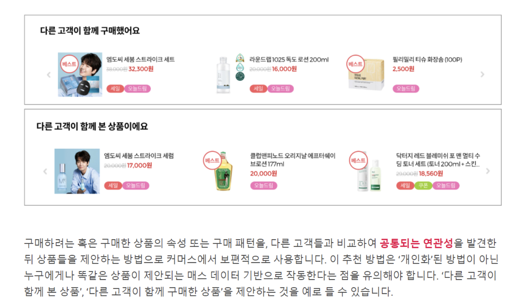

# UX_Desing Lecture 15-2 - Data Driven UX - 실전 데이터 분석 사례

## 내용 - "뷰저블" 사이트 블로그 중심 - part 02
1. 세그멘테이션을 사용한 사용자 분석
2. “클릭” 행위 분석하여 사용자 의사 결정 촉구
3. “내부 검색 데이터” 분석 – 고객의 방문 목적 파악
4. 콘텐츠형 서비스 분석
5. `맞춤형 상품(콘텐츠) 추천 방식 구현 – 필요한 데이터 종류`
6. `맞춤형 상품(콘텐츠) 추천 방식 구현 – 데이터 기반 추천`
7. `맞춤형 상품(콘텐츠) 추천 방식 구현 – 고객 취향`

## `5. 맞춤형 상품(콘텐츠) 추천 방식 구현 – 필요한 데이터 종류`

### 추천 받을 사람과 연관은 없지만 추천에 필요한 3가지 데이터와 UX
- 추천 기능의 기본은 `'상품(미디어 콘텐츠) 데이터, 사용자의 행동이력 데이터, 전문가 또는 직원의 지식'` 크게 3가지입니다. 어떤 개념인지 설명드리겠습니다.
1. `사물 기반 Attribute`

2. `사람 기반 Consumers`

3. `지식 기반 Knowldege`

### 추천받을 사람과 연관있으면서도 추천에 필요한 3가지 데이터와 UX

1. 행동 데이터

2. 과거 행동이력 데이터

3. 설문조사 등 마케팅 데이터

### 수집 데이터에 기반한 12가지 상품 추천 유형

## `6. 맞춤형 상품(콘텐츠) 추천 방식 구현 – 데이터 기반 추천`
### `사물 기반 (Attribute)`
#### A-1.상품 속성 랭킹 유형

#### A-2. 연관 상품 유형

#### A-3. 상품 선호 유형

#### A-4. 상품 니즈 유형

### 사람 기반(Consumer)
#### C-1. 인기도 랭킹 유형

#### C-2. 유사 행동 유형

#### C-3. 협업 필터링

#### C-4. 설문 기반 유형

### 지식 기반(Knowledge)
#### K-1. 공인/유명인 추천 유형

#### K-2. 개인 추천 유형

#### K-3. 의견 제안 유형

#### K-4. 상품 니즈 분석 제안 유형

## `7. 맞춤형 상품(콘텐츠) 추천 방식 구현 – 고객 취향 사로잡기`

### 김민경 고객에게 추천해야하는 상품은 무엇일까요 ? - 협업 필터링 알고리즘의 기본
- 쇼핑몰에서 상품 구매이력 데이터를 살펴본 결과 아래 표로 도식화할 수 있었습니다.

> 김민경 고객에게는 다음으로 어떤 상품을 추천해야 할까요 ?

### 김민경 고객에게 추천해야 하는 상품, 한 걸음 더 나아가 고도화된 협업필터링으로 찾아볼까요 ?

#### <고도화된 협업 필터링>

### 협업필터링으로 구현한 추천 기능, 어떻게 성과를 측정할까 ?

### 고도화된 추천 알고리즘을 구현하기 위해서는 데이터 설계 단계부터 UX디자이너가 참여해야 합니다.
- 온라인에서 일어나는 '추천 기능'은 데이터 수집 단계부터 UX디자이너와 데이터 관리자, 데이터 분석가, 개발자가 함께 협업하여야 합니다.
- 어떤 알고리즘을 적용해야하며 어느 수준까지 구현할지, 해당 기능을 구현하기 위해서는 화면으로 어떻게 풀어 고객 경험을 증진시킬 수 있을지 모두 UX 디자이너가 이해하고 주축이 되어 실현해야 합니다.