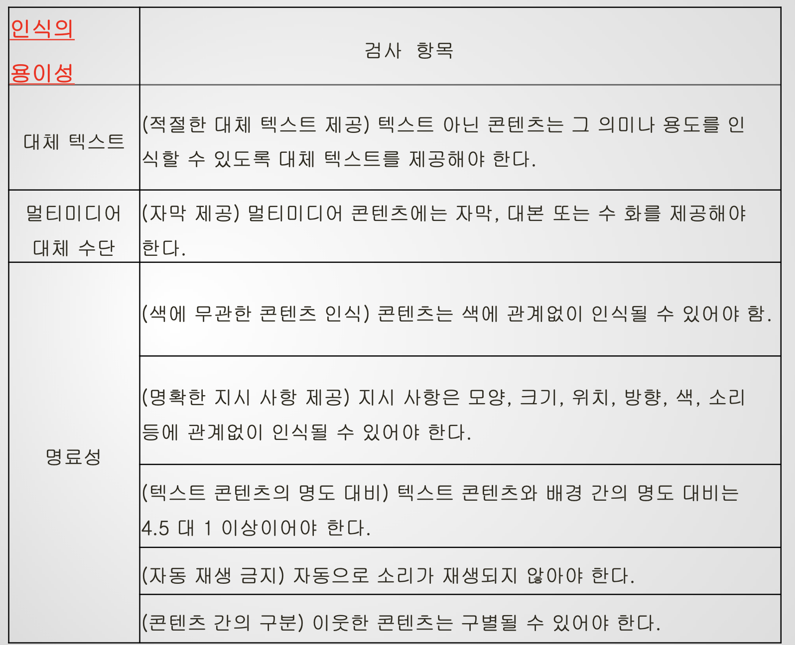
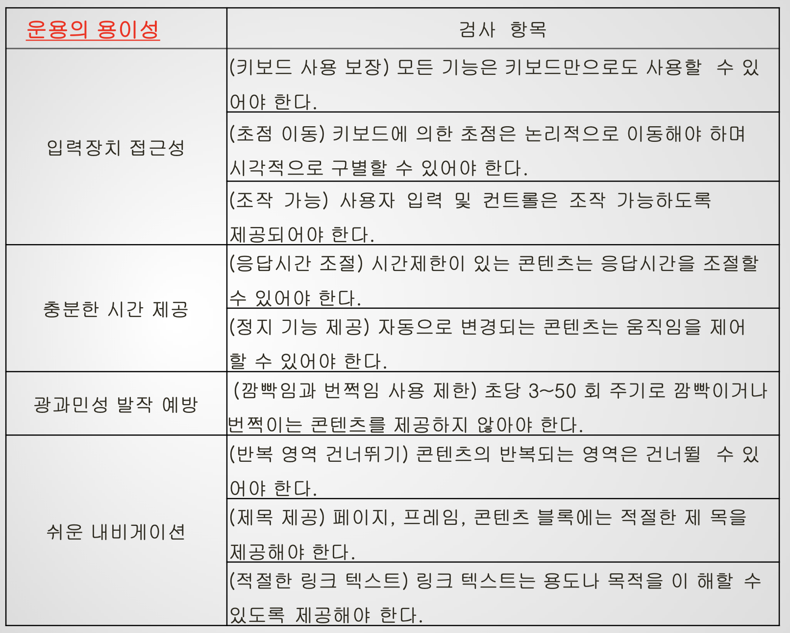
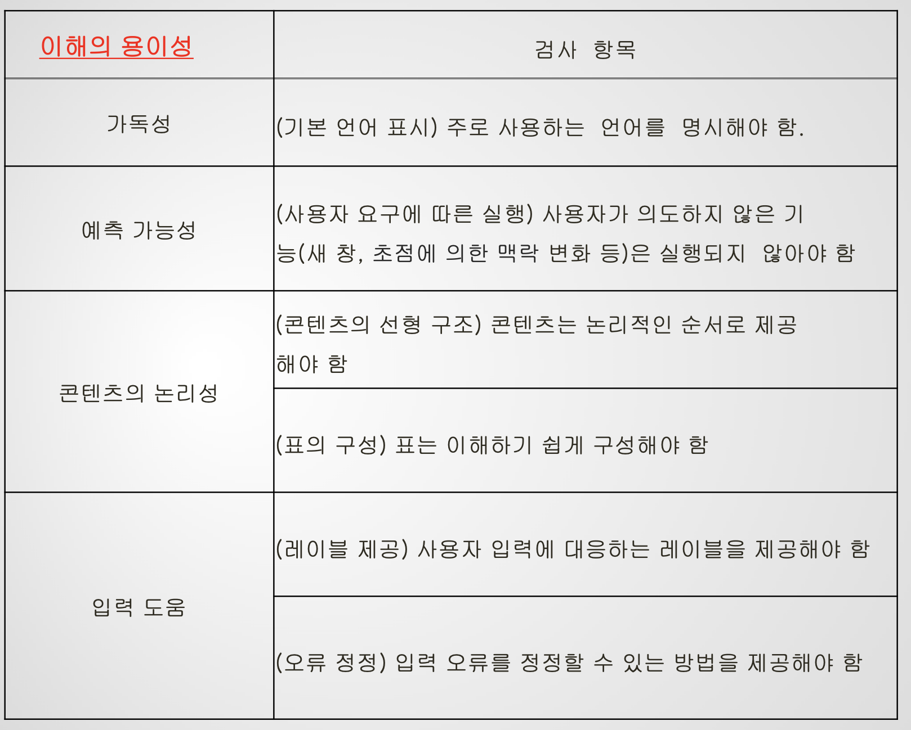
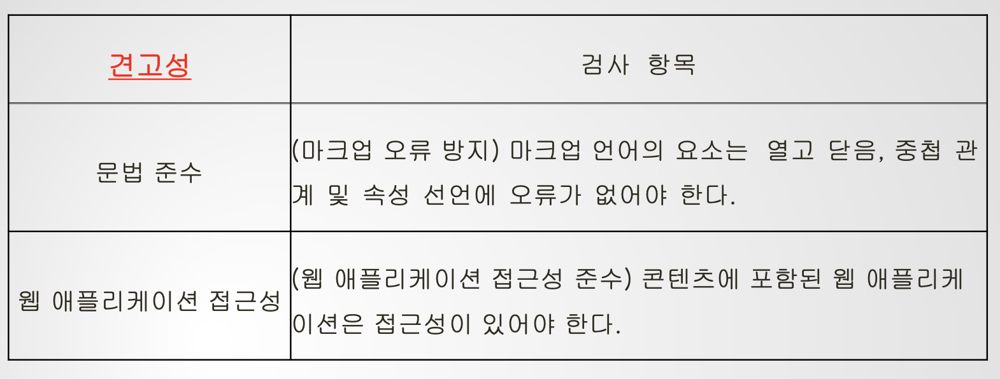
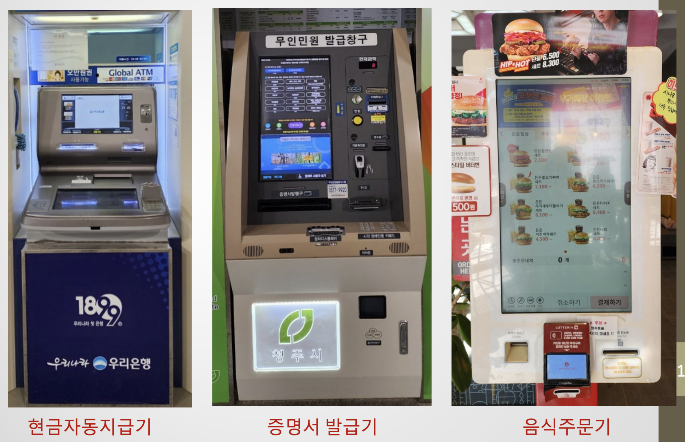
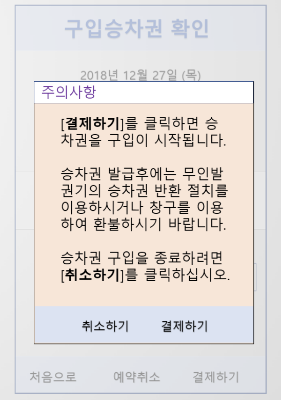
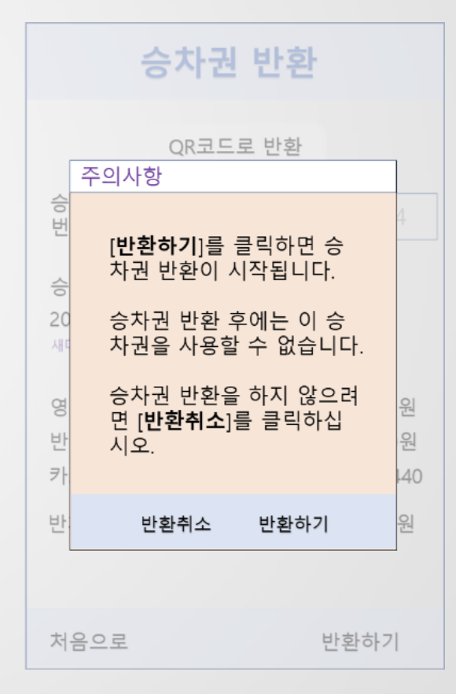
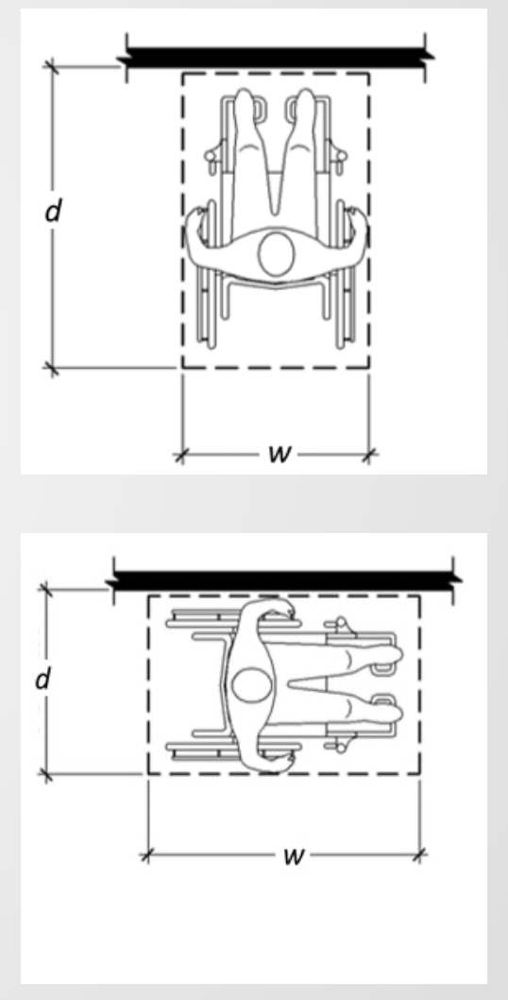

# Lecture16 Access for All (접근성) - 모든 사람들이 함께 행복한 따듯한 세상 만들기

## 내용 - 제 1 부
1. `개요`
2. `모바일 접근성`
3. 웹 접근성
4. 키오스크 접근성
5. 결론

## `1. 개요`

### `Accessibility (접근성) ` 
- 제품, 장치, 서비스 혹은 환경을 가능한 많은 사람들이 사용할 수 있도록 지원하는 수준을 말함. 
- 접근하여 사용자들이 이득을 얻을 수 있어야 함.
- 장애인이나 노약자들의 요구를 충족시키기 위하여 다양한 형태의 보조 기술을 사용 가능함.

### Disabled - World's Largest Minority

### 초고령화시대 - 노인 인구 급증

### 모두에게 필요한 접근성

### 접근성 제고 추진
- 각종 제품과 서비스에 접근성을 높이는 경사로를 만들어 주자
    - 다리가 아플때, 축구, 등산을 하고 난 뒤 혹은 무거운 짐을 들고 다닐때 -> `우리의 힘을 덜어 줄 수 있는 경사로 같은`
    - 터치 스크린을 활용하지 못할 때, 컴퓨터나 통신환경이 좋지 않을 때, 시끄러운 환경에 놓여 있을 때, 동영상 보기 어려울 때 등 
    - 제품과 서비스에 쉽고 편리하게 접근할 수 있도록, 보조기술을 활용한 소프트웨어, 웹 및 모바일 접근성 제고 방안을 강구하자

### UN - 장애인 권리 협약
- UN - 장애인 권리 협약 채택 (2006.12.13)
- 교육, 건강, 근로, 문화생활 등 총 50개 조항에 걸쳐 장애인의 전 생활영역에서의 권익 보장에 관한 내용을 포함
- 협약은 각 당사국의 협약 이행과 장애인 권익보호의 평가를 위한 국가보고서 제출 의무 부과
- 모든 사람들의 `정보 접근성 보장을 "기본 권리"로 설정`

### 정책 및 법률적 지원 - 국내
- 국가 차원에서는, 2013년 `"장애인 차별금지 및 권리구제 등에 관한 법률"` (약칭 : 장애인 차별 금지법)에서 장애인에게 정보접근성 관련하여 차별을 하지 못하도록 명시
- w3c 제정 웹 콘텐츠 접근성 지침 [World Wide Web Contents Accessibility Guide](https://www.w3.org/WAI/standards-guidelines/ko) 부합하는 `한국형 웹 콘텐츠 접근성 지침 2.1 제정 (2015년)`
- `모바일 앱 접근성 지침 2.0 제정 (2016년)`

### 정책 및 법률적 지원 - 해외
- 유럽 접근성 법 2019년 4월 발효된 유럽 연합 지침
- 국가별 규정을 제거하여 접근 가능한 상품 및 서비스에 대한 EU 회원국 간의 무역을 개선하는 것이 목표
- 컴퓨터, 스마트폰, 텔레비전, 등 개인용 장치에서 방송, ATM, 매표기, 대중 교통, 은행 및 전자 상거래 사이트 등 공공 서비스까지 광범위한 시스템 포함
- '모든 사람을 위한 디자인' 원칙, '유럽의 ICT 제품 및 서비스의 공공 조달에 적합한 접근성 요구 사항'을 정의하는 유럽 통합 접근성 표준 EN 301 549의 생성
- 미국에서는 정보 접근 권리와 관련하여 장애인법과 재활법 508조가 있음.
- 미국 장애인 법은 미국 내에서의 장애인이 고용, 교육 등 모든 사회 영역에서 차별을 받지 않도록 보장하는 법률
- 미국 재활법 508조는 미국 연방정부에서 전자 및 정보기술 (EIT : Electronic Information Technology)를 구매, 이용, 유지 및 보수할 경우 접근성을 준수하도록 명시

### 접근성 보조 기술 - 기업
- 운영체제가 제공하는 접근성 보조 기술 (Accessibility Assistive Technology)
    - 모바일 앱에 적용
    - VoiceOver (Apple - ios)
    - TalkBack (Google - Android)
- 운영체제 앱 `개발자`들에게 `표준화된 접근성 보조기술`을 제공하여, 앱 개발에 집중하며 개발된 앱들의 호환성 보장
- `사용자` 입장에서는 `일관성이 보장된 모바일 앱 인터페이스` 제공

### 시각장애인을 위한 스크린 리더

### 제스처 사용하여 명령

### 제스처 패턴

## `2. 모바일 접근성`
- 모바일 기기를 사용한 웹 사용이 데스크탑 사용을 앞질렀음
- 장애인들에게는 애플 아이폰 접근성 기능이 먼저 공개되고, 우수하여, 웹 사용에 대한 활용도 및 대중성이 높음
- 모바일 앱 콘텐츠 접근성 지침 2.0
- `한국정보통신기술협회 (TTA, Telecommunications Technology Associations)`에서 제안한 단체 표준 문서를 기준
- 접근성 지침 1.0은 2011년 9월 행정안전부 고시 (2011-38호)
- 2013년 미래창조과학부에서 지침 2.0 고시
- 4개의 원칙 하에 19개의 지침으로 구성

### 지침 2.0 4개 원칙
1. `인식의 용이성` - 사용자가 장애유무 등에 관계없이 애플리케이션의 `모든 콘텐츠를 동등하게 인식할 수 있도록 제공`
2. `운용의 용이성` - 사용자가 장애유무 등에 관계없이 애플리케이션에서 제공되는 `콘텐츠를 이해할 수 있도록 제공`
3. `이해의 용이성` - 사용자가 장애유무 등에 관계없이 애플리케이션에서 제공되는 `콘텐츠를 이해할 수 있도록 제공`
4. `견고성` - 견고성은 사용자가 기술에 관계없이 애플리케이션에서 제공되는 `콘텐츠를 이용`할 수 있도록 제공

### (대체텍스트) 텍스트 아닌 콘텐츠(Non-text-Contents)는 대체 가능한 텍스트와 함께 제공되어야 한다.
- '대체텍스트' (Alternative Text)는 사용자들이 그림이나 사진, 비디오, 등 멀티미디어 콘텐츠와 UI요소들을 인지하고 그 내용과 의미 및 기능을 파악할 수 있도록 충분한 설명을 작성하여 제공하는 텍스트를 의미
- 사용자들이 멀티미디어 콘텐츠의 의미를 명확하게 이해하고, UI 요소와 연관된 기능을 확실하게 알 수 있도록, 간단하고 명료하며, 쉽게 이해 가능한 텍스트 작성 및 첨부 필요
#### 사례 - 스크린리더 지원 필요
- '대체텍스트'가 제공되지 않으면 'VoiceOver'같은 스크린리더가 시각장애인 사용자들에게 제대로 된 정보 제공 불가능

>VoiceOver 실행

### (초점) 의미나 기능을 갖는 모든 객체에는 초점(focus)이 적용되고, 초점은 논리적인 순서로 이동되어야 한다.
- `초점`은 스크린리더와 같은 보조기기들을 지원하여, 화면에 나타나서 현재 선택된 콘텐츠 내용이냐 UI 요소 관련 정보를 읽을 수 있도록 하는 기능
- 현재 초점이 되는 선택된 객체들을 알려 주고 강조
- 사용자의 작업 순서에 맞게 이동하여 적절한 객체를 선택하고, 작업 순서와 논리에 맞게 순서에 따라 다음 객체로 이동하여 선택하여야 함
#### 사례 - 잘못된 초점 기능

- <전형적인 실수 사례>
- 초점을 적절하게 제공하지 못하여, '공인 인증서 로그인' 방식 사용 불가
- 패스워드 입력 불가
- 작업 논리에 맞지 않는 초점 이동 설계

### (색에 무관한 인식) 화면에 표시되는 모든 정보는 색에 관계없이 인식될 수 있어야 한다.
- 색상을 사용하여 표현된 정보의 경우, 색이 아닌 다른 방식으로 생성된 동일한 수준의 정보나 메시지가 추가 제공되어야 함
- 텍스트 혹은 흑백 이미지, 이미지 패턴 등을 사용한 정보를 사용하여, 동등한 수준의 정보가 병행하여 제공되어야 함
- 색맹 혹은 색약 문제가 있는 사용자 지원을 위한 기능 필요
#### 사례
> 색맹이나 색약 문제가 있으면 이해불가

> 텍스트 정보 추가하여 지원

### (자막 및 수화) 멀티미디어 콘텐츠에는 동등한 내용의 자막, 원고 또는 수화가 제공되어야 한다.
- 동영상 텍스트 정보는 제공 되었으나 '음성' 제공할 수 있도록 대체 텍스트 정보가 제공되지 않으면, 시각장애인은 필요한 정보를 얻을 수 없는 문제가 발생함.

### (컨트롤의 크기와 간격) 컨트롤은 충분한 크기와 간격으로 제공되어야 한다.
- '콘트롤'은 UI요소로서 사용자의 동작을 통하여 앱이나 폰의 기능을 활성화 하는 단추, 위젯, 등을 의미
- 크기가 작은 스크린을 사용하는 사람들이 본인의 의도와 달리 '콘트롤'을 누를 수 있으므로 이를 방지하기 위하여, 제어 영역을 확실히 알아서 정확하게 작동 시킬 수 있도록 크기, 간격, 모양, 등이 설정되어야 함
- 추천되는 콘트롤 UI요소들의 간격은 최고 13밀리미터이며, 최소의 크기는 가로/세로 8.5 밀리미터
#### 사례 - 제어용 UI 요소 크기 및 간격 확보

### (깜박거림) 깜박거리거나 번쩍이는 콘텐츠를 제공하지 않아야 한다.
- 깜박이거나 번쩍이는 콘텐츠를 보면 사용자에 따라 '광과민성 발작' 증세를 유발할 가능성 높아짐
- 초당 3~50 사이클로 번쩍이거나 깜박거리는 콘텐츠를 제공하는 것은 피할 것을 추천

### (범용 폰트 이용) 운영체제에서 제공한느 폰트 관련 기능을 활용할 수 있는 방법을 제공해야 한다.
- '범용 폰트'란 운영체제에 포함되어 있어야 하며, 줌인 & 아웃, 기울기, 강조, 크기 조정 및 모양 조정 등 기본 글꼴에 사용되는 동작이 적용 가능해야 함
- 모든 앱에서 제공되는 화면에서 글자의 폰트 활용 가능해야 함
#### 사례 - 활용 가능한 글꼴

### (사용자 인터페이스의 일관성) 사용자 인터페이스의 핵심 컴포넌트는 일관성 있게 사용이 되어야 함
- 앱의 UI 및 상호작용은 일관성을 유지하여 사용자가 학슴의 부담을 적게 가지도록 해야 함
- 버전이 바뀌어도 (업그레이드) 핵심 UI 요소 및 상호작용 방식은 일관성 유지 필요
#### 사례 - UI요소의 일관성

## 내용 - 제 2 부
1. 개요
2. 모바일 접근성
3. `웹 접근성`
4. `키오스크 접근성`
5. `결론`

## `3. 웹 접근성`
- W3C (World Wide Web Consortium)
- Web Accessibility Initiative (WAI)에서 웹 접근성 지침, 기술명세 및 교육 자원 개발하여 장애인들의 웹 접근 지원
    - Web Content Accessibility Guidelines, `WCAG Overview`
    - Authoring Tool Accessibility Guidelines, `ATAG Overview`
    - User Agent Accessibility Guidelines, `UAAG Overview`
    - Accessible Rich Internet Applications , `WAI-ARIA Overview`

### 추진 절차
- 전문가 및 작업반의 합의로 개발 후, W3C 승인으로 제정
1. Working Draft : 작성된 초안은 공개되어 검토 과정을 거침
2. Wide Review WD : 작업반에서 1차 리뷰 피드백 반영 공개
3. Candidate Recommendation : 1차 후보 추천 문서 (기술보고서) 작성하여 실무에 적용한 후 피드백 제공
4. Proposed Recommendation : 기술보고서를 발전시켜서 제안 추천 문서로 w3c 차원의 공개. 회원 승인 필요.
5. Recommendation (Web Standard): 표준 제정

### WCAG 2.1 – 원칙들
1. 인식의 용이성 `(Perceivable)` : 사용자들이 인식 가능한 방식으로 표현
    - Text Alternatives : 텍스트가 아닌 콘텐츠 설명
    - Time-based Media : 오디오, 비디오. 이미지, 등을 위한 캡션, 수화, 등 제공
    - Adaptable : 콘텐츠를 사용자의 요구에 맞는 다른 형태로 표현
    - Distinguishable : 사용자들이 구별 가능하도록 콘텐츠 제공 (글자 모양 & 크기, 배경색과의 차이, 명도, 등)
    
2. 운용의 용이성 `(Operable)` : UI 요소들을 작동시키고, 웹 페이지 항해가 용이
    - Keyboard Accessible : 모든 작업을 키보드 만을 사용하여 운용 가능
    - Enough Time : 사용자들이 콘텐츠를 이해하고 반응하기에 충분한 시간 제공
    - Seizures and Physical Reactions : 힘을 주거나 물리적 반응을 일으키지 말아야 함 (예, 광과민성 발작)
    - Navigable : 사용자들이 항해하는 과정이 쉽고, 어디인지 쉽게 파악 가능
    - Input Modalities : 사용자 요구에 맞는 다양한 입력 수단 제공
    
3. 이해의 용이성 `(Understandable)` : UI 기능과 작동 방식 및 텍스트 내용이 이해가 가능하도록
    - Readable : 웹 페이지의 텍스트가 읽기 쉽고 이해가 가능
    - Predictable : 웹 페이지의 표현 및 작동 방식이 예측 가능
    - Input Assistance : 사용자들의 실수 방지, 예방, 및 복구 지원
    
4. 견고성 `(Robust)` : 보조기술을 포함하는 다양한 형태의, 현재는 물론 미래의 사용자 에이전트와 호환성 보장 필요
    - Parsing Compatibility : HTML, XML, 등 마크업 언어 표준 준수하고 버전 변화에 대응
    - Name, Role & Value Compatibility : 모든 UI 요소들이 프로그래밍 되어서 사용자 에이전트 및 보조 기술 변화에 적절하게 대응
    - Status Messages Compatibility : 마크업 언어를 구현하여 
    

### 한국형 웹 콘텐츠 접근성 지침 2.1
- 장애인이 비장애인과 동등하게 웹 콘텐츠에 접근할 수 있도록 웹 콘텐츠를 제작하는 방법에 관하여 기술
- 지침들은 웹 콘텐츠 저자, 웹 사이트 설계자들이 관련된 지침을 준수하여 접근성(accessibility)을 보장하는 웹 콘텐츠를 쉽게 만들 수 있도록 지원
- 보조기술 개발자들이 보조기술을 설계할 때 참고
- 시각 장애, 저시력 장애, 청각 장애, 지체 장애, 학습 장애, 지적장애, 뇌병변 장애, 광과민성 발작, 등과 같은 개별적인 장애를 가진 사용자들이 쉽게 접근할 수 있는 웹 콘텐츠를 구축하는데 필요한 방법을 소개
- 표준의 체제는 원칙(principle), 지침(guideline), 검사 항목(requirement)의 3 단계로 구성
- 웹 접근성 제고를 위한 4 가지 원칙과 각 원칙을 준수하기 위한 13 개 지침 및 해당 지침의 준수 여부를 확인하기 위해 24 개의 검사 항목을 제시
- W3C가 개발한 '웹 콘텐츠 접근성 지침 2.0'을 참고

## `4. 키오스크 접근성`

### 키오스크 대중화

### 키오스크 특징
- 제한적 기능을 제공하는 독립적인 시스템으로, 보조기술 적용에 어려움 존재
- UI요소
    - 하드웨어 – 키보드, 키패드, 단추, 스크린, 볼륨 조절기, 등
    - 표준 콘텐츠 – 텍스트, 이미지, 테이블, 기호, 등
    - 음성 및 시각 콘텐츠

### 키오스크 접근성 장애
- 인식 장애
    - 음성 및 점자 지원 부족
    - 글자 크기 및 명도 차이 부족
- 운용 장애
    - 행동 유도성(Affordance) 미흡
- 이해 장애
    - 실수한 이유를 모르고, 화면이 복잡하며, 실수 대비 부족
- 견고성 장애
    - 듣기 & 말하기 기능 부족

### 이해 용이성
- 적절한 피드백 제공
- 에러 메시지 적절하게 제공
- 작업 완료
    - 충분한 시간 제공
    - 초기화 기능
- 적절하고 간명한 언어 사용
    - 그림과 아이콘 추가 사용
- 알림 기능
    - 시작, 정지, 종료, 등

### 사용자 안내 (1)
- 입력 도움
    - 사용 방법 안내, 레이블 제공, 오류 안내, 등
- 되돌릴 수 없는 기능의 안내
    - 시작 전
    - 종료 안내
    

### 사용자 안내 (2)
- 종료 안내
- 피드백
    - 콘트롤 조작 피드백
        - 온-스크린 콘텐츠 변화
        - 클릭음, 비프음, 등 신호
        - 촉각 피드백
        - 색상 변화

### 개인정보 및 지원 서비스
- 개인정보
    - 생체정보 사용 – 다양한 방식의 인증 방식 (지문, 얼굴, 등) 도입
    - 정보 보호
        - 시각 정보 – 민감 정보 차단을 위한 보호 필름 사용
        - 음성 정보 (개인정보, 금융정보, 등) 노출 방지 – 이어폰 사용
- 지원 서비스
    - 유인서비스 & 콜센터 운영
    - 사용자 가이드 & 매뉴얼 제공
    - 도움말 기능
    - 외국어 서비스 제공

### 키오스크 접근성 설계 원칙 (1)
- 키오스크에는 시각을 사용하지 않고도 이용할 수 있는 한 가지 이상의 방법이 제공되어야 한다 (청각, 촉각, 등)
- 낮은 시력으로도 이용할 수 있는 한가지 이상의 방법이 제공되어야 한다 (확대, 명도 대비, 등)
- 색을 인식하지 않고도 이용할 수 있는 한가지 이상의 방법이 제공되어야 한다
- 청각을 사용하지 않고도 이용할 수 있는 한가지 이상의 방법이 제공되어야 한다 (시각, 촉각, 등)

### 키오스크 접근성 설계 원칙 (2)
- 낮은 청력으로도 이용할 수 있는 한가지 이상의 방법이 제공되어야 한다 (배경음 감소, 음량 조절 범위 확대, 등)
- 발성을 사용하지 않고도 이용할 수 있는 한가지 이상의 방법이 제공되어야 한다 (시각, 촉각, 등)
- 사용자가 큰 힘으로 조작할 필요가 없는 방법이 제공되어야 한다 (음성 사용, 등)
- 일부 사용자의 광과민성 발작을 최소화할 수 있는 한가지 이상의 방법이 제공되어야 한다 (반짝임이나 번쩍임 규제)

### 키오스크 접근성 설계 원칙 (3)
- 주변환경
    - 단단한 바닥
    - 바닥면 높이 차이 – 휠체어 이동 고려
    - 활동 공간 – 휠체어 공간 고려
    - 조명 환경 – 눈부심 및 비침 방지
    - 방음 환경

## `5. 결론`
- 장애인 및 노약자의 정보 접근성 보장은 인간의 기본 권리
- 웹, 모바일 앱, 키오스크 등 디지털 및 정보 접근성 제고 노력이 필요
    - 사회, 기술, 재정, 정책 및 법률 등의 분야에 수많은 기회가 존재 &rarr; 다양한 접근 방식 존재
- 단체, 국가 및 국제 표준화 활동이 필요
- 정보통신 기기, 서비스 및 환경에서의 접근성 제고를 위한 정부와 산업체의 노력이 진행 중
    - 사업 기회 존재 – 접근성 개선, 보조 기술 개발, 등
    - 웹, 모바일 앱 및 키오스크 등 디지털 기술 접근성 제고

