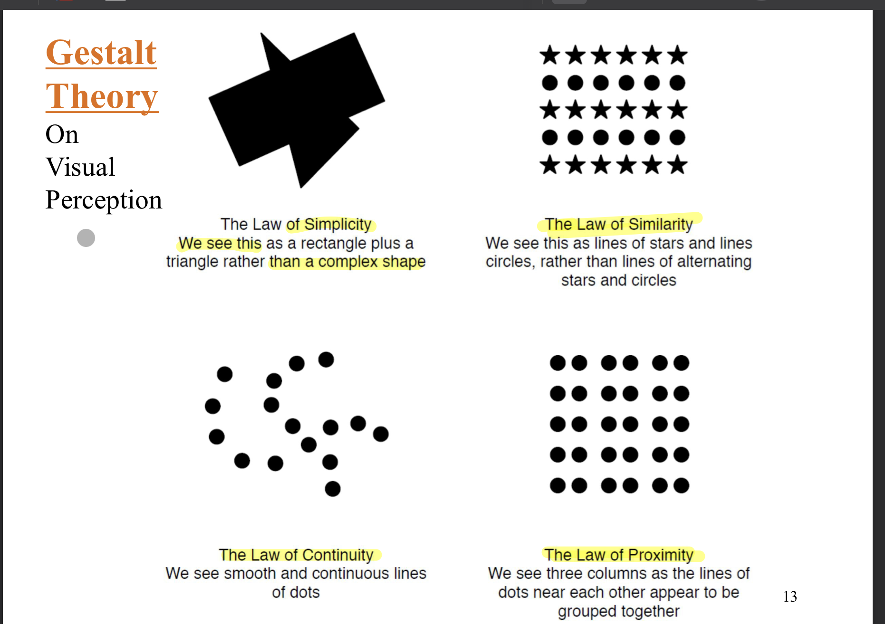
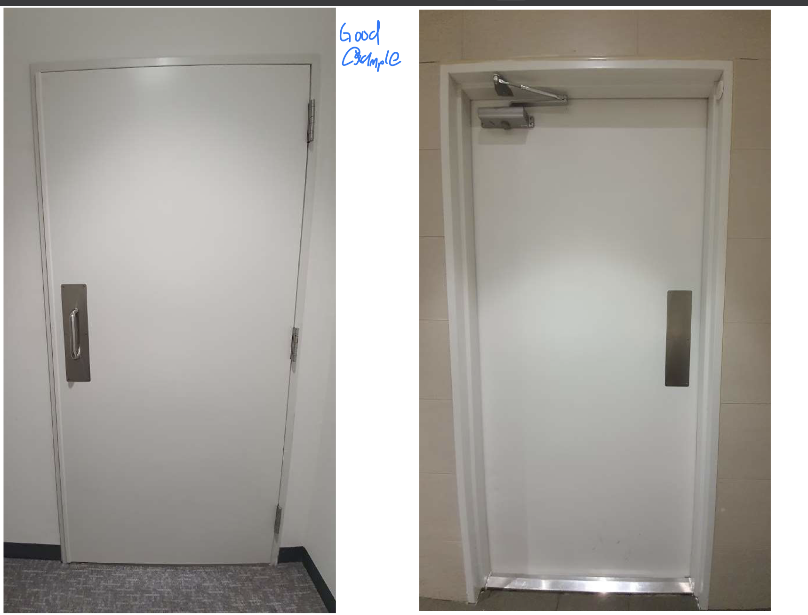
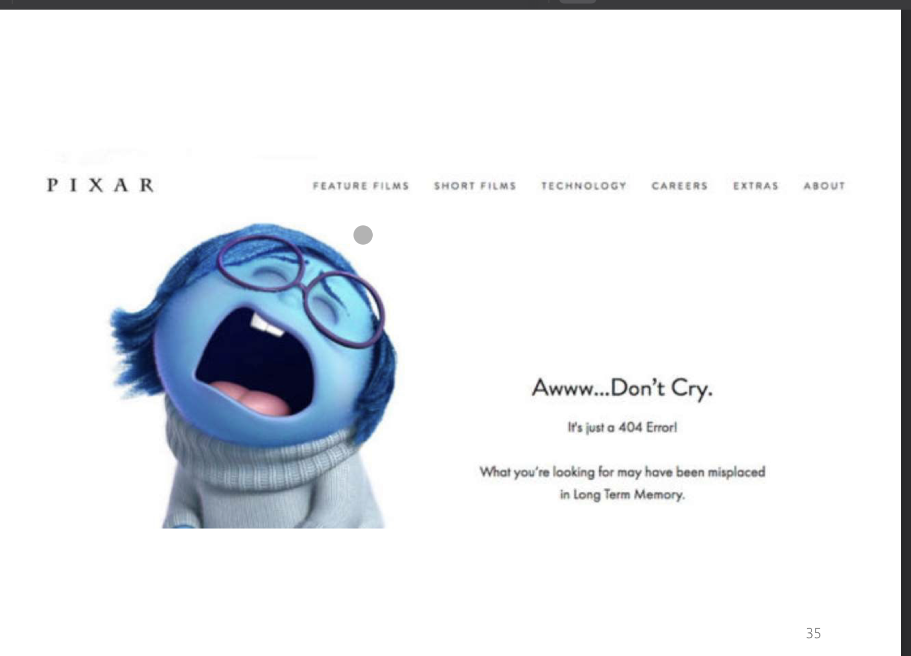
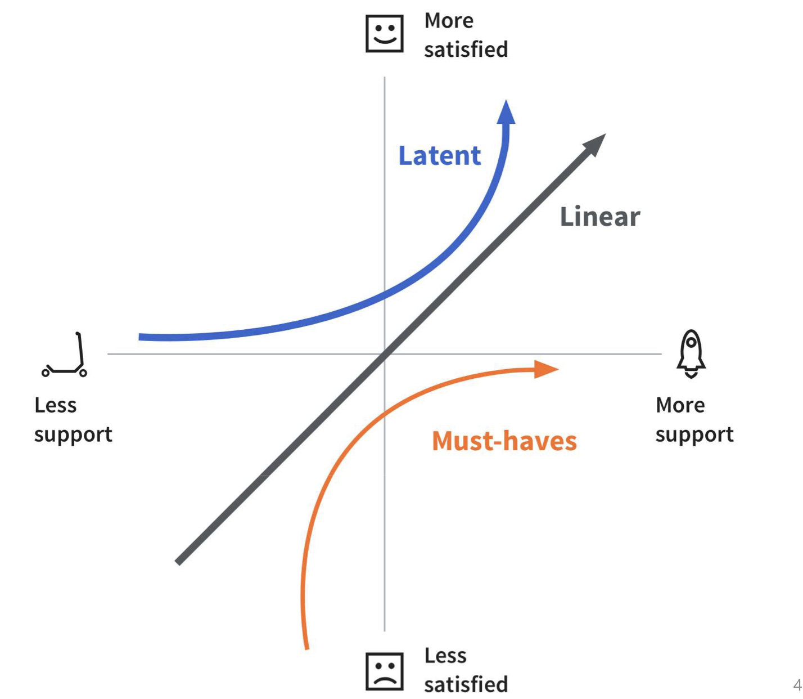
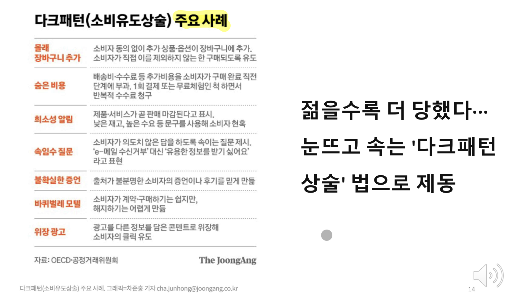

# UX디자인 1강 Introduction

## 2부
1. 개념 소개
2. UX 디자인
3. 성공 및 실패 사례 소개
4. 상호작용 실행 모델 (Norman)
---

### UX란?
- User eXperience : 사용자 경험은 특정 제품, 시스템 혹은 서비스를 사용하는 사람의 `감정과 태도`를 의미
- UX가 다루는 영역은 `최종 사용자의 상호작용과 관련된 모든 면`
- 성공적인 제품, 시스템 혹은 서비스에 필수
- 직관적인 사용 + 효율적이고 효과적인 사용 = 사용자 만족도 극대화

### UX디자인의 목적 및 기대효과
- `사용자 중심 디자인` : 사용자의 니즈, 행위 및 선호도에 대한 이해를 바탕으로 사용자들의 요구사항과 기대에 부응하는 `해결 방안 개발`
- `사용성 개선` : 쉽게 배우고 편하게 사용하도록 하여, 사용자 작업을 효과적이고 효율적으로, 만족도 상승하게 하여 `지속적 사용 유도`
- `고객 만족도 개선` : 사용자의 만족도를 제고하여 즐겁게 우리 제품을 사용하는 충성도 높은 고객 확보
- `효과적인 의사 소통` : 직관적이고 명쾌한 방식으로 의사 소통 가능하도록 하며, 데이터 시각화, 정보 구조 개선, 레이아웃 설계 개선, 등을 통하여 사용자와 의사소통 방식 개선
- `성공적인 비즈니스` : 사용자들에게 긍정적인 영향을 주어 `사업 성공`
- `경쟁력 강화` : 경쟁사 대비 더욱 부드럽고, 재밌으며 효육적인 경험을 사용자들에게 제공하여 `경쟁령 우위 확보`
- `개발 비용 절감` : 개발 초기에 설계 단계에서 문제점 개선과 지속적이고 반복적인 테스팅 과정을 통해 제품의 품질과 성능을 개선하므로 `개발비용 절감 가능`
- `다양한 플랫폼에 적용` : 다중 매체 시대를 맞이하여 다양한 매체와 장비에서도 일관성이 있고 호환성이 높은 사용자 경험을 제공할 수 있도록 하여 `제품, 시스템 혹은 서비스의 품질 향상`

> 핵심 메시지 : `사용자를 중심에 두고 제품과 서비스를 개발하자 !`

- `혁신` : 디자이너와 개발자가 새로운 UX방법을 개발하여 혁신 성취
- `윤리적 설계` : 데이터 프라이버시, 접근성, 등 사용자들의 실질적이고 정신적인 웰빙과 안정을 추구하며, 개별적 요구를 만족하고, 공급자 중심에서 수요자 중심으로 발전하는 설계
- `개인화` : 사용자 개인 별로 요구되는 다양한 니즈와 개별적인 선호도를 반영하여 만족시켜주는 설계
- `지속적 개선` : 제품과 서비스가 제공되는 생애 전주기 동안 지속적으로 점검하여 문제점을 보완하고 개선

> 사용자 경험 디자인 : 배우기 쉽고 사용하기가 편한 제품, 시스템 및 서비스 만들기 위한 기반 구축

### 나쁜 사례
- 사용자가 무엇을 해야할지 헷갈리게 함
- 사용성 & 접근성 미흡
- 사용자 심리 법칙 위반
- 찾아서 수행하기 힘든 기능 존재

### Norman의 상호작용 모델
- ``Gulf of Execution (실행의 간격)``:

Gulf of Execution은 사용자가 시스템 또는 인터페이스를 효과적으로 이해하고 활용하기 위해 필요한 작업 및 노력의 양을 나타냅니다.
사용자가 원하는 목표를 달성하기 위해 시스템을 어떻게 사용해야 하는지를 이해하는 데 드는 노력과 복잡성을 나타냅니다.
Gulf of Execution을 줄이기 위해 디자이너는 사용자가 시스템 또는 인터페이스를 직관적으로 이해하고 사용할 수 있도록 노력해야 합니다.

- `Gulf of Evaluation (평가의 간격)`:

Gulf of Evaluation은 사용자가 시스템의 상태, 결과 또는 상호작용의 결과를 어떻게 이해하고 해석하는지를 나타냅니다.
사용자가 시스템 또는 인터페이스의 작동 상태를 파악하고 효과적으로 피드백을 받을 수 있는 능력을 나타냅니다.
Gulf of Evaluation을 줄이기 위해 디자이너는 사용자에게 시스템의 상태 및 결과를 명확하게 표시하고 이해하기 쉽게 만들어야 합니다.

> 요약하면, Gulf of Execution은 사용자가 목표를 달성하기 위한 작업의 어려움을 나타내고, Gulf of Evaluation은 사용자가 결과를 이해하고 해석하는 어려움을 나타냅니다. 디자인과 사용성을 향상시키려면 이 두 간극을 최소화하고 사용자 경험을 개선해야 합니다.

## 3부
1. 사용자 중심 디자인
2. 디자인 원칙
3. 사용성 (Usability) - 정의 및 평가
4. 맺음말
---

### 관점의 전환
- Technology-centered design >>>> User-centered design
    - ex) 수도꼭지

### 인지부담 (Cognitive Load)
- 제품 구매를 하려면 반드시 회원 가입을 하고 로그인을 해야하는 온라인 쇼핑몰
- `암호를 기억하는 일은 대단한 인지적 부담`
- 암호 재설정은 가능하지만, 재방문 사용자의 숫자가 현저하게 떨어짐
- `비회원으로 진행` 혹은 `손님으로 구매` 등을 통하여 `고객의 니즈`를 파악하여 충족시켜 해결

### 디자인 원칙
1. 인간의 조건에 따른 니즈 - 인간(고객)의 특성 파악 - 생리 & 심리
2. 일반적인 기대에서의 니즈 - 혼란 최소화 - 문화, 관습, 사회, 연령 등
3. 특정 사용 맥락에서의 니즈 - 상황 별로 니즈가 변화 - 제약 사항 점검 필요
> ex) 어린이가 보는 웹사이트는 알록달록한 색깔 사용, 관심끌기 위해 빨간색 사용

### 게슈탈트 이론
- 형태주의 이론 - 심리학
    - 사물은 지각하는 `사람의 습관`에 따라 인식된다.
    - `전체는 부분들의 단순 합` 이상을 의미한다.

### 일반적인 니즈
- 특정 유형의 제품에 상관없이 사용자는 제품 사용 과정에서 `일반적인 기대를 함`
- 기대 충족을 위하여 `혼란 최소화 & 인지 부하 최소화`
- 행동 유도성 (`affordance`)
    - 사용자가 인지하는 속성
    - `제품을 보기만해도 어떻게 사용할지 알거나, 디자이너의 의도대로 사용자의 행동을 자연스레 유발하는 것`

> 미는 문 당기는 문에 affordance 적용

### 디자이너 가이드라인
1. 문제 해결 `작업 단계 최소화`
    - 다양한 입력 지원 - 예) 전화번호 입력, 이름 입력, 영문자(대/소) 등
    - 스마트한 기본값 지원 - 내비게이션 앱의 출발지의 기본값은 현재 위치
    - 직접조작 지원 - 대부분의 모바일 기기는 터치 스크린 기반
2. `전문용어가 아닌 적절한 용어`를 사용하여 사용자가 잘 알아듣게 함
    - 사용자가 주도적으로 작업을 수행한다고 느끼게 한다 - 예) 사용자가 보낸 메시지가 발송되고 잘 읽혔는지 확인
    - 비교 설명 - 예) 내비게이션 앱에서는 자동차 속도 + 도착 예정 시간 - 사용자의 목적과 관심에 맞게 표현
    - 친숙한 용어 사용 - "멘탈 모델" 기반

3. 사용자의 `시간을 낭비하지 마라`
    - 사용자가 필요로 하는 `도구 혹은 기능을 가까이 배치`
    - 성능 향상 - `로딩 시간 줄이기`
    - 사용자의 작업 흐름 방해 금지 - `흐름을 깨는 대화 상자나 메시지 출력 금지`
4. 사용자의 `실수를 방지`하라
    - 실수 예방 - 원천 봉쇄
    - 실수 탐지
    - 실수로부터 원상 복구 지원
    - 실행 취소 기능

### 특정 맥락에서의 니즈
- 솔루션 VS 니즈
- 문제 해결을 위한 근본적인 니즈가 무엇인가에 집중
- 강에 다리를 만들자
    - `다리 는 솔루션`, 근본적인 니즈는 `강 건너는 것`이다.
    - 기술 대 사용자

### 카노 모델 : 사용자의 니즈를 분류한 MODEL
- 필수 (`must-haves`)니즈 : `기본 기능으로 못하면 망하고 잘하면 본전`
- 선형적 (`linear`)니즈 : 검색에 필요한 시간처럼, `잘 할수록 비례하여 만족도 상승`
- 잠재적 (`latent`)니즈 : 사용자가 모르던 니즈로서 없어도 그만이지만, `잘되면 추가로 더 큰 만족도 달성` - 찾아내기 위한 노력이 필요함

### 모바일 UX 디자인의 기본
1. 사용자 리서치 (User Research) - 니즈 & 동기
2. 아이디어 탐구 (Ideation) - 스케치
3. 모바일 패턴 (Mobile Pattern) - 웹, 안드로이드, IOS 우수 사례 - 사용자의 기본 기대 만족
4. 솔루션 (Solution) - Wireframe & Mock-up
5. 프로토타이핑 (Prototyping) - 시뮬레이션
6. 사용자 테스팅 (User Testing) - Usability

### 맺음말
- UX는 중요하다!
- 사용자의 니즈를 파악하는게 중요하다!
- `Usability is measured, evaluated and improved`

## 4부 심리학 & HCI

### Technology & Human Behaviors
- 인간 사용자의 특성에 잘 맞는 사용자 인터페이스를 제대로 개발하기 위하여 `유용한 심리학 원칙` 학습
- `행동심리학 및 인지심리학` 원칙 학습
- 제품이나 서비스 개발 원칙에 맞도록 활용
- 개발자는 책임감을 가지고 제품이나 서비스 개발

### 디지털 제품 / 서비스 `사용 유도 방법`
- 인간 사용자의 행동 형성을 위하여 다양한 방법 사용
    - `사용자를 사이트에 오래 머물게 함`
    - 제품이나 서비스 구매 혹은 콘텐츠 공유 유도
- 인간 사용자의 심리 활용 - 예) 보상심리

1. 간헐적이고 불규칙한 보상
    - 스키너의 이론 - 불규칙적으로 이루어지는 `무작위 강화`가 행동을 형성하는 가장 효과적인 방법임을 입증
    - 트위터 앱의 `새로고침` - 슬롯 머신의 `당기기` 동작과 유사하여 사용자에게 쾌감 제공, `불규칙적으로 새로운 콘텐츠를 로딩`하는 결과 제공
2. 무한 루프 - 자동 재생
    - 유튜브
3. 콘텐츠 제공에 대한 보상 - `사회적 확증`
    - 페이스북의 좋아요 버튼
4. 기본 설정의 중요성
    - 인간은 한번 기본 설정에서 정한 것은 `좀처럼 변경하지 않음`
    - 기본 설정이 사용자의 기대와 달라도 변경하는 비율은 낮음
    - `이러한 특성을 이용하여 사업자들은 기본 설정에서 더 많은 이익(예) 개인정보) 취하려고 노력`
5. 방해 요소 제거
    - `사용자의 행동 형성을 방해하는 요소를 찾아서 제거`
    - 제품과 서비스 사용에 필요한 동작 수행이 쉬워지고 편해지도록 유도
    - 사용자의 동작 수행 및 습관화 목표
6. 호혜성
    - `타인의 행동에 보답하고자 하는 인간의 욕구 활용`
    - 링크드인의 사례
        - 나의 보유 기술을 추천한 상대의 보유 기술도 추천하도록 의무감 부여
        - 상대방을 추천하는 동안 사이트에 머무르고 수행하는 행동 증가
7. 다크 패턴
    - `사용자가 원하지 않거나 불필요한 행동을 하도록 유도하여 기업의 이익을 위하는 기만적인 기법`
    - 단기적인 이익에 집착하는 방식으로 비판을 받지만, `현실적으로는 인기가 많은 사이트 일수록 다크패턴` 활용하는 비율도 높은 것으로 알려짐.
    

### 정리 : 심리학과 UX
- 기술이 인간 행동에 끼치는 영향력을 생각할 때, `디자인 및 개발 윤리 준수를 통한 견제가 필수`
- 사용자의 목표를 지원하는 제품 과 서비스 개발
    1. `다양한 가능성을 고려한 테스팅` & `수정 보완 작업 수행`
        - `아무것도 잘못되지 않는 행복경로`
        - 사용자 실수, 의도를 벗어난 행동을 미포함, 이슈나 버그가 발생 가능성 낮음
        - '행복경로' 시나리오는 잘못된 입력, 네트워크 문제, 서버 요류가 발생할 가능성을 무시, 시나리오나 케이스를 벗어난 오류에서 이슈를 찾을 수 없음
        - `비이상적 경로` 혹은 `최악경로`와 같이 다양한 사용자가 만나는 여러가지 가능한 경우에 대하여 테스팅 필요 
            1. 사고 발생 확률이 높은 경로
            2. 사고가 나면 큰 손해가 발생하는 경로
            3. 우리의 약점이 드러나는 경로
    2. `개발팀 구성과 사고방식의 다양성 추구`
        - 유사한 배경을 가진 사람들이 공유하는 인생 경험 `이외의 부분 존재`
        - 제품 / 서비스의 회복탄력성 저하로 `문제 발생 대처 능력이 감소`
        - 개발팀의 사고방식을 확장하기 위하여 `다양한 구성원 참여`
        - 개발 프로세스를 `유연하고 탄력있게 추진`
        - `다양한 관점에서` 개발 작업 추진 가능
    3. `정량적 & 정성적 분석을` 통하여 사용자 중심의 개발 필요
        - `정량적 데이터 분석으로` 놓치는 부분을 정성적 분석으로 탐구
        - `사용자 행동에 대한 세심한 관찰과 대화 필요`
        - 개발 제품/서비스가 사용자 삶에 미치는 영향에 대한 관찰과 분석 필요
        - 사용자의 목표와 행복을 지원하는 제품/서비스 개발
 