# 제 7강- 솔루션 구체화하기

## 모바일 UX 디자인의 기본
1. 사용자 리서치 (User Research) - 니즈 & 동기
2. 아이디어 탐구 (Ideation) - 스케치
3. 모바일 패턴 (Mobile Pattern) - 웹, 안드로이드, IOS 우수 사례 - 사용자의 기본 기대 만족
4. `솔루션 (Solution) - Wireframe & Mock-up`
5. 프로토타이핑 (Prototyping) - 시뮬레이션
6. 사용자 테스팅 (User Testing) - Usability

## 내용
1. `개요`
2. `와이어프레임(Wireframe) 이해`
3. `기능 스펙 문서로서의 와이어프레임`
4. 목업(Mock-up)
5. 실용적 진행

## 1부 와이어프레임 (Wireframe)

## 1. 개요
1. `스케치(개념설계)`는 `아이디어 탐구` 초기 단계에 가장 효과적
2. `와이어 프레임(세부설계)`으로 `구체적인 디자인 솔루션`을 제시
3. `목업(GUI 설계)`을 사용하여 `좀 더 구체적이고 실감나게` 표현

 

- `와이어 프레임`과 `목업`을 사용하여 `디자인 솔루션을 구체화`
- 다양한 모바일 기기의 화면해상도에 맞추어 스펙과 에셋을 준비
- 프로젝트 팀 내부의 `디자인팀과 개발팀 사이 소통의 수단`으로 활용

## 2. 와이어프레임 이해하기
- `Wireframe` 혹은 `UI Blueprint`
- `(1) 화면 UI구성요소`가 명확하게 구분되고, 이해하기 쉬워야 함
    - 버튼 형태, 아이콘, 텍스트, 도형 등을 색상과 조합하여 UI설계
- `(2) 화면 사이의 이동 및 UI 동작` 표현 -> `UI Flow Diagram(흐름도)`
    - 팀 내부 다양한 구성원들 사이에 소통을 위한 도구로 사용 
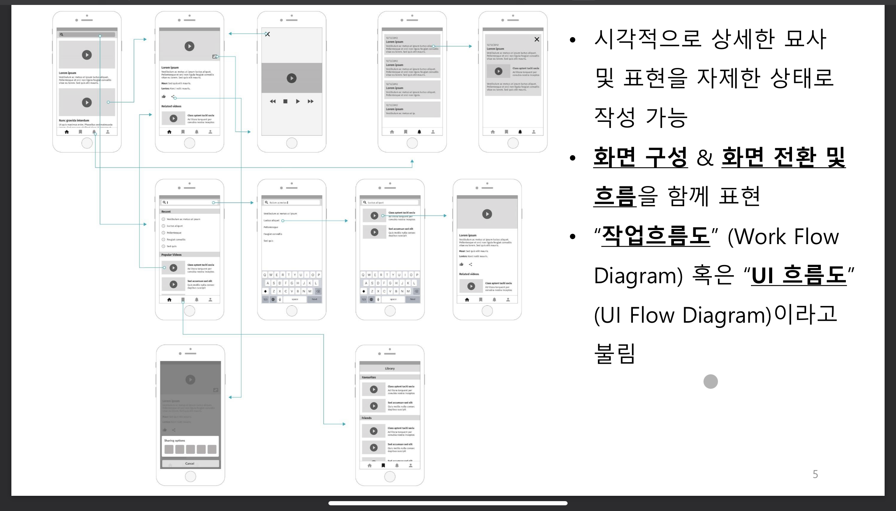
> `화면 구성 하고 화면 전환 및 흐름 까지 해야 와이어프레임이 끝`
- `Low-fidelity` vs `High-fidelity` **Wireframe** : 구체화 수준에 따라

## 3. 기능 스펙 문서로서의 와이어프레임
- `기능명세서(Functional Specification)`는 가능한 상세하게 기술
- 앱의 조작 흐름, 화면 전환을 위한 제스쳐, 화면 구성 및 제어상태, 등에 대한 명확한 견해를 가질 수 있도록 지원해야 함
- 일부 구성 요소는 아이콘이나 작은 그림으로 표현 가능
- 보다 구체적인 세부 사항은 `목업`에 명시 가능
- `상세화` 수준에 따라 여러가지 화면 구성, 기능 및 동작을 표현
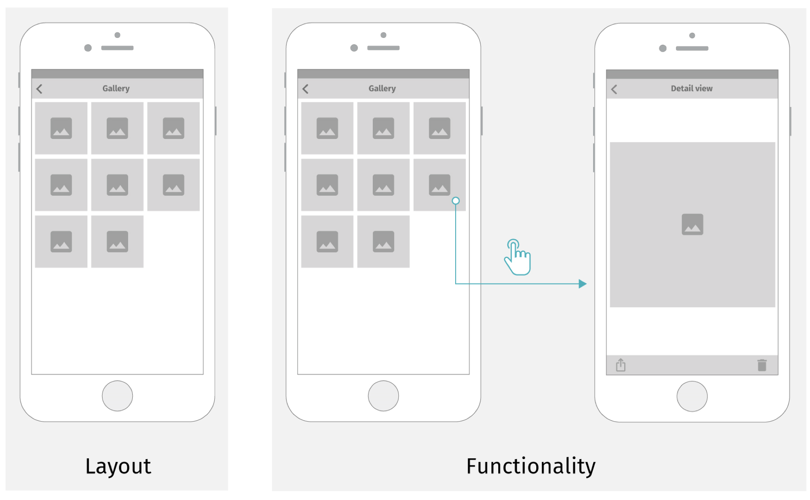
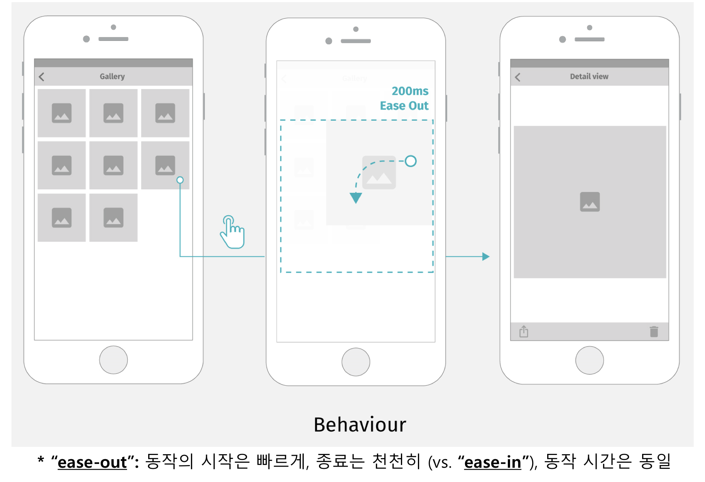

### 화면 구성
- `앱의 기본 구조와 화면 구성 요소`들 각각의 `관계`를 정의
    - 예) 버튼의 위치- 상단 혹은 하단인지 ? 아니면 탭바 인지 ?
- `폰트`의 경우는 별도의 문서에 명시 가능
- `그림 요소들의 모양과 크기, 색상` 등도 명시 - 사용자들의 `시선 집중 및 초점 유도`에 중요한 요소
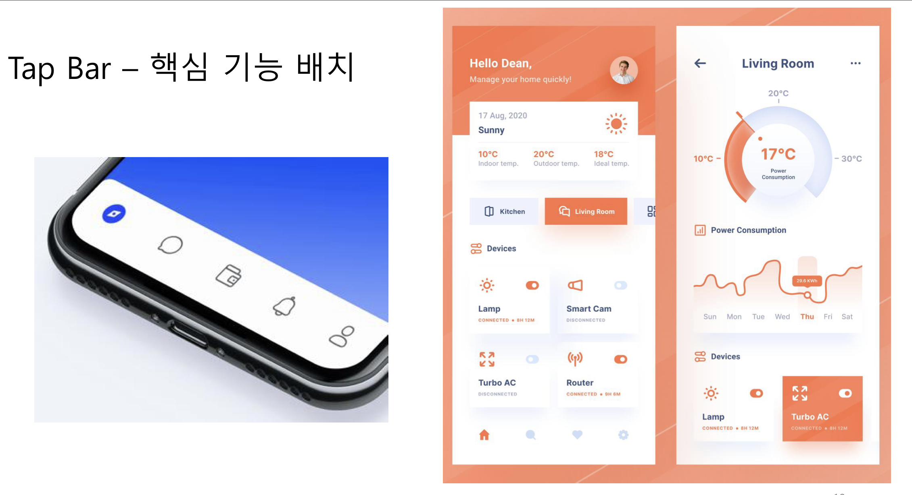
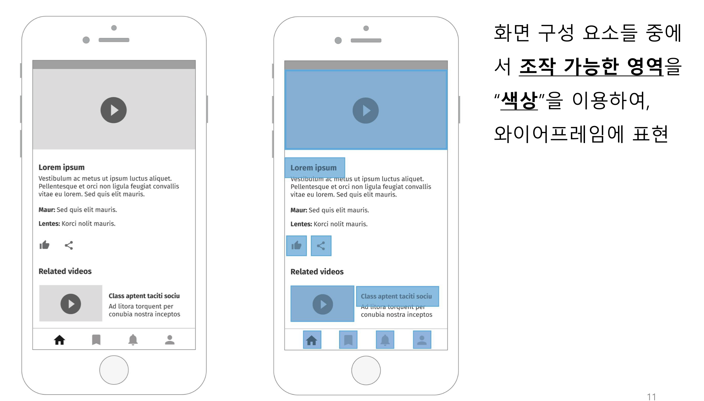

#### 제스쳐
- 모바일 앱에서 사용되는 중요한 상호작용 방식
- 화면 전환은 물론 화면 내에서의 상호작용 표현
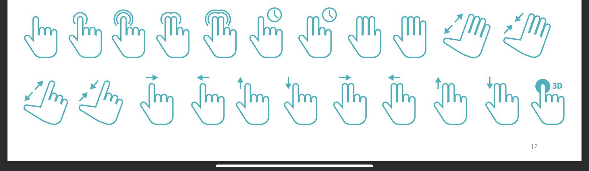

#### 전환
- 앱에서는 다양한 `UI 요소들과 콘텐츠가 화면과 함께 나타났다가 사라짐`
- 사용자들의 인지 활동을 지원하기 위하여, 즉 `무슨 일이 벌어지는지 상황 파악을 잘 하도록 지원` 필요
- 구성 요소들의 `이동 궤도, 속도, 지속시간, 타이밍` 등의 요소가 정의되어야 함

#### 궤도
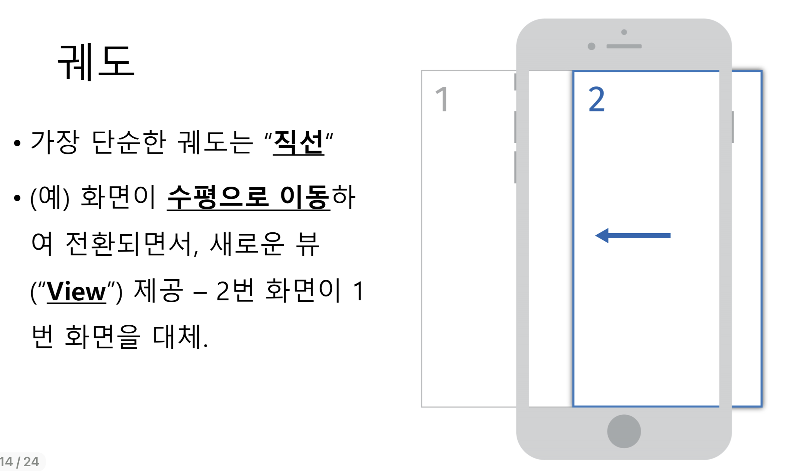

#### 곡선 궤도
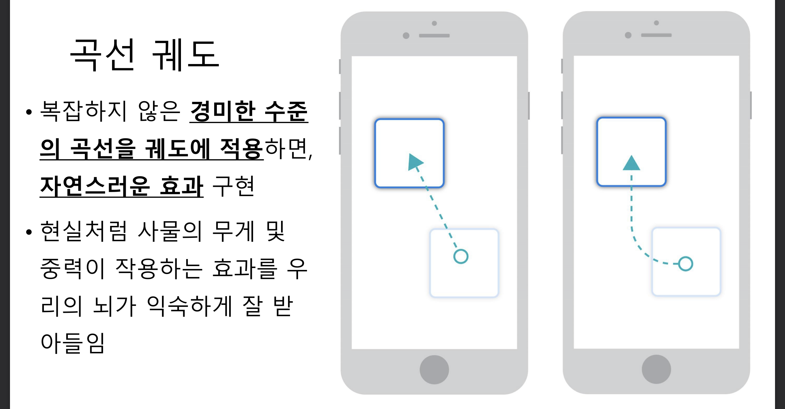

#### 복잡한 전환
- 화면 구성 요소들이 제각각 움직이면 `사용자가 혼란스럽게 느낌`
- 움직이는 여러 개의 요소들은 함께 움직이는 것이 바람직하므로, 움직일 요소들을 구조화 (예, 계층 구조로 표현)하면 `복잡성 감소`
- 사용자가 `집중할 항목이 무엇인지를 명확하게 표현`하여 잘 알아챌 수 있도록 지원
- 이동하는 일부 요소 형태나 위치가 크게 변할 경우, 흐릿하게 보이거나 번지는 효과를 사용하여 사용자의 혼란을 감소
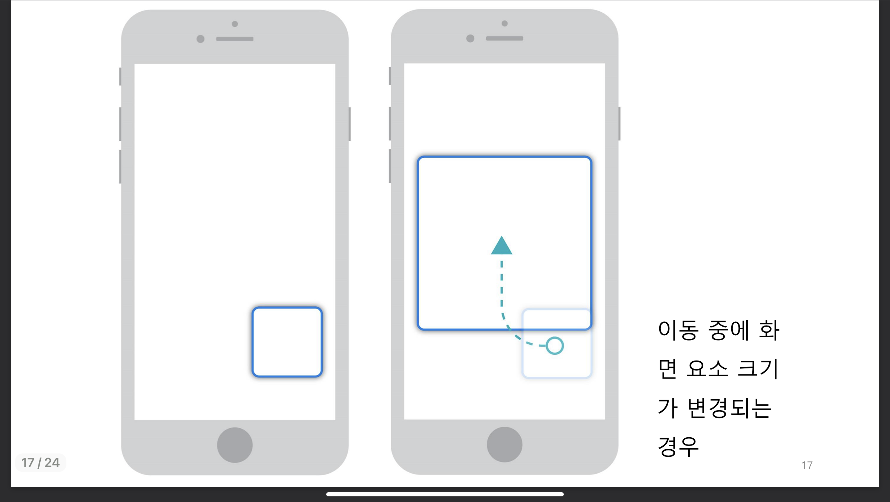

#### 타이밍
- 복잡하게 이루어지는 `화면 요소 전환의 경우 체계적이지 못하거나, 자연스럽지 못하다면`, 사용자가 `산만해지고 혼란을 야기`
- 실 생활의 물리학이 `디지털 세계에도 적용`되기를 기대함
- 예) 새로운 요소가 들어 오기 이전에 공간이 존재하여야 가능할 것으로 기대, 충돌 검사를 통해 구현 필요.
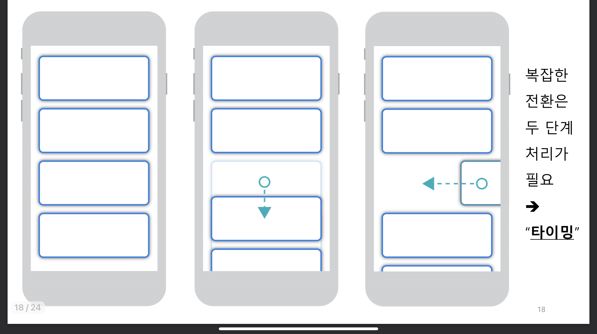
- 예) 사용자의 자극에 대하여 지연 시간 없이 즉시 반응하기를 기대

#### 지속 시간
- `전환 속도` - 모바일 폰에서는 대다수의 사용자에게 `적절한 평균 속도를 0.2~0.5초` 설정
- 짧은 거리 이동 0.2초, 여러 단계 & 긴 거리 0.5초
- `사용자의 특성 (예, 나이)에 의존` 하므로, 조사하고 고려하여 설정
- `접근성(Accessibility)` 설정으로 조정 가능
    - 나이가 많기 때문에 1초 정도로 설정할 수 있도록 옵션으로 줘야 한다.
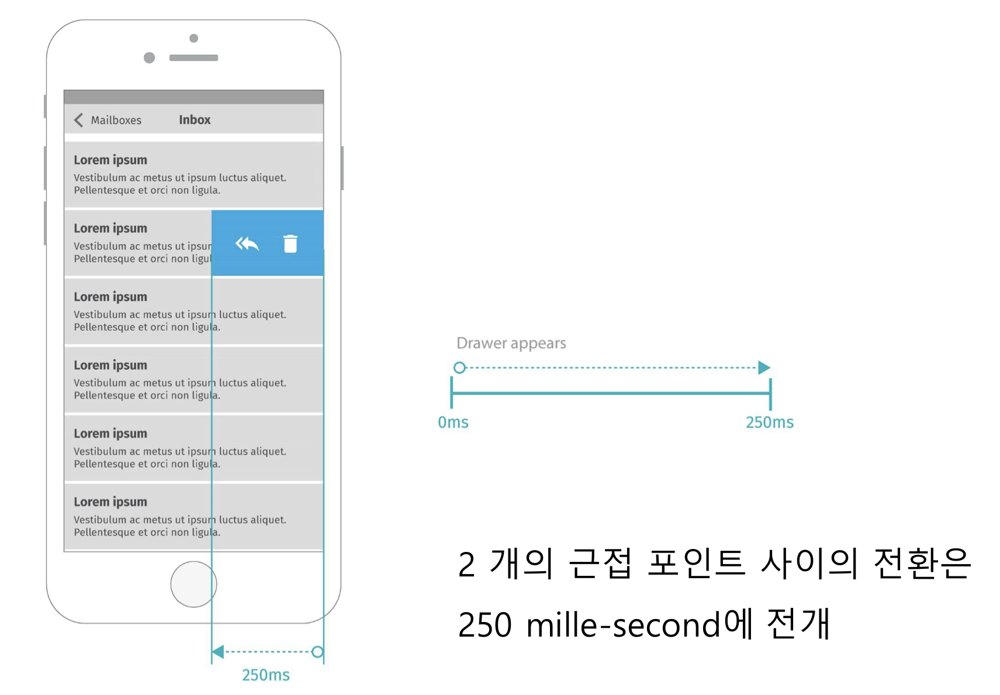
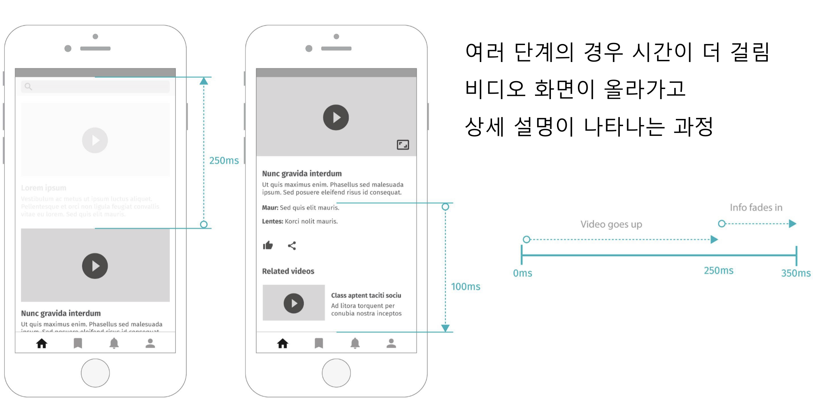

#### 속도
- `실 생활에서 사물의 이동 방식은 다양`하므로 (예, 일정 속도, 일정한 가속도, 변화되는 속도, 등), `디지털 요소들도 상황에 따라 다양한 이동 속도`를 가지는 것이 자연스러움. `디지털 세상 고유한 움직임`도 존재.
    - 일정한 속도 변화(`선형적`)
    - 처음에는 속도가 느리지만, 기하급수적으로 속도 증가(`Ease In`)
    - 속도가 처음에 빠르다가, 끝에서 속도가 느린 (`Ease Out`)
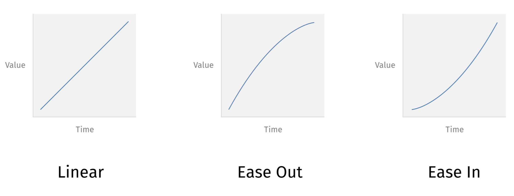

## 와이어프레임 Summary

### `와이어 프레임 단계에서 UI에 대한 속도, 지속시간 등 까지 고려하여 화면에 대한 세부설계를 한다.`

---
---

## 내용
1. 개요
2. 와이어프레임(Wireframe) 이해
3. 기능 스펙 문서로서의 와이어프레임
4. `목업(Mock-up)`
5. `실용적 진행`

## 2부 목업 (Mock-up)

## 4. 목업 (Mock-up)
- `제품 최종 "디자인"의 모형` - 실제 제품의 느낌을 가지고 미리 테스트하는 모형으로 와이어프레임(세부설계) 다음 디자인 최종 단계(`GUI 설계`)
- `와이어프레임`에서 기술한 것과 `동일한 기능을 구체적으로 표현` - `기능이 작동 가능함을 보이는` 적절한 `시각적 특성`과 `행동 유도성` 제공
- 시각화 및 해당 기능성의 명확한 표현 - `사용자의 이해`가 쉽도록
- 구성 요소의 체계, 작동하는 요소와 정지 상태로 고정된 콘텐츠 구분
- 색상 표현, 제목이나 텍스트의 속성 및 치수를 설명

> 이처럼 목업에서는 최종적인 디자인을 수행

### 디자인 테스트
- 개발 이전에 제품을 표현하여 `실제 콘텐츠를 사용한 테스트` 실시 가능
- 실제 `콘텐츠를 활용`하여 `현실감 넘치는 테스트` 가능
- 콘텐츠 활용이 어려우면 `다른 수단으로 시뮬레이션 가능`하도록
- 화면 디자인 및 UI흐름 디자인을 미리 검토하여 `실제 개발 (코딩 작업) 이전의 수정 보완`하게 되면 `비용, 노력과 시간이 크게 절감` 가능

### 다양한 화면을 위한 스펙과 에셋
- 완벽한 `Spec 작성`을 위해 `목업`과 `와이어프레임`을 `상호보완적`으로 사용
- `객체와 텍스트` : 색상, 사이즈, 폰트, 정렬, 등의 속성 정의 필요
- `객체와의 상호작용` 과정에서의 다양한 상태 규정 필요
- `스타일 가이드` 참고 - 특정 플랫폼이나 조직에 사용 중인 ㅣㅈ침서 
    - 예) 건국대 - KU UI & Communication Mark
- `모바일 기기의 다양성`에 따라 `크기 및 해상도` 조정 필요

### 벡터 그래픽스 VS 비트맵 방식
- 이미지를 `점과 점을 연결하는 직선과 곡선`으로 평면 상에 표현하여 `다각형이나 복잡한 모양`으로 나타내는 방식
- 다양한 벡터 형식을 사용하여 `다양한 밀도`에서 단일 `에셋`을 표현하는 경우에도, `적절하게 크기가 조정`됨
- SVG (Scalable Vector Graphics)
- PDF (Portable Document Format)
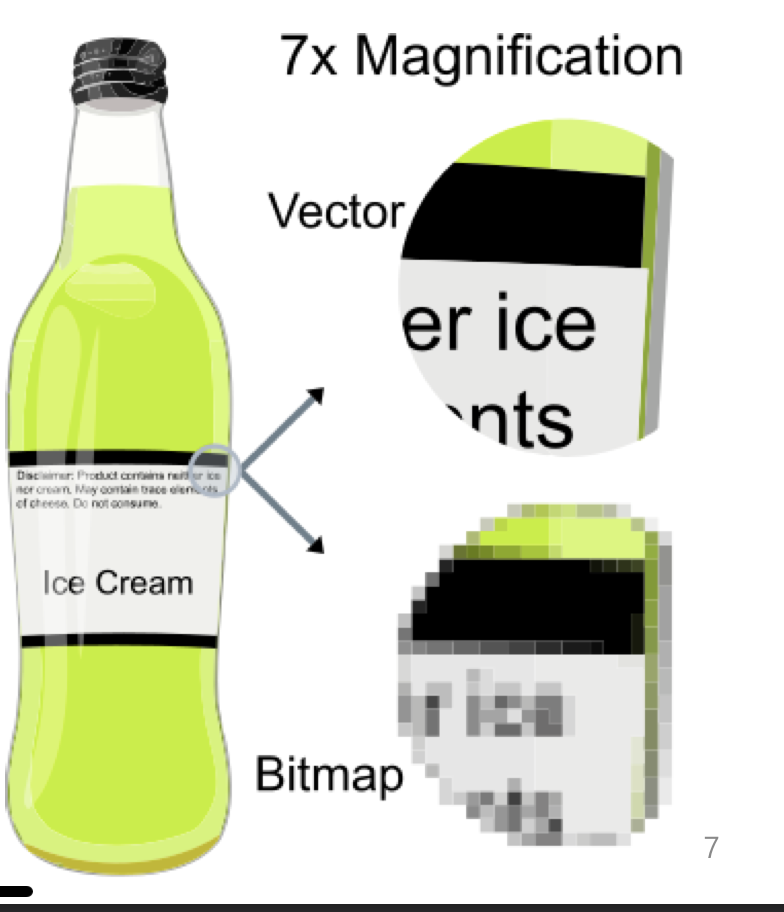

### Unit & Pixel 밀도 (1)
- `픽셀`은 위치, 색상을 저장 가능한 `화면 위의 최소 물체`
- 픽셀 기준으로 `에셋(Asset)을 정의`하면, 아이콘과 구성요소는 스크린 특성 (`픽셀 밀도, 해상도, 인치 당 픽셀 수`)에 따라 `크기가 다르게 표현`됨
- 하나의 픽셀이 표현하는 기기의 해상도에 따라 다른 물리적 크기로 나타나게 되면 (예, dpi (dot per inch)로 길이를 정의하면 화면 해상도에 따라 크기가 다르게 표현됨) 혼란이 발생하므로, `장치 독립적` 혹은 `밀도 독립적인` 픽셀 - 즉 논리적인 픽셀 단위(`"dp"`)를 사용한다.
### Unit & Pixel 밀도 (2)
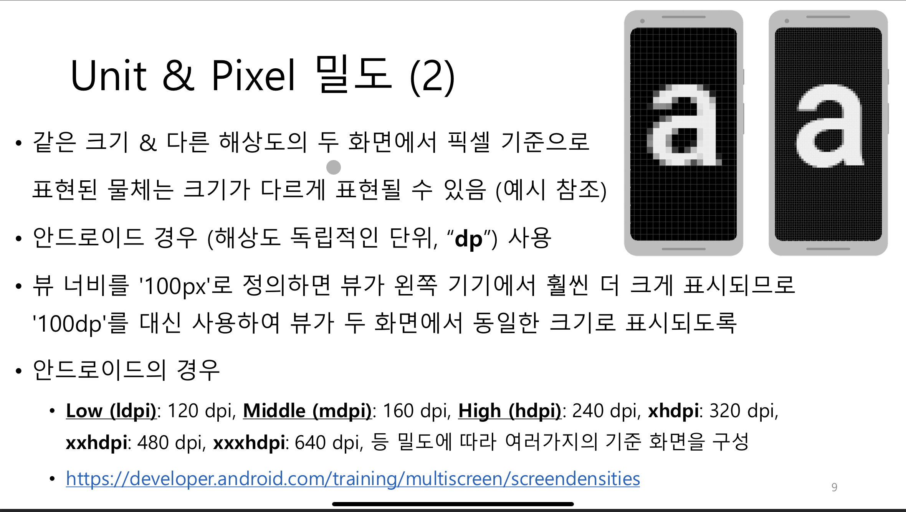
> 안드로이드와 IOS는 다른 픽셀 단위를 사용
>> 안드로이드는 밀도에 따라 여러가지의 기준 화면을 구성

#### Dp 단위를 픽셀 단위로 변환
- 일부 경우 크기를 dp 단위로 표시한 후 이를 픽셀로 다음과 같이 변환
- px  = dp * (dpi / 160) - 기준 화면의 경우 (mdpi - Middle - 160dpi)
- 앱에서 사용자 손가락이 16픽셀 이상 이동하면 스크롤 같은 동작이 인식된다고 가정.
- 중밀도 화면에서는 손가락을 16 pixels / 160 dpi (2.5mm 또는 1/10인치와 같음)만큼 이동해야 동작이 인식.
- 고밀도 화면 (240dpi)을 사용하는 기기에서는 사용자가 손가락을 16 pixels / 240 dpi (1.7mm 또는 1/15인치와 같음) 만큼 이동해야 하므로, 거리가 훨씬 더 짧아지므로 앱이 사용자에게 더 민감해 보임.
> `밀도가 높아질 수록 사용자가 손가락을 짧게 움직여도 반응을 해주기 때문에 장치가 예민하고 민감해진다.`

### Unit & Pixel 밀도 (3)
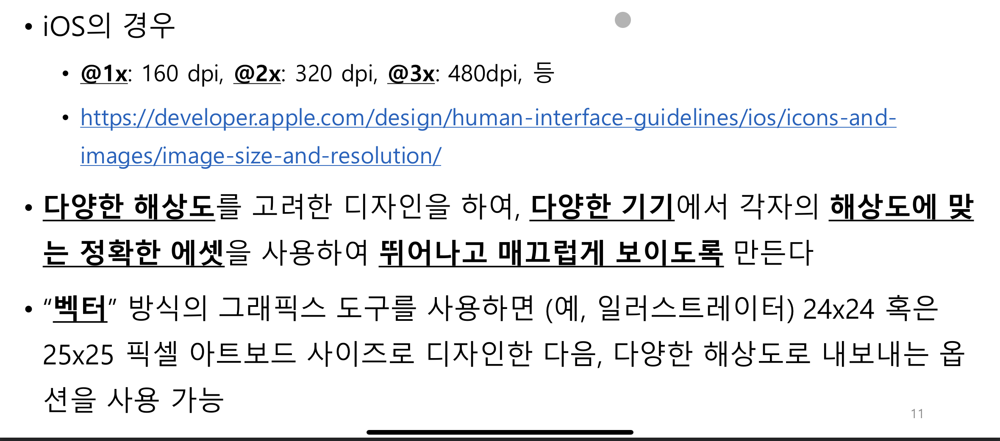
> 기기에 따라 다양한 해상도를 고려하여 디자인 하면 됨.
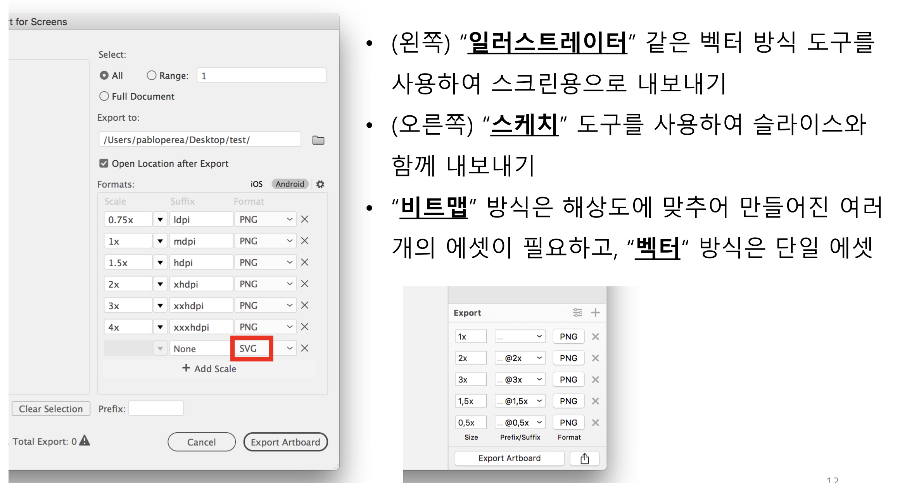

### Unit & Pixel 밀도 (4)
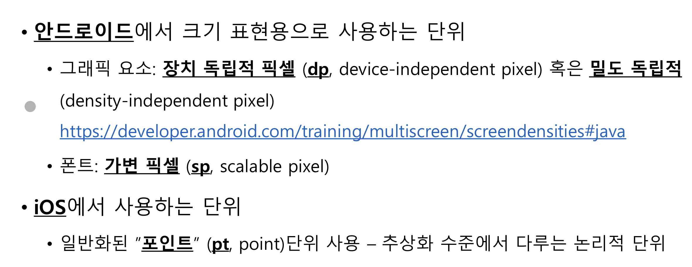

### 설명 예제
- `안드로이드` 48dp 크기 (장치 독립적인 논리 단위)의 버튼이라면, 중간해상도 화면 (mdpi, 160 dpi) 스크린에서는 48픽셀 (px) 크기를 가지고, 초고해상도 화면 (xhdpi, 320 dpi) 스크린에서는 96 픽셀 (px) 크기를 가짐
- `애플 IOS`에서 44포인트(pt) 크기의 버튼은, @2x 스크린에서는 88 픽셀 (px), @3x 스크린에서는 132 픽셀 (px)크기로 표현됨
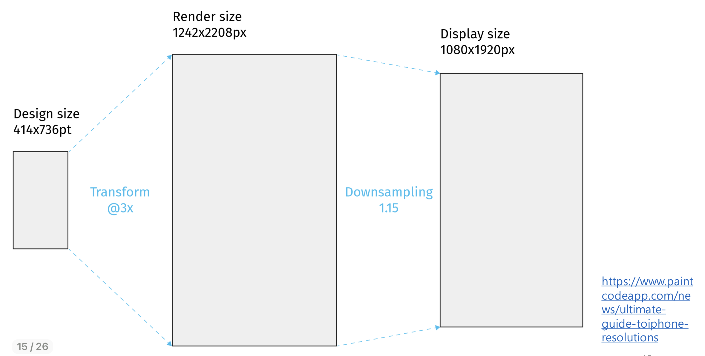
> 픽셀에 대한 원리 이해만 하면 나머지는 툴이 해주기 때문에 원리에 대한 이해가 필요하다.

### 스펙 파일
- 디자인에서 `스펙 생성`시키는 다양한 플러그인 사용
- 기존의 제품 ("일러스트레이터", "스케치", "포토샵", 등) 제공하는 솔루션 사용 가능
- 무료 플러그인 존재
    - [Sketch Measure](https://utom.design/measure.html)
    - [github](https://github.com/utom/sketch-measure)
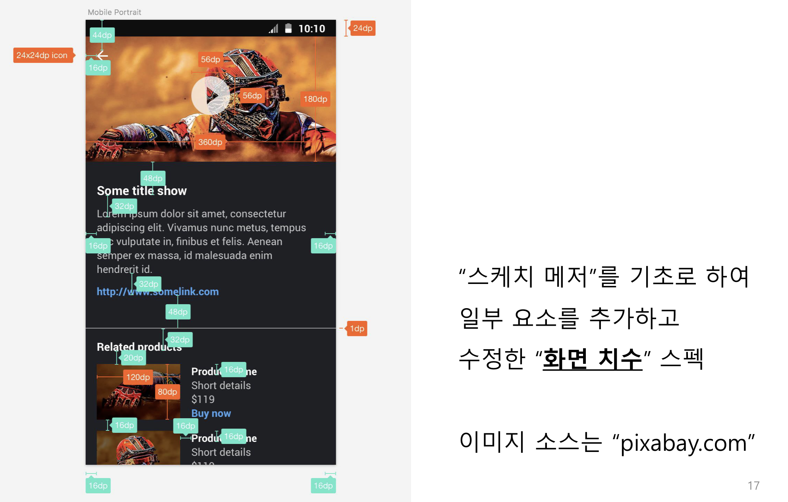
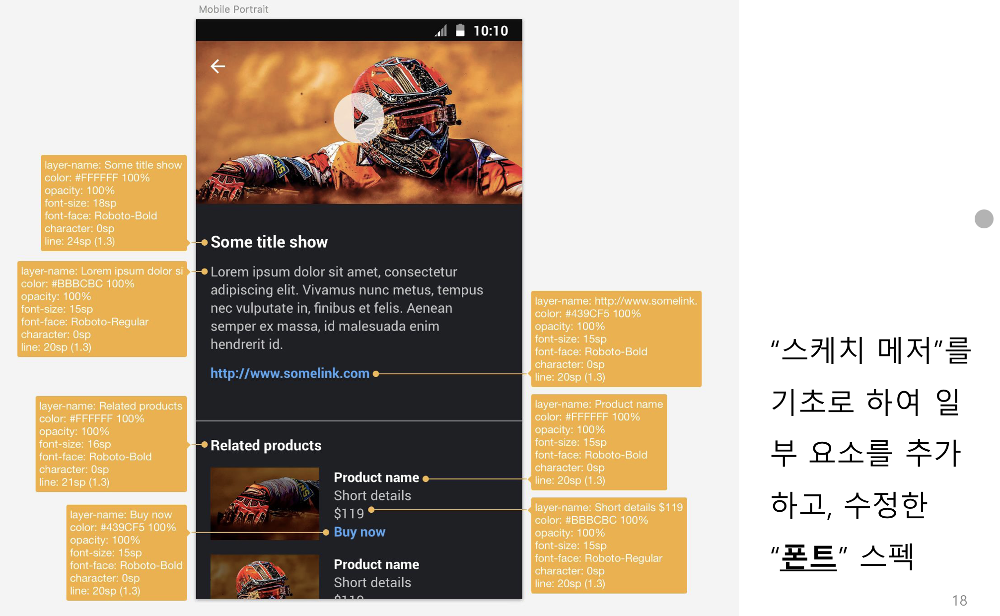
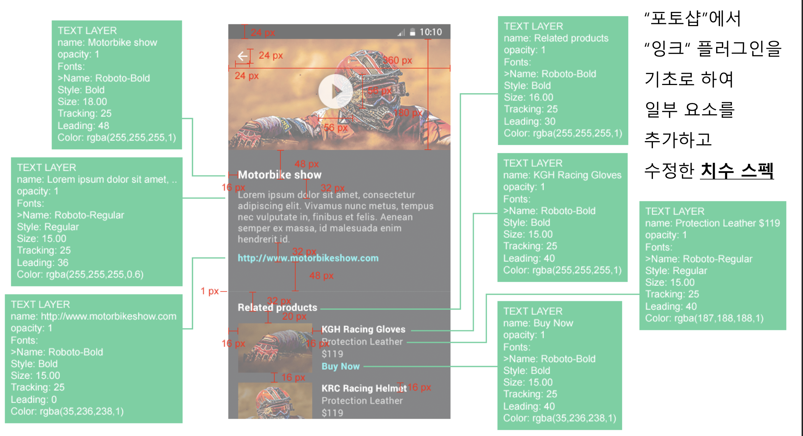

> [제플린](https://zeplin.io/) 사용

### 터치 타겟 (Touch Target)
- 사용자가 동작 수행을 위하여 터치하는 스크린의 영역 : 7 - 10mm
- `권고 최소 사이즈` 
    - `안드로이드` : 48dp * 48dp
    - `ios` : 44pt * 44pt
    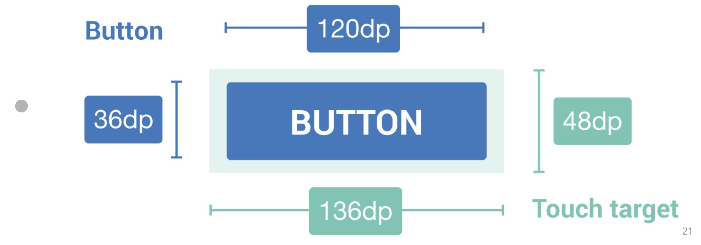

### 이미지 해상도
- 이미지 표현 : `Vector` 방식 혹은 `Bit Map` 방식
- 비트맵 (혹은 `Raster`) 방식은 확대될 경우, 아래의 가운데 그림 처럼 흐려짐 -> PNG (Portable Network Graphics), JPEG, JPG, GIF, 등
- `다양한 해상도`에 맞게 `조정된 에셋`을 `여러 개 제공`해야 함
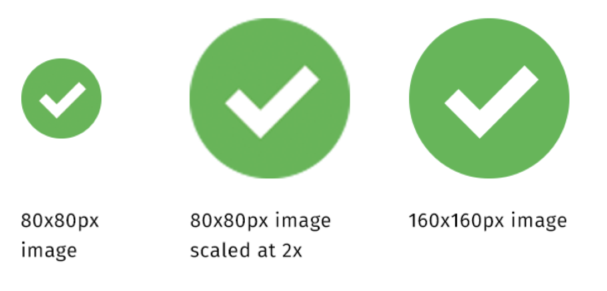
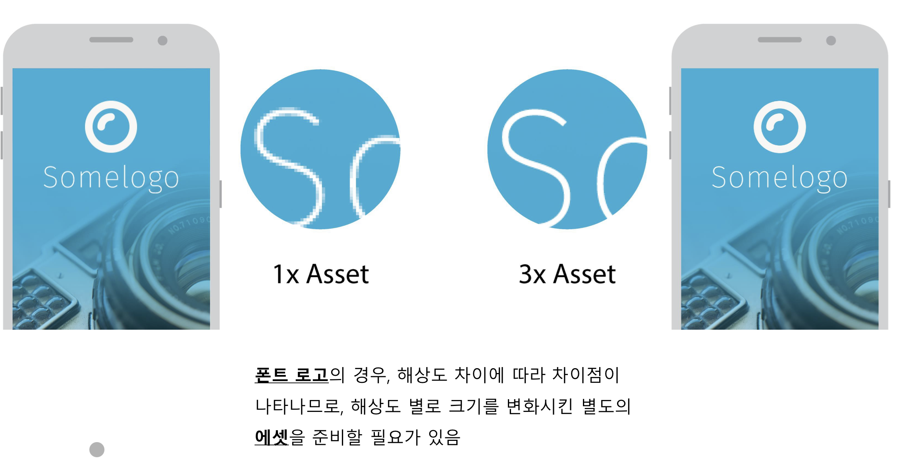
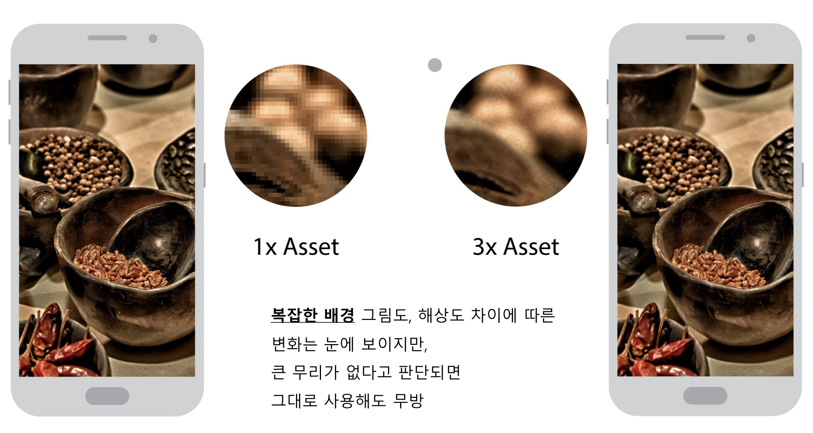

## 5. 실용적 진행
- 개발팀과 디자인팀 `상호간의 소통`이 매우 중요
- `서로 다른 관점에서 접근`하는 경우, 어려운 문제를 쉽게 풀 수 있는 길이 열린다.
- `스펙`에 관하여 전체 프로젝트 팀 구성원들이 `하나의 같은 언어로 이야기`할 수 있도록 하여야 함

