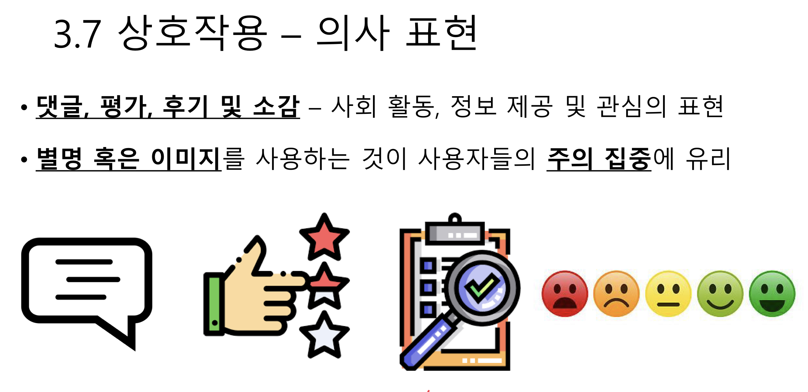
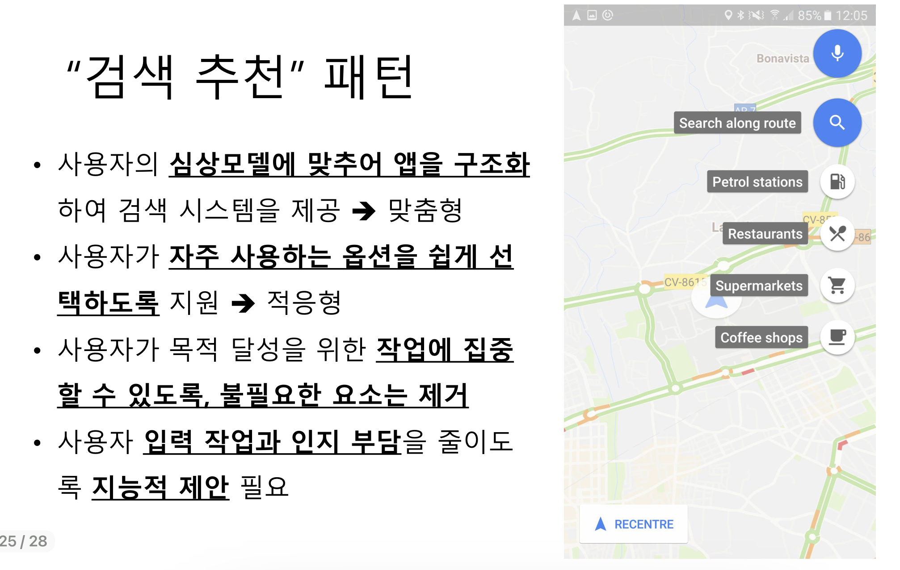

# 제 8강- 모바일 패턴

## 모바일 UX 디자인의 기본
1. 사용자 리서치 (User Research) - 니즈 & 동기
2. 아이디어 탐구 (Ideation) - 스케치
3. `모바일 패턴 (Mobile Pattern) - 웹, 안드로이드, IOS 우수 사례 - 사용자의 기본 기대 만족`
4. 솔루션 (Solution) - Wireframe & Mock-up
5. 프로토타이핑 (Prototyping) - 시뮬레이션
6. 사용자 테스팅 (User Testing) - Usability

## 내용(part 1)
1. `개요`
2. `웹앱 디자인 기법 - 반응형, 유동형, 적응형`
3. 모바일 앱 디자인 패턴
    - 내비게이션 외 다수의 디자인 패턴

## 1. 개요
- `데스크탑과 모바일 폰`
    - Phono-Sapiens: 스마트폰이 몸과 마음의 일부가 된 신인류
    - 모바일폰을 통하여 인터넷 접속하는 사용자가 점점 많아짐
    - 화면 크기 축소, 터치스크린 기반, 음성 인식 활용, 등 고려 사항
    - 모바일폰은 항상 사용자 곁에 있으며, 여러 종류의 센서를 보유하므로, 위치 기반 서비스, 이동 간 서비스, 편안한 상황에서 필요한 서비스, 등을 고려 가능
- `상호작용` 방식, 사용자 `인터페이스 구성` 및 `콘텐츠 표현` 방식 차이 고려

### 핵심 팩트
- 디지털 미디어 소비의 25% -> 모바일 기기를 통한 소셜미디어
- 2022년 전세계 스마트폰 서비스 가입 65억 돌파.

### 모바일 사용자에 대한 접근 방식
- `웹(Web)` 접근 방식
    - 다양한 플랫폼 사용자를 목표로 접근 (OS, 브라우저 및 장비의 다양성)
    - 브라우저 제어용 공간이 필요하므로, 콘텐츠를 위한 공간이 축소됨
- `앱(App)` 접근 방식
    - 모바일폰 직접 사용하는 장점이 있으나, 설치와 관리에 번거로움 존재
    - 한번 앱을 설치하기도 어렵고 자주 바꾸거나 추가하지 않는 경향 존재
- `프로그레시브 웹앱 (PWA, Progressive Web App)` : 검색 엔진에도 노출되는 웹과, 장치의 기능을 충분히 활용하는 네이티브 앱의 장점 활용
    - 기존의 `모바일 앱 단점 극복` - 사용자들에게 `노출되기 좋고 찾기 쉬우며 설치` 불필요, 앱 로딩 속도도 빠르고, 오프라인에서도 실행 가능
    - 개발과정에서 `다양한 기기와 브라우저에 맞추어야 하는 어려움`과 `사용가능한 기능에 제한이 존재`하며 구글이나 페이스북 이용한 로그인 불가
    
    

## 2.1 웹앱 디자인 기법 - `반응형`
- 다양한 스크린 크기에 맞추어 웹 페이지 조정하기
- `반응형`: `(Responsive)` CSS의 `미디어 쿼리` 사용하여, 구성 요소 위치 & 크기 관리
- 640 픽셀 이하 스크린 폭에서는 콘텐츠가 스크린을 100% 곽 차게 하고, 1024픽셀 이상의 스크린에서는 콘텐츠 80% 되도록 줄여서 좁게 만든다.

## 2.2 웹앱 디자인 기법 - `유동형`
- 스크린 구성 요소(즉, 콘텐츠)의 `크기를 비율("%")로 정의`
- 콘텐츠가 `큰 화면에서 점유한 비율이 작은 화면에서도 유지 & 적용됨`
- `간단한 디자인의` 화면의 경우 `유동형` 방식이 유리
    - 예, 이메일 화면
- `복잡하게 디자인된 웹 페이지의 경우, "유동형" 접근 방식은 화면 크기 변경에 따라 조정하기 어려움`

## 2.3 웹앱 디자인 기법 - `적응형`
- 미디어 쿼리를 사용하여 사용자의 기기에 맞도록 `완전 변형` - `"Adaptive"`
- 사용자 `기기 성능에 따라 다른 콘텐츠를 제공하는 편이 유리`할 때 사용
- 예) 데스크탑 사용자에게는 복잡하고 상세한 정보 제공하고, 모바일폰 사용자에게는 간략한 요약 정보 제공하는 `보험 앱`
- 예) 모바일폰 사용자는 실시간 이동 정보 및 날씨 등을 제공하고 데스크탑에서는 종합적인 정보와 통계를 제공하는 `운동 모니터링 앱`

## 2.4 웹앱 디자인 기법 - `하이브리드 (혼합)`
- 다수의 기업에서는 각 디자인 기법의 장접을 활용하는 혼합된 `하이브리드(Hybrid) 전략` 사용
- 기능성이 필수적인 경우에는 `적응형`을 사용 - 접속하는 사용자의 기기 특성과 제약을 활용
- 기능성이 필수가 아닌, 일반적 경우에는 `반응형` 이나 `유동형`같이, 유연한 디자인 기법 사용 

## "Front-end" Framework
- 대상 디바이스 특성에 따라 크기, 모양, 레이아웃, 등 조정
- 가장 널리 사용되는 솔루션은 `반응형 접근법을 지원`하는 프레임워크
- `HTML & CSS` 프레임워크 및 `표준(W3C)`

 

1. [Zurb Foundation](https://get.foundation/)
2. [BootStrap](https://getbootstrap.com)
3. [CSS Flexbox](https://www.w3schools.com/css/css3_flexbox.asp)
4. [CSS Grid](https://www.w3schools.com/css/css_grid.asp)

## 세로열 디자인
- `12열 디자인` - 콘텐츠를 스크린에 펼쳐 놓고 웹앱에 접속하는데 사용되는 기기의 스크린 크기에 맞추어 조정하는 작업 지원
- `데스크탑용 디자인`과 `모바일용 디자인` 사이에 전환
- `사용성`과 `가독성`을 확보하기 위하여 조정 필요
- 예) Zurb Foundation 이메일 & 구글의 지메일도 `미디어 쿼리` 지원
    - 데스크탑과 모바일에서 이메일을 `매끄럽게` 사용할 수 있도록 지원

---
---

## 내용(part 2)
1. 개요
2. 웹앱 디자인 기법 - 반응형, 유동형, 적응형
3. `모바일 앱 디자인 패턴`
    - `내비게이션 외 다수의 디자인 패턴`

## 3.1 사용자 동작 감지 (가로 세로 스크린 감지)
- 가로 방향과 세로 방향 스크린 보기와 상호작용 진행
- `사용자의 동작을 감지`하여 보기 형식 전환 가능- > 스마트폰 특성 반영
- 응용 분야의 특성에 따라 선택
    - 예, 게임, 비디오, 사진, 이메일, 문서 작성, 등 다양한 콘텐츠 특성에 따라 가로/세로 보기 결정
- 세로 모드

- 가로 모드

## 3.2 플로팅 버튼 (FAB, Floating Action Button)
- `기능 강조`를 위하여 `스크린의 다른 UI 요소 위에 사용`
- 스크린의 여러 영역에서 표시 가능
    - 예, 동영상 재생 버튼, 지도 길찾기, 현위치 등
- 엄지손가락 터치를 위하여 하단에 주로 표시
- 기본 내비게이션 메뉴가 상단에 위치하여 사용자가 다음 동작 취하기가 어려울 때 주로 사용
- `사용자의 시선`을 사로잡을 수 있어야 하며, `행동유도성` 우수해야 함

## 3.3 "알림" 기능
- `새로운 알림을 시각적으로 표현`하여 `사용자의 관심 끌기`
- 지나치면 사용자를 방해하여 짜증나게 할 수 있으니 조심할 것
- 움직임, 반짝거림, 강한 색상, 등으로 시선 끌기
- `동그라미` 힌트 - 무언가 변화가 생긴 것을 알려줌
- `뱃지` 앱 아이콘으로 동그라미 속에 숫자 표현

## 3.4 대화상자 패턴

## 3.5 썸네일 (Thumbnail) 패턴

## 3.6 화살표
- "위아래" 화살표는 "스크롤"용으로 사용
- ios에서는 "우측 방향" 화살표를 메뉴 옵션에서 하위 메뉴로 이동하는 과정에 사용

## 3.7 상호작용 
- 참여

- 의사 표현

## 3.8 `"에러" 처리`
- 에러 `발생 방지`를 목표로 하지만, 사용자 혹은 시스템에서 문제 발생 가능성 항상 존재 -> 감지, 정보 제공, 원상 복구, 재발 방지, 등 조치
- 만약 에러가 발생하면 사용자에게 상황을 정확하게 알려서 `문제 해결에 필요한 정보를 제공`해야 함
- 최대한 인간 중심적으로 다루어서 사용자들에게 `부정적인 상황을 최소화하고, 편안하고 즐거운 경험으로 전환`할 수 있도록 노력

### 에러 메시지 만들기
- 사용자가 `알아 듣기 쉽게 설명하기` - 전문 용어, 기술적 용어 회피
- 에러의 `심각성에 비례하는 언어`를 사용하기 - 메시지는 사용자의 에러 수준 인지에 영향을 주는 것이므로 적절한 수준의 언어 상요할 것
- 가급적 `방해를 줄이기` - 에러가 발생해도 사용할 수 있는 기능은 보전
- 가능하다면 `솔루션 제공`하기 - 사용자의 에러 해결 활동 지원
- 사용자가 `찾아 보거나 취소할 수 있게` 허용하기 - 시급하게 해결되지 않아도 되는 에러는 나중에 사용자가 필요 정보를 찾아서 해결 가능하도록 지원. 그 동안의 사용 이력 및 내비게이션 기록을 보존하여 에러 해결에 사용할 수 있도록 지원.

## 3.9 Overlay Tip
- 새로운 기능 설명을 위하여 `적절한 타이밍에 도움말 메시지` 혹은 `유용한 정보` 제공하여 사용자가 길을 잃는 것을 방지
- 최근 추가된 새로운 기능 설명
- 사용자가 처음 사용하는 기능 설명
- 현재 작업 화면 위에 표현되므로 남용/오용 금지

### Roadblock

### 콘텐츠 내부 메시지

### 콘텐츠 상단 메시지 표시

## 3.10 모바일 디자인 행동 패턴
- `사용자의 행동 혹은 사고 패턴을 파악하여` 디자인 함으로써, `프로세스 최적화`하거나, `UX를 더욱 효과적`으로 `조정`
- 사용자 `행동과 사고`에 대하여 이해하고 `자주 사용하는 인터페이스`에 대하여 이해한 후에 `행동 패턴을 디자인`
- 상호작용 방식, 절차, 타이밍, 수준 및 지원 방식을 디자인

### "기능 노출" 패턴
- 앱의 기능을 노출하는 과정에서, `사용자의 전문성 및 경험을 고려`
- 전문성이 낮거나 경험이 적은 `초보 사용자`들에게는 `단순화`된 버전
- `고급 사용자`들에게는 `다양하고 복잡한 기능 세트`를 제공
- 초보 사용자들이 경험을 축적하면서 `고급 사용자로 발전`하고, 그 수준에 따라 `필요한 기능을 추가 제공`

### "사용자 등록" 패턴
- 앱 사용자에게 `"등록 필수" 조건을 강요하지 않음`
- 사용자가 앱과 마주하는 `최초의 몇 초 시간이 매우 중요하므로`, 사용자에게 장애가 될 만한 `무리한 요구를 하면 전환율 하락 가능성 상승`
- `유연한 사용자 등록 방식`으로, `익명의 사용자에게도 서비스 제공`
- 꼭 필요한 경우, 예를들어 사용자가 플랫폼과 상호작용을 원할 떄, 등록 강요
- 등록 사용자가 많을수록 앱의 가치와 리뷰의 신뢰성이 제고되지만, 단순 피드백 수준인 "좋아요" 정도의 익명 사용자도 가능하도록 디자인

### "리프레시(Refresh)" 패턴

### "검색 추천" 패턴

### "상호성" 효과 활용
- `인간의 본성`이 `상호작용 과정`에서 드러남 ("Give and Take")
- 누군가에게 `은혜를 입으면, 반드시 보답`을 하는 심성
- 가상세계이지만, 플랫폼이 사용자에게 무언가 `혜택이나 이익을 주는 경우 사용자는 보답하려는 심리를 가지게 됨`
- `사용자에게 무언가 부탁하려면, 이전에 혜택을 제공`
    - `예, 좋은 음식점을 추천해 주면, 사용자는 충실한 리뷰를 남기려고 노력`

## 디자인 지침 : 안드로이드 vs IOS
- 모바일 기기의 양대 산맥
- Look & Feel - UX의 근본적인 차이를 만들어 냄
- [Android](https://material.io/design)
- [Apple](https://developer.apple.com/kr/design/)