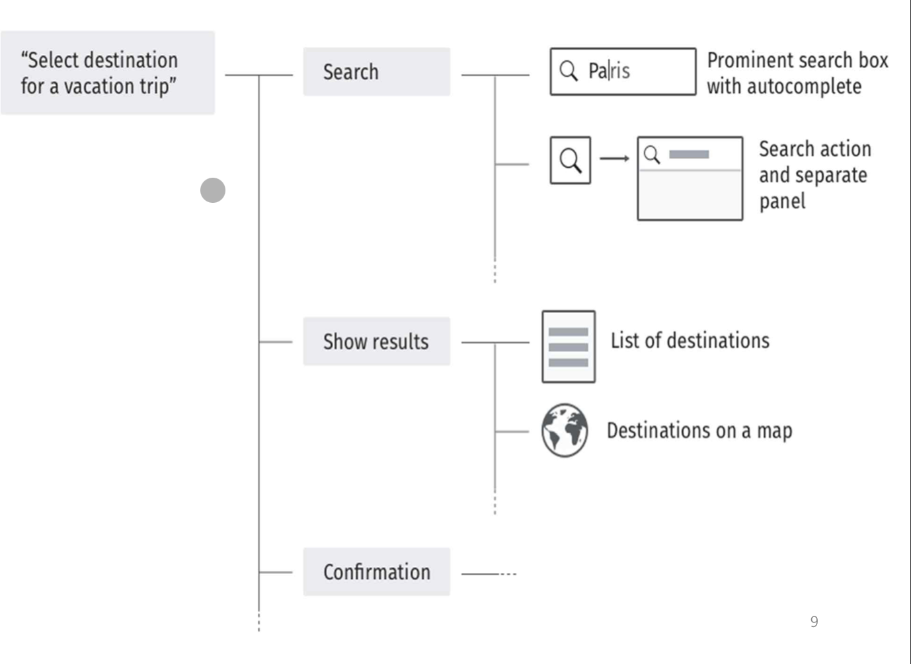
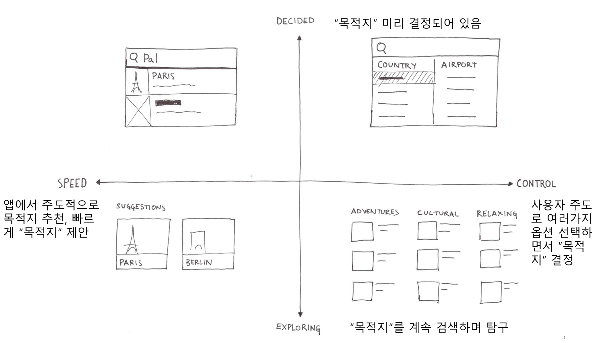
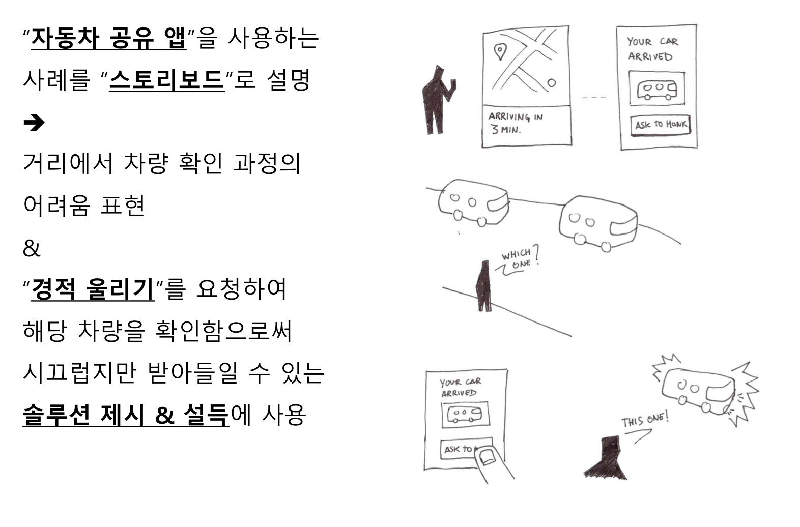
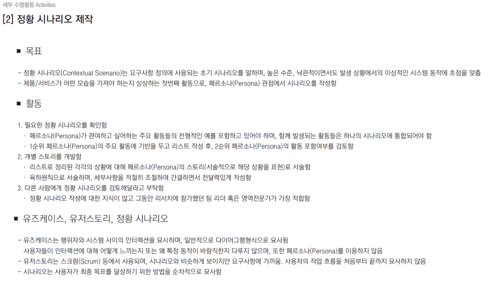
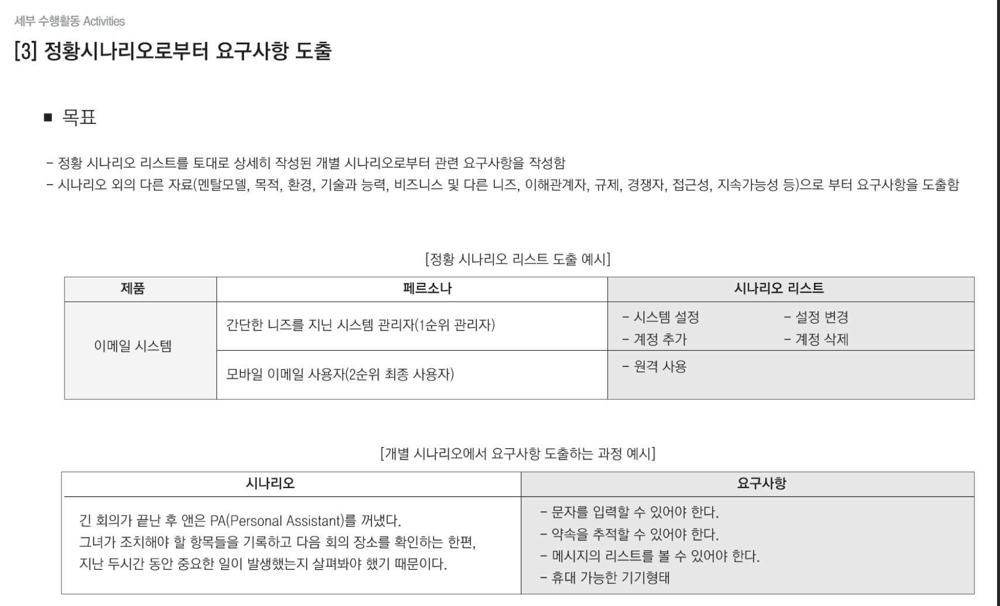

# 제 3강- 아이디어 탐구하기

## 모바일 UX 디자인의 기본
1. 사용자 리서치 (User Research) - 니즈 & 동기
2. `아이디어 탐구 (Ideation) - 스케치`
3. 모바일 패턴 (Mobile Pattern) - 웹, 안드로이드, IOS 우수 사례 - 사용자의 기본 기대 만족
4. 솔루션 (Solution) - Wireframe & Mock-up
5. 프로토타이핑 (Prototyping) - 시뮬레이션
6. 사용자 테스팅 (User Testing) - Usability

## 1부

> 사용자의 니즈 충족을 위한 다양한 솔루션을 탐구하여, 새로운 솔루션 창조와 기존 솔루션 변형의 과정을 통해 혁신적 솔루션 찾기

### 내용
1. `"아이디어 탐구" 개념`
2. 신속하게 결과물 만들기
3. 탐구 체계화하기
4. 아이디어 커뮤니케이션
5. 실용적 접근

### 1. 아이디어 탐구
- `Design Space`(디자인 공간) : 문제 해결이 가능한 모든 솔루션들의 집합
- 최적의 솔루션을 찾아서 디자인 공간을 항해하는 것이 디자이너의 역할
- 디자인 공간을 `체계적으로` `신속하게` 탐색할 것.
    - 체계적 : 좋은 솔루션을 위한 `효과적인` 탐색
    - 신속하게 : 가능한 많은 옵션 탐구, 시간과 자원을 잘 분배한 `효율적` 탐색

    ####  아이디어 탐구 방법
    - `Ideation` - 디자인 아이디어 찾기
        - 적극적, 창의적, 협력적 으로 fast moving
        - 압력 밥솥 기법 (주어진 시간 내에 계속 도출) 
        - 반복적인 작업
        - review and judgment필요 
        - one team spirit 기반의 작업
        - So-creative, Time-boxed, Facilitated `(must-haves)`
        - 방법
            1. `Brainstorming`
            2. `Worst Possible Ideas`(최악의 아이디어를 도출하여 최악의 상황을 피함)
            3. `Mind` Map (Centural concept를 가운데 두고 가지치기) (FreeMind - Mind Mapping을 위한 자주 쓰이는 도구)
    - `Sketching` - 디자인 아이디어 구체화
        - `아이디어를 시각화` 하는 것이 유용함
        - 추상적인 아이디어를 좀 더 `구체적인 형태로 표현` (개념의 대략적 표현)
        - 내가 생각하고 있는 아이디어를 `대략적으로 그림`
        - `반복적으로 수행`되며 `팀 프로젝트 효율적`
        - 아이디어를 찾을 때는 `질`보다는 `양`이 중요하다.
        - 아이디어의 `본질 표현, 단순성과 명확성`에 초점
        - 정확하거나 완벽할 필요는 없다 - 손쉽게 표현하여, 아이디어 검증
        

---
## 2부

### 내용
1. "아이디어 탐구" 개념
2. `신속하게 결과물 만들기`
3. `탐구 체계화하기`
4. `아이디어 커뮤니케이션`
5. `실용적 접근`

### 2. 신속하게 결과물 만들기
- `초점` 맞추기
    - 명확하게, 아이디어의 핵심 요소와 관련 컨텍스트를 덧붙여주는 요소에 집중할 것
        - `"문제 정의서"` 작성 - 개방형 질문으로 표현 - 예) 휴가 여행지를 빨리 선택하려면 어떻게 해야 할까 ?
        - `"사용자 시나리오"` 작성 - 문제가 관련된 컨텍스트를 설명
        - `"디자인 목표"` 작성 - 사용자 니즈를 만족하는 솔루션을 찾기 위한 솔루션의 기본 속성 결정 - 예) "신속하게 조작하기"
    - 스케치 레벨 결정 
        - 구체화 수준을 결정해야 빨리 스케치할 수 있음
        - `동일 아이디어도 스케치 구체화 수준이 다름`
- `시간` 관리하기
    - 시간 관리 기법 - "Crazy Eights" (종이를 접어 8칸으로 만든 후에, 5분 동안 8개의 스케치를 하는 기법)
    - `방식의 탐구는 제한된 시간으로 정확도 및 완성도는 떨어질 수 밖에 없으나, 신속하게 아이디어 도출 결과물을 만들기에 유리`

### 3. 탐구 체계화하기
 - `아이디어 탐구를 구조화`
 - 문제 분해하기 (Divide & conquer)
    - 복잡한 문제를 세부 단계로 분해
    - 단순한 문제부터 해결
    
    > vacation trip의 목적지를 search, show results, comfirmation으로 나누어 해결
- 충돌 요소 파악하기
    - `가능성 있는 솔루션들끼리 상호출동`하는 경우 발생
    - `충돌하는 요소들 사이에서, 주어진 니즈와 환경 및 조건을 고려하여, 균형을 잡아 적절한 솔루션 탐구`
    - 충돌 요소 사례 - 여행 예약 앱
        - `속도 vs 제어` (목적지 검색의 경우, 시스템 자동 추천 vs 사용자가 주도적으로 다양한 옵션을 선택하면서 제어하여 추천)
        - `결정하기 vs 탐색하기` (이미 결정된 리스트를 가지고 원하는 장소 선택 vs 미정인 상태에서 계속 목적지를 찾으면서 여행)
        

### 4. 아이디어 커뮤니케이션
- `아이디어를 구체적으로` 표현하여, 이해당사자들 `오해를 축소`
- 스케치된 아이디어를 사용하여 커뮤니케이션 - `공유와 설득`
- `스토리보드`를 통해 아이디어를 효과적으로 표현

    - `Powerful tool for delivering information`
        1. Visualization - Pictures are worth a thousand words.
        2. Memorability - make a story
        3. Empathy - 스토리에 있는 캐릭터에 감정 이입
        4. Engagement 
- `비평 세션`
    - 팀 내 다른 사람들의 `의견 수렴`을 위한 비평 세션은 필수
    - 대상 사용자의 `페르소나` 사용할 것 - 타켓 사용자에 대한 설명 및 `왜 이들에게 초점을 맞추어야 하는지 타당성 설명`
    - 해결하려는 문제 영역 및 해결 방식 `시나리오` 사용하여 설명할 것
    - `디자인 목표`를 명확하게 설명 - `솔루션으로 달성하려는 목표 설명`
    

### 5. 실용적 접근
- 스케치는 완성도 높은 `미적 완성품이 아니다.` -> `질 보단 양 아이디어`
- 디자인은 "창의적 영감"만을 다루는 것은 아니다. -> `여러개의 일련의 과정을 거쳐 디자인이 나오게 됨`
- "비평세션"에서 진행되는 대화를 디자인 목표와 연결 -> 참여자들의 피드백을 디자인 목표와 연계하여 이해하고 설명할 수 있도록 유도
- `Trade-off` 를 가시화
    - 참여자의 피드백과 제안은 특정 관점에 초점을 맞춘 경우, 상호충돌 발생 가능성이 있다.
    - `탐구 과정에서 이러한 모순이나 상호충돌을 발견하여, 드러내 놓고 토의하여 해결 방안 모색, 상반된 요소 사이에서 균형을 잡는 일이 중요`

---

## 3부 - 사용자 요구사항
- 사용자 중심 vs 기술 중심 (아이폰을 예로 들음)
- `"사용자를 만족 시켰냐 아니냐"에 대한 기준은 사용자의 요구사항이다.`
- How to get requirements ?
    1. 현재 상태를 파악
        - How to learn the current state? - Stakeholder interview & research
        - Heuristic Analysis - 현실적으로 이상적이고 완벽한 답을 얻는 것이 어려울때, 제한된 정보와 변수를 분석하여 `만족할 수준의 답`을 찾는 분석 법
    2. Gather `needs and ideas` from stakeholders and current and potential users
    3. Merge ideas into requirments
    4. `Prioritize` 우선순위를 매김
- How to Analyze ?
    1. 가능한 많이 찾아내서, 
    2. Heuristics를 찾아냄
    3. 우선순위를 매겨 꼭 해야되는 것 위주로 해결
    3. Present your findings to the project team and primary `stakeholders(이해당사자들)`
- How does it help ? 
    - 현재 상태의 이해
    - 아이디어의 리스트
- Gather ideas from Stakeholders
    - 회의 준비 잘해서 잘 얻어내면 됨
- Coalescing Requirements
    - `Collected된 아이디어들로부터 요구사항 통합하기 단계`
    - 버릴건 버리고 유용한 요구사항은 남김
- User Reasearch
    - 카드소팅, 트리 소팅등을 통해 사용자의 정보를 얻어냄
    - `가장 핵심적으로 진행되어야 함`
 
 ```
 Generate Requirements
  
    User requirements + Business requirements

 Then, prioritize them (모든 요구사항은 다 들어줄 수 없는 것이 현실)
 ```

 ### 지금까지 이론적인 이야기, 구체적인 방법 소개
 
 


    