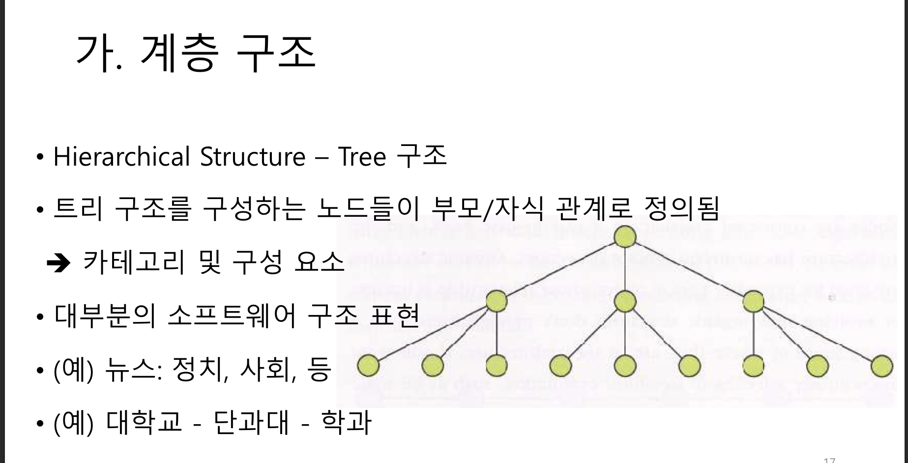
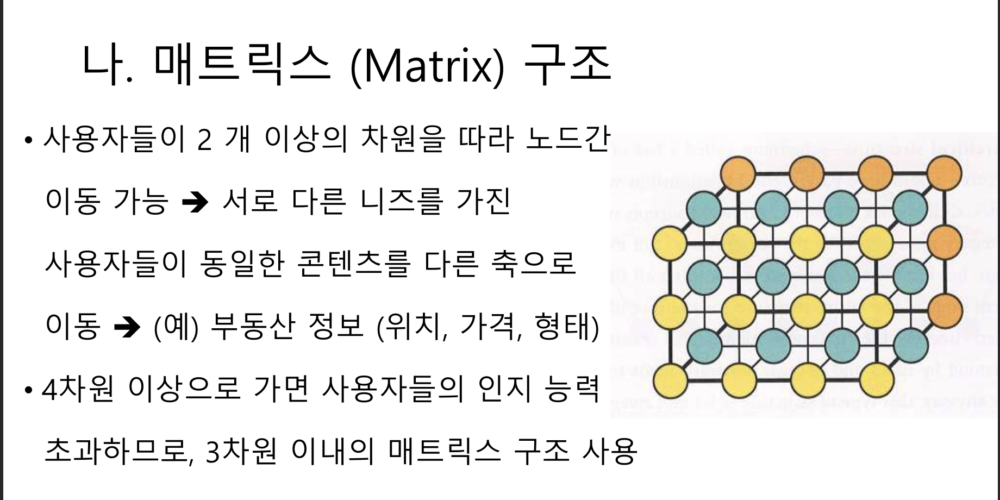
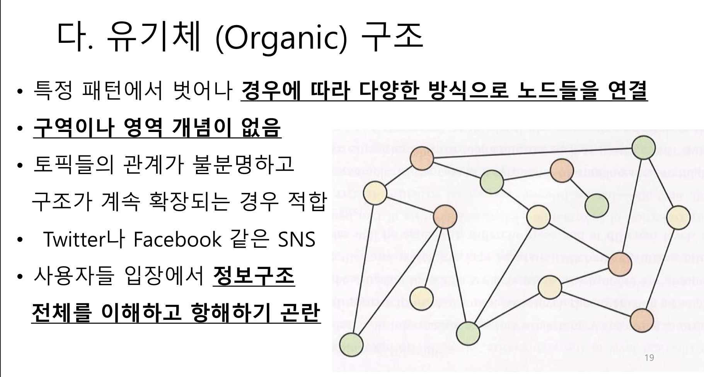
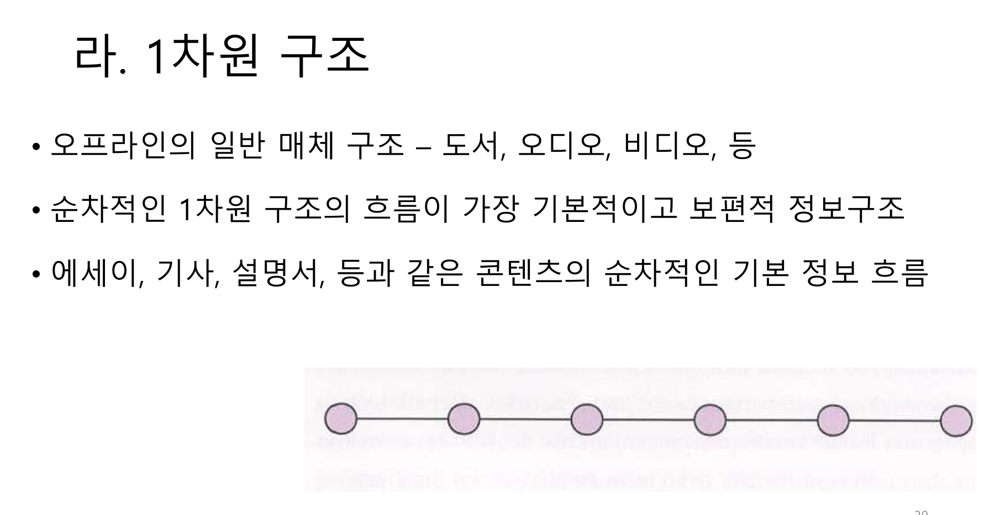
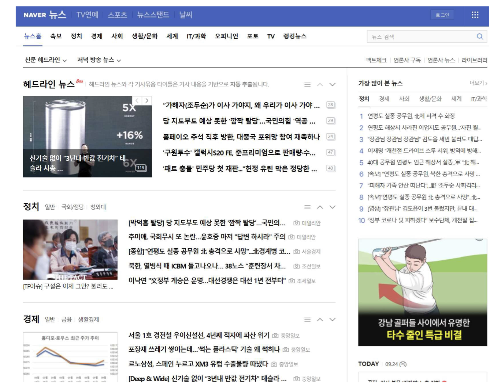
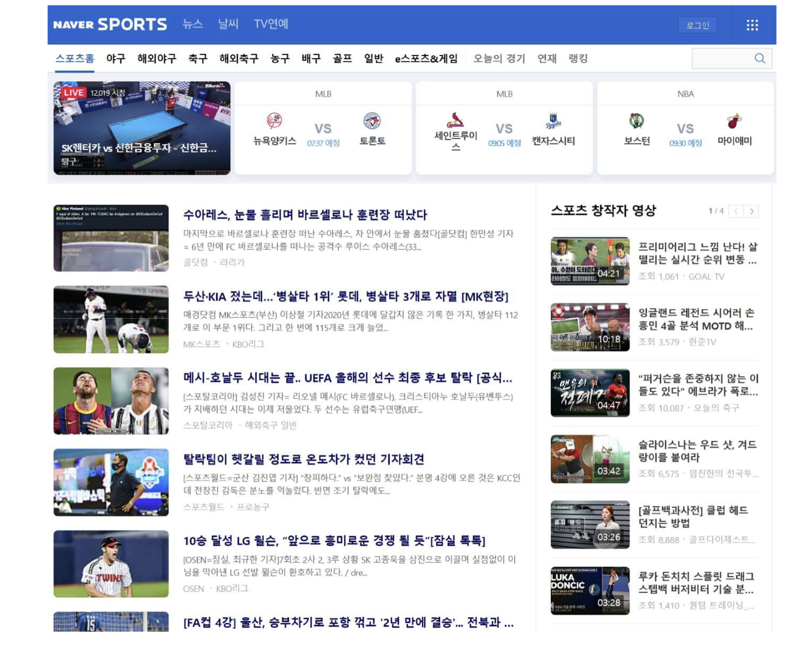
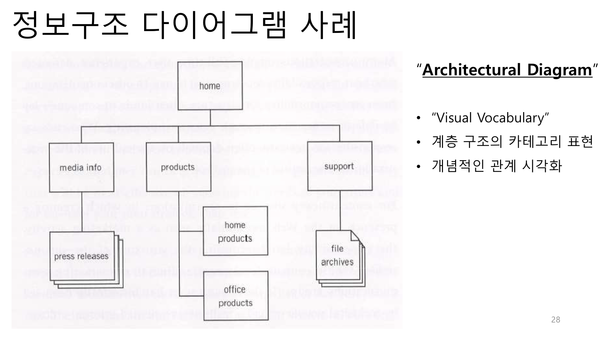
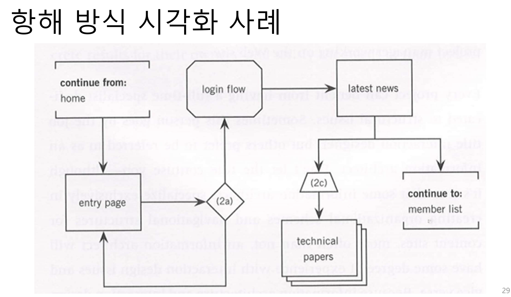

# UX디자인 5강 정보 & 콘텐츠의 구조화 (Structure)

## Structure(구조) 정의하기
- "범위" : 무엇을 개발하는지, "구조" : 어떻게 조합되는지 명시 (기능과 정보)
- 추상적인 "전략" -> 구체화되어 -> "범위" -> "구조" -> UX 세부 설계
- `인터랙션 설계 : 사용자 (사람)의 작업 수행 및 완료 과정에 초점`
    - `Interaction Design`
    - 사용자 입력과 시스템 출력의 과정, 패턴, 순서 등을 정의. 사람의 행위와 사고에 대한 이해가 바탕이 되어야 함.
- 정보 구조 : 제품/서비스에서 다루는 정보의 조직화, 분류, 그루핑, 순서정하기, 등 & 정보에 접근하는 방식 체계화 초점 (맥락 & 사용환경 고려)
    - `Information Architecture`
    - 콘텐츠 개발 과정에서 사용자 경험(UX) 구조화를 지원. 정보와 콘텐츠 구조 및 사용자들에게 정보가 전달되는 과정을 정의.
- 기술적인 영역도 고려하지만, 핵심 요소는 사람의 "행위와 사고 방식"

## 1. 인터랙션 설계
- 사용자 행위에 따른 시스템 반응과 사용자의 평가에 따른 사용자 추가 행위 - 목적 달성 시점까지 계속 순환 - Norman 실행/평가 모델
- `기술 기반` 접근 방식과 `사용자 중심` 접근 방식
- 컴퓨터와 정보통신 기술의 대중화에 따라 "일반인"들도 쉽게 배워서 편하게 사용하도록 인터랙션 설계가 되어야 함

### 개념 모델 (Conceptual Model)
- 인터랙티브 시스템의 `작동 및 반응 방식` -> 사용자 관점에서 해석
- 사용자의 `심성모델 (Mental Model)과 일치도 혹은 유사도가 중요`
- 작업 분석을 통하여 개발한 Workflow Model 과 Task Model 활용한 인터랙션 설계
- 메타포 (Metaphor) - 은유 - 얼마나 적절한가 ?
- `예) 온라인 쇼핑몰의 개념 모델 - 사용하는 용어 및 개념이 달라짐`
    1. 일반가게 모델 : 쇼핑몰을 항해하면서, 상품을 검토하고, 원하는 상품을 고르고, 쇼핑카트에(혹은 장바구니) 담아서 대금 결제
    2. 카타로그 모델 : 카타로그의 상품 리스트들 중에서 구매하고자 하는 상품을 체크하여 주문하고 체크된 상품 구매 리스트에 속한 상품들에 대하여 대금 결제

### 실수 (ERROR) 처리
- `인터랙션 설계에서 집중해야 할 매우 중요한 이슈 - 사용자 실수`
    1. 실수 예방 및 방지 - 실수 발생이 불가능하게 설계
    2. 실수 발생이 어렵게 설계 - 예) 실수 자동 수정 기능
    3. 도움이 되는 친절한 에러 메시지 - UX Writer 역할이 중요
    4. 실수로부터 원상 복구 기능 제공 - "UNDO" 기능
- 실수 방지 및 예방, 실수 탐지 및 수정, 원상 복구, 등의 단계를 통하여 "실수 처리 및 대응" 작업 수행
- `사용자들의 만족도는 단계가 진행됨에 따라 증가`
- `기능 (Functionality) 위주의 시스템에서는 특히 실수 처리가 중요`

## 2. 정보 구조 (IA, Information Architecture)
- `콘텐츠를 구조화하여, 체계적인 관리와 효율적인 접근` 지원이 핵심
- 사람들이 (사용자) 정보 처리하는 과정에 (인지적 관점)에 대한 이해가 필수
- `"심상 모델" 연구에서 시작하여, 대응하는 "개념 모델" 개발`
- 정보 제공 위주의 시스템은 물론 기능제공 위주의 시스템(예, 모바일 스마트폰) 필수적인 핵심 요소
- 예) 조직도 & 부서 배치도 및 접근 방법, 웹 사이트 구조 & 맵, 등

### 콘텐츠 구조화
- 콘텐츠(정보) 조직화 & 콘텐츠 접근 (항해) 방식 체계화
- 사용자 작업의 효과성과 효율성에 초점 -> 예) 경제적으로 작업 완료
- 웹 사이트 - 사용자가 원하는 기능 수행과 콘텐츠 검색 과정을 지원하면서 교육, 설득 및 정보 제공 역할 수행
- 콘텐츠 분류 및 조직화 작업 - "Top-down" vs "Bottom up" 방식
    - `Top-down 방식` - "전략" 평면에서 결정된 `사용자 니즈와 제품 목표에 근거하여 정보 구조 개발`. 추상적 개념 수준에서 출발하여 구체적인 세부 콘텐츠 수준으로 발전. 카테고리가 정해지면 해당 콘텐츠를 해당 카테고리에 배치.
    - `Bottom-up 방식` - `수집되거나 기존에 보유한 콘텐츠`들을 정리, 분류, 그루핑, 등의 작업을 통하여 조직화하면서 정보 구조 개발. 낮은 수준의 구체적인 카테고리에서 추상적 개념으로 발전.
    - `장점과 단점`
        - Top-down : 전략 및 범위 체계에 맞추어 정보 구조를 개발. 콘텐츠의 세부적인 그러나 중요한 디테일을 놓치는 경우 발생 가능성.
        - Bottom-up : 수집되거나 기존에 보유한 콘텐츠 특성을 반영. 융통성이 없고 전체 구조나 상황 변화에 대처 능력 저하 가능성.
        - `Balanced` : 프로젝트 개발 기조에 잘 맞추면서, `융통성 있고 유연한 구조` 개발 필요. `콘텐츠의 세부 특성을 활용할` 수 있는 균형 감각 필요.

### 추가 고려사항
- 적절한 `카테고리` 숫자는 ? 
    - 분류된 그룹의 숫자 ? 
    - UX품질 지표?
- 적절한 `레벨의 깊이`는 ? 
    - 작업 완료를 위하여 클릭하는 횟수? 
    - 사용자의 입장에서 이해되는 수준이 제일 적절. 단순 숫자가 중요한 것은 아님.
- `라이프 사이클에` 따른 관리
    - 웹사이트 및 앱은 생명체와 같아서 지속적인 관리와 수정 보완 필요
    - 콘텐츠 생성 및 업데이트 주기적으로 실행
    - 시간 흐름에 따라 성장하고 변화-  관리되지 않는 웹이나 앱은 무용지물

### 정보구조 접근 방식
- 정보구조의 기본 단위는 `노드` 
    - 추상적 개체이자 단위로서 구체적인 페이지, 화면, 문서, 구성요소, 콘텐츠, 데이터 등을 의미함
- 다양한 분야의 정보구조를 공통의 언어로 표현하고 관리 가능
- 새로운 요소들을 추가하거나 구조화하여, 정보구조를 추상화된 수준에서 정리 혹은 개선 

### 조직화 원칙
- 정보구조를 조직화하는 원칙
    - 어떤 노드들을 하나의 카테고리로 묶을지 ?
    - 어느 노드를 분리할지 ?
    - 각 영역 및 단계에 따라 다른 원칙 적용 가능
- 예) 
    - 사용자 역할 : 소비자, 투자자, 경영자, 관리자, 등의 카테고리
    - 지역 : 아시아, 유럽, 아프리카, 북미, 등 카테고리
- 추상화 수준 : `전략`의 `제품목표 및 사용자 니즈에` 맞춤
- 구체적 수준 : `범위`의 `기능명세 및 콘텐츠 요구사항에` 맞춤

### 조직화 사례 (1)
- 뉴스 (정보) 제공 사이트의 경우 - `타이밍`이 제일 중요
- 기사를 읽는 독자나 작성자, 모두에게 제일 중요 
    - 현재 핫 이슈: "속보" -> "헤드라인 뉴스" -> 정치, 경제, 사회, 생활/문화, ...
- 다음 수준에서는 세부 영역 -> 스포츠 -> 야구, 축구, 농구, 배구,...
- 사용자 니즈와 제품목표에 맞도록, 기능명세와 콘텐츠 요구사항 고려 -> 적절한 `정보구조` 만들기 -> `사용자 멘탈모델에 맞는 개념모델`

### 조직화 사례 (2)
- 자동차 관련 정보구조
    - 대부분의 사용자들에게 자동차 제조사, 모델, 용도, 색상, 가격, 등이 중요
    - 자동차 무게는 ?
    - 자동차를 운반하는 해운사 직원의 입장에서는 무게와 크기가 제일 큰 관심사
- 정보에는 `다양한 측면("Facet") 존재`
    - 사용자들에게 가장 필요한 측면에서 정보구조를 만들어서 제공하여야 함
    - 사용자가 기대하고 원하는 정보를 제공할 수 있도록 조직화

### 언어와 메타데이터
- 이름 지어 붙이기 (명명법, Nomenclature) - 사이트에서 사용하는 어휘
    - 사용자들이 사용하는 언어로 지속적이고 일관성 있게 이름 지어 붙이기
    - 해당 사이트에서 사용하는 표준 용어 - 사용자 이해 가능한 어휘로 표현
    - 필요하면 "비슷한 말 사전" (Thesaurus) 제공하여 사용자 지원
- 메타 데이터 (Meta-data) - "정보에 관한 정보"
    - 젱보와 콘텐츠에 대한 기술과 설명 -> 사용자 뿐 아니라 검색엔진의 작업 지원
    - 저자 이름, 게시 일자, 형태, 종류, 제목, 관련 문서 및 토픽, 
    
## 3. 팀 역할 및 프로세스
- 웹 "구조"를 표현하는 문서가 필수적으로 준비되어야 성공적인 `웹 관리, 유지 및 보수가 가능함` -> 명확한 실행 및 관리 계획 수립 필요
- 간단한 텍스트 문서, 스프레드시트, 혹은 데이터베이스 사용
- 해당 조직의 문화와 특성에 따라 다르지만 웹 사이트 관리 "담당자" 및 "담당 부서" 확정 필요 -> 기술 부서, 홍보 부서, 혹은 마케팅 부서, 등 -> `정보구조`와 `인터랙션 설계` 문서를 사용

### 항해 방식 (Navigation)
- 메뉴 구조로 표현됨
- [Global Navigation](https://agentestudio.com/company) - 웹 사이트 내의 모든 페이지 항해
- [Local Navigation](https://www.nngroup.com/articles/local-navigation/) - 페이지 내부에서의 항해

### 유용한 사이트 관리하기
- `정보 혹은 콘텐츠 위주의 시스템`
    - 일반적으로 홍보 혹은 마케팅 부서에서 담당
- `기능 위주의 시스템`
    - 기술 부서에서 담당 - 정보의 구조화 및 관리
- `사용자의 생각과 기대에 잘 맞춘 정보와 기능을 제공`하려면, 즉, `최적의 UX` 제공하려면, 해당 `조직 전체의 협력을 바탕으로 하는 지속적이고 적극적인 노력`이 필수 -> 라이프 사이클 동안 지속적인 관리 필요

