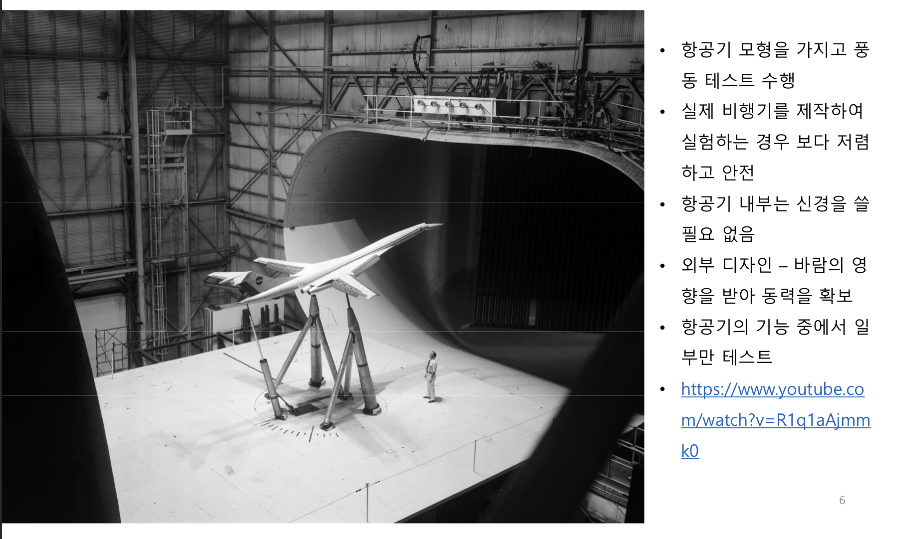
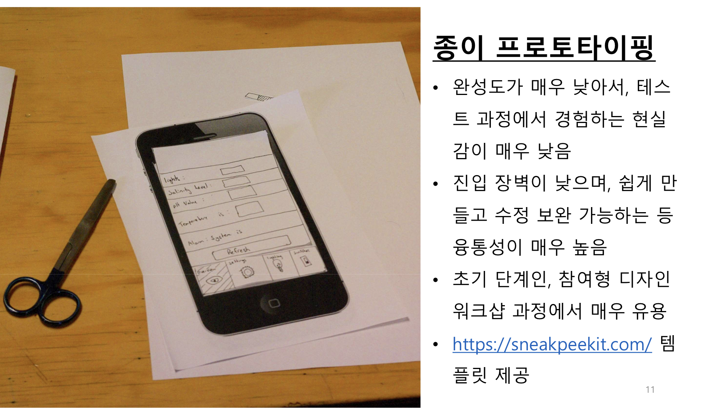
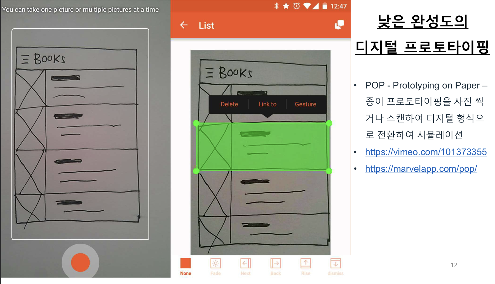
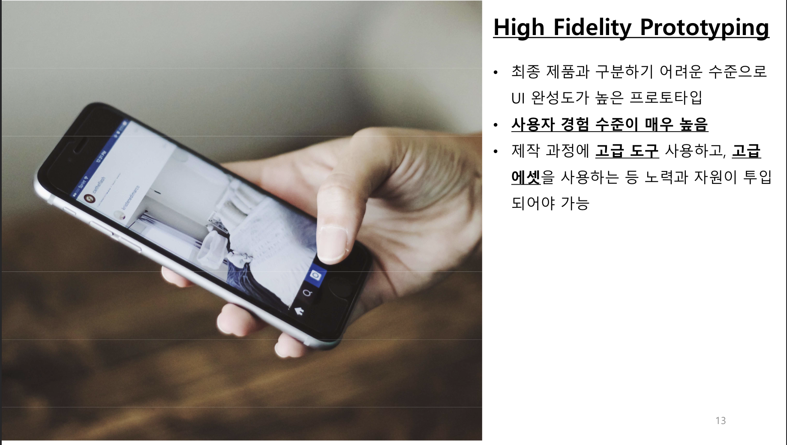
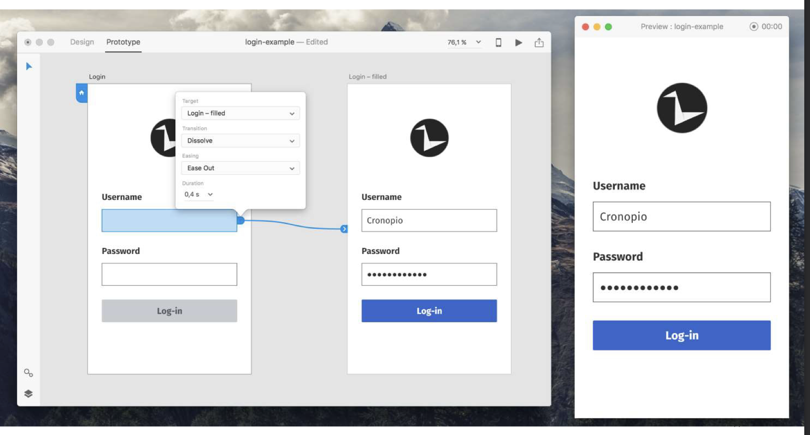
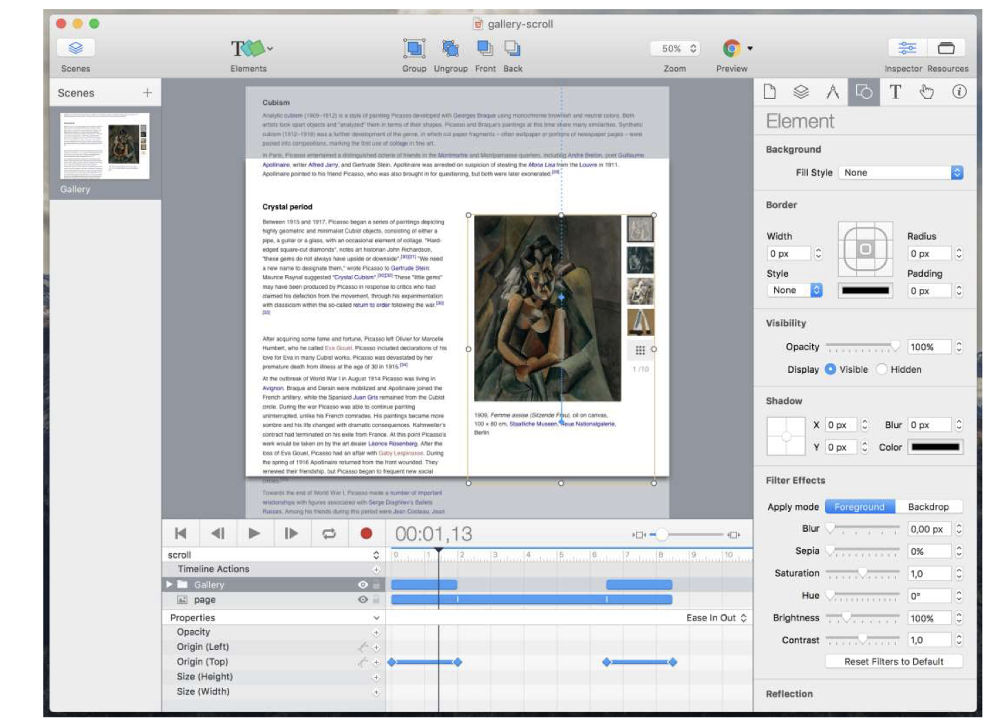
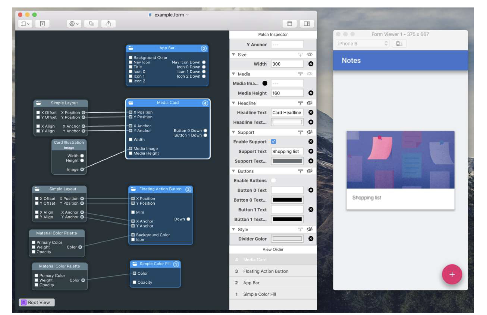
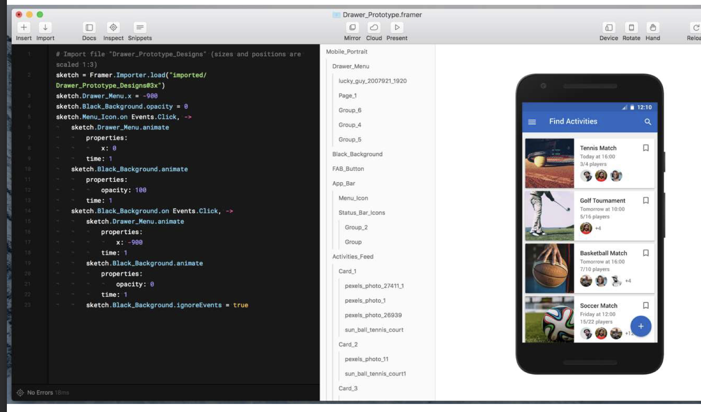
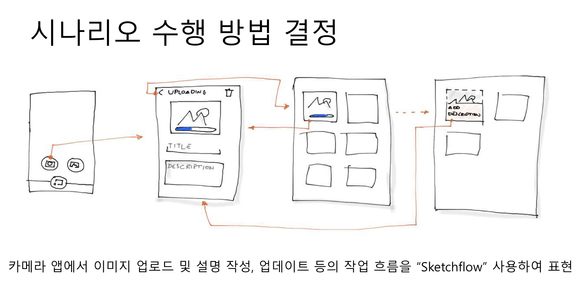

# UX_Design 9강 프로토타이핑

## 모바일 UX 디자인의 기본
1. 사용자 리서치 (User Research) - 니즈 & 동기
2. 아이디어 탐구 (Ideation) - 스케치
3. 모바일 패턴 (Mobile Pattern) - 웹, 안드로이드, IOS 우수 사례 - 사용자의 기본 기대 만족
4. 솔루션 (Solution) - Wireframe & Mock-up
5. `프로토타이핑 (Prototyping) - 시뮬레이션`
6. 사용자 테스팅 (User Testing) - Usability

## 내용
1. 개요
2. 프로토타이핑 사고방식 채택하기
3. 접근법 결정하기
4. 계획 세우기
5. 실용적 진행

### 1. 개요
- 제품의 성공과 실패를 가르는 열쇠 중의 하나는 개발 제품이 실제로 `기획자, 개발자 혹은 디자이너의 의도` 대로 `소비자들이 반응`할 지 여부
- 실제 `소비자들의 생각과 반응을 일찍 파악`하는 것이 핵심
    - Mental Model과 Conceptual Model의 일치?
- 프로토타이핑으로 아이디어를 `일찍 평가 받을 수 있음`
- 솔루션의 특정 부분에 대한 사용자 반응을 확인하는 `시뮬레이션`
- `개발시간 절약과 사용자 니즈 해결 가능성 높은 제품` 개발에 필요
> ex) 실패한 장난감 - Swing Wing - 성공을 기대 했으나 사용자의 반응을 살피지 않았기 때문에 실패

### 2. 프로토타이핑 사고방식 채택하기
- 실제 `제품 완성 이전에 모형`을 가지고 `특정 부분 혹은 기능 테스트`
- 프로토타입은 `실제 제품과 차이`가 존재하며, `제품의 일부 측면`을 갖추고 있어서, `특정 기능을 시뮬레이션` 하도록 지원
    - 비행기 모형의 날개 특정 부품이 바람에 어떤 영향을 미치는지 Test하는 프로토타입 (항공기 기능 중 일부만 테스트)
    - 대학로에서 연극해서 관객의 반응을 보고 티비 프로그램으로 옮김
- 사용자는 프로토타입의 내부 보다는 `외형만을 보게 되어, 제품 사용 과정에서 체험할 경험을 재현`하는데 충분하면 됨 

- 항공기의 특정 기능 중 일부만 테스트할 목적으로 항공기 모형을 사용
- `항공기를 직접 만드는 것보다 비용이 저렴하여 개발시간 절약`

#### 프로토타입 마인드 셋
- `최소한의 노력과 비용으로 최대한의 환상을` 만들어 냄
- 복잡하지 않고 `단순하게` 만들어야 함
- 테스트하고자 하는 `일부 측면만 작동`하면 됨
- `프로토타이핑의 범위를 줄이는 것`이 `이득을 극대화`하는 길
- 하나의 프로토타입으로 `점검할 수 있는 측면이 제한적이므로, 최소의 노력`을 기울이는 것이 효율적

### 3. 최적의 프로토타이핑 접근법 결정하기
- 속도와 개발하는 프로토타입의 사실감 사이의 `균형 잡기 필수` -> 가능한 빠르게, 현실감 나는 제품 경험 제공
- `확인하려는 사항을 사전에 정의` -> 해당 사항만 집중 테스트
- `특정 시나리오에 초점` 맞추기 -> 불필요한 부분 제거 & 복잡성 축소 -> 여행 앱에서 목적지 선택 과정은 건너 뛰고 중요한 부분에 집중
- 관련성에 따라 `인터랙션을 단순화` -> 중요한 인터랙션만 수행
    - 로그인 기능 제거

#### 프로토타입 유형 결정하기
- 목적과 제작 가능 시점에 따라 프로토타입의 유형을 결정
- `중요한 것은 실험이 가능하도록 제작하는 것`
- `완성도("Fidelity") 기준` : `"어느 부분을 얼마나 사실적으로 제작할 것인지"`
    - Paper Prototyping, Low-Fidelity Digital Prototyping, High-Fidelity DP(피그마같은 고급 도구 사용)
    
    
    
- 인터랙션 기준 : `사용자의 동작에 반응하는 정도를 결정`
    - `수동적` 프로토타이핑 :
        - 정지 이미지 사용, 사용자와의 인터랙션 과정을 동영상으로 보여주는 등의 작업을 거쳐 제작.
        - `실제로 사용자의 제어나 이에 대한 시스템의 반응은 구현되지 않음`
        - 수동적 프로토타이핑은 `빠르고 경제적이며`, 초기 디자인 개념을 검토하고 공유하는 데 효과적
        - 디자인 프로세스 초기 단계에서 아이디어를 시각화하고 개선하는 데 도움이 된다.
        - 예) 제품의 특정기능 설명을 나타낸 스토리보드, 설계도
    - `능동적` 프로토타이핑 : 
        - 실제 제품 수준의 상호작용을 인터랙티브하게 시뮬레이션
        - 상호작용 몰입감이 높아서 자연스러운 사용자 경험 제공 가능
        - 피그마같은 것으로 사람들의 터치에 화면이 넘어가도록 디자인 하는 것을 예로 들 수 있음.

#### 적절한 도구 선택하기
- 다양한 프로토타이핑 도구 존재, 대부분 유사한 접근법 채택
  

- `페이지 사이의 내비게이션에` 기반 ex) Adobe Experience Design
    - 앱의 특정 뷰(View) - UI 혹은 UI제어 요소들 이미지 사이의 전환
    - 이미지들 중 `인터랙션 가능한 영역` 정의
    - 인터랙션 과정에서 발생하는 `View 전환` 및 `화면 및 UI 제어 요소들의 상태 변화`를 시뮬레이션
    - 동시 발생 가능한 `여러 개의 상황 및 View를 시뮬레이션`하려면 중복된 이미지를 준비해야 함
    
- `타임라인 기반` : 애니메이션 중심 ex) Tumult Hype
    - 키프레임 기반의 프로토타입 작동 애니메이션 개발 지원 도구
    - 프로토타입 콘텐츠들의 재생 방식을 시각화 (시간 축을 따라)
    - HTML 5 기반 "Tumult Hype"
    
- `구성 요소 연결`에 기반 : UI구성 요소 ex) Form
    - 시각 프로그래밍 패러다임 (`Visual Programming Paradigm`)
    - 인터랙션 구성요소 혹은 논리적 요소에 해당하는 블록을 연결
    - 화면에 요소를 만들면, 대응되는 창에는 해당 요소와 연계된 동작 및 인터랙션 방식 정의 (`시각 프로그래밍 방식으로`)
    
- `코드 기반` : 개발의 유연성 ex)Framer 
    - `프로그래밍 언어를 사용하여 프로토타입 정의`
    - 화면 구성 요소 동작 및 속성을 정의하는데, 융통성과 유연성을 가질 수 있음
    - 화면 구성 요소 디자인을 High Fidelity 수준으로 하려면 별도의 도구 필요
    

### 4. 계획 세우기
- `프로토타이핑은 실험 과정이며, 이 과정을 통하여 프로젝트의 문제점을 파악하여 해결하는 것이 목적`
- 계획을 잘 수립하여 시간과 노력을 절감해야함
- `무엇을` 프로토타입으로 할 것인가 ? 목표, 대상 사용자, 시나리오, 등
- `어떻게` 할 것인가? 사용자의 시나리오 수행 단계 결정

#### 프로토타입의 목적
- `목표 : 포로토타이핑 과정에서 확인하려는 것이 무엇인지 명확하게, 구체적으로 정의할 것`
    - 예) 내비게이션이 명확한지 ? 작업 완료는 용이한지 ?
- 대상 사용자 : `목적 달성을 위하여 필요한 대상자`, 실제 사용자의 경우라면 완성도가 높은 프로토타입으로 실험해야 함. 사용자가 친숙한 환경과 상황에서 실험하도록 설계.
    - 예) 작업의 종류, 플랫폼 등
- `시나리오` : `사용자의 행위 중 핵심이 되는 부분을 설명`. 목적에 따라 복수의 프로토타입 사용한 실험도 필요

#### 수행 방법 결정
- `프로토타입 설계도 그리기`
    - 프로토타입 개발 과정에서도 사용하고, 상황 점검 과정에서도 사용
- `사용자의 경로 결정`
    - 시나리오를 기반으로, 사용자의 이상적인 행동 및 예외적인 행동 상황 예측 및 대비하기 위한 계획 수립
- `완성도 결정`
    - 사용자들이 몰입할 수 있는 적정 수준의 완성도를 개발 속도와 함께 고려하여 결정

### 5.실용적 진행
- 프로토타입은 `제품의 초기 버전이 아니다`
    - 아이디어 테스팅을 위하여 특별하게 제작된 것으로 실험 후에 제거될 수 있음
    - 재사용하지 않을 부분을 가짜로 꾸며도 문제 없음
- `천번의 회의 진행한 수준의 가치가 있다.`
    - 회의는 의견과 추측에 기반하여 진행되는 것이 대부분임
    - 프로토타이핑을 통해 사용자가 몰입하여 아이디어를 테스트할 수 있음
    - 사용자가 직접 경험하면서, 개발 상의 문제 해결에 효과적인 도움을 줄 수 있음

  

## 시험에 나올만한 것 (Summary)
1. `프로토타이핑의 목적` : 실제 `제품 완성 이전에 모형`을 가지고 사용자에 대한 반응을 확인하는 작업으로 `개발시간 절약하면서 사용자 니즈를 충족시키는지 확인`할 수 있다.
2. `프로토타이핑 유형` :
    - `완성도 ("Fidelity")에 따라 `
        - Low-Fidelity
            - 낮은 수준의 완성도
            - 예) Paper Prototyping
        - High-Fidelity
            - 높은 수준의 완성도
            - 예) 피그마
    - `인터랙션 정도에 따라`
        - 수동적
            - 사용자의 반응에 동작하지 않는 수준
            - 예) 제품의 특정기능 설명을 나타낸 스토리보드, 설계도
        - 능동적
            - 사용자의 반응에 따라 동작하는 수준
            - 예) 피그마를 이용하여 만든 디자인 정도
3. `프로토타이핑 도구`
    - `페이지 사이의 내비게이션에 기반` : ex) Adobe Experience Design
    - `타임라인 기반` : 애니메이션 중심 ex) Tumult Hype
    - `구성 요소 연결`에 기반 : UI구성 요소 ex) Form
    - `코드 기반` : 개발의 유연성 ex) Framer 
4. `프로토타이핑 계획 세우기`
    - `무엇을 프로토타입으로 할 것인가?`
        - 목표 : 프로토타이핑 과정에서 확인하려는 것.
        - 대상자 : 목적 달성을 위해 필요한 대상자
        - 시나리오 : 사용자의 행위 중 핵심이 되는 부분 정하여 설명하기
    - `어떻게 할 것인가?`
        - `완성도 결정`
        - `프로토타입 설계도 그리기`
        - 시나리오를 기반으로 `사용자의 경로 결정` (이상적인 행동, 예외적인 행동 모두 고려)
